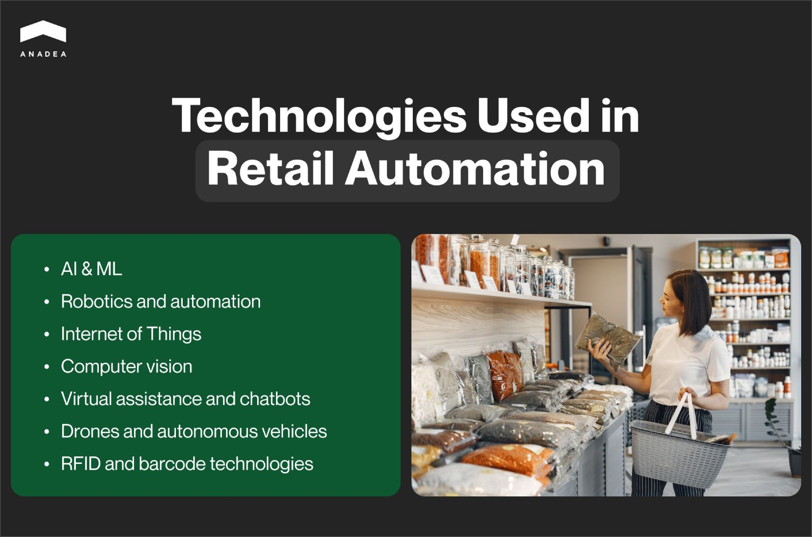
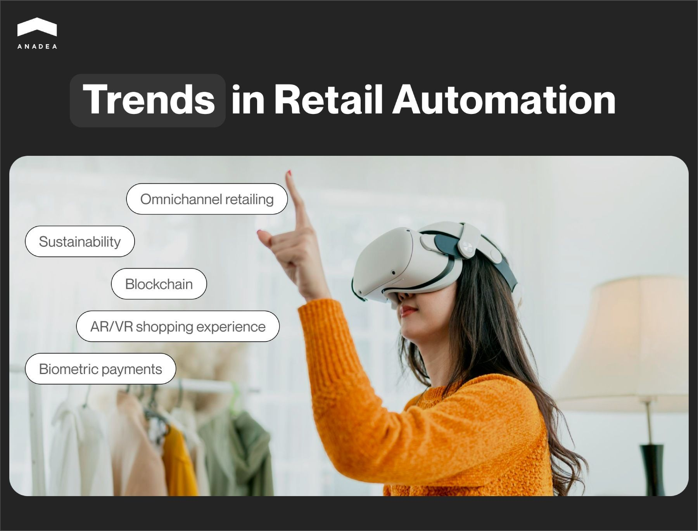

The key goal of any good technology is to address particular issues, enhance processes, and optimize the resources required for some tasks. When it comes to Artificial Intelligence, already today, it has a wide range of applications and one of them is automation. Digital tools powered by AI and other emerging technologies can successfully cope with numerous processes across various domains. This allows employees to focus more on challenging tasks that require creativity and human touch. In this article, we are going to talk about automation in retail industry and explain how businesses can benefit from such solutions.

## What is retail automation?

The term “retail automation” describes the use of technology to automate various processes in the retail industry. The range of these processes can cover all the business aspects in this domain, from customer interactions to inventory management.

All the efforts related to implementing retail automation solutions are aimed at improving efficiency, reducing costs, and enhancing the customer experience.

Key benefits of automation in retail are related to excluding human intervention and related errors from many routine tasks. As a result, the main advantages for retail businesses are the following:

* Increased efficiency;
* Enhanced accuracy;
* Cost savings;
* Faster service;
* Personalized customer experiences;
* Improved inventory availability;
* Better decision-making.

With all the perks that businesses can leverage, it comes as no surprise that the global automation retail market is gradually growing. According to recent [studies](https://www.precedenceresearch.com/retail-automation-market), in 2023, its size was $26.5 billion. In 2024, it is already at the level of around $29 billion. The expectations for 2034 are rather high. This figure is projected to reach $71.91 billion. In other words, from 2024 to 2034, the market will be expanding at a CAGR of 9.5%.

The region with the largest share in the global market is North America (34%). At the same time, the market in Asia-Pacific is likely to expand at the fastest CAGR of over 11% during the period between 2024 and 2034.

The in-store automation was the biggest segment in 2023, its share was 61%. The most remarkable growth within the period from 2024 to 2034 is predicted to be demonstrated by the [warehouse segment](https://anadea.info/blog/warehouse-automation-software).

## Key technologies used in automated retail solutions

The development of solutions for retail store automation may involve a wide range of technologies that can perform different functions. Of course, the exact set of technologies and tools that will be used in your project should be discussed directly with the team that will provide [retail software development services](https://anadea.info/solutions/retail-software-development) to you. Nevertheless, we offer you to consider the most widely used technologies. This will help you get a better understanding of the tasks that your future solution may deal with.

### AI and ML

Artificial intelligence and machine learning are the foundation for many automated retail processes. They enable systems to learn from data and make intelligent decisions. As a result, AI algorithms and ML models are always used in predictive analytics and dynamic pricing tools, as well as personalized recommendations. If you want to learn more about AI-powered software, follow this [link](https://anadea.info/blog/how-to-create-ai-software).

### Robotics and automation

Robots can successfully handle repetitive tasks, which helps to reduce human error. For example, robots can find, pick, pack, and sort products. And quite often they can do it faster than human employees.

### Internet of Things

IoT devices connect various retail systems, which is required for real-time data collection and seamless data exchange. Here, we can mention smart refrigerators in grocery stores. They can track product freshness and manage supplies automatically. When such devices detect low inventory levels, they can notify managers that restocking is needed.

### Computer vision

Such technologies enhance automation through image and video analysis. They can identify products for inventory management and checkout processes, monitor store activities to reduce theft, and analyze customer in-store movement to optimize product placements.

### Virtual assistance and chatbots

These solutions can greatly improve customer service and support in a 24/7 regime, even outside the working hours of the store.

### Drones and autonomous vehicles

They can revolutionize delivery and logistics in the retail sector. Already today they are used for inventory transport and last-mile delivery.

### RFID and barcode technologies

Radio-frequency identification and barcodes are essential for accurate inventory management and tracking. RFID tags provide real-time visibility into stock levels, locations, and movement within the supply chain. And barcode scanners are used in the automated checkout process.

## How to implement retail store automation?

Some people think that the most challenging part of any automation project is to find the relevant hardware and software. Nevertheless, that’s only one of the stages. The most important task is to strategically plan the implementation of such solutions. Here’s a short step-by-step guide.

1. Define clear objectives and set measurable targets.
2. Evaluate your current processes and find areas for improvement (you can also rely on customer needs and opinions).
3. Choose the right tech partner and identify the best technologies to cope with the set tasks.
4. Implement automation only in a single store or one department. This will help you test the effectiveness of your solution before rolling it out across your entire operation.
5. Once the pilot projects demonstrate success, gradually scale automation to other parts of your business.



## Best practices for retail automation

The introduction of automated retail solutions can be a rather expensive and complicated project. However, we have some tips for you that will not only facilitate this process but also make your efforts more result-oriented.

* Align automation with your business goals. You should make sure that the automation solutions you choose correspond to your overall business objectives. Automation should support these goals rather than just being a tech trend to follow.
* When implementing automation, always keep the customer experience at the forefront. The better you address customer needs, the better results you can expect to achieve.
* Instead of investing a huge amount at once, begin with an MVP and small-scale pilot programs. They will help you test the effectiveness of automation in specific areas of your retail operation without big financial risks.
* Choose automation solutions that will be compatible with your existing systems and software. Seamless integration is crucial for ensuring data flows smoothly across all your platforms.
* The roles of your employees will change when automation comes. Invest in training programs to help people adapt to new technologies and processes. You can offer them courses to learn how to operate new systems, how to assist customers with automated tools, or how to interpret data from automated systems.
* Ask customers to share their feedback. This can be done through surveys, in-app feedback, or direct interactions.
* Always choose vendors and tech partners who have a proven track record in the relevant domain. If you are looking for a reliable service provider, at Anadea, we will be always happy to help you and can guarantee the best results.

## Trends in automation in retail industry

In general, automation as a whole can be viewed as a trend in the retail industry. Nevertheless, it is possible to detect some tendencies in such projects as well. Today a lot of retail automation software solutions are focused on increasing profits namely by enhancing customer experiences. And here’s how it can be achieved.

### Omnichannel retailing

Retail businesses today try to ensure seamless integration across online and offline channels. Clients expect to enjoy a consistent experience regardless of the chosen way of making purchases. It can be an in-store visit, or online shopping in a web or mobile app. Automation tools, including personalized recommendations, should take into account all these channels at once.

### Sustainability

Retailers can successfully rely on automation to minimize waste. For example, they can use AI to optimize inventory levels and reduce excess stock that may go unsold. Moreover, automated systems can be applied to monitor and reduce energy consumption in stores and warehouses. Such efforts greatly contribute to more sustainable retail practices.

### Blockchain-powered supply chain transparency

Blockchain technology can provide transparent and tamper-proof records of product origin and other related info. This can be particularly important for food, luxury goods, and pharmaceuticals. At the current moment, retailers are also exploring smart contracts to automate transactions and agreements between parties.

### Immersive shopping experience

AR and VR are used to create virtual fitting rooms. In such virtual spaces, customers can “try on” clothes, accessories, or makeup without physically interacting with the products.

### Biometric payments

Technologies like facial recognition, fingerprint scanning, and vein pattern recognition can be integrated into automated payment systems. Such an approach to customer authentication can increase the security and convenience of payments.

## AI-powered autonomous stores

Autonomous stores can be viewed as the highest stage of automation in retail. These stores operate without traditional cashiers or staff. They use AI and other technologies to handle everything from inventory management to checkout.

Such automated retail solutions can ensure grab-and-go shopping experiences. This means that customers can enter, take the required items, and leave without waiting in line, scanning products, and making payments at a terminal. Here is how such stores work.

1. Customers enter the store with the help of one of the authentication methods. For example, they can scan a QR code from a mobile app, swipe a payment card, or use facial recognition. This step is important for linking people’s identities with their accounts. Such accounts will play an essential role in billing.
2. In the shop, customers pick up items and place them in their shopping bags or carts. AI-powered computer vision systems, often enriched sensors and RFID tags, track which items are selected in real time.
3. When customers are ready to leave the automated retail store, they simply walk out of it. As AI systems automatically identify the taken items, this data is sent to people’s accounts. It means that the traditional checkout process is not required.
4. Receipts are sent to users on the store’s app or via email. Customers can review their purchases, provide feedback, and request returns online.

Some autonomous stores may have virtual assistants. They are designed to provide product info and recommendations, as well as help locate items within the store.

The inventory level in such stores is monitored by AI and IoT sensors. When an item is picked up, the system automatically updates the inventory count and can trigger restocking processes if necessary.

Such projects look quite promising. As technology continues to advance, these stores are likely to become more widespread. Nevertheless, right now such issues as privacy concerns, data security, and the initial cost of deployment prevent them from broader adoption.



## Examples of successful retail automation solutions

As we have already stated, for the success of a retail automation project, it is important to find the right approach to its implementation and to carefully consider the processes to be automated. It means that there can’t be two fully identical projects as there can’t be two businesses with the same needs.

Nevertheless, successful examples can be rather inspirational and insightful. Let us mention a few.

### 7-Eleven’s Evolution stores

The “Evolution Store” concept which also included a restaurant experience for customers was presented in 2019. It offers custom espresso drinks and cold brew coffee, refreshing organic smoothies and shakes, sparkling water, a selection of wine, hot dogs, etc.

As for digital innovations, customers can enjoy mobile checkout, ordering, and delivery. With the loyalty program in the 7‑Eleven app, in-store customers can skip the checkout counter. Payments for their purchases can be conducted on their phones.

### Amazon Fresh

Amazon Fresh stores have adopted various automated technologies. Among them, we should mention smart shopping carts that are also known as [Dash Carts](https://www.amazon.com/b?ie=UTF8&node=21289116011). They can automatically detect items that customers put into them. Carts just scan barcodes and can also weigh products directly in the basket.

Customers can successfully track their spending in real time. Also, they can look for various items on the store map and find them faster and more easily.

When customers are ready to finish shopping, they can just exit through the Dash Cart lane. If a person has initially signed with an in-app Amazon store code, it will be possible to pay with the previously indicated method, The receipt in this case will be sent via email. If a person has started shopping without entering an app code, a store employee will help to finalize the transaction in the exit lane.

### Mercadona

This Spanish supermarket chain, with stores across Spain and Portugal, heavily invests in digital transformation. For instance, it has implemented AI for inventory management and customer service chatbots to enhance the shopping experience.

One of the examples of such projects is its cooperation with Cimcorp, aimed at automating fresh food intralogistics at some of its distribution centers. Cimcorp’s robotic solution helps Mercadona deliver fresh produce from the field to the store within 24 hours. With automation, Mercadona can increase the shelf life of products, minimize food waste, and improve workplace safety.

## Challenges in retail automation: How to deal with them

As well as in the case of any innovation, the implementation of business process automation in retail can be associated with some difficulties. And it is always worth considering them in advance. This will help you to get better prepared for possible pitfalls and find the most appropriate ways to address them.

### Initial investments

Automation technologies can require significant costs. However, with the correctly chosen strategy, such projects are highly promising from the perspective of their ROI.

### Job displacement

A lot of people are preoccupied that automation can reduce the need for certain jobs. This raises concerns about unemployment. Nevertheless, it is important to understand that very often machines take routine tasks that people usually do not like at all. Businesses can provide people with the possibility to develop new skills and occupy new positions within their structure to avoid massive layoffs.

### Security

The increased reliance on technology can result in higher risks of cyber-attacks and data breaches. In this case, it is important to think about protective measures (like data encryption, multi-factor authentication, role-based access, etc.) and regulatory conduct security audits.

### Customer habits

Some customers, especially elderly people, may find it challenging to adapt to automated systems. To address this challenge, it is recommended to provide clients with detailed information and guidelines about new processes, just after their introduction. Moreover, in the initial stages, the help of human assistants will be of great importance.

## Final word

Retail automation has great potential to reshape the industry. It can drive efficiency, enhance customer experiences, and open up new opportunities for growth. Already today, retailers all over the world are exploring the power of emerging technologies in order not to lose the market competition in the era of digitalization.

If you are also planning to build your own retail automation solutions and are looking for a professional team to help you, do not hesitate to contact us! At Anadea, we will attentively study your idea, offer the best solution for its realization, and provide project estimates for free.

Get in touch
