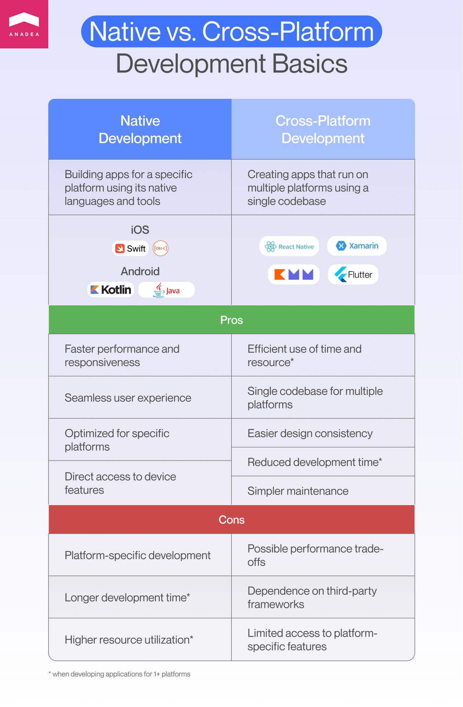
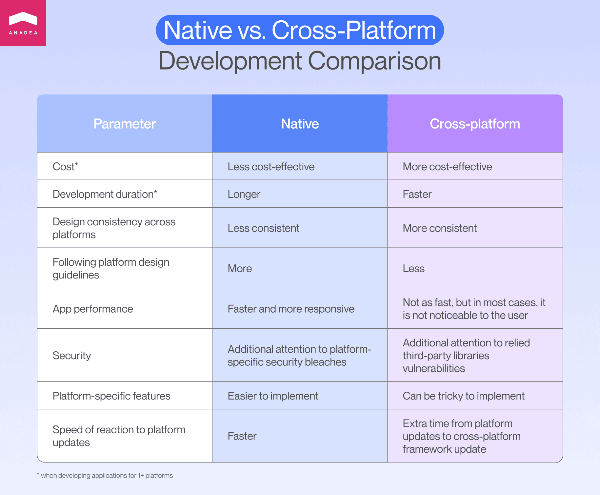
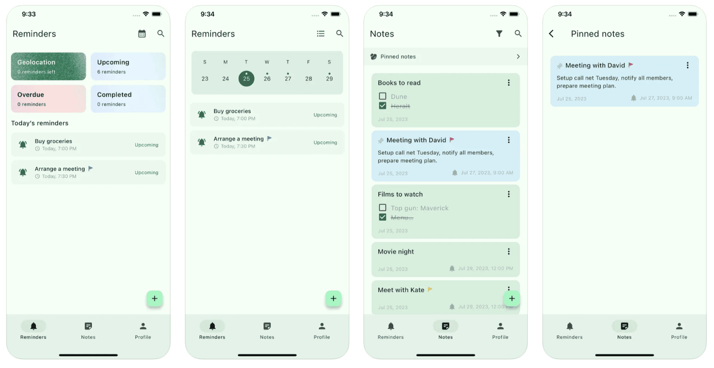

When venturing into the mobile space, many businesses face a critical decision: choosing between native vs cross-platform development for their app. Understanding this dilemma, we, the mobile developers at Anadea, embarked on a journey to shed light on this very choice.

We conceived the idea of **developing the same application from scratch** using our respective platforms. Our goal was to extend beyond the theoretical comparison of the pros and cons of native and cross-platform approaches. We delved into a unique blend of collaboration and competition, facing identical challenges and sharing our rich developer experiences.

This article doesn't just outline the differences between the approaches; it offers our unbiased opinions and showcases an **experiment** we conducted. What allows us to do so? Our expertise in Android, iOS, and <a href="https://anadea.info/blog/flutter-development" target="_blank">Flutter development</a>, attested by multiple delivered projects and client testimonials.

## Native vs cross-platform development: Which one to choose for your project?

Let's revisit the basics of native and cross-platform <a href="https://anadea.info/services/mobile-development" target="_blank">mobile app development</a>. These two unique methods for creating apps come with their own advantages and challenges. In the vast app market of 2023, there are over 9 million apps worldwide—this includes over 3.5 million in the Google Play Store and over 1.6 million in the Apple App Store. The sheer number of apps makes it clear how crucial it is to choose the right development approach to ensure your app stands out.

### What is native development?

Native development involves creating apps for a single platform using platform-specific languages and tools. For instance, Swift or Objective-C for iOS and Kotlin or Java for Android. Native apps are often faster and more responsive since they directly leverage the device's features and functionalities. They tend to provide a more seamless user experience as they are optimized for the platform they are built on. However, creating separate apps for different platforms requires more time and resources.

**Pros:** Faster performance, better responsiveness, seamless user experience, platform optimization, direct access to device features.

**Cons:** Platform-oriented development, longer development time, higher resource utilization (all if required to develop apps for more than one platform).

**Languages/Frameworks:** Swift, Objective-C (iOS); Kotlin, Java (Android).

### What is cross-platform development?

Cross-platform development allows the creation of apps that can run on multiple platforms using a single codebase. Popular frameworks for cross-platform development are Flutter, React Native, Xamarin, and others. This method saves time and resources as developers can write and deploy one codebase across various platforms. Maintaining consistency across platforms is generally easier as the same codebase is used. The implementation of design consistency seems to be an easier task for a cross-platform approach if the application's design prefers custom UI elements to native out-of-the-box ones.

**Pros:** Time and resource efficiency, single codebase for multiple platforms, easier design consistency, reduced development time, simpler maintenance of non-complex applications (all if required to develop apps for more than one platform).

**Cons:** Potential performance trade-offs, reliance on third-party frameworks, limited access to platform-specific features.

**Languages/Frameworks:** Flutter, React Native, Xamarin, KMM, and more.

### Comparing native vs cross-platform mobile app development

How do the two approaches compare? Most commonly, putting aside app development time and cost, businesses value such parameters as mobile app performance, security, and particular considerations for each platform. And there is plenty to discuss at this point.

#### Performance

While advancements have been made, cross-platform apps might sometimes face performance issues compared to native apps due to abstraction layers or differences in platform-specific functionalities. For apps demanding peak performance and intricate usage of device-specific capabilities, native development shines. Gaming apps, apps reliant on complex animations, VR/AR functionality, or apps with numerous platform-specific features often benefit from native development.

#### Security

Both native and cross-platform development require vigilant monitoring for security threats and regular updates. Ensuring the app and frameworks are up-to-date is crucial for security. Cross-platform development often involves the use of third-party libraries. If these libraries have security vulnerabilities, they could potentially affect the security of the entire app, making it crucial to choose trusted libraries and keep them updated. At this point, native development provides a higher level of security since it uses native instruments for applying safety measures.

#### Implementation of platform-specific features

Implementing platform-specific features in native development often involves more straightforward but separate coding for each platform. Cross-platform development aims to simplify this process but might face limitations or require additional workarounds for some features. Another factor is native development can utilize new platform possibilities faster while cross-platform developers have to wait for cross-platform frameworks updates.

Additionally, mobile apps often have unique designs for iOS and Android. Designers follow platform-specific guidelines for consistency. Native apps aim for a consistent design, while cross-platform apps use a single design for both, sacrificing some platform optimization and user-friendliness.

### Side-by-side comparison

To provide you with a clear and concise overview of the differences between native vs cross platform app development, we've compiled a table summarizing the key aspects of both approaches.

Wrapping up, native excels in performance and quick platform updates, suitable for intricate, high-demand apps, e.g. <a href="https://anadea.info/blog/enterprise-mobile-apps-development" target="_blank">enterprise mobile apps development</a>. Cross-platform offers cost efficiency, quicker development, and design consistency, with some trade-offs in performance and security due to third-party libraries. The decision should be driven by your app's unique requirements and the technical realities of each approach.

Get a consultation

## The experiment: Native vs cross-platform app development for the Smart Reminder app

Before we start, we'd like to stress that the experiment doesn't claim to be scientific research, nor does it aim to compare metrics in a controlled manner. Had that been the case, we would have created as identical code as possible, run it across a broad range of devices, and likely confirmed what many already know: native apps are generally faster and lighter than their cross-platform counterparts.

Instead, our goal was to empirically test whether any development approach encountered significant time-consuming issues while implementing the same features. Below, you'll get an inside look at our development process, find some comparative insights, and possibly consider them when choosing a platform for your mobile application.

<b>Important:</b> There are scenarios where it's not practical to develop a mobile application for both Android and iOS. For instance, if one platform dominates the market for the app, or the app's key feature relies on platform-specific functions, like the iPhone's ProRAW photos. These situations are beyond the scope of this article, as they present no real dilemma.

Now onto the experiment!

### Smart Reminder app

We developed a personal productivity app called Smart Reminder, designed to enhance user's daily organization and efficiency. The app boasts several key features:

* **Notes:** A simple yet powerful tool for jotting down thoughts, ideas, or important information.
* **Time reminders:** Scheduling reminders based on specific times to keep track of your daily activities and commitments.
* **Geolocation reminders:** Leveraging the power of location-based reminders, triggering alerts based on your geographical position.



### Technology choice

To bring Smart Reminder to life, we carefully selected a range of technologies, ensuring optimal performance across platforms:

* **Kotlin for Android:** Leveraging Kotlin's modern features and compatibility with Android for a seamless user experience.
* **Flutter for cross-platform:** Utilizing Flutter's capabilities to develop a unified and efficient app experience on multiple platforms.
* **Swift for iOS:** Employing Swift to craft a high-quality, native experience for iOS users.

To enhance the functionality of Smart Reminder, we integrated several third-party services:

* **Firebase Firestore:** A real-time online database that ensures your notes and reminders are always up-to-date and synchronized.
* **Firebase Auth (Google Sign-In):** A secure and convenient authentication system for easy app access.
* **OpenStreetMap and native frameworks:** OpenStreetMap is used for geolocation reminders on cross-platform and Android, while native Swift frameworks are employed for iOS, ensuring accurate and efficient location-based services.

<b>Related read:</b> <a href="https://anadea.info/guides/custom-development-vs-app-builders" target="_blank">Custom Mobile Development VS App Builder: Which to Choose</a>

### Experience with Android, iOS, and cross-platform development

Now, let's finally dive into the most fascinating part, where three developers assess their areas of expertise, highlight challenges, and whether they did or did not overcome them when building the apps.

#### Android developer's experience

The journey into the development of Smart Reminder was marked by innovation and practicality. The Android developer saw the straightforward features of Smart Reminder as an opportunity to delve into the newest technologies available for the Android platform. This exploration was guided by several key decisions:

* **Going with recent trends:** Jetpack Compose was chosen for building native UI, aligning with the trends in Android development. Jetpack Compose's dynamic and flexible framework allowed us to create a more intuitive and responsive user interface.
* **Architectural precision:** MVI (Model-View-Intent) architecture was the choice to complement Jetpack Compose. This architectural pattern helped streamline the app development process, ensuring a robust and scalable app structure.
* **Design innovation:** Material 3, Google's latest design system, allowed for leveraging the most current design elements and principles. This choice was crucial in providing users with a visually appealing and seamless experience.

Implementing geo notifications was a critical feature of Smart Reminder. To achieve this, the Android developer utilized native Geofence capabilities alongside **OpenStreetMap** , which offered a free and effective solution for location-based reminders.

The app's backend infrastructure was built on **Firebase** , a choice driven by its reputation as a lightweight and well-documented backend service that enables a quick launch for an app. Despite being a new terrain for our team, Firebase's user-friendly nature facilitated a smooth integration into our development process.

The journey wasn't without its challenges. Opting for the latest technologies like **Jetpack Compose** and **Material 3** meant the developer occasionally encountered uncharted territories, particularly in UI development. For instance, the unavailability of certain components in Jetpack Compose, such as the **DateTimePicker** , required innovation and the creation of custom solutions. This decision, though demanding additional effort, was crucial in laying a robust foundation for Smart Reminder and simplifying its future maintenance.

#### Flutter developer's experience

Flutter demonstrated impressive support for **Material 3** , providing access to many interface components out of the box. This has proven to be extremely useful in the development process, as many elements needed for building the user interface were already available. It allowed the Flutter developer to focus on more complex aspects of the application without spending unnecessary time on creating basic components.

When it came to integrating with platform-specific APIs, the developer faced some challenges but mostly benefited from the **plethora of existing Flutter plugins.** These plugins provided functionalities like push notifications and geofencing, simplifying the development process. Occasionally, a specific plugin wasn't available, requiring the developer to create custom solutions using platform languages. While these instances were more challenging, they were relatively infrequent due to Flutter's extensive plugin library.

Perhaps the most significant advantage of Flutter is its **support for a single codebase across multiple platforms.** This feature was a game-changer, streamlining the development process by avoiding duplicated efforts and reducing the time and costs associated with maintenance. The single codebase approach not only increased efficiency but also ensured more stable and maintainable applications.

#### iOS developer's experience

When working on the iOS version of SmartReminder, the iOS developer faced the task of adapting it from its original Android-focused design. The challenge? iOS has its own unique style and user expectations, and the app should fit naturally into this style. Here's how it was achieved:

* **Embracing iOS features:** To make things quicker and ensure iOS users feel at home, the developer used native iOS UIKit tools for things like picking dates, showing alerts, and other elements. Those are what iOS users know and love.
* **Swipe actions for better interaction:** iOS users like to swipe on lists for quick actions. So, the developer added this to the app to make it feel more intuitive and handy.
* **Adding Apple Sign-In:** Apple Sign-In was used because when you go for other social media logins, Apple's rules say you need to offer their sign-in method too.
* **Choosing Apple Maps:** For showing maps and locations, the developer picked Apple Maps over OpenStreetMap. Why? They're free, simpler to add, and keep getting updates from Apple. Plus, it meant less reliance on third-party services.

In short, the iOS version of SmartReminder does everything it's supposed to, feels familiar to iOS users, isn't too dependent on third-party services, and is up-to-date with the latest Swift and other iOS tech. This should make it easier to keep the app running smoothly in the future.

### The experiment: Bottom line

After completing our experiment, we decided to launch the cross-platform Flutter app first. Notably, developing the MVP (Minimum Viable Product) for the two native apps took almost twice as long as for the cross-platform app. Interestingly, we didn't observe any significant difference in user experience between the native and cross-platform apps with the mentioned set of features. As a result, **Flutter emerged as a clear winner in this phase of the experiment.** The app is available on App Store and Google Play and is now gaining its first users.

However, we're not stopping the competition there. We're giving native development another chance to prove its mettle. Upcoming enhancements for the Smart Reminder app include more complex features like speech-to-text, calendar app synchronization, and smart reminders that account for travel time to a destination.

The initial phase of our experiment, focusing on MVP creation, highlighted the efficiency and cost-effectiveness of cross-platform development. **But the native development team is not backing down.** We're gearing up for the second round with a new strategy: blend native and cross-platform methodologies, employing Kotlin Multiplatform Mobile for shared core logic and services across both native apps, while keeping the UI elements platform-specific.

## Conclusion

Our exploration of cross platform vs native app development has shed light on critical considerations for businesses and developers. We've navigated the realms of performance, security, and platform-specific features, revealing the nuances of each method. Yet we believe that every project is unique and the best approach—be it native or cross-platform—varies with each specific case. If you're contemplating the development method for your app idea, we're here to offer guidance and help bring your vision to life.

Contact us
