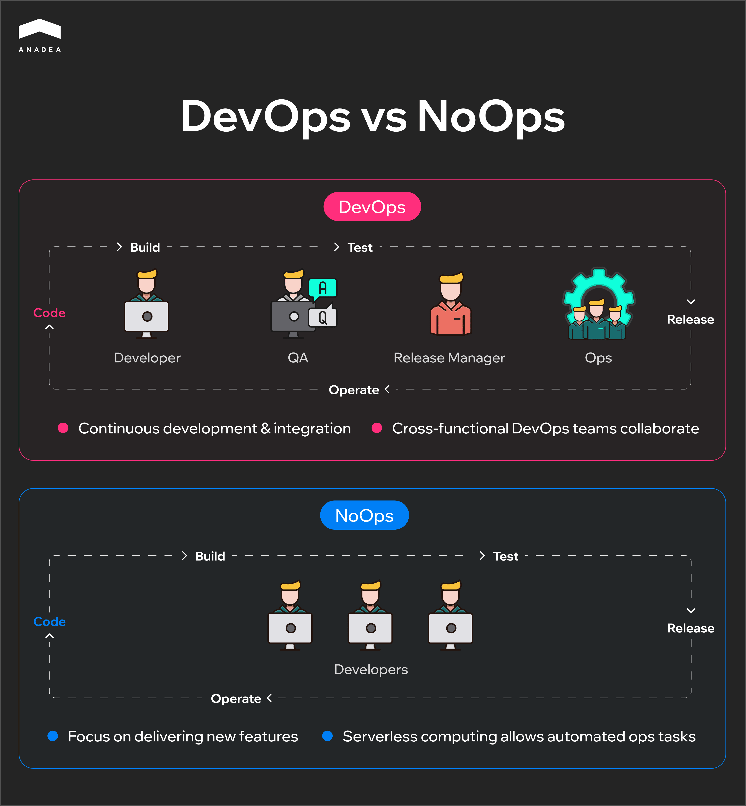

Over the past decade, the [DevOps methodology](https://anadea.info/guides/why-devops-is-vital-for-saas) has fully revolutionized how companies build, test, and deploy digital solutions. The correct implementation of its principles ensures much faster delivery cycles, greater collaboration between teams, and more reliable software releases. That’s exactly what modern businesses are striving for. With all the benefits that DevOps approaches bring, it is quite natural that the global DevOps market is quickly expanding. From $13.16 billion in 2024, its size is expected to hit the mark of over [$81 billion](https://www.imarcgroup.com/devops-market) by 2033. These numbers reflect a CAGR of 19.95% for the period from 2025 to 2033.

The tech world is highly dynamic. With cloud-native architectures, microservices, and multi-cloud environments, systems are becoming more and more complex. Amid such shifts, traditional DevOps tooling and methods are losing their positions. Instead of addressing operational challenges, they introduce extra risks and bottlenecks. All this has led to the introduction of such paradigms as AIOps, GitOps, and NoOps that are currently gaining traction. 

In this article, we are going to talk about the future of [DevOps](https://anadea.info/services/server-administration-and-maintenance) and explain how new DevOps trends are changing the software development space today.

## AIOps: How AI and ML Can Power IT Operations

AIOps is also known as artificial intelligence for IT operations. This concept presupposes using AI capabilities, including ML and NLP models, to optimize and automate IT operational workflows.

AIOps processes data and delivers intelligent automation and insights in the following way:

* AIOps collects and analyzes both historical and real-time data from various IT systems. This phase is foundational for anomaly detection and trend recognition.
* It relies on AI and ML capabilities to automate various tasks (like incident remediation or system optimization).
* It also focuses on seamless interaction with IT teams and analytical tools to provide contextual insights and recommended actions to enhance decision-making and system performance.

### DevOps vs. AIOps

DevOps and AIOps are both intended to improve IT operations. However, they focus on different areas. **DevOps** principles are mainly concentrated on increasing the efficiency of the software development process. At the same time, **AIOps** relies on emerging technologies to enhance the performance of IT environments. It means that **both methodologies complement each other** and can be efficiently combined in a comprehensive approach to software lifecycle management.

### Key AIOps Functions

* **Anomaly detection and failure prediction.** [AI tools](https://anadea.info/services/ai-software-development) are highly helpful for finding unusual patterns and predicting potential system failures before users notice their impact.
* **Automated incident resolution.** AIOps platforms can automatically address and resolve incidents of certain severity, providing AI-driven insights.
* **Performance optimization.** Such tools can continuously analyze system performance. The collected data can be applied to optimize resource utilization and increase the efficiency of system functioning.
* **Root cause analysis.** AI models can pinpoint the underlying causes of technical issues, ensuring faster remediation.

### Why Implement AIOps: Main Benefits

* **Higher operational efficiency.** AIOps plays a vital role in automating routine tasks, which enables IT teams to focus more on strategic tasks.
* **Minimized business disruptions.** Thanks to accurate predictions, teams can proactively prevent potential issues, thus improving operational resilience.
* **Faster and more efficient decision-making.** Artificial intelligence provides real-time insights that are essential for informed and timely decisions.
* **Reduced mean time to repair (MTTR).** The use of advanced ML models significantly speeds up incident detection and issue troubleshooting.
* **Scalability.** AIOps platforms can successfully manage ever-growing IT complexities and data volumes.

### Examples of AIOps Platforms and Their Capabilities

With the skyrocketing popularity of this approach, the number of AIOps tools is growing as well. Here are a couple of the most popular platforms today.

#### BigPanda

This AIOps platform helps teams accumulate and process the events collected from different tools. It relies on artificial intelligence to identify incidents in real time and transform the collected data into actionable insights.

Among the features provided by this platform, we should mention:

* Incident progression visualization, 
* Root cause analysis, 
* Identification of changes in infrastructure and services.

#### Dynatrace

It provides automatic observability for enterprise systems and cloud-native workloads. Dynatrace can analyze app data, monitor infrastructure performance, and detect underperforming functions.

The list of its key features includes but is not limited to:

* Autonomous performance management, 
* Full-stack observability, 
* Issue identification, 
* Automated remediation.

## GitOps: How It Works

GitOps is an approach to managing infrastructure and app configurations by relying on the distributed version control system Git as the single source of truth. As all configuration files and source code are stored in Git repositories, this method helps teams track and work with all changes to the desired state of the system.

GitOps workflows are designed as follows:

1. All the code files are stored and managed in Git.
2. When a change is made to the codebase, this triggers an automated CI/CD pipeline.
3. The CI/CD loop performs a series of predefined tasks (building, testing, and deploying).
4. These tasks update the runtime environment to reflect the latest state stored in Git.

### Core Principles that GitOps Relies on

* **Declarative infrastructure.** This principle involves defining the desired state of a system using code. It helps teams make sure that their infrastructure is version-controlled and reproducible.
* **Automated deployment via CI/CD.** With Continuous Integration/Continuous Deployment pipelines, it is possible to automatically apply changes from Git to the live environment.
* **Rollback capabilities.** Teams can quickly revert their solutions to anacceptable state with the help of Git’s version history.

### Advantages of GitOps

* **Enhanced collaboration.** When teams use convenient Git workflows that are familiar to them, they can cooperate more effectively.
* **Better security and compliance.** As all changes are tracked, audits and compliance become less challenging.
* **Consistency.** The use of the same Git configurations ensures that development, staging, and production environments are consistent.

### Popular GitOps Tools

To better understand how these principles can be used in the work of your teams, it can be helpful to take a look at commonly used GitOps tools.

#### Argo CD

It is a GitOps continuous delivery tool for Kubernetes. Argo CD enables automated deployment, synchronizing the desired state, defined in Git repositories, with the actual state in Kubernetes clusters. 

The tool continuously monitors apps, provides real-time insights, and facilitates easy rollbacks. Its key features include:

* Declarative setup,
* Visual dashboard, 
* Multi-cluster support, 
* Role-based access control.

#### Flux CD

This open-source GitOps tool is also intended for automating the deployment and lifecycle management of apps in Kubernetes clusters. It functions as a controller that continuously monitors Git repositories for changes.

Apart from common features like automated synchronization and multi-environment support, Flux CD also supports popular tools for managing Kubernetes manifests, like Helm and Kustomize. 

## NoOps: How to Fully Automate IT Operations

This is a new IT paradigm aiming at minimizing or even eliminating the need for human intervention in managing IT operations.

The NoOps approach **allows developers to focus solely on writing and deploying code.** Meanwhile, operational tasks like provisioning, scaling, monitoring, and maintenance can be performed automatically.

The use of advanced automation, serverless architectures, and AI-driven tools helps significantly reduce the time and resources required for [software development](https://anadea.info/blog/building-scalable-web-applications-2025/) and deployment processes.

While typical DevOps flows involve the participation of many specialists, NoOps requires only developers (operations tasks are automated). Instead of prioritizing cooperation between different teams, NoOps focuses on delivering new features and minimizing the time needed for this process.

### NoOps Cornerstones

* **Serverless architectures.** The use of Function-as-a-Service platforms like AWS Lambda or Azure Functions creates all the required conditions for code execution without the need to manage servers.
* **Automation tools.** Infrastructure-as-Code tools and CI/CD pipelines allow teams to automate deployment and infrastructure management.
* **AI/ML integration.** Teams also implement AIOps tools for intelligent monitoring, anomaly detection, and automated incident response.
* **Self-healing systems.** NoOps methods include the implementation of systems that can automatically detect and resolve issues without human intervention.

### Key Perks of NoOps

* **High agility.** Automation accelerates development and deployment cycles and removes operational bottlenecks.
* **Cost efficiency.** Thanks to automating their processes, businesses can reduce employment costs for in-house specialists and optimize resource utilization. As a result, you will be able to lower operational expenses. 
* **Enhanced reliability.** Automated systems can consistently manage operations. This decreases the risk of human error.
* **Innovation-friendly environment.** The NoOps approach allows teams to concentrate on developing new features instead of fully focusing on managing infrastructure.

### NoOps Tools to Use

There are different types of platforms and tools that allow companies to minimize human intervention in IT operations. 

* Serverless platforms (AWS Lambda, Azure Functions);
* Infrastructure-as-Code (IaC) tools (Terraform, Pulumi);
* CI/CD tools (Jenkins, GitLab CI/CD);
* AIOps platforms (Moogsoft, Dynatrace).

## AIOps, GitOps, NoOps: When to Use Each of These DevOps Approaches?

Each of the above-discussed DevOps trends has its strengths and suits for businesses of specific scale and with defined needs.

**AIOps** is a good option for managing large-scale IT environments with complex infrastructure. It is often recommended for enterprises with high volumes of operational data. With this approach, teams can leverage real-time monitoring, predictive analytics, and automated incident response to enable stability and proactive problem-solving.

**GitOps** is typically chosen by middle and large teams that manage Kubernetes environments. It is a suitable approach for highly regulated industries that can benefit from declarative infrastructure and controlled deployments.

At the same time, **NoOps** is mainly intended for startups and small teams with limited DevOps resources. This method is the best solution for projects where speed and agility are more important than granular operational control.

<table>

<tbody>

<tr>

<td>

<strong>Aspects</strong>

</td>

<td>

<strong>AIOps</strong>

</td>

<td>

<strong>GitOps</strong>

</td>

<td>

<strong>NoOps</strong>

</td>

</tr>

<tr>

<td>

<strong>Key users</strong>

</td>

<td>

Enterprises with complex systems

</td>

<td>

Teams familiar with Kubernetes and Git

</td>

<td>

Startups, rapidly growing teams

</td>

</tr>

<tr>

<td>

<strong>Main benefits</strong>

</td>

<td>

Predictive and automated IT operations

</td>

<td>

Controlled deployments and full traceability

</td>

<td>

Fast feature delivery and minimal human intervention

</td>

</tr>

</tbody>

</table>

## The Future of DevOps: What to Expect

The evolution of the [software development space ](https://anadea.info/services/custom-software-development)has also become a reason behind the emergence of other trends that signal a clear shift from manual and reactive operations.

### DevSecOps

This method is based on the idea of “Shift-left security”. It presupposes integrating security practices into every stage of the DevOps lifecycle, rather than treating security as a final step. One of the key components of this approach is the use of automated tools for vulnerability scanning that are built into CI/CD pipelines.

### FinOps Integration

This collaborative approach unites the efforts of engineering, finance, and product teams to manage cloud expenses efficiently and transparently. Cost optimization is achieved through automation and policy enforcement and helps teams increase the financial predictability of DevOps activities.

### ChatOps and VoiceOps

ChatOps is the practice of performing DevOps tasks via chat platforms (Slack, Discord, or others). Meanwhile, VoiceOps is an emerging trend that relies on voice interfaces (like Google Assistant) to control and manage DevOps processes.

These approaches ensure streamlined communication between all team members and faster issue resolution.

## Wrapping Up

As technology evolves, we can observe the introduction of new approaches to building, deploying, and managing software. Today, such DevOps trends as AIOps, GitOps, and NoOps are among the most widely discussed ones. But they are not just simple buzzwords. They are real solutions that can help organizations strengthen IT operations and tailor them to the needs of the modern world.

Of course, there are still no “one-size-fits-all” approaches. For example, while NoOps is a great option for startups, AIOps is more suited for enterprises. That’s why the choice of the right DevOps strategy is a key step for any business looking for agility, stability, and operational efficiency.

If you are ready to start your DevOps journey or need to modernize your existing workflows, [our team](https://anadea.info/services/server-administration-and-maintenance) is here to help. 

[Contact us](https://anadea.info/free-project-estimate) to discuss an approach that will fit your goals and infrastructure.


