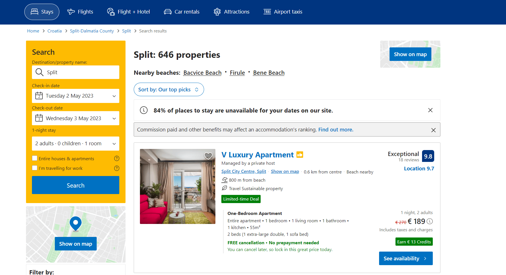

Nobody wants to waste time standing in queues in front of the ticket office and absolutely nobody is fond of spending long hours on a phone when it is necessary to book a hotel room. And thanks to modern apps, it is possible to avoid these unpleasant experiences. Given the wide range of benefits that users can leverage thanks to solutions of this type, it is absolutely not surprising why so many startups and companies are interested in launching such apps.

In this article, we'd like to share our knowledge in this sphere and explain how to create a booking app. In other words, our blog post will help you to find the right approach to online booking app development and to launch a solution that will be bound to succeed and win the attention of users.

## Online booking app market overview and benefits of booking apps

When we are talking about booking app development, it is vital to understand that this group includes a lot of types of mobile and web solutions united by one common idea. They allow users to order and often pay for some particular services or products. It can be either a hotel room, a concert ticket, or a table at a restaurant (we will definitely have a closer look at these types a little bit further in our article). Nevertheless, all of them let people avoid a lot of extra effort that they previously needed to devote when they wanted to get access to some products or services. Now, everything can be done fully remotely and just in a couple of clicks. This convenience is one of the reasons for the popularity of such apps.

Moreover, it is important to understand that these solutions are gaining popularity in parallel with the growing tech literacy in society and the skyrocketing <a href="https://www.statista.com/statistics/539395/smartphone-penetration-worldwide-by-country/" target="_blank" rel="nofollow">smartphone penetration</a>, especially in developed countries. For example, in the US, the smartphone penetration level is already over 80%, in France, Italy, and Germany, the figures are also close to this mark. All this means that today a huge part of the population of many countries is accustomed to using mobile apps for solving their everyday tasks. In some sense, we also should admit that today mobile applications are even more popular than the same solutions for web platforms. And, again, it is related to the convenience and time that is needed to solve this or that task with the help of a smartphone or a computer. That's why for B2C solutions quite often <a href="https://anadea.info/services/mobile-development" target="_blank">mobile development services</a> can become a more feasible solution.

**Let's summarize, what new opportunities and advantages users can enjoy with booking apps.**

- Such services are available 24/7.
- They help to save time.
- It is possible to pay for products and services online.
- With them, users can avoid travel costs as they do not need to go, for example, to ticket offices or to restaurants to book a table.
- Such apps usually provide information about services and products which allows users to make a comparative analysis and choose the best option.
- Very often such applications launch loyalty programs. As a result, it is possible to get awesome discounts and other bonuses.
- Users can always take their time when they need to think, create lists of the most attractive options, return to the app at any moment, and continue their search.
- When a transaction is completed, users can see a confirmation on personal accounts. It is very convenient to know that all the information about your booking or order is just at hand.

But when you want to create a booking website or app, it is vital to realize what advantages your businesses will have in order to make a decision about the feasibility of this project.

- **Your clients will have the possibility to book your services, make appointments, and pay for them 24/7.** Thanks to this, the chances that you will receive an order are higher as there are a lot of people who prefer to make appointments and place orders past working hours.

- **You can optimize your staff**. When all orders are received only via calls, it is necessary to have specialists who will always be ready to answer these calls and process the requests. With online reservation systems, everything can be done faster and more easily. Of course, you still need to hire specialists who will process the orders left online and, moreover, somebody needs to support your website or app but that is already another story. And also, do not forget that today many users, especially those who belong to the group of the younger generation, hate making calls. And when everything can be done online, that's the perfect case for them.

- **The risks of mistakes are lower.** When you automate your business processes, you eliminate any mistakes that can be caused by a human factor.

- **You can increase your productivity.** As your online booking software will do a huge part of the work for you, you can invest less time in processing bookings and, consequently, your total productivity will be higher.

- **You will get a lot of valuable insights.** Information is one of the most valuable resources for businesses. That's why, it is important to have a convenient tool for gathering business data and processing it. You can use powerful analytics tools that will provide you with insights based on the gathered data related to users' preferences, time spent on different pages, and other behavioral patterns. You will be able to use this data for adjusting your software solutions and offers to the needs and preferences of your target audience.

And, of course, all these advantages have a direct impact on business profits.

**To fully realize the scales that such apps can reach, let's take some of the most well-known apps as examples.**

In 1996, **Booking.com** was just a small Dutch startup that didn't look very promising at that time. Today it is one of the leading companies in the industry. Now Booking.com is available in its web and mobile versions and has over 28 million accommodation listings. Moreover, it offers the possibility to book transfers and entertainment as well. It is also possible to read blog posts and reviews left by other travelers. All this makes Booking.com a comprehensive platform for people who are planning to go on vacations or have a business trip. Everything can be smoothly organized directly via Booking.

**OpenTable** is a restaurant reservation service that started its way in 1998. At that time, it offered the functionality for booking tables only at a limited number of restaurants in San Francisco. Now its network unites more than 50K restaurants worldwide. Every year, more than 1 billion tables are booked via the OpenTable app and website. And every month, nearly 1 million restaurant reviews are added by users which proves a high level of interest from the side of people.

Do these figures demonstrated by industry leaders show that the market is already full and there is no space for those who are just started their business journey? Definitely not. The interest of users is extremely high and there are no signs that can indicate that this interest will start decreasing anytime soon.

Though for users it may be comfortable to use such global platforms as Booking or OpenTable and have the possibility to book accommodations and restaurant tables all over the globe via a single app, in some regions we can observe a lack of local solutions. It will be a good idea to create a booking app that will cover several segments like restaurants, events, accommodations, and wellness services in one particular city or country. Such products will have huge chances to win the hearts of local communities. Moreover, in this case, you will be able to choose an interesting approach to positioning your new solution within the community.

## Online booking app development: What type to choose?

As we've already mentioned the range of apps that fall under this category is amazingly wide. But let us mention the key types of these solutions. We hope that this information will help you to better understand what you can offer to your clients if you decide to transform all your booking app development ideas into a real software product.

### Hotel and accommodation booking

Without any doubt, the majority of modern users know such names of websites and apps as **Booking.com** and **Airbnb**. And this popularity can be brightly demonstrated with real numbers, in 2022 only, the number of Booking.com downloads for Android and iOS reached the mark of 80 million.

Such apps allow users to find accommodations like hotel rooms, hostels, and apartments, in different corners of the world, compare the available offers, view photos, read reviews and descriptions, and book the best variants. When it comes to payments, there can be different options. Sometimes it is required to pay online, in some other cases you can pay upon arrival.

### Travel and transportation booking

As a rule, such solutions are launched by companies that offer passenger bus transportation services like **FlixBus** and **Ecolines**, airlines like **Ryanair** or **United Airlines**, as well as local railway operators. Sometimes taxi services <a href="https://anadea.info/blog/develop-an-app-like-uber" target="_blank">like **Uber**</a> also can be included in this category. But there are also travel and transportation aggregators that act as third-party but also can be useful for those who are looking for the best deals. Here, it is important to bear in mind that not all aggregators allow users to buy tickets via their systems and can only direct them to the website of a seller.

Such applications are a bright example of <a href="https://anadea.info/blog/travel-agency-software" target="_blank">travel agency management software</a>. If you work in this industry, you may be also interested in getting more information about other products that belong to this group. Moreover, our company has successfully realized a row of projects for the travel industry and invite you to find out more details about them in our <a href="https://anadea.info/projects" target="_blank">software development portfolio</a>.

### Event and ticket booking

These apps and websites boast enormous popularity in many countries of the world. They have fully revolutionized client experiences and greatly facilitated all the processes related to buying tickets for different events. One of the greatest benefits for users is that they do not need to look for ticket offices and they can easily buy tickets for events organized even miles away from their current locations and even for those that will take place on another continent. Moreover, in such apps, users can always see the plan of the venue and choose the best seats as well as understand how many seats are left.

We've already written about <a href="https://anadea.info/blog/ticket-booking-app-development-guide" target="_blank">ticket booking app development</a> on your blog and we strongly recommend you read this article if you want to know how to make a booking app of this type.

### Restaurant reservation

Such web and mobile applications allow business owners to establish close and comfortable communication with their clients. A table for a romantic dinner or a family celebration can be booked and confirmed in a couple of minutes. While some restaurants turn to custom mobile or <a href="https://anadea.info/services/web-development" target="_blank">web development services</a> and launch their own solutions, many others prefer to join already existing platforms that provide users with access to the booking systems of many restaurants at once, like **OpenTable** or **Resy**. A lot of apps of this type can also be enriched with the restaurant's point-of-sale solutions. Such integration helps to greatly streamline and enhance operations.

### Health and wellness appointments

These apps are believed to be powerful tools for increasing your client's satisfaction and loyalty. Thanks to the automation of reservations, you can not only allow users to save time but also have a comfortable option for rescheduling or canceling their visits. Today there are such software products as **Book4Time, Booksy, Apointy,** and many others. But some medical and wellness centers also prefer to build their own apps that they use as an additional channel for communication with clients.

### Other niche booking services

To this group, we can add a lot of products for different industries. For example, if you have a dress rental service, you can launch an app that will help your customers not only to make appointments but also choose the dresses that key want to try on. Or you can create a booking app for a library where users can choose what they want to borrow in advance.

Here, everything depends on the needs of your business and your imagination. And at Anadea, we will always be happy to find the right approach to building powerful apps based on your requirements.



## Features that you should consider for your online booking app

Though it is a clear fact that the features that an online hotel booking app has won't be just the same as those you need to build for a ticket booking platform. Nevertheless, it is possible to define some common functionality that will be relevant for all solutions in this category.

### Essential features

- Registration and user account
- Calendar
- Push notifications
- Payment gateways
- Filter-based search
- Ratings and reviews
- Maps and geolocation

### Advanced features to enhance user experience

- Lists of favorite options
- AI chatbots
- Dynamic pricing
- Personalized recommendations
- Booking history
- Social features

### Admin panel features

- Dashboard
- Tools for adding, editing, and deleting positions (events, hotels, etc.)
- Tools for viewing the history of booking and payment transactions

## Monetization of your project

When you launch an online booking website or application, it is quite natural to start thinking about possible ways to make money on your app. We have a couple of monetization ideas that you may find appropriate in your situation.

- **Advertising**. It is a simple way to earn money but you need to make sure that your ads do not spoil the user experience.
- **Paid downloads.** Though this option seems to be reasonable, you should be careful with it as it may become a barrier to your user base growth.
- **Premium features**. You can offer some options like early access to tickets or other bonuses as a paid package.
- **Services fee.** Owners of booking apps can earn a percentage from sales or a fixed fee on transactions.

## Tech stack for booking app development

When you are thinking about how to create a booking website or app, it is clear that you want to know what technologies and tools will be used, and, consequently, what specialists will be able to work on your project.

Of course, the exact list of tools and technologies will be known only after a deep analysis of your idea itself, and the tasks that you want to solve with your software product. Moreover, a huge part of the tech stack will depend on the platforms that you want your solution to be compatible with.

Below you can find some of the most popular technologies and tools that are typically used for booking app design and development. But please do not forget that in any particular case, these lists can be changed.

### Mobile app development

- **Programming languages:** Java, Kotlin (Android), Swift, Objective-C (iOS), React Native, Xamarin (cross-platform)
- **Backend:** PHP, Python
- **UI and UX:** Android UI, UIKit, SwiftUI, Figma
- **Payments:** PayPal, Stripe
- **Push notifications:** OneSignal, Pusher
- **Calendar:** Zoho, Google Calendar
- **Maps APIs:** Google Maps, Mapbox,Openstreetmap

### Web app development

- **Frontend:** HTML, CSS, JavaScript, JavaScript, TypeScript
- **Backend:** Ruby, Elixir, Python, PHP, Java
- **Database:** MongoDB, MySQL
- **Server-side framework:** Rails, Express, Django
- **Client-side framework:** Angular, React, Redux
- **Cloud platform:** Azure, AWS

## Online booking app development: process, time, and costs

When our clients come to us with questions on how to make a booking site or app, we always provide them with an approximate project realization plan that helps them to understand what stages are included in this process.

- **Step 1.** Every successful project starts with an idea. The same should be taken into account when you start to think about launching a booking solution. The first step requires deep market analysis. You should be sure that your application will offer people something that they really need to have and something that is not available to them at the moment. If you need assistance already at this step, we are always at your disposal. Our experts will conduct market research for you and offer the best solution.

- **Step 2.** Now it's time to gather requirements, choose a tech stack, and plan the roadmap. Very often this step is named business analysis and planning. Based on the goals and tasks of your product, it is necessary to decide on the features that your solution will have, the ways how they will help users, and the outcomes that they can get. With this information in mind, your development team can choose the right tools and set timeframes.

- **Step 3**. When all requirements are gathered. It's time for booking app design and development. As a rule, this step includes the creation of wireframes and prototypes, their approval, as well as a lot of coding work. Different projects require different approaches and efforts, that's why this step can be divided into different sub-steps that allow developers to organize the entire work in the most feasible way.

- **Step 4**. After the product is ready it is necessary to test it (in many cases testing is conducted in parallel with development). It is extremely crucial to make sure that all bugs are detected and fixed before users can find them.

- **Step 5**. It's time to launch your solution and wait for the feedback of the first users. Usually, when we are asked to create a booking app, we offer our clients to begin with an MVP that allows us to test the viability of the solution without significant financial losses from the side of customers. MVPs should include only the basic features. It means that you can save time and money and get the first opinions of users as soon as possible. Based on their feedback you can adjust and change your product.

- **Step 6.** When your app or website is already available to users and the major part of tech work is already in the past, it is necessary to focus on user acquisition and post-launch marketing efforts. Without any doubt, your marketing strategy should be developed in accordance with the peculiarities of your product and your brand identity. But the most common technics may include cooperation with influencers, active social media promotion, referral programs, etc.

### How to choose the right development team

If you do not have in-house developers, you always have a choice whether to create such a department or to work with an external team of experts. And to make the right decision, you need to answer the following questions:

- Do you have plans for regular software development projects?
- Are you sure that you will have enough budget to pay your in-house developers even when the active project phase is over?
- Does your corporate structure presuppose further expansion at the moment?
- Do you have enough resources for all the related recruiting, hiring, and onboarding tasks?

If you've answered "yes" to all these questions, it is probably a good idea to create an in-house team. In other cases, we offer to consider outsourcing.

This model will allow you to find experts with niche qualifications and skills that will have the required experience and will help you to enhance your idea at the stage of project realization. Moreover, in many cases, it is a more feasible option and it will help you to optimize your expenses.

### How much does it cost to create a booking app?

The cost of development is one of the most important factors that companies need to take into account when they are planning to build a new project. However, it is impossible to provide estimates without analysis of a lot of parameters, including your app functionality, the required tech stack, the volume of work, etc.

For example, the development of a booking app for the travel industry may take around **4 months** and its cost can vary in the range of around **$60K-$84K**. When we are talking about MVPs of simple ticketing apps, such projects will typically require significantly lower investments. This project may cost around **$15K-$20K**.

If you choose us as your software development partner, we will provide you with project estimates before we set our further terms of cooperation which means that you will be able to plan your budget allocation in advance.

## How can you improve your app? Key tips

- **Tip 1.** Even after the launch of your solution, your work on it should go on. Your app itself and its content should be continuously updated and improved in order to provide users with access to the most relevant information.

- **Tip 2**. It's also necessary to listen to your audience's opinions which will allow you to expand your solution with new features and enhance user experiences. That's why do not forget to monitor users' feedback.

- **Tip 3**. The nature of a booking app and the core idea behind it presupposes quite a lot of space for future scaling and expansion. For example, if you started your project by offering users access to holiday accommodations in one particular region, you can gradually enter new markets. If you have an app that helps users to buy tickets for concerts, you can also establish cooperation with sports event organizers and add tickets to matches and games.

- **Tip 4**. The tech market is quickly developing. And if you want to make sure that your solution fully meets market demands, you need to track all online booking app development trends and introduce new features in accordance with them. One of the most promising trends in booking app developments is the application of artificial intelligence. Among the AI use cases that are already widely adopted in this segment, we can mention AI chatbots and AI-powered personalized recommendations.

## Conclusion

If you are trying to find answers to the question on how to make a booking app and are looking for a reliable team that will provide you with all the required assistance, you should know that at Anadea, we can offer our professional help at absolutely all the stages of the project realization process. Our seasoned experts can not only create software products based on the technical requirements prepared by you but also can introduce various improvements and share their vision. Thanks to our proven track record in building outstanding software apps for companies in many business domains, you can fully rely on us. And we will do our best to deliver a solution that will go far beyond your expectations.

Contact us
