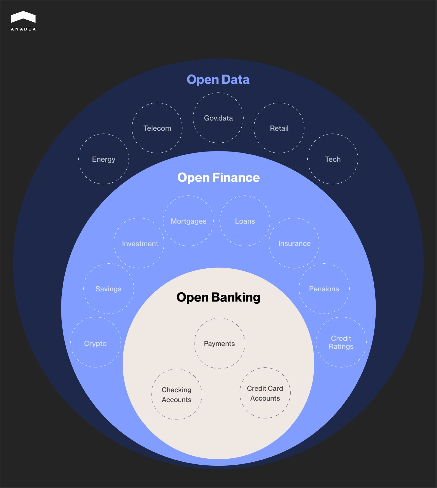
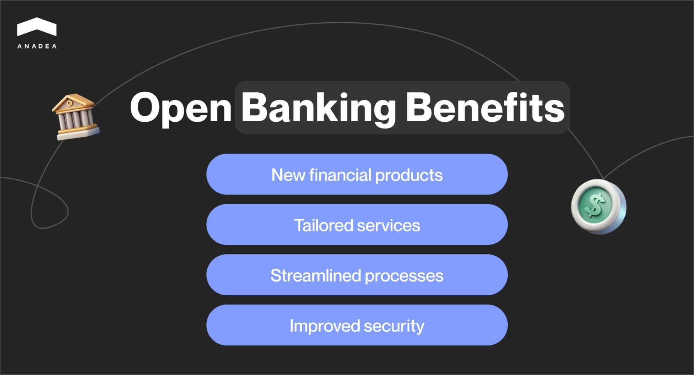

Although the finance and banking industry is believed to be quite traditional and resistant to innovations, today we can observe significant changes in this space. These days there are some shifts towards democratization of financial and banking services, their accessibility, and affordability. Thanks to various [custom fintech software solutions](https://anadea.info/solutions/financial-software-development), a lot of processes can be streamlined and simplified, while many services can become available to users regardless of their location or time of the day. A lot of changes are related to the way banking and financial institutions work with data. And that’s exactly what this article will be about. Open finance vs open banking - this choice may seem to be a rather complicated one. Both concepts sound rather similar. And both of them are related to the way of managing data. However, they are not just the same.

## What is open banking? Basic definition

Open banking is a term that refers to a banking practice that enables the exchange of services and data between financial institutions and third-party providers. In other words, it presupposes that third-party financial service providers may get open access to consumer banking, transactions, and other financial data in traditional banking systems. This can be done with the help of application programming interfaces (APIs) and only with the customer’s explicit consent.

Open banking is regulated by various frameworks in different regions. In the European Union, it is governed by the Revised Payment Services Directive ([PSD2](https://www.ecb.europa.eu/press/intro/mip-online/2018/html/1803_revisedpsd.en.html)). In the US, there is no comprehensive federal regulation for this practice as of September 2024. Nevertheless, the Consumer Financial Protection Bureau (CFPB) is the regulatory body that is in charge of overseeing the development of open banking.

The key goal of the implementation of this practice is to promote innovation by improving competition in this space. With open banking, consumers can leverage greater control over their financial information and services. At the same time, non-financial businesses and organizations can better understand the financial needs of their clients and efficiently address them.

For example, if we take an online fashion store. This business doesn’t offer any financial services. Nevertheless, it deals with payments. Thanks to the open banking practice, its managers can make more data-driven decisions, introduce more comfortable payment methods, and even find new revenue streams based on customers’ payment preferences.

In 2023, the global open banking [market size](https://www.imarcgroup.com/open-banking-market) hit the mark of $25.6 billion. According to experts, the future of this sector is rather bright. This figure can reach $113.3 billion by 2032. It means that the CAGR during 2024-2032 will be close to 17.5%.

## What is open banking examples range?

Open banking is not just one product or service. It is a framework that can unite under one umbrella an unlimited number of products and services. Let’s have a look at some of the examples that demonstrate what is possible within this concept.

* **Payment initiation**. With this service, sellers can eliminate the use of traditional payment gateways. Instead, they can initiate payments directly from the bank accounts of buyers. This approach can reduce transaction fees and streamline settlements.
* **Account aggregation**. Wealth managers and financial advisers can leverage the possibility of collecting banking data from multiple accounts and aggregating all the info in one place. Thanks to this, it is possible to get a full picture of the financial status of an individual and provide more accurate advice.
* **Automated invoice reconciliation.** Open banking APIs can help companies match invoices to transactions. This can be done automatically, which reduces manual work and minimizes the risk of mistakes.
* **Instant credit scoring**. With real-time access to data from multiple sources, banks and financial institutions can analyze and determine clients’ trustworthiness with a higher level of precision.
* **Enhanced fraud detection.** Among open banking examples, we should also mention solutions that can increase the security of financial products and transactions. Thanks to open banking and instant analysis of transaction data, the detection of suspicious activities takes place practically in no time.
* **Multi-banking platforms**. A lot of businesses use the services of several banks at the same time. This point is especially relevant for those entities that operate in foreign markets. Open banking makes it easy to consolidate accounts from multiple banks into a single dashboard. As a result, it becomes much more comfortable to track their global operations and transactions.

While talking about the open finance vs open banking choice, it will be also helpful to consider some real-life examples of their implementation.

### Raiffeisen Digital Bank

Raiffeisen Digital Bank is one of the financial institutions that are successfully using open banking today. It relies on this model to assess the creditworthiness of clients and potential risks related to lending to them. If clients provide their consent, the bank can analyze their banking histories.

It is possible thanks to the cooperation with one of the open banking data providers, AISP (Account Information Service Provider). AISP relies on such information as the average account balance and spending habits, and can provide a single-letter score from A to F. This score reflects the level of risk associated with lending to a particular person.

### Simpl.rent

Simpl.rent is a Polish-British startup that relies on open banking practices to enhance the verification of potential tenants.

When a person is interested in renting a property, Simpl.rent can assess his or her financial history and quickly analyze the risks based on the available financial data. Thanks to these possibilities, owners of properties can make better-informed decisions when it comes to the choice of potential tenants.

Moreover, this approach can greatly streamline the decision-making process. And potential tenants do not need to wait for a reply for too long.



## What is open finance? General information you need to know

To make up your mind on the open finance vs open banking duo, you should also get a good understanding of both practices.

Open finance is a broader concept and is often viewed as the next step of open banking development. It can expand the possibilities provided by its predecessor and offer even more benefits to all market players.

Open finance is not concentrated on banking data only. It allows third-party service providers to get access to customer financial data of different types and from various accounts. For example, this data can also be related to insurance, pensions, mortgages, savings, investments, and other sectors of financial activities.

This can help organizations find a more personalized approach to each customer and deliver financial products and services that will be fully tailored to the person’s needs.

The goals and ideas behind open finance are very close to those that we've discussed in the context of open banking. However, the scale of this newer concept is much wider. As for regulation, there isn’t any separate specific legal framework for it now.

With open finance, consumers are allowed to share data across the entire financial ecosystem. And at the same time, they can choose how they want to use their data for such aspects as budgeting, investing, and payments.

### Open finance examples

As for the real-life use cases for open finance, they are still quite limited. Nevertheless, we can already observe its growing adoption in a row of countries, including India and Brazil.

For example, **Banco de Brasil** has revealed that open financial data is used to enhance customer scoring for loans and credits.

India has introduced its version of open finance dubbed the **Account Aggregator** (AA) framework. This initiative is known to have brought positive results. It is reported that after customers linked their financial accounts through the AA systems, their engagement in the investment sectors has significantly grown. Moreover, thanks to the Account Aggregator, one of the private sector banks managed to achieve a 25% reduction in credit application process fees. At the same time, this initiative greatly contributes to the security of the financial space. Several lenders that rely on the AA data reported zero fraud rates.

## How to choose between open banking vs open finance?

Though these concepts are very close, we can’t equate them.

The key difference between open banking and open finance is in their scope. Open banking is focused on payment data. Being a broader concept, open finance covers not only payment data but also all other data that can be accumulated by financial institutions.

That’s why for your project you should decide whether you need to deal with a wider scope of data, or traditional open banking approach will be enough to satisfy your requirements.

Here, it is vital to mention that these two concepts are at different stages of implementation now. And this can be a crucial factor to think about.

Open banking is already a well-established framework. At the same time, open finance is still in the project phase and there are still no specific regulations for it.

<a href="https://www.insurely.com/open-finance" target="_blank">Source</a>

Sometimes there are also discussions about the embedded finance vs open banking comparison. Nevertheless, embedded finance is a different concept that shouldn’t be placed in the same row as open banking and finance. It refers to the integration of financial services into non-financial platforms, products, or services. It allows non-financial companies, like retailers, to offer financial products, such as payments, lending, insurance, or investment, directly within their ecosystem.

As for this open banking vs embedded finance combination, we can say that open banking and finance are contributing to the development of the embedded solutions and power their implementation.

## Open finance vs open banking: Benefits for businesses

While talking about open finance vs open banking differences, it is vital to highlight that when it comes to their advantages, they have a lot in common. They both promote greater transparency, accessibility, and consumer control in the financial services industry. They support innovation, enhance competition, and help businesses provide consumers with better services in both financial and non-financial services.

Benefits of open banking:

* **New financial products**. Open banking enables [fintech companies](https://anadea.info/blog/fintech-business-model) to develop innovative products, such as budgeting apps, automated savings tools, and personalized lending solutions.
* **Tailored services**. With access to more comprehensive data, banks and fintech companies can offer personalized services to their customers.
* **Streamlined processes.** With open banking data, such processes as applying for loans, mortgages, or switching banks, can become much faster than they used to be. This will allow businesses to work with more customers per day.
* **Improved security**. [Security in the fintech](https://anadea.info/blog/fintech-security-challenges) and financial sectors still remains to be a serious concern. Open banking is regulated by approved frameworks like PSD2 in Europe. This ensures that third parties accessing bank data are authorized and must meet strict security standards. Moreover, customers have control over which third parties can access their data. This reduces the risk of unauthorized sharing and makes the system more transparent.

Benefits of open finance:

* **New business models**. Open finance enables the creation of new fintech platforms that can aggregate financial services from multiple providers.
* **Comprehensive data analytics**. Businesses can access a broad range of customer financial data and gain deeper insights into customer behaviors, preferences, and needs. This allows them to ensure more accurate segmentation and targeting.
* **Seamless customer journeys**. With open finance, businesses can offer smooth and integrated processes for customers. Individuals can manage all their financial products through a single interface. This can greatly improve their overall experience.
* **Reduced customer acquisition cost**. Thanks to a more complete view of customer data, businesses can better target potential customers with relevant products. As a result, it helps them to reduce the costs associated with inefficient marketing campaigns.
* **Competitive advantage.** Early adopters of open finance can gain a competitive edge by offering more innovative, personalized, and integrated financial solutions.

## Open finance vs open banking: How we can help you implement new solutions

If you are thinking about launching your open finance or open banking solution but do not have in-house developers, you need to find a reliable tech partner with relevant experience. At Anadea, we work with projects from different domains but fintech is one of the sectors that we are focused on.

Our expertise is proven by a row of successfully developed fintech [projects](https://anadea.info/projects#fintech), including but not limited to a P2P lending platform, a multi-market mobile trading app, and an invoice financing system. Our developers deeply understand the latest trends and user needs, as well as security and regulatory requirements for financial digital tools.

Already have an idea for a fintech solution? Or still have doubts regarding the correct open finance vs open banking choice? Do not hesitate to contact us! At Anadea, we will find the right approach to your project realization and will deliver a solution that will bring the highest value to you and your customers. Get project estimates for free!

Get in touch
