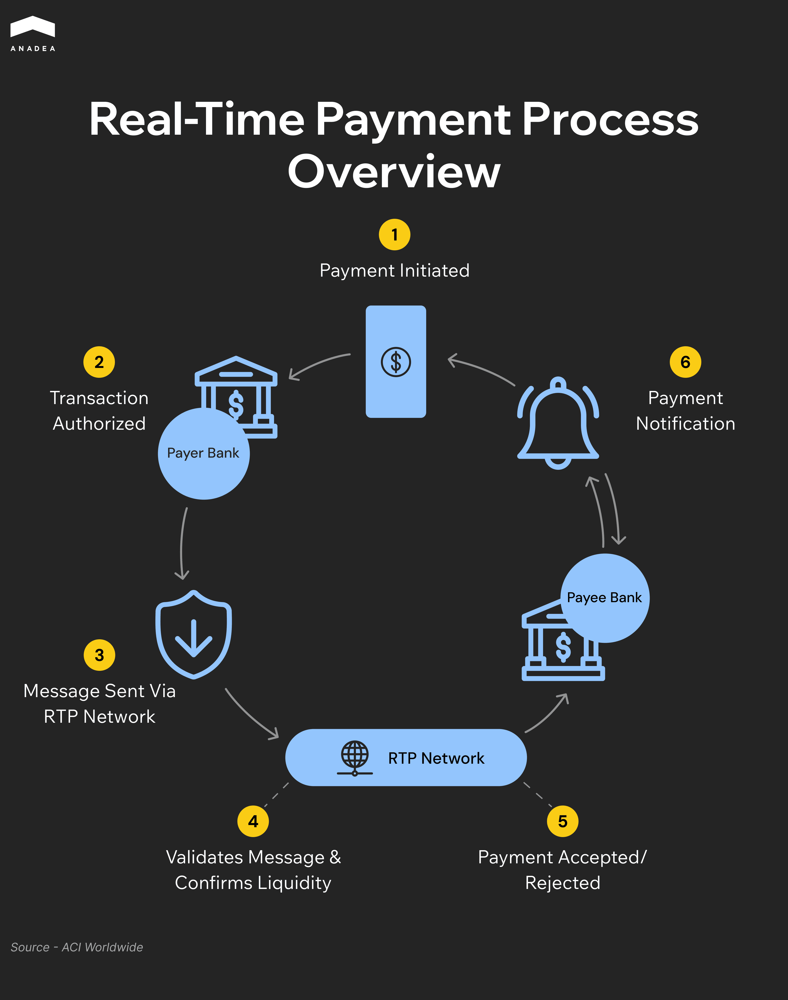

Reliability, security, and speed of payments are the key priorities for the modern financial ecosystem. Businesses and consumers all over the world look for seamless experiences and transparent money transfers. And that’s what P2P and B2B real-time payments (RTP) can offer them today.

In 2024, the global real-time payments market reached $24.91 billion. It is projected to grow from $34.16 billion in 2025 to [$284.49 billion by 2032](https://www.fortunebusinessinsights.com/real-time-payments-market-110424), demonstrating a CAGR of over 35.4% during this period.

The increasing adoption of real-time payments is powered not only by commercial projects but also by government-led initiatives, like FedNow in the US and UPI in India. A lot of central banks and regulators in different corners of the world introduce incentives to support the introduction and wider use of RTP systems. Such steps can fully reshape business operations and the financial services themselves.

In this article, we invite you to take a closer look at the tangible value that real-time payments of different types bring to both enterprises and end-users.

## Key Advantages of Real-Time Payments

The growing adoption of RTP methods is explained by the impressive range of benefits of such systems.

### Simplicity

That’s one of the most important perks of RTP solutions for end users and service providers. Consumers can send and receive money instantly. To do it, in the majority of cases, they can use easy-to-remember identifiers like phone numbers or email addresses. It means that there is no need to provide complex bank account details. 

For businesses, such systems significantly simplify transaction processing. They can benefit from real-time confirmations, automated reconciliation, and reduced reliance on time-consuming operations. 

### Cost Savings

RTP transactions typically incur lower fees than legacy methods like wire transfers or card transactions. While card networks often charge around 3% per transaction, many RTP systems work with flat or minimal fees.

In addition to this, with fully digital transfers, businesses can minimize their reliance on physical payment instruments and resources. Therefore, they can avoid manual processing and paper printing. This also helps to cut administrative overhead.

### Operational Efficiency

With real-time payment systems, large enterprises and smaller businesses can dramatically improve their back-office efficiency and streamline financial workflows.

Instant payment confirmations and rich transaction data enable companies to match payments with purchase orders, invoices, and other related documents in real time.

Automation minimizes human intervention and decreases the risk of widely spread payment errors like duplicate entries, mismatched records, or processing delays. In addition to this, real-time data access helps companies comply with regulatory requirements and internal reporting.

### Advanced Security

Most RTP platforms incorporate advanced protections such as multi-factor authentication, biometric verification, device recognition, and one-time passwords. At the same time, adherence to local Know Your Customer (KYC) regulations ensures that platforms meet stringent security and compliance standards. 

### Strong Architectural Standards

Many real-time payment platforms adopt the ISO 20022 messaging standard. It supports rich data formats and facilitates integration with global systems such as SWIFT. This is especially beneficial for conducting cross-border payments. 

However, not all systems follow this path. Some platforms rely on ISO 8583. Originally, it was designed for card transactions, but it can also be applied to RTP solutions.

## B2B Real-Time Payments: How They Redefine Business Processes

B2B real-time payments are reshaping the way organizations deal with their core financial operations. They not only make a lot of processes much more convenient but also increase overall efficiency, which has a positive impact on business profitability and customer experiences.

Here’s how key business processes and operations are enhanced with RTP technologies..

### Invoicing

Instant settlement helps to eliminate delays in receiving funds, as well as improves liquidity and cash flow. Moreover, immediate payments minimize discrepancies and late-payment penalties.

Access to instant data also strengthens financial modeling, increases the accuracy of forecasting, and allows businesses to make better-grounded decisions.

### Procurements

Instant payments speed up order processing. As a result, inventory restocking is streamlined as well. 

Also, with real-time payments, businesses can introduce dynamic discounting. Buyers can benefit from lower prices for early payers. At the same time, suppliers can leverage faster access to funds.

### Supplier Relationships

When suppliers receive funds instantly, it greatly contributes to the increasing confidence in the buyer’s commitment and financial stability. The speed of payments reduces uncertainty around timing and allows suppliers to better manage their own cash flow and operations.

Besides that, the possibility to monitor and confirm payments in real time enhances accountability between parties. 

### Integration with Digital Ecosystems

B2B RTP systems can be easily integrated with various enterprise tools to automate not only payment workflows themselves, but also reporting and other related tasks.

In advanced systems, businesses can configure payments and triggers in such a way that transactions will be conducted automatically when contract conditions are met.

### Business Agility

With real-time settlement, companies can react faster to the ongoing supply chain changes or urgent market needs. This ability gives a strong competitive advantage in the modern business world.

## The Role of P2P Payments

Today, the concept of P2P payments has gone much beyond simple money transfers between relatives or friends. Such transfers often become an essential functionality of tools intended for splitting bills, [lending money](https://anadea.info/solutions/fintech-software-development/p2p-lending), sending digital gifts, managing rent, and handling shared expenses. They can also be used for micro-transactions in gaming and content platforms. 

A good example of a P2P financial product is MONEYZEN, one of the projects that Anadea’s team worked on. This is a [peer-to-peer web platform](https://anadea.info/projects/moneyzen) for investments and loans. This AI-powered solution aligns with the principles of responsible lending and enables secure money transfers between users’ personal bank accounts and their virtual accounts on the platform.

The adoption of P2P features is boosted by the rise of [embedded finance](https://anadea.info/blog/embedded-finance-baas-api-first/).

### What Is Embedded Finance?

This term refers to the idea of integrating financial services within non-financial platforms. In the context of P2P transactions, it means that people can seamlessly send or receive money on various apps without switching to a bank or any dedicated payment solutions.

With the growth of embedded finance, a lot of companies outside finance can benefit from the introduction of P2P payments.

For example, retailers and eCommerce businesses can enable P2P transactions for purchases, gift transfers, and refunds directly on their platforms. This step traditionally has a positive influence on user satisfaction and loyalty.

Messaging apps and social media platforms can also incorporate financial transactions into chat flows.

In the gaming industry (and especially in online streaming), P2P transfers have already become a standard.

### Benefits of Embedded P2P Payments for Brands

* **Higher user retention**. Seamless transactions reduce friction and make the interaction with platforms more seamless for users.
* **Additional revenue streams**. Businesses can get extra profits from a peer-to-peer network for payments. For example, if they add such functionality to their apps, they can charge transaction fees or monetize their partnerships with different fintech services.
* **Increased trust**. Secure P2P features strengthened by biometric authentication and fraud detection help to build user confidence.

## Power of Real-Time International Payments

Global commerce is accelerating. Both businesses and consumers need to have fast and reliable cross-border payments. For many years, the SWIFT network was the foundation for international money transfers. Nevertheless, amid the changing market demands, it has become clear that a new, more powerful and flexible alternative is needed. Here’s when RTP technologies enter the global arena.

### Limitations of SWIFT

* **Slow settlement**. With this messaging protocol, it may take from 1 to 5 business days to make a transfer. The time required for this depends on the involved parties, time zones, and local banking hours.
* **Hidden fees**. Multiple intermediary banks can be included in the transfer process. All of them can introduce their fees, which leads to a lack of cost transparency.
* **Limited tracking**. As a rule, there is very little visibility into where the funds are at the moment. That’s why it is impossible to understand when they will be received.
* **Complex infrastructure**. This payment system heavily relies on correspondent banking networks. This adds friction and increases related risks.

### How Real-Time Payment Networks Address These Issues

* **High speed of transfers**. Settlements even for cross-border payments are conducted within seconds or minutes.
* **Transparency**. RTP systems allow users to track their transfers, view all the related fees, and get instant notifications when funds are sent or received.
* **Lower costs**. There are fewer intermediaries involved in the processing of transactions. This helps to reduce fees.
* **Great availability**. Such systems operate 24 hours per day, 365 days per year, without any days off or breaks.

While trying to make any predictions for the near future, it’s difficult to imagine that systems for real-time international payments will fully replace SWIFT. For complex and high-value corporate transactions, this traditional system will still remain a strong player. Meanwhile, we can expect to see the emergence of new hybrid models, where the speed of real-time solutions will be powered by SWIFT’s global reach.



## RTP Infrastructure: What’s Behind It?

The progress in the sphere of real-time transactions, including international payments, is powered by the advancements in [fintech development](https://anadea.info/solutions/fintech-software-development) and related technologies.

### API and Open Banking

APIs provide the possibility to seamlessly integrate bank systems, fintech platforms, and third-party services. This ensures real-time access to account data and instant payment initiation.

At the same time, open banking frameworks are aimed at enhancing transparency, strengthening competition, and fostering innovation in payment services. Want to know more about this concept? You can find more detailed information in [our article about open banking](https://anadea.info/blog/open-finance-vs-open-banking/).

### ISO 20022 Messaging Standard

This global standard for financial messaging ensures the exchange of structured data across payment systems. Thanks to the improved clarity and consistency in transaction details, it becomes easier to support interoperability between institutions, automation, and compliance. All these components are essential for the efficient processing of real-time transactions of different types.

### Blockchain and DLT

Blockchain and distributed ledgers are changing the way transactions are recorded and settled. They provide a decentralized system for real-time data sharing. As a result, all participants in a network can get practically real-time access to a synchronized, immutable record of transactions. This eliminates the need for intermediaries and also enhances transparency, security, and auditability. DLT can significantly reduce settlement times, lower transaction costs, and minimize errors in payments.

### Artificial Intelligence in Fraud Detection

AI and ML play a critical role in monitoring real-time transactions and identifying unusual patterns, anomalies, and potential threats. This helps to detect and prevent fraud within milliseconds. AI-powered systems can continuously learn from new data and can adapt to emerging fraud tactics without manual intervention. AI can also assess risk scores, flag suspicious transactions, and trigger additional authentication and transaction blocking mechanisms.

## Wrapping Up

Nowadays, real-time payment systems are a strategic business necessity. For P2P and B2B local and international transactions, this method offers essential benefits, such as speed, transparency, and efficiency. They directly impact customer satisfaction and can positively affect business profitability. 

With growing consumer demand and rapidly maturing infrastructure, today can be a good time for launching a dedicated real-time payment platform or a solution enriched with RTP functionality. 

The success of such a project will heavily rely on the timing and the idea itself. But also, it requires execution powered by the right expertise. A trusted tech partner like Anadea, with solid experience in web and [mobile development](https://anadea.info/services/mobile-development) and [design](https://anadea.info/services/ui-ux-design/mobile-app-design), will help you navigate the complexities of this domain.

Want to know more about what we can offer you? Don’t hesitate to contact us. And if you have already prepared your project requirements, share them with us and get estimates for free.
