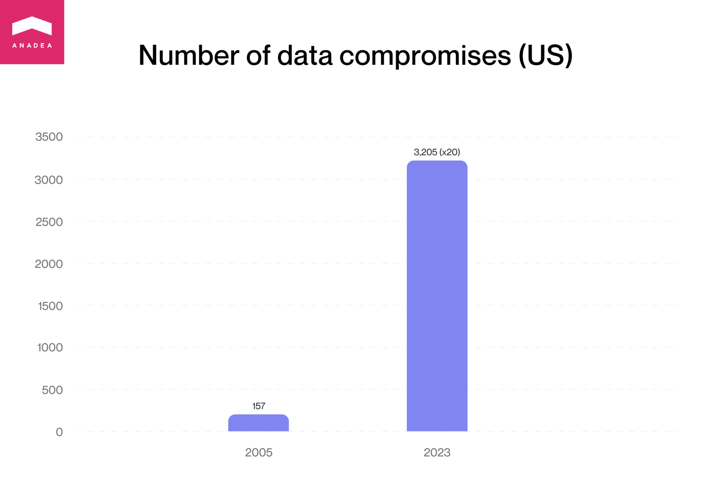
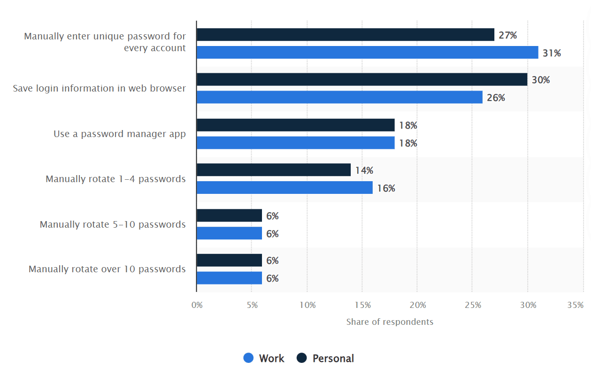
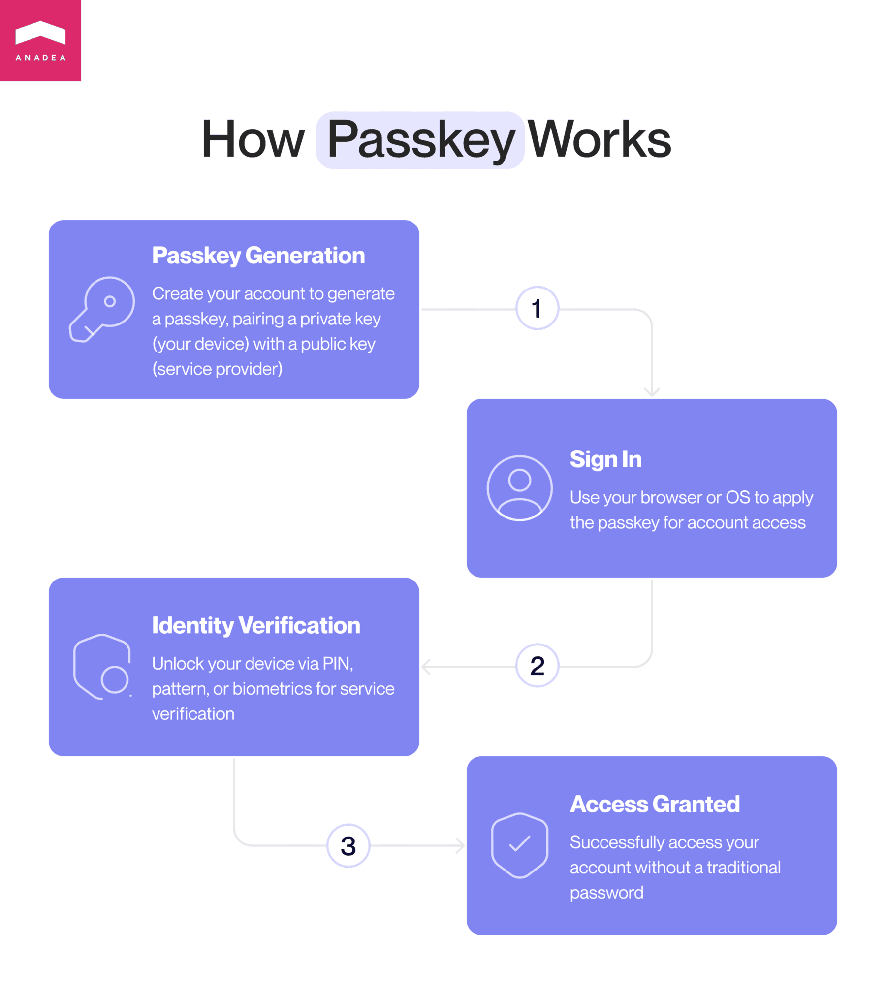
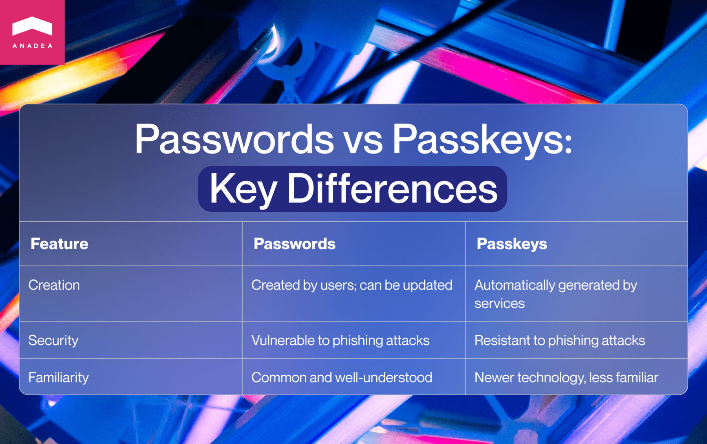

The issue of digital security is more pressing than ever before. Hackers, fraudsters, and other illegal players are continuously working on making their tools and approaches more and more sophisticated. Just imagine. In 2023, in the US only, the <a href="https://www.statista.com/statistics/273550/data-breaches-recorded-in-the-united-states-by-number-of-breaches-and-records-exposed/" target="_blank">number</a> of data compromises reached the level of 3,205, while in 2005, this figure was 157, which is more than 20 times lower. And, of course, <a href="https://anadea.info/services/custom-software-development" target="_blank">software development</a> teams should take this fact into account while building their solutions.

Though the topic of cybersecurity and data protection is a rather wide one, in this article, we’d like to talk only about one of its aspects. A good password is often considered to be one of the most important tools for protecting sensitive data from unauthorized access. Nevertheless, we should admit that even the strongest passwords are not safe enough in the current conditions. This leads us to the next big thing - <a href="https://anadea.info/services/passkey">passkey implementation</a>. But what is a passkey? And do you really have to choose between passkey vs password? We invite you to find answers to these questions in our article.

## What is a password?

Let’s begin with passwords that are more familiar to a wide audience and analyze their pros and cons.

**A password can be defined as secret data (as a rule, it will be a string of characters) that is used to gain access to an app, device, or place.** It can be a word, a phrase, or just a random combination of letters, numbers, and special characters.

There are so-called weak and strong passwords. A **weak password** can be easily guessed and compromised by a cybercriminal. For example, very short passwords, passwords that include recognizable keystroke patterns (like QWERTY) or your personal data (JohnSmith1972), repeated characters (666666), or other commonly used variants (like PASSWORD123) are definitely weak.

The strongest passwords are usually **lengthy, random combinations** that can contain numbers, lowercase and uppercase letters, as well as symbols. The more complex and longer your combination is, the better. Such passwords are not simple to guess. But it will be very difficult for you to remember them. And if you keep them somewhere written or when you use a not very reliable password manager app, they can be stolen.

In general, it is very interesting how people work with passwords and how they use them in different situations. For example, the <a href="https://www.statista.com/statistics/1147407/password-habits-adults-worldwide/" target="_blank">survey</a> demonstrated that more than 30% of adults use unique passwords for each of their accounts at work, but only 27% of respondents do the same in their private accounts.

Though passwords are commonly used, they have their drawbacks and can’t guarantee absolute protection of your data. However, today, there is another solution.

## What is a passkey?

We have another way to get access to our online accounts with no need to rely on passwords. To do this, we can use a passkey. **It's a FIDO (Fast Identity Online) credential that is stored on your device and is used to unlock your online accounts.**

The principle of its work relies on a **private cryptographic key** and a **public cryptographic key**. The service where you have your account stores the public key, while the private key will be kept locally (on your device).

When you create your account, your passkey is generated. And then, when you need to sign in, your browser or operating system will help the service to use the right passkey and verify you. In general, for a user, this process looks and feels very similar to the cases when they have saved passwords in the browser.

How can a service know that an authorized user tries to get access to the account? It will ask to unlock the device. It can be performed with a PIN, special pattern, or biometric methods (facial recognition or fingerprint).

This protection approach allows users to sign into their accounts on any device. Even if a passkey has been created and is now stored on a smartphone, they can access their accounts on a laptop or tablet. But to do it, it is required to have this smartphone nearby and be able to approve the sign-in on it.

Today, there is already a range of services and apps that use passkeys. Among them, we can mention a lot of prominent names like **Google**, **PayPal**, **Shopify**, and **DocuSign**.

## Passkeys vs passwords: Key differences

Let’s summarize the main characteristics that you should bear in mind when you need to make a password vs passkey decision for your own product.

1. **Passwords are created by users, while passkeys are generated automatically by a service**. Passwords can also be generated by services, but users still have the possibility to update them. And, of course, every person tries to create a password that they can easily remember. Moreover, quite often, people use the same password for all their accounts, which is definitely not the best idea. In the case of passkeys, everything will be done automatically. And users will just need to confirm their identity with the device that stores a passkey.

2. **Passkeys are phishing-resistant.** Nevertheless, we can’t say the same about passwords. A phishing attack presupposes that users are expected to provide their login details and passwords to malicious websites that may look quite legitimate. And it is a quite simple trick used by cybercriminals. Nevertheless, in the case of using passkeys, it won’t work.

3. **Passwords are more common to users.** People are well familiar with passwords and clearly understand what is expected from them when a service or website uses passwords. Passkeys are a new technology that is still not very widely applied. However, given all the benefits, its popularity is growing.

### Are passkeys more secure than passwords?

In the passkey vs password security battle, **a passkey wins**. First of all, it is phishing-resistant. And secondly, it is error-proof. When people create and then use passwords, there can be a lot of mistakes caused by a human factor. In the case of passkeys, these risks are eliminated.

By their design, **passkeys support 2FA (two-factor authentication)**. Each passkey is tied to the device where it was generated (and users need to confirm their identity on it), which represents an additional protection level. In the case of websites that rely on passwords, a lot of people do not enable 2FA.



### Will passkeys replace passwords?

Speaking about <a href="https://anadea.info/services/web-development" target="_blank">web development</a>, it is highly sensible to presuppose that in the future, passwords will be fully replaced by passkeys. They have a lot of benefits related to security and data protection directly. And also, they are convenient for users: people do not need to learn anything by heart and worry that if they forget their password, they won’t be able to log in.

## Why transition to passkey?

When our customers come to us with ideas for their projects and we discuss security, today we often recommend they think about introducing passkeys instead of traditional passwords. This technology is more complicated from a technical point of view, but its benefits overweight this complexity.

- Passkeys are well-protected. Public keys are stored with a website/app server, and private keys are kept in a secure wallet.
- Passkeys are secured against password-based attacks.
- They ensure rapid authentication.

## Conclusion

Today, when cybercriminals already have so many advanced approaches to guessing or stealing passwords, passkeys come out as a more powerful tool for protecting users’ data and online accounts. That’s why it is not surprising at all that the number of websites and apps that use passkeys is increasing.

If you have any questions regarding the peculiarities of passkeys, the work of this feature, or <a href="https://anadea.info/blog/how-to-implement-passkeys" target="_blank">how to implement passkeys</a> into your existing or new solution, do not hesitate to contact our team. At Anadea, we do our best to stay tuned with all tech trends and pay a lot of attention to data protection and software security.

Contact us
