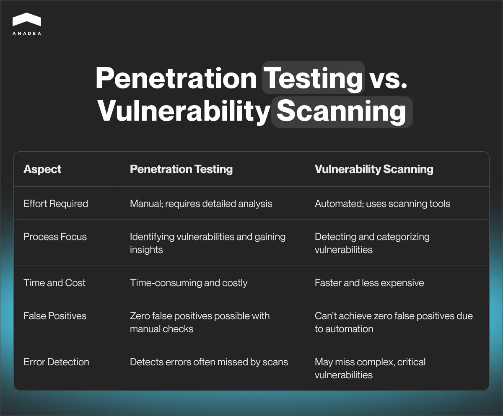
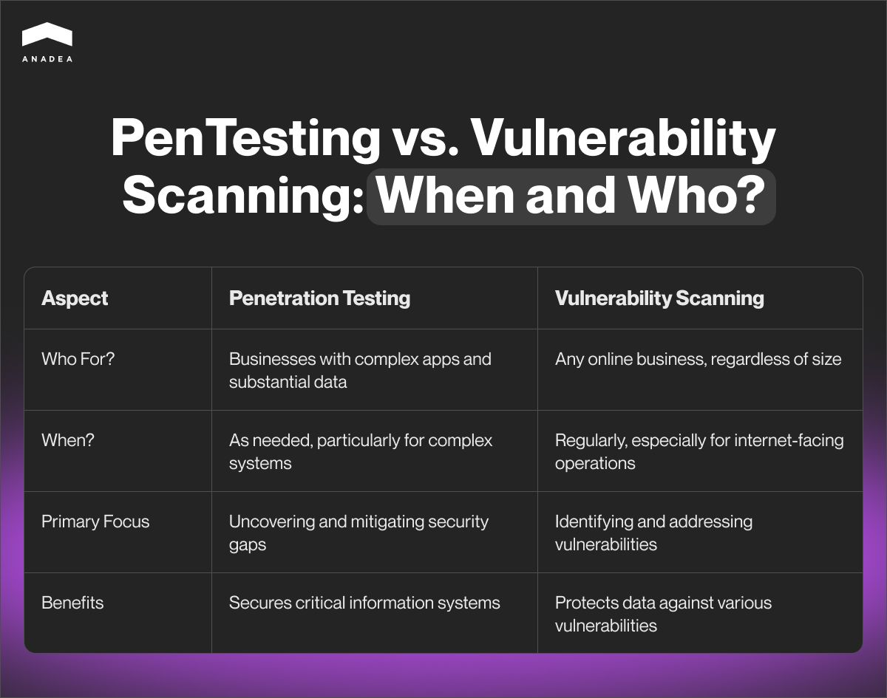

When it comes to software development, a lot of people strongly believe that coding is its most important step. But guess what? It is not so. All stages, from planning to post-launch support and maintenance, are significant for the common success. And of course, the role of testing efforts and security audits shouldn’t be underestimated.

In this article, we would like to focus on two types of methods aimed at detecting vulnerabilities in software systems and explain when and who needs to perform them. We offer you to have a closer look at the penetration testing vs vulnerability scanning comparison.

## Vulnerability assessment and penetration testing: What are they?

To speak about the difference between vulnerability scanning and penetration testing, we should provide clear definitions for each of these terms.

**Vulnerability scanning** is a review of security weaknesses in a network, hardware, software, or system, the goal of which is to identify, quantify, and prioritize the vulnerabilities. As a rule, such scans are conducted with the help of automated tools. All the detected vulnerabilities should be attentively analyzed and further taken into account for elaborating a remediation path.

**Penetration testing** (pen testing or a simulated cyber attack) is a more comprehensive process. It presupposes simulating different tactics of cyber attackers to evaluate the security of a system, separate apps, or individual software components.

The main goal of such activities is to find any hidden vulnerabilities that your software or hardware may have. The gained insights are used to adjust security policies and eliminate any gaps in them. Thanks to being better informed about the current state of their systems and their weaknesses, companies can be better protected from any actual cyber attacks.

You can read more about penetration testing in one of our previously published [articles](https://anadea.info/blog/what-is-penetration-testing). There, we also talked about different types of such tests: black box, white box, and grey box testing.

## What is the main difference between vulnerability scanning and penetration testing?

At first glance, it may seem that these two processes are very similar. Nevertheless, we need to dive deeper into the vulnerability assessment vs penetration testing topic in order to highlight important differences between them. Namely, based on these differences, it will be possible to choose the most appropriate option in each situation.

As you can see from this comparison, penetration testing often appears to be a deeper process, which allows project teams to detect all the existing vulnerabilities. Nevertheless, vulnerability scanning also has a row of benefits that may be highly important in various situations.

## Benefits of vulnerability assessment and penetration testing

To make any decisions on the pen testing vs vulnerability scanning dilemma, you should clearly understand what is offered by each of these methods.

### What is offered by vulnerability scans?

* **Proactive identification of threats**. Cybercriminals often rely on automated tools to find and further exploit common vulnerabilities. But if they can do this, companies can also look for their existing system vulnerabilities in order to address them faster than cybercriminals can find them.
* **Quantifiable metrics.** Thanks to vulnerability scanning, companies can collect quantitative data, such as, for example, severity scores. This format of data helps them efficiently track changes over time and observe the impact of the introduced updates in dynamics.
* **Regulatory compliance.** Each region has its own set of rules and laws that are intended to regulate the work of businesses in different industries. HIPAA and GDPR are well-known examples of such regulations. Vulnerability assessments (as well as penetration testing) help businesses meet the existing requirements. As a result, they can not only avoid serious penalties but also make sure that sensitive data remains confidential.
* **Cost savings.** The earlier you detect the existing vulnerabilities, the lower risks that they will transform into real threats you will have. As a result, you can avoid significant financial losses that are always associated with data breaches, as well as the necessity to recover from them and to pay possible legal fees. It’s also worth mentioning that vulnerability scans require lower investments than penetration testing.

### What can you get if you opt for penetration testing?

* **Manual procedures.** Penetration tests are mainly performed by human testers who have a task to mimic the behavior of potential attackers. It means that this method can address complex attack scenarios that are typically not covered by automated scans.
* **Custom approach**. As penetration testing presupposes procedures, testers can change their approach to each project individually and focus on the most important concerns. It means that penetration tests can be fully adjusted to the needs of your business.
* **Scenario-based testing**. Companies have the possibility of emulating specific threat scenarios the probability of which seems to be the highest. For example, they can work with scenarios of an insider threat or a data breach. Thanks to this, they can efficiently evaluate their readiness to respond to such threats.
* **Deep understanding of context.** As testers work manually, they can deal with vulnerabilities, not in isolation but provide context around them. They can chain different vulnerabilities to increase the power and scale of a possible attack. Though such an option ensures a deeper analysis of the company’s readiness to face possible threats, it is not available in vulnerability scanning.
* **Comprehensive approach**. Penetration tests help not only to define vulnerabilities but also check whether a company is ready to address potential threats. Moreover, such tests can demonstrate possible impact of the existing vulnerabilities which allows businesses to mitigate consequences of attacks if they can’t fully prevent them.



## Vulnerability scanning vs penetration testing: When and who needs them

It doesn’t matter which option from the vulnerability testing vs penetration testing pair you prefer, to achieve its highest efficiency, it is required to apply them in the correct situations. In other words, there is a range of cases when each of them will be the best choice and will ensure the best results.

If you run an internet-facing business, we recommend you regularly conduct vulnerability scans. In this case, it doesn’t matter whether you have just a small startup or a huge SaaS company. If you work online, your data is under threat, which explains why regular vulnerability assessments are required. Such procedures will help you test your system against different types of vulnerabilities. And this will let you have enough time to address them if such a need is detected.

Penetration testing has some other tasks. That’s why traditionally it becomes a choice of another segment of companies. This testing is an appropriate option for businesses that have complex apps and work with huge volumes of diverse data. Such companies usually pay a lot of attention to their software and data security, which explains why it is so vital for them to eliminate any gaps in their security policies.

## How to choose between penetration testing vs vulnerability assessment

When companies are working on the elaboration of their security strategy, quite often they do not have a clear understanding of the difference between vulnerability scanning and penetration testing. As a result, it can become a real challenge for them to choose any of these methods.

What can we recommend you do to make the right choice?

* Attentively analyze what these methods offer and what benefits they have;
* Identify your goals based on the peculiarities of your solutions and systems, your work with data, etc.;
* Define your budget for security-related services.

When you formulate your expectations and needs, you will be able to make up your mind and determine the method that will correspond to your ongoing business situation better than the second one.

But do you really need to choose between them? Not always. For many organizations, the combination of pen testing and vulnerability assessments can become the best way to ensure comprehensive security.

What can you get thanks to combining these two methods:

* Deeper insights into the security state of your networks and systems;
* Faster remediation;
* Lower security risks.

However, to integrate such practice into your business processes, you should be sure that your resources and budget are sufficient for it.

Book a free consultation

## How to hire a penetration testing company

The annual number of [complaints](https://www.statista.com/statistics/267546/number-of-complaints-about-us-internet-crime/) on cybercrimes on the internet in the US increased dramatically within the period from 2000 to 2023. While in 2000 this figure was at the level of 16K, it skyrocketed to over 880K in 2023, which is the biggest amount in the history of research.

As for the overall global cost of cybercrime, it’s [projected](https://www.statista.com/chart/28878/expected-cost-of-cybercrime-until-2027/) to grow as well. In 2024, it can reach the mark of $9.22 trillion, and in 2028, it is expected to be around $13.82 trillion. And of course, with time flow, cybercriminals are becoming more sophisticated, which requires special efforts from the side of companies that want to protect their data and software.

Given all these factors, the importance of cybersecurity in your organization can’t be underestimated and you should carefully choose a team that will perform penetration testing for you.

Today, you can find quite a lot of companies that offer their security-related services. But how can you understand that the chosen team won’t let you down and that the quality of the delivered services will be high enough?

There is a range of factors that you would take into account.

1. The experience of the team;
2. Types of tests that it can perform;
3. Its business processes (the company’s workflows should correspond to your business approaches);
4. The flexibility of engagement models and financial terms;
5. The reviews written by the company’s clients.

Our top-rated company was founded in 2000. Now we offer different types of [penetration testing services](https://anadea.info/services/penetration-testing-services), including web and mobile app testing, server testing, cloud testing, IoT device testing, as well as consulting support. We deeply know the peculiarities of different types of systems and solutions and can understand how cyber attackers would work in each case.

If you want to learn more about our services and approaches to work, do not hesitate to contact us. We will be happy to answer all the questions you may have.

Get in touch
