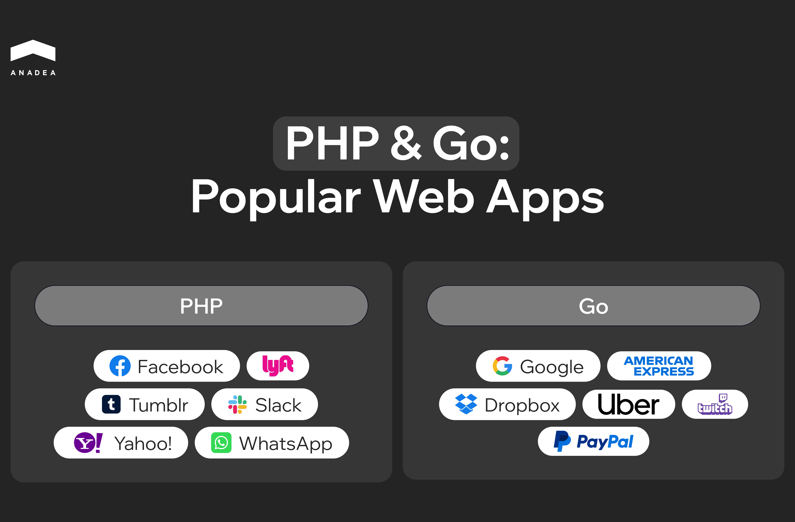

The choice of programming language can have a big impact on the success of a project. Developers often hesitate between [PHP](https://www.php.net/) and [Go (Golang)](https://go.dev/). PHP appeared back in the 90s and became the basis for most websites, while Go is a relatively new player that quickly gained popularity due to its speed and simplicity. PHP and Go are two popular programming languages ​​that are often compared in terms of performance, scalability, and ease of use. 

In this article, we will analyze how they differ, where each of them shows itself best and how to choose the right tool for your project.

## Overview of Technologies

PHP is one of the most widely used languages for building websites and web applications. Launched in 1994, it started as a small set of scripts for HTML and evolved into a full-fledged server-side language. 

As of December 2024, [75.2% of websites](https://w3techs.com/technologies/details/pl-php?utm_source=chatgpt.com) with known server-side languages use PHP. It powers platforms like [WordPress](https://wordpress.org/), [Joomla](https://www.joomla.org/) and [Drupal](https://new.drupal.org/home). PHP’s popularity comes from its simplicity, large list of frameworks ([Laravel](https://laravel.com/), [Symfony](https://symfony.com/)), and universal hosting support.

Go was developed by Google in 2009. It was designed to solve scalability and performance issues. It combines the speed of compiled languages with a clean, modern syntax.

Go excels at handling concurrency. With [goroutines](https://go.dev/tour/concurrency/1), it can process thousands of tasks at once, making it ideal for high-load systems. Tools like [Kubernetes](https://kubernetes.io/), [Docker](https://www.docker.com/), and [Prometheus](https://prometheus.io/) run on Go because of its efficiency and stability.

### PHP & Go: Popular Web Apps

## Feature Comparison

### Performance and speed

Performance is a key factor when choosing between PHP and Go.

Golang is designed for speed. It’s a compiled language that executes code directly, which means faster response times and more efficient handling of concurrent requests. Thanks to goroutines, Go can manage thousands of tasks simultaneously without losing performance.

PHP, especially with the release of PHP 7 and 8, has significantly improved in speed. The introduction of [JIT (Just-In-Time) compilation in PHP 8](https://php.watch/versions/8.0/JIT) narrowed the performance gap. However, PHP has a unique challenge — every time a request is made, the entire application state is reset. This isn’t always a problem, but for applications that require shared resources across requests, it can lead to inefficiencies.

If raw speed and performance under heavy loads are your priorities, *Go is the better choice*.

### Ease of learning

PHP is known for being beginner-friendly. Its syntax is simple, and there’s an abundance of tutorials, guides, and forums available. Many developers get their start with PHP because they can quickly build a working website with minimal effort.

Go takes a different approach. While Go’s syntax is minimalistic, the language can feel unintuitive at first. Concepts like pointers and goroutines may confuse beginners. However, once mastered, Go’s simplicity and efficiency make it a pleasure to work with.

For ease of entry and accessibility, *PHP wins this round*.

### Scalability

Scalability becomes crucial as applications grow and businesses expand.

Golang was built with scalability in mind. Its lightweight goroutines allow developers to handle concurrent processes effortlessly. Go also integrates well with scalable databases like [MongoDB](https://www.mongodb.com/lp/cloud/atlas/try4-reg?utm_source=google&utm_campaign=search_gs_pl_evergreen_atlas_core_prosp-brand_gic-null_emea-ua_ps-all_desktop_eng_lead&utm_term=mongodb&utm_medium=cpc_paid_search&utm_ad=e&utm_ad_campaign_id=12212624575&adgroup=115749710823&cq_cmp=12212624575&gad_source=1&gclid=CjwKCAiAjp-7BhBZEiwAmh9rBbJ0xCvPdQiwkJq6JmQNDlrQR7aSVEQBxZ45dbfNHoQpIs-Jy2Z4eRoCPCgQAvD_BwE), [Redis](https://redis.io/), and [MySQL](https://www.mysql.com/), making it easy to build applications that can handle increased loads.

PHP can scale, but it often requires additional frameworks or tools like [Laravel Octane](https://laravel.com/docs/11.x/octane) or [caching solutions](https://stackoverflow.com/questions/5914700/php-caching-techniques). While PHP can manage growth, it isn’t as seamless or efficient as Go when dealing with large, complex systems.

For applications that need to scale rapidly and handle high traffic, *Go is the stronger option*.

### Ecosystem and community support

A strong community and ecosystem mean faster troubleshooting, better tools, and more resources for development.

PHP boasts a massive, established community. With decades of development, PHP has countless libraries, frameworks, and plugins available. Projects like WordPress, Laravel, and Symfony reflect PHP’s dominance in web development.

Go, while newer, has rapidly gained traction. Backed by Google, Go’s community is active and growing. Its ecosystem may not be as vast as PHP’s, but it’s expanding steadily with high-quality libraries for backend services and APIs.

For mature ecosystems, *PHP leads*, but *Go is catching up fast*.

### Security

Security is critical for any web application, and the language you choose can impact how vulnerabilities are managed.

Go is increasingly popular in the cybersecurity space. Its focus on simplicity reduces the chances of errors, and it provides robust tools for secure development. Go’s performance in server environments also makes it a reliable choice for sensitive applications.

PHP, while widely used, has faced numerous security issues over the years. Many vulnerabilities were addressed through community efforts, but PHP applications still require careful coding practices to avoid common exploits.

For applications where security is a top priority, *Go outperforms PHP*.



## Typical Use Cases

### When to choose Golang?

Go is a powerful tool for high-load and scalable projects where speed and stability are important. It is often used for developing microservices, APIs, streaming platforms, and processing large amounts of data. If your project involves thousands or even millions of requests at the same time, Go can easily handle such a load thanks to goroutines and efficient threading.

Go is also ideal for cloud solutions and server-side applications where stability during load growth is necessary. Many companies choose Go to create monitoring tools, streaming data processing, and internal corporate services, as it allows you to create productive and secure systems.

It is also a great choice for startups that want to develop an innovative product from scratch and scale it in the future. If you need a technology that will withstand business growth, Golang is a solid option.

### When to choose PHP?

PHP ​​is a classic for developing websites, blogs, and online stores. If you need to quickly create a website or landing page, PHP CMS (for example, WordPress, Joomla or Drupal) allow you to do this in just a few days. PHP is great for projects where it is important to get a result quickly without unnecessary costs.

It is the best choice for e-commerce - many platforms for online stores are built on PHP (for example, [Magento](https://www.magestore.com/blog/what-is-magento/) or [OpenCart](https://www.opencart.com/)). If your budget is limited, PHP allows you to quickly deploy an MVP and start earning money at the early stages.

PHP is also suitable for corporate sites, portals and services with medium load, where it is important that the product works stably and reliably. Thanks to a large number of frameworks (Laravel, Symfony, CodeIgniter), the development of complex applications also becomes much easier.

If your project does not involve huge loads or the need for a complex architecture, PHP is fast, simple and time-tested.

## Golang or PHP: Choose in 7 Questions

Choosing between PHP and Golang can feel tricky, especially if you need to build a project quickly but also want to leave room for future growth. Each language has its strengths, and it’s important to determine which one is the best fit for your needs.

To make this decision easier, we’ve created a simple algorithm. Based on the core features of PHP and Go, it will guide you toward the most suitable language for your project. Just answer "yes" or "no"!

1. Is your project a website or a content management platform (CMS, blog, e-commerce)?

* Yes → PHP
* No → Next

2. Does your project require high performance and the ability to handle a large number of requests at once?

* Yes → Golang
* No → Next

3. Is quick MVP launch or development simplicity important to you?

* Yes → PHP
* No → Next

4. Do you anticipate scaling the system or increasing traffic over time?

* Yes → Golang
* No → PHP

5. Will your project include microservices or rely on cloud technologies?

* Yes → Golang
* No → PHP

6. Is development speed and the availability of numerous libraries and frameworks a priority?

* Yes → PHP
* No → Golang

7. Does your team have experienced developers ready to work with new tools and paradigms?

* Yes → Golang
* No → PHP

The conclusion is simple:

* PHP for fast, simple, and budget-friendly solutions.
* Go for powerful, scalable, and high-performance systems.

## Comparison Table: Golang vs PHP

To help you make the right decision, we’ve compiled all the key information about these two languages into one clear and simple table.\

<table>

<thead>

<tr>

<th>

<strong><em>Criteria</em></strong>

</th>

<th>

<strong><em>Golang</em></strong>

</th>

<th>

<strong><em>PHP</em></strong>

</th>

</tr>

</thead>

<tbody>

<tr>

<td>

<em>Performance</em>

</td>

<td>

High &ndash; compiled language, efficient multithreading (goroutines).

</td>

<td>

Improved with PHP 8 JIT, but still slower due to interpreted nature.

</td>

</tr>

<tr>

<td>

<em>Development speed</em>

</td>

<td>

Faster for scalable systems but requires more setup.

</td>

<td>

Quick for websites, CMS, and simple projects.

</td>

</tr>

<tr>

<td>

<em>Ease of learning</em>

</td>

<td>

Minimalistic syntax, suited for experienced developers.

</td>

<td>

Beginner-friendly, extensive documentation and tutorials.

</td>

</tr>

<tr>

<td>

<em>Scalability</em>

</td>

<td>

Built-in scalability, ideal for microservices and APIs.

</td>

<td>

Limited, but possible with additional tools (Laravel Octane).

</td>

</tr>

<tr>

<td>

<em>Security</em>

</td>

<td>

High &ndash; less prone to errors due to simple syntax.

</td>

<td>

Historically more vulnerable, but strong community support.

</td>

</tr>

<tr>

<td>

<em>Ecosystem and libraries</em>

</td>

<td>

Growing ecosystem, fewer libraries but essential ones are available.

</td>

<td>

Mature ecosystem with numerous frameworks (Laravel, Symfony).

</td>

</tr>

<tr>

<td>

<em>Hosting and integration</em>

</td>

<td>

Requires server configuration.

</td>

<td>

Supported by most hosting providers.

</td>

</tr>

<tr>

<td>

<em>Typical projects</em>

</td>

<td>

APIs, streaming platforms, microservices, cloud systems.

</td>

<td>

Websites, blogs, CMS, e-commerce, small business projects.

</td>

</tr>

<tr>

<td>

<em>Best for</em>

</td>

<td>

High-performance, scalable, heavy-load applications.

</td>

<td>

Fast development with limited budgets.

</td>

</tr>

<tr>

<td>

<em>Development cost</em>

</td>

<td>

Higher due to complexity but justified for large projects.

</td>

<td>

Low entry cost, cheaper for small to medium-sized projects.

</td>

</tr>

</tbody>

</table>

## Conclusion

Golang and PHP continue to hold strong positions in the development world, but in different niches.

Golang is rapidly gaining popularity due to its performance, scalability, and ability to handle microservices and cloud solutions. If your project focuses on high loads, Go is an excellent choice for building a stable and fast system.

PHP remains an essential tool for creating websites, content management platforms, and online stores. With numerous frameworks and ease of use, PHP continues to be a popular option for developers and companies looking for quick and affordable solutions.

The bottom line – Golang is better suited for complex, scalable systems, while PHP excels in fast web development and budget-friendly projects. Both languages have a promising future, and the right choice depends on the tasks you need to solve.
