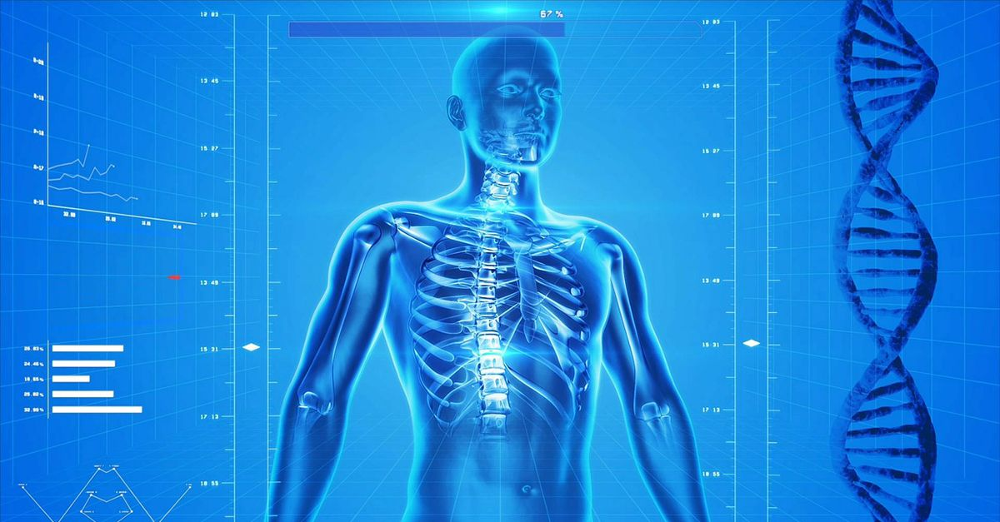

The healthcare industry is one of the multi-dimensional industries in the world. It caters to many services, including prevention, diagnosis, and treatment of various diseases or impairments in human beings. Health experts and professionals have spent years (decades, even) looking for ways to continuously develop operational efficiency in healthcare.

Like any other industry, healthcare relies heavily on data to come up with the right treatment for their patients, discover a new disease or illness and how to prevent it from spreading. This is because decisions in healthcare are data-driven.

Healthcare is home to a huge amount of data, so it’s no surprise that technology is now used to gather and help professionals analyze information and predict possible outcomes. After all, <a href="https://www.physicianleaders.org/news/predictive-analytics-health-care-opportunity-risk" target="_blank">according to Samuel Greengard</a> of the American Association of Physician Leadership, “Medicine has always revolved around probabilities.”

## This method is called predictive analysis

<a href="https://www.sas.com/en_ph/insights/analytics/predictive-analytics.html" target="_blank">Predictive analysis</a> uses “Big Data”, statistical algorithms and machine learning techniques to identify the likelihood of future outcomes based on historical data.

This method is used by many industries, like banking, finance, and <a href="https://propelrr.com/blog/ecommerce-business-data" target="_blank">e-commerce business</a> - for many reasons, one of which is to improve their operations. The healthcare industry is no exception.

<a href="https://www.soa.org/globalassets/assets/Files/programs/predictive-analytics/2017-health-care-trend.pdf" target="_blank">According to the Society of Actuaries</a>, around 93 percent of health payers and providers believe that predictive analysis plays an important role in the future of their business.

## What is predictive analytics in healthcare?

Predictive analytics is a tool that estimates the likelihood of a future outcome based on patterns in the historical data. Healthcare stakeholders can use such predictions to provide the best possible care for their patients. For example, its applications are the most significant in emergency care, surgery and intensive care, where the outcome of a patient is directly related to the quick reaction and precise decision making of the care provider.

## Predictive analytics in healthcare cases

Here you can find a few examples of use of predictive analytics at different stages of care for patient:

* **Diagnosis:** predictive analytics has been used to predict malignant mesothelioma in a patient cohort. Patients diagnosed early can start treatment immediately, improving chances of survival.
* **Prognosis:** researchers used predictive analytics on physiological data from patients with congestive heart failure to foresee which patients are at higher risk of readmission after a hospital stay. Using these predictions physicians could implement early interventions.
* **Treatment:** clinicians have used predictive analytics to identify the most efficient treatment course for chronic pain patients.

## How can predictive analytics help the healthcare industry?

Let’s get down to the basics, first. What is healthcare’s Big Data? Big Data is literally a massive amount of information used in predictive analytics in healthcare. In the healthcare industry, its “big data” is made out of hospital records, medical records, and medical examination results, among others.

Back in the day, all medical records were done in the traditional way of pen and paper. But with the advancement of technology, these data are now digitized and called “<a href="https://anadea.info/solutions/medical-app-development/emr-ehr-development" target="_blank">Electronic Health Records</a>” or EHR.

Related read: <a href="https://anadea.info/blog/development-of-custom-emr-in-practice">Developing Custom EMR in Practice</a>

So how can this data help the healthcare industry through predictive analytics?

### Overall healthcare improvement

Data gathered from these medical records are used primarily to improve the efficiency in healthcare. The medical field has always revolved around probabilities. Past data on many patients are used collectively to improve the quality, service efficiency, and healthcare costs. At the same time, they help avoid medical errors in the future.

Using the right analytics system, the data gathered can help medical experts and professionals make informed decisions on various factors for their patients’ needs.

### Patient-centric improvements

With the digitized medical records of medical patients, it would be easier for doctors and patients to access all the needed data during a medical check-up or hospitalization. This way, the diagnosis and treatment for the patient will become more accurate, considering that the doctor has access to the patient’s complete medical records.

Data analytics can also read other factors beyond healthcare, including a patient’s health habits and behaviors and other factors, like environment and employment which also affect a person’s health.

With this, negative events like readmission to the hospital or emergency room visits can be prevented. Consequently, this would lessen the expenses of patients, in terms of medical treatment and hospitalization.

### New discoveries

When everything was still done with pen and paper, medical professionals would analyze data manually. With today’s technology, in the form of artificial intelligence (AI), these data are initially analyzed for patterns by a system. In turn, experts use these to study new discoveries in the field.

Data are now read faster, making it easier for <a href="https://www.designrush.com/agency/mobile-app-design-development" target="_blank">top health and fitness app developers</a> to create data-driven healthcare solutions such as new medications and treatments, and avoid preventable deaths. Data can also help in discovering new diseases, to keep them from spreading.

Related read: <a href="https://anadea.info/blog/digital-healthcare-a-new-approach-to-care-coordination">Digital Healthcare: A New Approach to Care Coordination</a>

### Service improvement

While predictive analytics helps improve the health and welfare of patients, it can also help healthcare organizations improve their operational management. Through big data and predictive analytics, organizations are provided with timely insights and predictions that can help them prepare for an upcoming event. For example, if the data had read that more nurses would be needed in the emergency room by next month, the organization can do just that.

Moreover, healthcare analytics can be used to evaluate the practitioners’ performance, which can help them improve their practice and patient care.

Thanks to healthcare analytics, medical and health organizations are able to strategize to improve their overall service. In turn, this gives patients an effective environment to heal them from their illnesses.

With the availability of such technology, one might think that predictive technology could soon replace physicians and human thinking. That’s highly impossible.

<a href="https://www.physicianleaders.org/news/predictive-analytics-health-care-opportunity-risk" target="_blank">According to Chad Mather III, MDA, MBA</a>, “A physician should always be able to override the recommendations of a system. Using ongoing data and machine learning, it’s possible over time to continue to improve systems and outcomes.”

Data from predictive analytics should never be used in place of an actual prescription of a physician. Rather, data should be used as a starting point, to discuss how the system of healthcare around the world can be improved.

Data should also not be used to undermine the value of medical professionals. With the rapid growth of data in the medical field, predictive analytics should serve as an assistive tool for physicians, to help them arrive at the best possible outcomes. The challenge for doctors today is to combine traditional patient care with the data captured by the healthcare analytics.

Related read: <a href="https://anadea.info/blog/how-the-next-generation-of-healthcare-tech-is-shaping-proactive-treatment">How New Healthcare Tech is Shaping Proactive Treatment</a>

“Doctors are increasingly finding they need to continually evolve their computing skills as technology systems become more sophisticated and are linked with the ability to read and interpret information such as pathology reports from digital sources,” <a href="https://www2.deloitte.com/us/en/insights/topics/analytics/predictive-analytics-health-care-value-risks.html" target="_blank">a Deloitte study revealed</a>.

Medical organizations today have acquired various predictive analytics software to help them improve the overall quality of their services. Data in the medical industry are continuously growing, so much so that they would need software to process meaningful information.

Some people might think that such information isn’t really necessary in a field full of experts and professionals. Predictive analytics, however, play a critical role in the improvement of overall healthcare services and facilities by providing data and information.

Ultimately, these can help professionals come up with data-driven decisions and strategies quicker and more accurately for the benefit of their patients.
