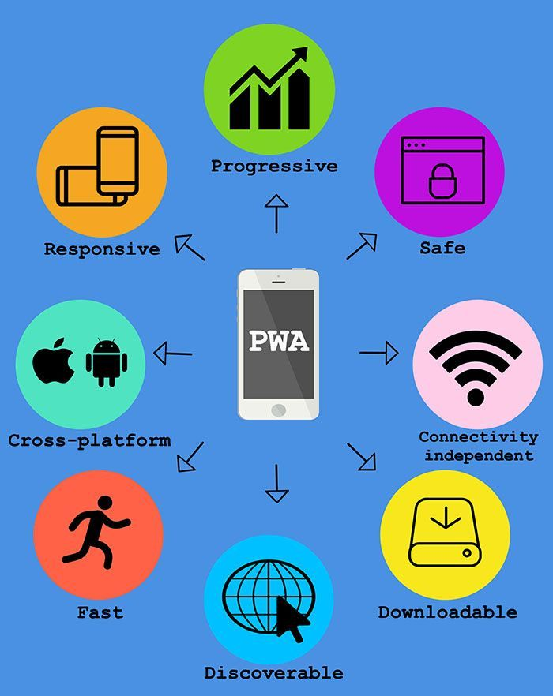

Global web giants Google, Apple and Microsoft work towards the expansion of progressive web apps. <a href="https://www.gartner.com/en/documents/3645344" target="_blank">Gartner predicts</a> that 50% of all native apps will be replaced by PWAs. It is, of course, too early to talk about the full replacement of mobile applications with progressive ones, however, PWAs already enable businesses to gain success within the mobile area. Let's sort out what a progressive web application (PWA) is and how it transforms the mobile landscape.

## A brief description: What is a Progressive Web App?

In 2015, Google added new functionality to Chrome browser - "Add to Home Screen".

Imagine that your website interacts with users like an application. Users add your website's icon to home screen like an app. They do not wait for content to load after each interaction. They can easily access your website without seeing the dinosaur. These are just web pages with super abilities, agree?

This is what "Add to Home Screen" means. Consequently, we should take a PWA app as a website that behaves like an app for Android or iOS. It means that you can add it to a smartphone home screen, receive push notifications, use it in an offline mode, and it is, in fact, a website. Moreover, with the introduction of a <a href="https://medium.com/@firt/google-play-store-now-open-for-progressive-web-apps-ec6f3c6ff3cc" target="_blank">Trusted Web Activity feature in Chrome 72</a>, PWA can be installed from Google Play Store.

## Progressive web apps features or a new way to simplify user experience

Let's treat a PWA as a web page saved on your device. It works inside the browser and can use only API of the browser. There are also mobile app features that you can imply into progressive web app development. Here is what PWAs can do:

* **Add home screen icons**. Look at colorful squares at your smartphone main screen and you will see icons of native apps. Adding an icon to the home screen creates experience focused totally on the app. With google progressive web apps users open your website without the browser URL panel or any other navigation tool. They just need to tap the icon on the home screen. PWAs provide quick access to your website.
* **Improve engagement**. Mobile apps have a common approach to navigation like the header panel with the title of the section, the return button in the upper left corner, the contextual actions in the upper right corner. Such app-like navigation helps users to solve their tasks easier.
* **Work for any user**. Thanks to the progressive enhancement of PWAs users can visit your website regardless of browser and device they choose.
* **Send web push notifications**. In 2015 Google Chrome introduced push notifications via a browser on both mobile and desktop. This technology provides profit-making opportunities for business as it works in real-time, sends your users notifications without the need for personal email, contact details even when they are not on your website. The notifications may inform on personalized or seasonal discounts, or report when the product is in the stock.
* **Work offline**. PWAs can work offline thanks to a technology called Service Workers. It is used for instantly displaying online content in places with a poor Internet connection or even when there is no connection.
* **Integrate with the device**. Progressive mobile app for Android appears in the system settings, in task switcher and on the home screen. Even push notifications look like they belong to a native application.
* **Improve your SEO ranking**. Mobile PWA is indexed by search engines, moreover, Google raises PWA higher in search results. All progressive mobile apps work on the HTTPS protocol that prevents data interception, respectively, Google responds positively to this and rewards the site with a more favorable ranking.

## Advantages of PWAs or what is so progressive about them

According to Google statistics, mobile users spend more time in applications and less in browsers. But on average, half of the users download zero new apps per month, and most of the time that they spent in apps falls on app giants like Facebook. At the same time, users visit more than 100 different sites per month and easily visit new sites. That's where progressive apps can grant businesses the advantage over native apps. The cost of attracting a user to the progressive web app could be up to ten times less than the cost of attracting a user to an app downloaded from the store.

Next up - a PWA is cross-platform, as it works through a browser. And thanks to the adaptive design, the browser will display the optimal version of the interface, taking into account the size and screen resolution of the mobile device. The absence of the need to attract a large staff of specialists to develop several versions for different mobile platforms reduces the cost of development of a progressive web app.

PWAs are free of intermediaries, namely App Store and Google Play. Which means that users get simplified set up and do not need to independently update the app to get access to fresh content and a new interface. The Script Service Worker used by all browsers, allows you to update the PWA mobile app in the background.

What's interesting about progressive web apps is that they are independent of the quality of Internet connection. They are loaded on an undefined network. Abandoned shopping carts, interrupted dialogues, blank questionnaires, closed web pages all come from the slow Internet. How can a browser open a website without access to the Internet? <a href="https://whatwebcando.today/" target="_blank">Your browser is capable of many interesting features</a> that you would not have expected in just a couple of years ago. Thanks to the work with a smaller amount of data in comparison with native, PWA apps give businesses the opportunity to enter the growing markets with low Internet connection speed.

In addition to instant download speed regardless of the quality of the Internet connection, progressive mobile app occupies tiny space on the mobile device, on average 2Mb, since its main components are stored in the browser cache. If you need to free up device memory, you usually begin to delete rarely used apps, photos and music. The probability that a user decides to remove your app to clear the memory is low.

## Progressive web application examples. Who already sees success

PWA is a competitive advantage. Well-designed PWA helps to speed up the shopping process as it works faster than mobile websites therefore customers always remain involved. Brands such as Twitter, The Washington Post, Forbes have discovered the benefits of a transition to a progressive web application.

<a href="https://developers.google.com/web/showcase/2016/alibaba" rel="nofollow" target="_blank">Alibaba.com</a>, the world's largest commerce platform, achieved a 76% increase in conversions and 4X increase in the interaction rate after they implemented PWA format to the mobile site.

PWA became a commercial breakthrough for <a href="https://developers.google.com/web/showcase/2017/lancome" rel="nofollow" target="_blank">Lancome</a>, a leader in the market of decorative cosmetics. The company has achieved an increase in the duration of the session by 53%, conversion increased by 17%.

Such results show not only companies from the retail sector. The <a href="https://developers.google.com/web/showcase/2016/wapo" rel="nofollow" target="_blank">Washington Post</a> also launched an app in PWA format. Thanks to it, the website began to load 88% faster. The Post readers more likely tap to articles as pages load fast.

## The technical side of progressive app development

Making a progressive web app requires [experienced mobile developers](https://anadea.info/services/mobile-development) who understand the new way to create fast, reliable and attractive websites. From a technological point of view PWA uses only web standards - a set of APIs that allow using most of the native app functions while working in a regular browser:

* The heart of PWA is **the Service Worker.** It protects the user from connection problems on his device. It also enables a PWA to send push notifications, and get automatic site updates.
* **The Web App Manifest** is responsible for some properties of how the site will be displayed and the icon will look after the addition.
* PWAs require that all site resources be transmitted over the **HTTPS protocol.** There should be no links to unprotected resources, otherwise, some browsers simply will not display the site.
* **App shell** that is just a skeleton of a graphical interface, a template.

## Challenges of building progressive web apps

PWA provides obvious advantages for both the user and website owner. However, a progressive mobile website has some challenges to overcome.

Google Analytics allows you to track the actions of only those users who use the app online. To collect information about those who use the app offline the development of a separate custom tool will be required.

Progressive web apps do not have in-app purchases. For example, in native apps you can implement a subscription for a month or year via in-app purchases.

At present, PWA does not support all hardware components supported by traditional native applications like fingerprint scanners on mobile phones, task management, alarms, browser bookmarks access.

## PWA vs native mobile app vs hybrid

Businesses have three options to reach their mobile audience - to create a native mobile app, to build a progressive web app and to create a hybrid. We included all three in comparison. What is a hybrid app we discussed in one of our previous articles. Briefly, it is an app developed using technologies that allow you to get access to native API with a certain amount of common code for different platforms. Let's look at the differences between PWA, native and hybrids.

### Cost of development

* **PWA:** Progressive web app development cost is the lowest thanks to a single code base and a single set of tools
* **Native:** The highest as mobile native apps are developed for multiple platforms which requires certain skills
* **Hybrid:** Similar to PWA, however, if there is no adaptation based on the framework it can turn out to be a bit higher than native app development

### Performance

* **PWA:** It depends on the browser of the user
* **Native:** The performance is high as native apps have direct access to the functionality of the platform for which they are designed
* **Hybrid:** Hybrid apps have access to hardware API interfaces, however, their performance is lower than the performance of native apps

### Development time

* **PWA:** Rapid development
* **Native:** Needs more time since a native app is developed for numerous varieties of iPhones and Android devices
* **Hybrid:** More rapid development compared to native app

### Distribution

* **PWA:** URL, and with Chrome 72 support for Trusted Web Activity - App Stores
* **Native:** App Stores
* **Hybrid:** App Stores

### Monetization

* **PWA:** There are a few ways of monetization
* **Native:** Wide monetization opportunities
* **Hybrid:** Wide monetization opportunities

The choice depends on goals. So, if you need maximum performance and access to hardware functionality - choose native apps. If you want to test your idea of a new product - choose hybrid. And if it is just important for you that a user has the opportunity to get the necessary information about your company, goods and services via a mobile phone, then create progressive web app.

## How PWA progressive web apps are changing the mobile industry

Today, the emergence of PWA is a breakthrough in the mobile web, like the appearance of responsive web design 6 years ago. In the future, the number of mobile applications on our smartphones may be reduced due to the increasing popularity of progressive web apps.

While native mobile applications continue to exist peacefully, PWA can provide the perfect solution for companies that want to create an excellent and easily accessible mobile tool for their customers, eliminate costs of app creation and promotion, increase revenues while reducing costs. This is a new technology that will inevitably develop and change over the years, as developers are constantly improving its versions, and brands are resorting to using PWA as part of their mobile strategies.
