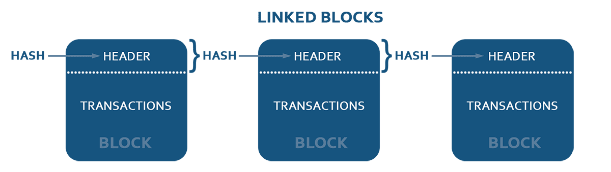
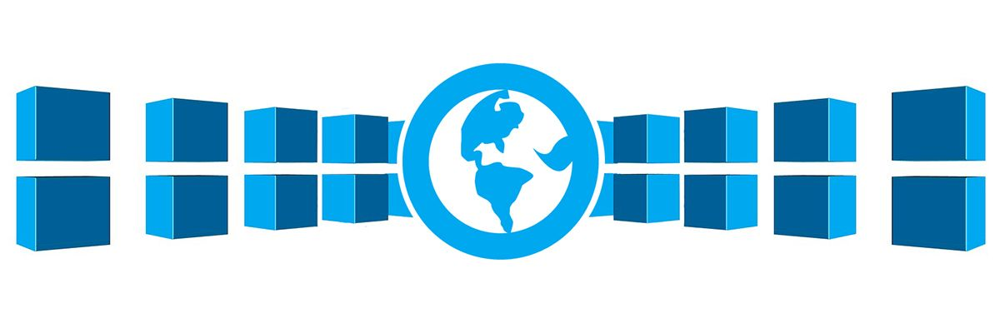
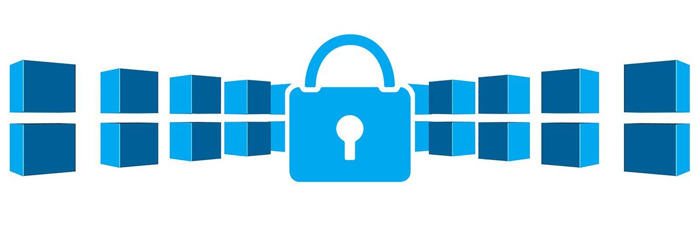
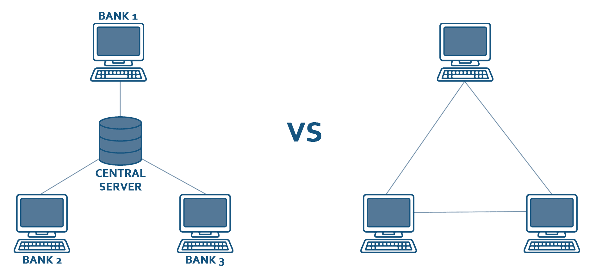
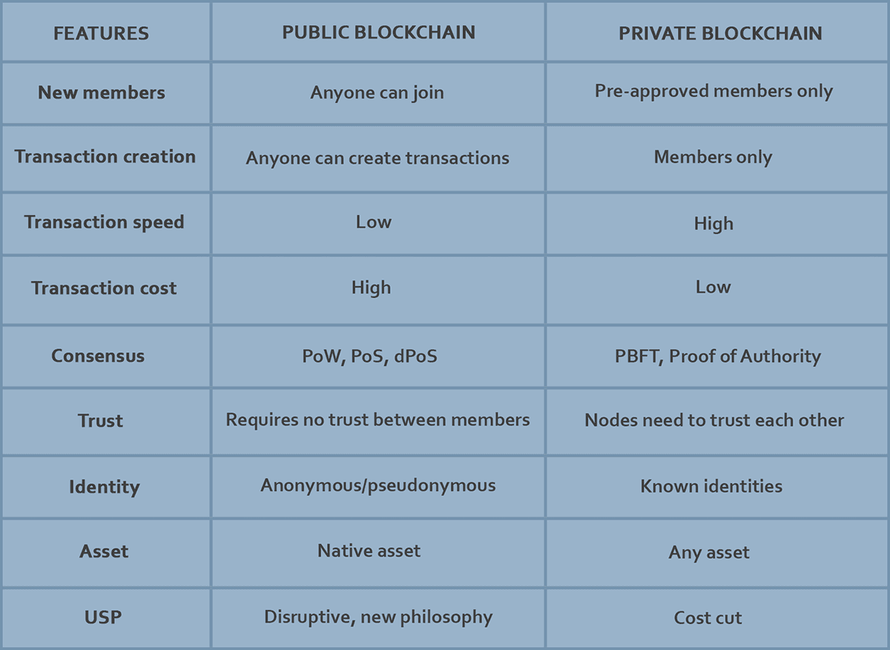
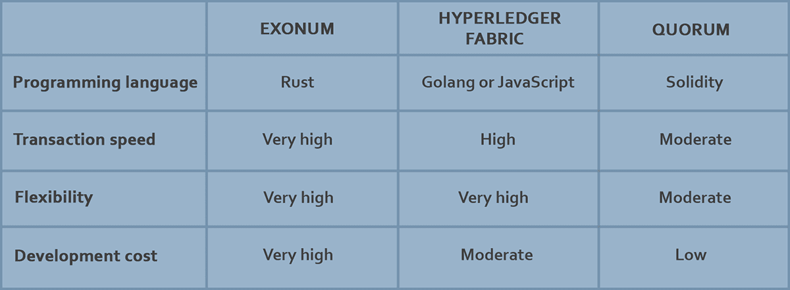

No matter who you are or what industry you work in, you've probably heard way more than you ever wanted to know about blockchain, cryptocurrencies and other related things. However, despite being on everyone's lips, this technology still remains far from broad adoption and full understanding of its potential.

I started my journey into blockchain a year and a half ago and had an opportunity to probe its capabilities on several projects. I'm going to share some high level information about private and public blockchains, use cases for blockchain, and why businesses may need this technology or, just as importantly, why they may not. So, this article is about big picture concepts and tailored for those who are just starting to explore the world of blockchain, thus don't worry if you're not exactly a "tech person". That being said, if you do have a technology background, this will be an awesome refresher of the core concepts and ideas you may have encountered before.

## What is blockchain?

Blockchain has drawn a lot of attention over the last couple of years, and while speculation on coin price may seem unsustainable, the core technology behind Bitcoin and other tokens is actually very promising.

There are a lot of cool introductory articles into blockchain technology, like

* <a href="https://andersbrownworth.com/blockchain/" target="_blank">Blockchain demo</a> by Anders Brownworth;
* <a href="http://adilmoujahid.com/posts/2018/03/intro-blockchain-bitcoin-python/">Python implementation of simplified blockchain project</a>.

We'll give our own short introduction to the underlying concepts and technology before moving on to public and private blockchain use cases and comparison.

As its core, a blockchain is a distributed database that allows direct transactions between two parties without the need of a central authority. This distributed database has a special kind of "Event sourcing" mechanism, where all transactions entering the system are organized into blocks, and blocks are linked together into a sequence or chain. Each block in the chain contains information (more specifically, a hash) about the block that comes before it in the sequence. Is the name "blockchain" starting to make a little more sense now?

As a rule, each transaction is signed by its sender, and can only send information that the sender owns. That means you can't make a transaction for transferring money from Bob's account to James' account if you are not Bob.

The classic blockchain network consists of equal nodes, where each node stores a complete copy of the whole chain. Thus, the whole log of transactions, stored in blocks, is replicated many times.

### What makes blockchain special?

Ok, you're probably thinking, this is all well and good, but what makes blockchain so special? And why is it so well suited for things like cryptocurrencies and banking?

What sets blockchain apart from other methods of storing information about transactions is the fact that it's decentralized. Rather than having a single, central database that records transactions and determines if an exchange of money did or did not occur, we rely on the many copies of the chain, replicated on our network of nodes, to act as our source of truth.

The decentralized nature of blockchain makes it harder for a fraudulent or faulty transaction to corrupt the entire system. Whereas in a centralized system malicious actors would only have to change one set of data to introduce a fake transaction, in a decentralized one they would have to introduce that transaction into every copy of the chain of transactions stored on the network.

### What keeps blockchain transactions secure?

To answer that question, we have to go back to the little chunks of information each block in our chain stores about the block that precedes it. These chunks of information, called hashes, are created by applying mathematical formulas to pieces of text to produce lines of seemingly random numbers. If you want to check if two pieces of information are the same - like if you want to make sure a given block in a chain hasn't been modified in any way - you can just compare the hashes from both blocks to make sure they are identical.

While calculating hash of block, all block data, including all transactions, service data, timestamp and importantly - hash of previous block, is considered. So hash of block depends on block's data and hash of previous block - thus, it depends on data of previous block. And as hash of previous block in its turn is calculated from block's data and hash of its previous block, so each hash depends on data of ALL previous blocks.

The fact that each block contains hash of previous block gives us what is called an "immutability effect": if you want to change some old transaction, you'll need to recalculate the hash of this block. Changing the hash in one block means that you will have to change the hash in the next block, and on and on and on.  Ultimately, introducing a single change in the ledger will require a recalculation of each stored hash in each block - that's a lot of work.

What's more, you'll have to somehow communicate these changes to each node on the network, and convince those nodes to accept the change. Due to special rules governing the calculation of hashes, this is practically impossible. This may be a bit difficult to grasp at first, especially if this is your first foray into blockchain, but this strategy allows us to make two important guarantees:

* First, the data stored in a blockchain is immutable.
* Second, we can always calculate the state of the network using the log of transactions.

## What is the difference between public and private networks?

What does "public" actually mean when it comes to a blockchain network? Public, also known as open or permissionless networks, are those which allow anyone to join. Just like a public road or highway, anyone can use it, a car owner, bike owner, lawnmower owner or horse owner.

Contrast that with something like a railroad, which can only be used by a very specific set of people operating a very specific type of equipment. In blockchain terms, we would call this a "permission", "closed", or "private" network.

Another way to think about the difference between public and private blockchain networks is to compare them with public and private WiFi networks. Free WiFi spots allow anyone to log on, be they malicious actors or law-abiding surfers, while private networks can only be accessed with a password.

Before continuing with public and private networks, we'll touch one small but very important topic - consensus. Having distributed database, you need so synchronize and align data on all nodes. This is achieved by consensus algorithms, like Paxos and Raft for classic distributed databases, BFT/PBFT for private blockchains or PoW/PoS for public blockchain platforms.

Assuming you're using a Cassandra distributed database deployed to a server cluster, one of the first concerns you will want to address is node or network failure. Fortunately, tools like Paxos and Raft help a lot if you run into these sorts of problems. Even if a node is compromised by a hacker, these consensus algorithms can do a pretty good job of handling the intrusion. However, Paxos, Raft and other consensus algorithms usual to classic distributed databases heavily rely on "majority vote". Thus, what is accepted by majority nodes is treated as truth.

Imagine, though, that someone creates 1000 new nodes and connects to your cluster, then starts intentionally issuing malicious transactions. This insidious strategy has come to be known as a "sybil attack". A hacker using this strategy has a good chance of cracking the consensus algorithm, and tricking nodes on your network into accepting fraudulent transactions as legitimate.

That's where PoW consensus algorithm comes in. PoW neutralizes the threat of a sybil attack by forcing the attacker to expend more resources on attacking your network than they could expect to gain as a result of hacking it.

At the same time, PoW also provides a flat architecture for the network, where each node is equal to any other node, and no selected leader exists while all nodes can communicate directly, thereby maintaining consensus. Though 2-level architectures exist, (masternodes on Dash or verifier nodes in dPoS netwokrs), we'll hold off on discussing them until a later article.

## Smart contracts

Another important thing worth mentioning is the idea of smart contracts. Smart contracts can be compared to stored procedures in distributed databases. This procedure can be called from outside the network, and must be run on each node to consistently change the data stored on the network. Smart contracts add a lot of value, versatility and agility to blockchain projects, as they allow you to add custom logic per client or set of clients without changing core blockchain parts.

For example, several users could deploy smart contract which governs exactly their interactions with a set of rules they agreed upon. It's like setting recurrent or conditional automatic payments with complex logic from your bank account, but the logic could be arbitrary complex and regulate not only payments. And completely without central authority like bank. There are different implementations of smart contracts in public and private networks. We'll describe them in scope of each network type.

### Public blockchains

Examples of public blockchains include Bitcoin, Ethereum, Dash, Monero, Stellar, Neo, and NEM/XEM.

The number of public blockchain use cases is growing rapidly. The first industry to see blockchain's potential as a business solution was banking and finance, though many others began to adopt this technology after recognizing the potential and popularity of smart contracts. You've likely already heard of Ethereum, a smart contract platform which is widely used and has attracted a ton of media attention over the last couple of years.

Besides transferring money, businesses can use public blockchains to:

* **Store document hashes or entire documents.** Blockchain is a good choice for this sort of thing as all transactions in a block are immutable, we can guarantee that a document exists - we can also store some pretty important meta data along with the document, like when it was created and who created it.
* **Store a ledger of some operations** which should be public, accountable and transparent, like change of ownership of precious Swiss watches or ledger of politicians tax records.
* **Codify contracts** between parties directly.
* **Create digital assets and transfer them** to one another.
* **In logistics to prove the origin of goods** (another good example of this would be food which is sustainably grown without GMOs).

**Let's look at another example of how a public blockchain already works in practice.**

Those of us how have experience in submitting apps to the App Store know that Apple requires you to purchase a developer subscription in order to publish your work on their marketplace. This "subscription-based" model probably sounds familiar to all of you out there who have a Netflix account or subscribe to newspapers or magazines.

That being said, there's really nothing preventing companies from using a token-based model supported by blockchain instead. Loom, a platform for online games and social apps, for example, requires developers who want to publish on its site to buy a couple of Loom tokens which grants access to Loom marketplace in a decentralized way.

Businesses can also take advantage of blockchains like Bitcoin or Dash by providing their clients with means of accepting payments in tokens (e.g. payment in Bitcoin). This gives ability to settle easy and fast cross-border payments and track all transactions for greater security against possible fraud.

### Private blockchains

While there are real benefits of using public blockchains, traditional businesses see few cons:

* You need to pay for each transaction in a given network's internal token, which means a business must first acquire these tokens itself.
* While public blockchains are reliable and relatively secure against malicious actors, the amount of time it takes to complete a transaction is large for using inside a private organization.
* Since a public blockchain is, by definition, visible to everyone, anyone can access the data stored on your network. Even if your personal data in transactions is encrypted, a motivated actor could obtain a lot of information about the parties involved in a given transaction from metadata or inference.

For these reasons, companies looking for ways to improve their processes and operations with blockchain technology tend to use private blockchains, i.e. closed or permissioned networks in which only a set of approved nodes can participate.

As the name "private blockchain" implies, this type of network has a central authority (company, consortium) which controls who can and who can't access the blockchain. Sometimes private blockchains controlled by a set of entities (consortiums, holdings) are called "federated blockchains"; contrast this with a "private" blockchain which is controlled by just a single entity. I'll be referring to both federated and private blockchains as "private" for the sake of simplicity, because they have almost the same properties.

Using a private blockchain allows businesses to assume that no unwanted users can access the network, meaning many security requirements are no longer necessary. Remember sybil attacks? Well, in a private network there's no risk that someone will be able to trick your network by adding a million malicious nodes.

Given the lighter security requirements, a more effective consensus algorithms can be used on private networks, making transactions several orders of magnitude faster (compare 7-15 transactions in Bitcoin or Ethereum to 1000 in hyperledger fabric). What's more, transactions in private blockchain networks are usually free, as the owner maintains the node fleet and there is no need to pay for things like network maintenance or associated costs.

**Let's look at an example of how a private blockchain might work in practice.**

In our example, three banks create a consortium and want to make transactions amongst themselves. If they opt for the traditional approach to managing money data between a discrete number of institutions, they'll probably set up a dedicated server for processing transactions, keeping logs and providing a user interface to request different queries and statistics.

Naturally, a question of trust emerges. Who's going to actually maintain this server? One of the consortium member's IT departments or the IT departments from all the consortium members working together? What measures will the consortium take to prevent one bank or administrator from cheating the others if they have full control over this server. How can other banks detect fraud? Fortunately, there's a good solution to these questions - a private blockchain.

Let's imagine that, instead of a centralized server maintained by one or multiple members of the consortium, the banks chose to use a private blockchain. Each bank would have its own server, and all three servers would be joined into a private blockchain network.

Since each server stores the consortium's entire transaction history, and because the network uses a consensus algorithm when new transactions take place, no bank alone has the power to modify transaction records or create fraudulent records.

A majority of the network, two members of the banking consortium in our case, would be able to reject any corrupted or malicious transactions initiated by the remaining members. Since "truth" is dictated by the majority of the network, there's no risk of faulty transactions being introduced into our transaction history. The same principle holds true if one of the bank's IT system is compromised. Even if one server is attacked, it won't affect outside interbank transactions because the 2 other nodes of the blockchain will reject transactions from the compromised node.

So far we've emphasized the benefits a private blockchain brings to the majority of members in a given network. However, what about the protections it can offer individual actors? Let's imagine that two members of our consortium decide to gang up on the third, and create fraudulent transactions that advantage the former at the expense of the latter. In this case, the third bank could easily track when the malicious transactions were made and present a case to a higher institution, using the immutable blockchain transaction history as evidence.

#### Who's using a private blockchain?

Typical usages for private blockchains include:

* finance,
* logistics,
* medical data,
* user identity,
* asset ledgers,
* auction systems,
* supply chain tracking (to detect counterfeit or stolen goods, or ensure the origin of a given product).

### Comparison of public vs private blockchains

## Platforms for building a private blockchain network

There are many software platforms, libraries, frameworks and other tools for building blockchains. While public blockchains are usually forked from existing chains or written from scratch, private chains are usually built using tools available on the market.

The most popular tools for creating private blockchains are:

* **Hyperledger** and its associated products, Hyperledger Fabric, Hyperledger Sawtooth, and Hyperledger Indy;
* **Corda**, which offers features designed for use in banking (some banks use Corda for its speed and bank oriented features);
* **Exonum**, which was used to create ledgers for land and state-owned property in countries like Ukraine and Georgia;
* **Quorom**, **Ethereum**, and **Mijin**, though best known for their use in public blockchains, can be forked and redeveloped for use in a private blockchain. While a lot of businesses use these technologies to get started, it's important to keep in mind that they don't provide a one-step solution. You'll need to reserve some time and money for development and testing.

Another important aspect of building your own private blockchain is how to codify your business logic. Let's use an analogy with a typical web application like an online store. You can implement a super fast dedicated web server in the Go programming language, which does everything from handling network connections to managing complex user logic. Or you can split your application between different technologies with their own domains of responsibility: Apache web server can be used to manage things like data transfers and connectivity, while PHP can be used to implement your business logic.

The latter approach is ultimately more stable, as one small error in you business logic won't knock out your server. That being said, it's also definitely slower than the "all-in-one" approach which Go offers. On the other hand, having scripts separated from core web-server logic allows you to change scripts, representing business logic faster without recompiling and redeploying server software.

Both approaches have been used to implement blockchains, and some technologies are "opinionated" about what technology stack you have to use to set up your network:

* If you use **Exonum**, for example, you'll have to define all your business logic in the Rust programming language and compile it as a module in you blockchain node software. This is definitely a case of more control and flexibility of core blockchain functionality requiring more time and money expenditure, as to fine tune your chain you'll need help from a developer who knows a way around Rust.
* **Hyperledger Fabric** lets you codify business logic in Golang or JavaScript, which you can then wrap around the nodes responsible for this sort of logic with Docker.
* In **Quorum** (an Ethereum clone for private usage), you'll write your business logic in Solidity, which will run on a virtual machine on each blockchain node. The cool thing about this is that the logic will have no effect on the underlying node functionality at all, so it remains stable. That being said, you also sacrifice some speed and flexibility.

Here's a table comparing the above technologies by language, transaction speed, flexibility, and development cost.

Which approach to take for your blockchain development heavily depends on what problem you are trying to solve, and the criteria your solution needs to meet.

For example, a blockchain that manages micropayments for data collected hourly could be implemented easily with Quorum. That being said, if you up the requirements to include thousands of transactions per second, and sensors that are constantly transferring data, you'll need something more powerful like Hyledger fabric or Exonum.

In case business doesn't want to commit heavily into building its own blockchain, there are many Blockchain as a Service platforms (think about AWS, Azure, IBM first) which you can experiment with.

## Typical problems in using private blockchain in classical businesses

Blockchains are often plagued by a variety of common issues that arise from their inherent nature as decentralized systems. Namely, these are:

* **Scalability**, as robust consensus algorithms can make blockchain solutions slower and less efficient than their centralized counterparts.
* **Data redundancy** is one more common problem, as all nodes store the same data, reducing disk space utilization efficiency.
* **Governance** is another issue that can arise with blockchains, as multiple parties are responsible for maintaining the network, which can lead to longer consensus times and more complicated decision-making processes, especially when upgrading or evolving the blockchain.
* **Collective responsibility** is also a challenge for blockchains, as there is no single entity responsible for the network as a whole. This can make it difficult for traditional businesses to adapt to the decentralized approach required by blockchain solutions.
* Finally, **upgrading** decentralized systems can be more complex than upgrading centralized solutions, making it a significant challenge for blockchain users and developers. Overall, these issues highlight the need for careful consideration and planning when implementing blockchain solutions, as well as ongoing efforts to address these inherent challenges.

Anyway, despite these difficulties, pros, provided by blockchain, overweight cons in many cases, so one should judge wisely whether to use blockchain solution and to what problems should it be applied.

## Conclusion

Though many treat blockchain as the next silver bullet, capable of solving any business task, the reality is a bit different. If your existing (centralized) solution works well in terms of speed, trust, maintainability and security, you should think twice if you need blockchain couterpart. However, if your existing solution is ineffective in some way (I'll put trust on the first position, speed and immutability on the second) you can think about blockchain. Several bank consortiums (especially in Japan) boasted of increased transaction speed in clearing transactions after adoption of blockchain solutions. As speed increased from couple of days to a matter of seconds.

We believe that blockchain is the next revolution which happens right now, we just should make wise decisions when switching to it.

Good links to investigate:

* <a href="https://ambisafe.com/blog/public-vs-private-blockchain/" rel="nofollow" target="_blank">Public Vs. Private Blockchain</a>
