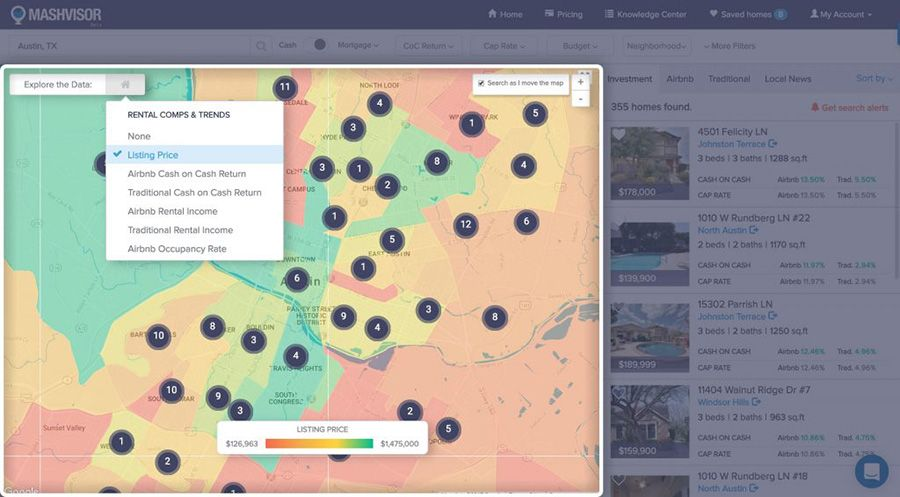
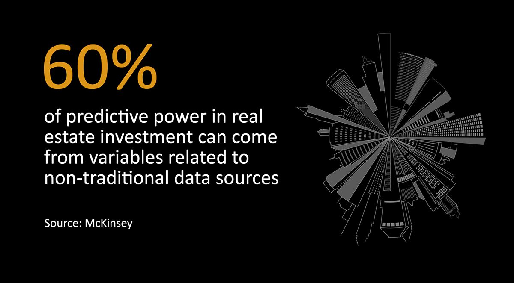
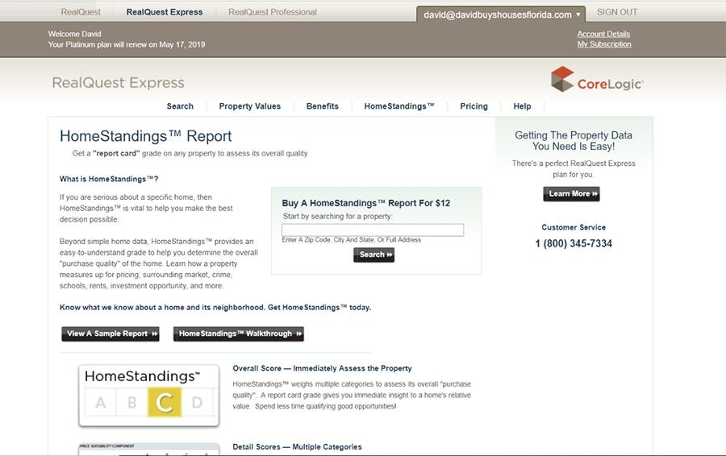

When investing in real estate, especially in rental properties, one should make quick and well-informed decisions, backed by data. The real estate market changes at a rapid pace, and for success, you have to be able to adapt to those changes just as fast.

Today, there are many helpful resources and tools available to anyone who wants to invest in real estate. Using predictive analytics, a sophisticated technological tool, can help you make the correct decisions when investing in real estate and rental properties.

## Predictive analytics

Although the name suggests a complicated process, predictive analytics is a relatively simple concept to understand. Predictive analytics helps you predict future trends by analyzing past data. This technology uses data science that selects patterns that are not normally visible to human analysis. Predictive analytics is not a fortune teller, and it cannot tell the future with certainty. However, it does provide the user with a reliable estimation of future data and also takes into account the “what ifs” that could happen.

## Why should you use predictive analytics?

Every organization, no matter how young or old it is, should use predictive analytics, as this increases their advantages against their competitors and helps with their bottom line. This tool supports decision-making processes and provides insights that lead to more effective business actions.

There are always risks associated with any new technology, and predictive analytics comes with the risk of overreliance. Predictive analytics is based on correlations and probabilities, so the data it analyzes will not always be 100% accurate.

Related read: [What is the Future of the Real Estate Software Industry?](https://anadea.info/blog/what-is-the-future-of-the-real-estate-software-industry)

## How to use predictive analytics to find the best deal

### Specific investment strategies analysis

Investing in real estate can be a great way to increase your wealth. If you use predictive analytics, it can help you choose the right investments. Buy and hold investors and real estate investment trusts use predictive data that gives them insight on which properties to buy. The data is from the renter’s demographics (so a macro business perspective) or available parking, building space, or businesses close by (a micro business level).

Using this type of data can also help you with short term investments (such as flipping houses), or long term and vacation rental homes. Predictive analysis has predicted the rise of rental homes available. <a href="https://www.urban.org/research/publication/single-family-rentals-new-approach-affordable-housing" target="_blank">Urban Institute uses predictive analysis</a> stating that there will be 13 million new rental homes by 2035, with the majority being single family homes.

### Predictive analytics: location is everything

There are many quotes over the years that have said the same thing - location is everything in real estate.

...location, location, location...
...location is everything...

Anyone who has ever seriously considered the idea of investing their money into real estate should know that the most crucial aspect of real estate investing is the location of their investment. If you pick a great place for your investment, positive cash flow is sure to follow.

Using predictive analysis, you can choose the absolute best location for your investment properties, while not being a massive expert on investing or real estate in the area. Some real estate websites provide you with this data. Mashvisor, a real estate site, gives you a heat map of areas within your chosen city and analyzes the area. Their data helps you select the best neighborhood for your investments into real estate. Heat map analysis is straightforward to understand, as it displays a visual of the data of investment outcomes (not only based on data but also trends and future estimates) - which is better known as predictive analysis.

Source: <a href="https://www.mashvisor.com/blog/heat-map-analysis-real-estate/" rel="nofollow" target="_blank">Mashvisor</a>

Modern technology has made it possible to receive a report of any data one wants in a few seconds. Heat map analysis helps investors find the absolute best neighborhoods, by analyzing real estate metrics such as cash on cash return, property price, rental income, and occupancy rate.

Investing in the right neighborhood in the proper city will enable you to be one step closer to increasing your income and making real money in real estate.

### Value of non-traditional data

Today, along with conventional data, there is an increased use of <a href="https://www.mckinsey.com/industries/capital-projects-and-infrastructure/our-insights/getting-ahead-of-the-market-how-big-data-is-transforming-real-estate" rel="nofollow" target="_blank">unconventional data sources</a> for real estate market analysis and valuation. Some of nontraditional variables that can be used to get more clear picture of a location’s possible risks and opportunities:

* average rating of local restaurants,
* number of gas stations within a specific distance,
* number of food stores nearby,
* a location's crime statistics,
* neighborhood noises.

Demographic indicators, such as median age, number of people who are single and married in the area, also can yield valuable insights. Non-traditional variables can constitute about 60% of predictive power in in real estate investment.

### Use predictive analysis to find the best rental property

While the location is essential, it is not the end all. The property that you intend to buy and invest in remains the most crucial aspect of investing.

Remember, you don’t need to be a seasoned real estate investor, with 50 properties to your name, to buy a new investment rental property. What you truly need is predictive analytics. After you have located the absolute best location, there you have to find the best investment property that you can afford, that will also serve your future aspirations and current needs. There is a rental property calculator that you can use as an investing tool, as it uses predictive analytics to help investors choose their future rental property.

An investment property calculator, which we have previously named as a rental property calculator, shows several features that are important to the more valuable properties in your chosen location. For example, in West End, Boston, to make money with rental properties, you should purchase a three bedroom apartment if you can. According to predictive analytics of the area, a three bedroom apartment is the most sought after properties in West End, Boston based on the date of sale, median price, average days on the market,surrounding area, crime, schools, rents, and investment.

This sort of information is vital to know before you make your investment. Predictive analytics helps you narrow in on the most sought after real estate property type and the number of bedrooms within your chosen neighborhood location. Personally, I use real quest express made by CoreLogic which provides quality data that property appraisers use to appraise and predict property values.

Source: <a href="https://express.realquest.com/HomeStandings.aspx" rel="nofollow" target="_blank">HomeStandings</a>

However, predictive analytics does not stop at helping you find the most sought after real estate property for you to invest in - it also estimates your future income from the particular rental property you have bought. Whether this is a cap or return rate, it will know. These analytics compare real estate that is already for sale and estimates the investment return they will recoup for their owner and is based on the estimated income, expenses, and occupation rates of the real estate. Using this data, you can make the best decision based on data and information - not on any fortune telling.

Related read: [Disrupt Like Zillow: Transforming the Real Estate Industry](https://anadea.info/blog/disrupt-like-zillow-transforming-the-real-estate-industry)

## Using predictive analysis in real estate investing: benefits

After reading this article, you must now know that you can use predictive analysis to invest in heights that you may not have dreamed possible before. There are several significant benefits to using it while investing in real estate properties, as compared to old school investing.

### Identifying trends

These analytics provide future and current real estate investors with real data and benefits when it comes to trends. This can result in significant savings on costs and more efficient operation, as the data is in actual time estimates. Investors can use it to find the best investments, forecast the neighborhood, the predicted maintenance of the property, which helps them ensure a higher return on their investment properties. When one decides to buy an investment property, knowing the trends surrounding the area is vital. How so? These analytics not only assess the current value of the property value, and estimates the future value and risks associated with the property. It provides the investor with green and red flags of the property, i.e. all the information available as to whether or not they should invest in the property.

### Can you buy the best property?

By using predictive analytics, prospective investors can predict which properties will be the most popular in the future and buy the best property they can afford.

The goal of the investor is to increase their investment and cash flow so they need to pay attention to the growing popularity of specific demographics. If the most money is to be made in a growing family, then an investor doesn’t have to buy a large family home, but a two or three bedroom apartment for their prospective tenants. Using the analytics, investors can find the most sought after attributes connected to property currently and make the most substantial return on their investment.

Related read: [How Big Data Has Transformed the Real Estate Industry](https://anadea.info/blog/how-big-data-has-transformed-the-real-estate-industry)

### Tenants targeting

These analytics also can identify the sort of tenants you want to handle, e.g. will give you the best return on your investment. Analytics not only analyzes what makes up the demographics of your preferred tenants but also how they will change in the future.

Is it projected that a massive flow of people will be looking to rent in the same neighborhood in x amount of years? Will those same type of tenants be there in five years or will the demographic of tenants be different at the end of that time frame? Why should an investor consider this? These questions inform the investor as to whether or not they will have properties rented for 2 or 3 years at a time, which groups they should focus their rental efforts on (university students, single people, young families, etc). It helps investors concentrate their marketing on getting tenants, as well as figure out if their preferred tenants can afford the rent they want to set.

### Save time using analytics

It usually takes about three months to find a rental property to invest in, using traditional methods. If you use predictive analytics, it may take fifteen minutes. This process keeps the investor from having to physically go and find properties, and gather data on them. The analytics also comes with a rental property calculator, so you don’t have to perform investment property analysis or comparative market analysis.

### No need for a real estate agent

Agents in the real estate business are essential, especially as they have years worth of knowledge and education regarding tips and tricks in their chosen location of real estate property. Before predictive analytics, it would have been very challenging for an investor to enter into the field without a real estate agent. Using predictive analytics can save you a lot of money and time.

Related read: [How to Create a Real Estate Web Platform](https://anadea.info/blog/how-to-create-a-real-estate-web-platform)

To put it, breaking down the data and analyzing it provides potential real estate investors with a visual, and a detailed picture of the target market location. It also gives these investors an advantage, as they receive current data and estimated trends based on past data to inform their investing decisions.
