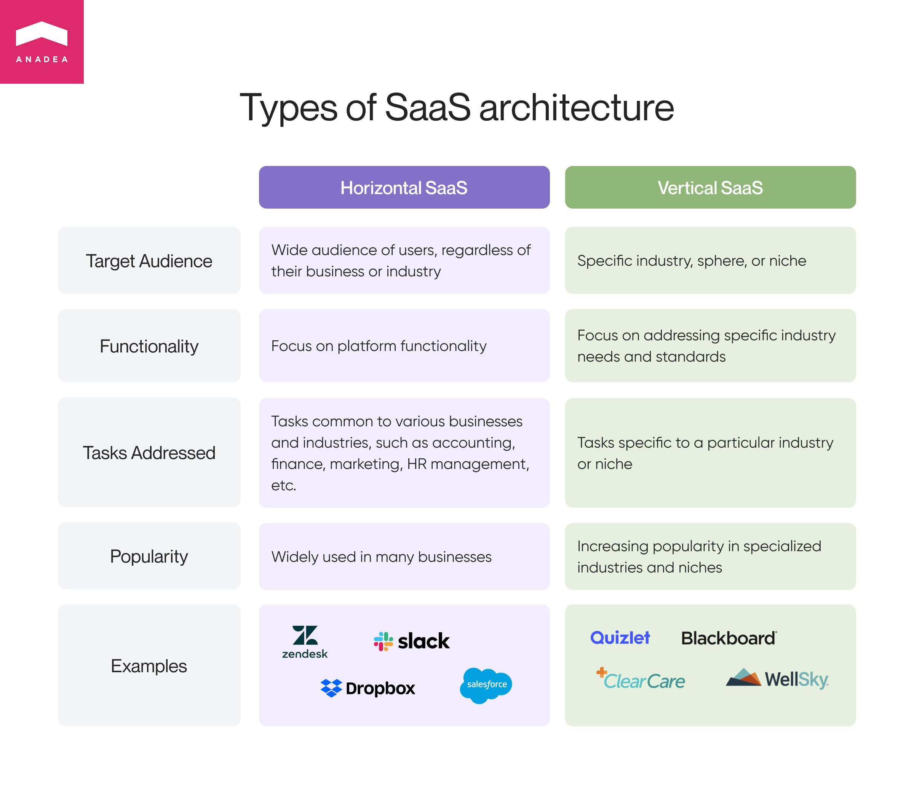
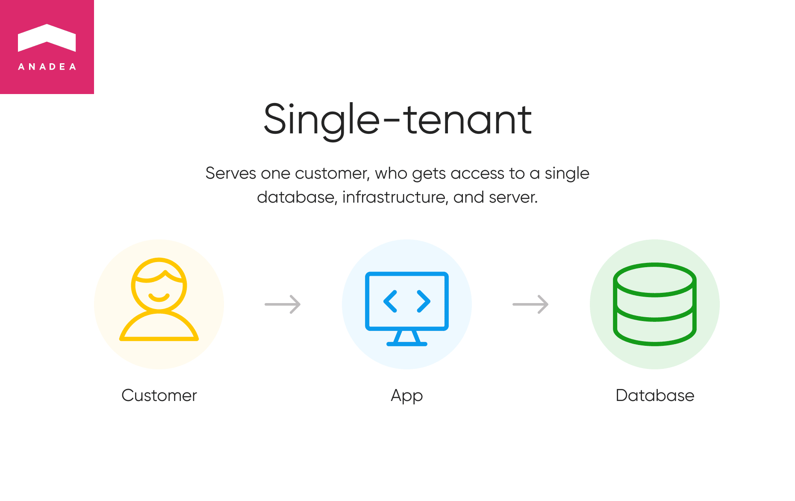
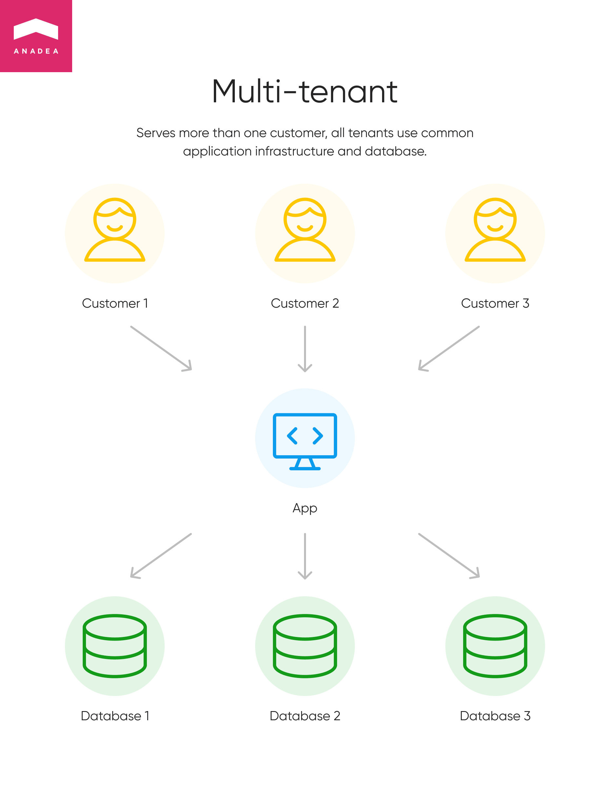

The adoption of SaaS is skyrocketing. And it is absolutely understandable given all the benefits that this model of delivering software offers. As a result, we can observe growth in demand for <a href="https://anadea.info/services/saas-development" target="_blank">SaaS development services</a> and an increase in interest in such solutions from companies and enterprises of different types and sizes. However, when you are planning to create such a software product, it is not enough to think only about its features and the set of tasks that it will be able to solve. It is also necessary to make a decision regarding the architecture of SaaS that you will opt for. In order to choose the most appropriate variant that will help to strengthen your solution, it is necessary to have a good understanding of the existing options and their peculiarities.

## SaaS: Quick overview
Before we proceed to the discussion of SaaS application architecture, let us remind you about the specificity of this concept.

The term SaaS (Software as a service) is used to describe a method of delivering apps over the Internet. It means that for getting access to software products delivered in accordance with this model, users do not need to install and further maintain them. In such a case, to use the functionality of SaaS solutions, it is enough just to access them via the Internet. As a result, users are free from all the tasks related to managing software and hardware. Such aspects as software security, performance, and availability are the responsibility of a vendor.

According to experts, the <a href="https://www.alliedmarketresearch.com/software-as-a-service-saas-market-A14951" target="_blank" rel="nofollow">size</a> of the global SaaS market may reach the level of $702.19 billion by 2030. And of course, we have a solid ground to presuppose that it won’t be the final point of its expansion. If you want to learn more about the future of the SaaS market, we offer you to read one of our previously published blog posts on <a href="https://anadea.info/blog/saas-market-overview" target="_blank" rel="nofollow">what businesses should know about the SaaS market</a>.

But why do businesses prefer SaaS solutions these days? Among the reasons, we can name some of the advantages and new possibilities ensured by this method of software delivery, including but not limited to:

* No expenses on SaaS apps installation and tech support;
* Flexible payment models provided by vendors;
* Accessibility from multiple devices;
* Enhanced security thanks to the use of additional protection layers;
* Great scalability and customization.

At the moment, cloud products really seem to be a universal solution for the majority of businesses from all over the world. And we should admit that the coronavirus pandemic together with all the related lockdowns and other measures were among the strongest boosters for their adoption as they allow companies to seamlessly organize the work of their employees from any location.

But can we say that all solutions of this kind are built practically in the same way and share the same SaaS architecture? This idea is rather far from being true. And we’d like to prove it.

## Types of SaaS architecture
There can be different approaches to defining types of software as a service architecture.

### SaaS architecture patterns based on functionality and industry coverage

Here we can name two types of SaaS platforms that have some clear differences.

#### Vertical SaaS
This group unites those solutions that are built for and are targeted at a particular industry, sphere, or niche For example, these can be SaaS platforms for real estate, logistics, education, retails, or other industries. These solutions are developed in strict accordance with relevant industry-specific requirements and standards which allows developers to address the most pressing needs of potential users. This type of SaaS is a comparatively new one which allows some experts to believe that these platforms are not mature enough. Nevertheless, it is a very promising sphere and today we can observe the increasing popularity of niche-specific platforms.

Among the examples of vertical SaaS platforms, we can mention solutions for healthcare like ClearCare and Kinnser or edtech solutions like Blackboard or Quizlet. In our portfolio, you can also find examples of such solutions that have this type of SaaS architecture. One of them was a project for the real estate industry called ListingDoor. You can find more detailed info <a href="https://anadea.info/projects/listingdoor" target="_blank">here</a>.

#### Horizontal SaaS
This approach to SaaS architecture design presupposes developing solutions that can be used for solving tasks of a wide audience of users, regardless of the type of their business and the industry where they work. Developers of such solutions usually focus more on the functionality of the platforms rather than on industry-specific needs and standards. Usually, such platforms are intended for dealing with the tasks that are fulfilled by companies regardless of their business activities. Examples of such tasks are accounting, finance, marketing, HR management, etc.

Today there are a lot of businesses that prefer to use horizontal SaaS platforms. This approach allows vendors to greatly expand their customer bases. The most bright examples of such applications are the well-known Zendesk, Slask, Dropbox, and Salesforce.

### SaaS tenancy models
The next way to differentiate types of SaaS application architecture is related to customers (tenants) of a platform who get access to the functionality and services of a solution for paying subscription fees and the way they use the offered resources.

#### Single-tenant SaaS architecture
This architecture is intended for serving one tenant (customer). By paying a fee this tenant gets access to a single database, infrastructure, and server. It means that users do not need to share database resources with any other tenants which is a huge benefit for them. What’s more, there is a huge space for customization. Customers can get the software services fully tailored to their needs. As cloud services are also known for their scalability, users can easily have these solutions scaled up and down at any time when there is such a necessity. This SaaS applications architecture is used by Oracle Cloud.

To understand the specificity of such solutions, let’s have a look at the pluses and minuses of this SaaS platform architecture.

__Benefits:__
* The data of each tenant is fully independent. It means that even if a provider has a lot of customers, all of them can be sure that their database can’t be accessed by anybody else.
* As all databases are separate, even if one of them gets hacked, all others will stay safe.
* A high level of customization is allowed for both hardware and software elements.
* In case of any downtimes, data loss, or any other issues, thanks to isolated backups, users can recover their data more quickly than in those situations when one database is used by several tenants.

Nevertheless, it will be not very wise to suppose that this type of architecture has no disadvantages.

__Pitfalls:__
* Maintenance, customization, and hosting are expensive.
* As usually, a tenant is the only authorized party that is able to manage such a system, all processes like upgrading or updating can take quite a long period of time.
* Not all single-tenant systems are well-optimized as a result their performance is not very efficient as even not all resources can be used.

#### Multi-tenant SaaS architecture
As you can easily guess from the name of this type, this architecture is able to serve more than one customer. In this case, all tenants use common application infrastructure and database but, of course, customers do not have to worry about their sensitive data as all private information stays secure.

You definitely know at least one of the examples that can be mentioned in this group. That’s Google Workspace. Numerous tenants can utilize a common cloud-based database. But those resources can be accessed by a lot of users. Nevertheless, all personal data is safely stored and only authorized users can view it thanks to strong privacy settings.

Let’s also consider the pros and cons of this type of platform which is a popular choice for many cloud businesses from all over the world.

__Advantages:__
* As in this case, resources are shared, these platforms are considered to be more cost-efficient as the cost per user is lower.
* The onboarding of each customer is quite a straightforward process thanks to the fact that a shared environment is used.
* Unlike the situation with single-tenant architecture, system maintenance is typically managed by a vendor, not individual users. It means that, first of all, it is faster to introduce any updates to the system, and secondly, fewer issues are detected than in those cases when different customers have various versions of the app.
* High security is ensured thanks to the possibility to implement additional protection measures at the application level.

__Disadvantages:__
* It can be rather challenging to serve numerous customers in one app instance and to provide a common database.
* Data backup is a more complex task than in the situation with a single-tenant model.
* Less customization is available.
* If a software provider has any technical issues, they may have a negative impact on all users. As a result, more time will be required to solve the problems.

Yes, of course, this SaaS architecture has its minuses but they are greatly compensated with its benefits that’s why it definitely deserves your attention and consideration as a preferable choice for your solution.

But that’s not all that you need to know about multi-tenant architecture.

### Models of multi-tenant SaaS software
There are several types of multi-tenant architecture based on how databases are used by tenants.

1. __Single database for multiple tenants.__ This model is quite close to the traditional understanding of multi-tenant databases. Users share the same storage, resources, and database. This model is a good choice from a financial point of view but there are also some drawbacks related to the lowered performance often services for users if too many computing resources and storage space are allocated for one user.
2. __Single database per tenant.__ The name of this model can seem to be quite controversial. If you have attentively read our article you’ve already learned that when you have an architecture that presupposes providing a single architecture to each tenant, it will be a single-tenant platform. Nevertheless, it is not so.
Though each tenant according to these SaaS architecture principles, have the possibility to enjoy the benefits of an individually used database, the databases themselves are divided into pools that are quite flexible. In other words, a software provider has the right to change the location of these databases from one pool to another. It can be done to find a better way to optimize and allocate resources. This approach allows software providers to better scale their products.
3. __Sharded database for multiple tenants.__ Sharded databases are a rather widely applied method for building apps that stand out from the row for their performance and excellent efficiency. Thanks to sharding, it is possible to split the data of tenants across different databases which is extremely important when the workload on one database is increasing.
4. __Hybrid sharded database for multiple tenants.__ This model ensures a lot of flexibility for a software provider who has the right to move users into sharded or dedicated databases. With this architecture, vendors can provide different access rights to different groups of tenants. For example, while premium users should get access to a full range of app features, those users who have chosen a trial version can access only limited resources.

## How to choose the right SaaS applications architecture?
When you are going to launch a SaaS solution and are thinking about how to design SaaS architecture, we recommend you answer a couple of questions in order to understand what your solution should look like. We’ve prepared a small questionnaire that highlights the most important points which should be taken into account at the planning stage.
* What services are you going to deliver to users?
* Do they need to use your cloud services or just storage?
* Do you need to provide a common database to all your customers? Can they share the same app hardware?
* Would it be sensible to create different databases for your customers but ensure a similar architecture for them?
* Is it required to provide isolated apps and databases in SaaS for all customers?

When you answer all these questions, it will be easier to detect suitable SaaS architecture patterns.

It’s also worth mentioning that it won’t be a disaster if you already have, for example, a single-tenant SaaS architecture and now see that you are not satisfied with this option. It doesn’t mean that you need to rebuild a new solution from scratch. Today it is possible to migrate a single-tenant solution to a multi-tenancy environment if it is required.

## Closing word
If you are not sure that you can make the right choice on your own, do not worry. You can contact us and we will be happy to support you at all the stages of software development: from the stage of planning to the post-release maintenance and further modernization.

At Anadea, our developers have rich expertise in building SaaS solutions and can help you to build a software product that will bring real business value to you and your customers. If you want to learn more, please, do not hesitate to contact us and get a quote for your project.

Hire SaaS developers
