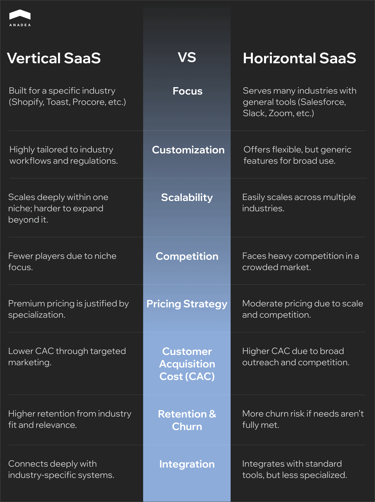

SaaS (Software as a service) adoption has evolved from the nice to have novelty to a standard practice. According to various sources, today nearly [99% of businesses](https://www.saasacademy.com/blog/saas-statistics) use at least one SaaS app in their operations to gain higher flexibility, scalability, and cost-efficiency across one or more functions. As a result, demand for [SaaS development services](https://anadea.info/services/saas-development) is rapidly increasing.

But when it comes to building a SaaS product, defining the feature set is only one task among many others. The type of architecture you choose will directly impact your SaaS solution’s scalability, performance, and long-term success.

To make the right choice, you need a clear understanding of the available models and their unique strengths. Only then you can design an app that’s not just functional, but also future-ready.

If you are currently at a crossroads, our article will explain the benefits of different SaaS architecture types and the best use cases for each of them.

## SaaS: Quick Overview

In 2024, the size of the global SaaS market was $266.23 billion. According to experts, it may reach the level of $1,131.52 billion by 2032. This growth is explained by the fact that businesses all around the world are continuously looking for adaptable, reliable, and value-driven services, which cloud-based SaaS platforms can provide.

If you want to learn more about the future of the SaaS industry, we invite you to read one of our previously published blog posts on what businesses should know about the SaaS market.

### What Is SaaS Architecture?

SaaS application architecture is a structural design of cloud-based software that are delivered to users via the internet. It enables multiple users to access a software application over the internet. This approach eliminates the need for local installation, maintenance, or infrastructure management conducted by the user.

## Types of SaaS Architecture in Cloud Computing

Today, there is a range of SaaS cloud architecture patterns that can be categorized based on the functionality and technical peculiarities of such solutions. Each of them serves specific goals and use cases. Let’s consider them in more detail.

### Horizontal SaaS

This approach to SaaS architecture design focuses on creating solutions that are targeted at a broad audience of users. These solutions are intended to be applicable across different business types and industries, regardless of their particular domain.

Developers of such solutions usually focus more on the functionality of the platforms rather than on industry-specific needs and standards. Usually, such platforms are equipped with tools that support essential business operations, including accounting, HR, project management, etc.

Horizontal SaaS platforms are not constrained by industry-specific requirements. As a result, they can scale rapidly and offer features that adapt to different organizational contexts. 

**Examples of use:** Salesforce, Asana, Trello, Xero, DocuSign.

### Vertical SaaS

Vertical SaaS refers to software solutions specifically designed for a particular industry, sector, or niche. Platforms of this type are tailored to meet the unique needs and workflows of specific domains such as real estate, logistics, education, retail, and other markets. These solutions are developed in strict accordance with relevant industry requirements and standards. 

This allows them to address the most pressing needs of potential users and help businesses greatly boost their productivity and streamline their processes.

The demand for vertical SaaS is continuously growing, as high product-market fit leads to better usability and faster onboarding. In 2024, the vertical SaaS market size was valued at $106.05 billion. In 2033, it is expected to hit [$369.24 billion](https://www.businessresearchinsights.com/market-reports/vertical-saas-market-117289), which reflects a CAGR of over 16% for the forecast period.

**Examples of use:** Clio (practice management platform for law firms), PowerSchool (software for K–12 schools), Veeva Systems (solution for the life sciences industry).

In our portfolio, you can also find examples of vertical SaaS products. One of them is ListingDoor, a project for the real estate industry. You can find more detailed info [here](https://anadea.info/projects/listingdoor).

The table below presents a detailed comparison between vertical and horizontal SaaS models. It highlights when each model is more appropriate based on your business needs and project requirements.

### Monolithic SaaS

A monolithic SaaS architecture is a traditional design approach where all components of an app, including the user interface, business logic, and data access layer, are integrated into a single unit. All modules are tightly coupled.

Thanks to its simplicity for development, testing, and deployment, this architecture type is commonly used in SaaS products at their early stages of development or legacy systems built on ASP.NET or Java.

Nevertheless, this approach is not well-suited for growing projects. Developers may experience serious issues when trying to scale individual features independently or introduce updates. Such changes usually require rewriting large portions of code.

Apart from this, even a single failure may affect the entire system.

**Examples of use:** startup websites, MVPs, internal business tools, complex legacy systems.

A lot of well-known platforms like Netflix, Spotify, or Slack were initially launched as monolithic products. Further, they were migrated to microservices as this architecture could better address their scalability needs.

### Microservices SaaS Architecture

This design approach is based on decomposing a SaaS app into a collection of loosely coupled, independently deployable services. 

Each service contains a specific business capability and communicates with other services via lightweight protocols or messaging queues.

This architecture ensures enhanced scalability and flexibility as each service can scale independently. Developers can adopt different technologies across services and isolate faults. Failures in one service do not crash the entire system.

Its characteristics make this model a good choice for large-scale, complex SaaS platforms and apps that require modularity.

However, microservices bring higher operational complexity and require sophisticated monitoring.

**Examples of use:** Complex, scalable, and fast-evolving SaaS platforms like Amazon, Shopify, Uber, Airbnb.

[Read more about ways to build scalable applications in our dedicated blog post!](https://anadea.info/blog/building-scalable-web-applications-2025/)

### Event-driven SaaS Architecture

It is a design model where services or components communicate by producing and responding to events. These events are messages or signals that indicate changes in state or user actions. Event-driven architecture is often used with microservices to build reactive and loosely coupled systems.

Apps of this type stand out for their high responsiveness and real-time processing capabilities. Yet, this architecture adds increased complexity to event flow and debugging. It may also lead to data inconsistency if it is improperly managed. One event may trigger multiple other events in a chain. This makes it hard to track the root cause of a final state. Additionally, due to the peculiarities of this architecture, there is no single orchestrator with a full picture of the system.

This model is traditionally chosen for IoT SaaS platforms that require real-time data processing. For example, IoT sensors and devices produce constant streams of data that are often asynchronous and independent, each sensor reading becomes an event. Event-driven SaaS solutions can process them in real time as they occur. Moreover, this architecture supports scaling and updating of each component without interfering with the entire system.

**Examples of use:** Solutions with streaming data and demand for high scalability. This architecture is often chosen, where one action should trigger several independent tasks. For instance, when a new user signs up, a system needs to send a welcome email, log activity, and assign a trial license.

Such platforms as Netflix, Uber, and Switzerland’s job portal JobCloud rely on the principles of this model.

### API-First SaaS Architecture

In the API-first SaaS architecture, Application Programming Interface (API) of an app is developed before the backend logic, UI, and other components, defining the flow of data and interactions between all the components. APIs are central to how services communicate internally and externally.

This approach makes it easier to build flexible, scalable, and developer-friendly platforms. Such solutions support rapid integration and omnichannel experiences, including web, mobile, IoT, etc.

As for existing pitfalls, the main one is security risks. Public-facing APIs are prone to attacks without proper security measures.

**Examples of use:** Solutions, like Twilio, Stripe, Plaid, AuthO, SendGrid, Strapi provide APIs for integrating specific third-party platforms.



### SaaS Tenancy Models

The next way to differentiate types of SaaS applications architecture is related to customers (tenants) of a platform and the way they use the offered resources.

### Single-tenant SaaS Architecture

This architecture is designed to dedicate an entire instance of the application to a single customer (or tenant). Each customer in this setup operates in a fully isolated environment. This approach is especially valued by organizations with complex customization needs, strict compliance requirements, or heightened sensitivity around data privacy and control.

Businesses can modify app behavior, UI/UX components, and database structures in full accordance with their needs. Apart from this, they can integrate these SaaS solutions with specialized internal tools, while such integrations are often restricted in shared environments.

Let’s have a look at the pluses and minuses of this SaaS platform architecture.

#### Benefits

* The data of each tenant is fully independent. It means that even if a provider has a lot of customers, their data isn’t accessed by other vendors.
* As all databases are separate, even if one gets hacked, all others will stay safe.
* A high level of customization is allowed for both hardware and software elements.
* In case of any downtimes, data loss, or any other issues, thanks to isolated backups, users can recover their data more quickly than in those situations when one database is used by several tenants.

#### Pitfalls

* Maintenance, customization, and hosting are expensive.
* As a rule, a tenant is the only authorized party that is able to manage such a system, and all processes (e.g., upgrading or updating) are often time-consuming.
* Not all single-tenant systems are well-optimized. As a result, their performance is often poor since not all resources can be used.

**Examples of use:** Solutions for users that require deep customization; platforms for highly regulated industries. Microsoft Dynamics 365, Workday, and Adobe Experience Manager provide single-tenant offerings.

### Multi-tenant SaaS Architecture

This type of architecture is able to serve more than one customer, meaning that all tenants use a shared application infrastructure and database. Despite sharing resources, the data of each tenant must remain private and inaccessible to others. To ensure this, cloud providers have to introduce specific measures like authentication and authorization mechanisms, role-based access control (RBAC) tools, data encryption, as well as security audits and activity monitoring.

Let’s also consider the pros and cons of this type of platform, which is a popular choice for many cloud businesses.

#### Advantages

* Multi-tenant platforms are more cost-efficient as the cost per user is lower.
* The onboarding of each customer is a straightforward process.
* System maintenance is typically managed by a vendor, not individual users. Hence, the system versioning, updates, and issues troubleshooting are consistent and timely. 
* High security is ensured thanks to the possibility of implementing additional protection measures at the application level, including multi-factor authentication, single sign-on (SSO), and rate limiting.

#### Disadvantages

* Data backup is a more complex task than it is with a single-tenant model.
* Less customization is available.
* If a software provider has any technical issues, they may have a negative impact on all users. As a result, more time will be required to solve the problems.
* Migration from a multi-tenant SaaS platform can be difficult because of shared infrastructure and proprietary data models.

**Examples of use:** Solutions of different types that are targeted at a broad market. Atlassian, Zoom, Slack, and Google Workspace are among them.

### Models of Multi-tenant SaaS Software

There are several types of multi-tenant architecture based on how databases are used by tenants.

1. **Single database for multiple tenants.** This model is quite close to the traditional understanding of multi-tenant databases. Users share the same storage, resources, and database. It’s more cost-effective, but often presents degraded performance if too many computing resources and storage space are allocated for one user.
2. **Single database per tenant.** In this model, each tenant has its own dedicated database. As each database contains only the data for a single tenant, there is no overlap of data between tenants at the database level. This approach ensures better customization as it makes it easier to tailor database configurations for individual tenants. Moreover, a spike or load in one database doesn’t directly impact others. That’s why it’s a perfect model for cases when tenants require strong isolation.
3. **Sharded database for multiple tenants.** In this model, data from multiple tenants is spread across multiple shards (databases). Each shard contains data for a subset of tenants, rather than all of them. This guarantees higher reliability. If one shard has issues, only a subset of tenants is affected. It is also more economical compared to using a single database per tenant.
4. **Hybrid sharded database for multiple tenants.** This model ensures a lot of flexibility for a software provider who has the right to move users into sharded or dedicated databases. With this architecture, vendors can provide different access rights to different groups of tenants. For example, when premium users get access to a full range of app features, trial program users access only limited resources.

## How to Choose the Right SaaS Applications Architecture?

When you are planning to launch a SaaS solution, clarify what your solution should look like and what architecture type it should have. To guide you, we’ve prepared a checklist of the most critical aspects to consider:

* What services are you going to deliver to users?
* Do they need to use your cloud services or just storage?
* Do you need to provide a common database to all your customers? Can they share the same app hardware?
* Would it be sensible to create different databases for your customers but ensure a similar architecture for them?
* Is it required to provide isolated apps and databases in SaaS for all customers?

The business world is very dynamic. New circumstances may require the introduction of new workflows and approaches. As a result, in time, the initially chosen SaaS architecture patterns may be unable to address your ongoing needs. Hiring an experienced development team, like Anadea, will help you [modernize your solution or migrate it to another environment.](https://anadea.info/services/saas-development)

### Non-Functional Requirements to Consider

When talking about different SaaS environment examples, we need to pay attention not only to their behaviors and functions (functional requirements), but also to how they should perform their functions. These requirements are known as non-functional.

### Security

SaaS applications often handle sensitive data. That’s why it is a must to introduce strong security measures like data encryption, identity and access management, as well as secure development practices.

In addition to this, there are some architecture-specific parameters like with microservices that require granular security per service. At the same time, in the monolithic architecture, it is always easier to centralize security management, but harder to isolate breaches.

If we take the event-driven SaaS architecture, securing message queues and eliminating risks of unauthorized access is almost critical.

### Performance

Make sure that your SaaS apps will deliver consistent and responsive performance under varying loads and conditions. That’s why you should opt for a suitable architecture type based on your project requirements.

Event-driven and microservices models are better suited for performance-critical, real-time workloads than monoliths. The monolithic architecture can become a good option for low-scale apps.

### Disaster Recovery

Solid recovery strategies will ensure business continuity. It’s important to evaluate key parameters such as the acceptable recovery time and permissible data loss to effectively restore your system and minimize operational disruption.

For example, monolithic apps are typically harder to recover partially, while in microservices, you can restore only affected components rapidly. The event-driven architecture supports resilience via message replay. But at the same time, it requires durable storage.

### Compliance

Your SaaS must adhere to regulatory requirements that vary across industries and regions, including GDPR, SOC 2, HIPAA, and others. The main difficulties start when you know that your system should be available to users in different jurisdictions, where different rules related to data storage, management, and usage can be applied.

For instance, a modular SaaS architecture will help you support different geographic or customer-specific policies. Monolithic apps are always harder to customize per region or customer.

## SaaS Best Practices: How to Optimize Costs in SaaS Architecture

With over 25 years of experience in the market, Anadea has helped companies not only choose the most suitable SaaS architecture but also successfully scale their systems and optimize operational costs. Based on this expertise, we’d like to share SaaS implementation best practices.

### Architecture Decisions that Affect Cloud Spend

Your costs greatly depend on how you design, scale, and deploy your system. For instance, when you use more resources and cloud instances than you really need, it leads to overpaying. To avoid this, you can rely on auto-scaling and right-sizing tools, like AWS Compute Optimizer. 

At the same time, too complex systems with too many microservices also complicate SaaS infrastructure and increase monitoring costs. Make sure that your services are modular but not fragmented.

The use of the single-tenant model can also result in inflated costs due to duplicated infrastructure for each customer. That’s why, in many cases, when strong isolation is not required, multitenancy would be a better option.

### FinOps Strategies

Such strategies rely on cloud financial operations principles to manage and optimize SaaS costs. Key strategies include:

* **Centralized license management.** When you track all your SaaS licenses via a single platform, you can avoid duplication and ensure compliance.
* **Usage and spending monitoring.** Introduce tools to track license usage and spending patterns in real time. It will help you understand whether there are any areas where you can reduce your expenses. Another important point is properly tagging and allocating costs to different teams. This will enable granular tracking and better accountability. 
* **Application portfolio rationalization.** You should regularly review your SaaS apps to make sure that you don’t pay for services that do not align with your needs and goals anymore.

What are other Ops ([AIOps, GitOps, DevSecOps](https://anadea.info/blog/devops-trends-aiops-gitops-noops/)) that you can use to boost your SaaS solution? Read this article about the latest DevOps trends!

## Closing Word

The right choice of an architecture type for your solution is not just a question of preferences. It’s a strategic decision that directly impacts scalability, performance, maintainability, and long-term cost-efficiency of your system. If you need a professional consultation on the questions related to the SaaS architecture, ask Anadea to help you.

[Contact us](https://anadea.info/free-project-estimate) to learn more about our services and experience in SaaS development.
