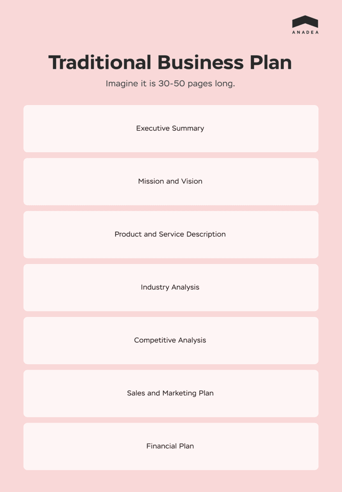
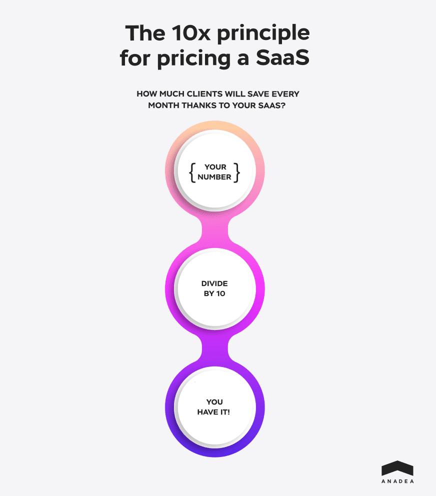
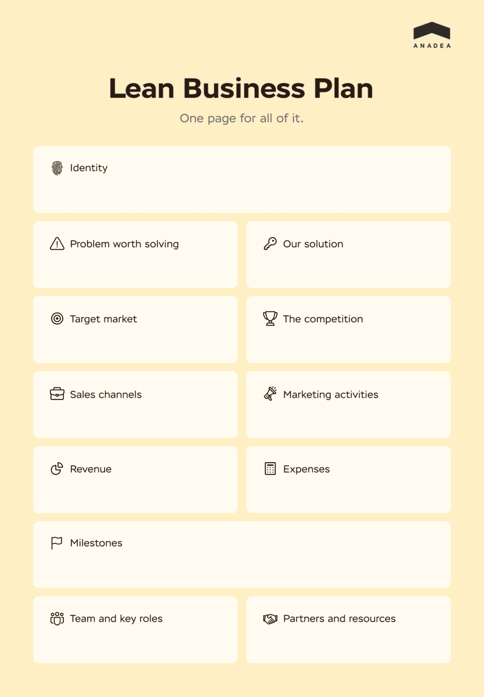

If you are on this page, perhaps you are already well aware of the benefits of composing a business plan when starting a venture. It allows you to stand firmly on the ground at every stage of business development and present your idea to investors correctly.

What could possibly bring you here is the question of __how a business plan for SaaS is any different from a regular business plan__ and what to pay attention to when working out a SaaS <a href="https://anadea.info/services/business-analysis" target="_blank">business strategy</a>. Let’s figure it out.

## What Is a SaaS Business Model?
__SaaS or Software-as-a-Service is a type of software maintained in the cloud, and to access and use it, B2B and B2C customers have to pay for a subscription.__ Subscription is the main source of revenue for the Software-as-a-Service business model which assures a high ROI for startups of this kind.

The most common SaaS examples are Salesforce, Slack, AWS, HubSpot, Mailchimp, Dropbox, and a lot more – their names are all around. SaaS end-user spending is set to reach <a href="https://www.statista.com/statistics/505243/worldwide-software-as-a-service-revenue/" rel="nofollow" target="_blank">$208.1 billion</a> by 2023 – the growth is impressive considering the past year’s number, $152.18 billion.

### SaaS VS Legacy Systems
More and more commonly, companies are looking to SaaS-ify their legacy software. It would not be so if SaaS sustained no value and benefits legacy systems have not.

Legacy systems are pieces of software and hardware that still manage to work (usually, supportability problems are present) but are not as scalable compared to cloud-based __SaaS whose scalability has no upper limit__.

Some may find the idea of storing their business software in the cloud quite disturbing. Risks frequently associated with cloud-based software are possible attacks and client data leaks. These aspects without a doubt have to be approached seriously with all the safety precautions observed.

However, it would be unfair to ignore the fact that on-premise systems have their own vulnerabilities and need proper protection measures too. Consequently, security concerns are not a downside of SaaS but just something to bear in mind.

The recommended measures for security protection are SaaS Security Posture Management (SSPM) tools that identify integrity issues, excessive user permissions, and other cloud-related risks. What we mean is that __appropriate steps toward security protection can lift a lot of concerns of a business thinking about SaaS-ification.__

### Making First Steps Toward Your SaaS Business Plan
The answer to what your SaaS business will be like has to be clear before starting a SaaS company business plan, not the other way around. With a clear SaaS concept in mind, start thinking of how the business plan will manage to break down the following:

* What problem of users is it designed to solve?
* Who is your target audience and how will you approach them?
* How will your product help businesses make more profit?
* Why customers should choose your proposition over similar ones?

See also: <a href="/projects/turbine-hq" target="_blank">SaaS business case by Anadea</a>

## SaaS Startup Business Plan: Traditional VS Lean
Time to pass from reasoning to action and translate everything you have been thinking over into a well-rounded plan. There can be two approaches to it. Below, we will review each.

### Composing a Traditional Business Plan for SaaS
How many pages should a business plan be? A traditional, practically academic approach to composing a business plan suggests it should have __30–50 pages__ of plain text, graphs, and argumentation. The proposed structure for a traditional SaaS business plan is:

#### 1. Executive Summary
Essentially, this is the elevator pitch about your SaaS key perks and ability to fulfill its purpose. At this stage, your task is to capture the reader’s attention, and for that, it is necessary to know who your reader is.

Related read: <a href="https://anadea.info/guides/user-persona-for-startups" target="_blank">What Is the User Persona and How to Define It</a>

Include supporting data from research on your topic and be concise. Ironically enough, the introduction in its core, the ideal executive summary can be read as the conclusion with your business’s audience, relevance, and funding clearly outlined. This is why entrepreneurs are frequently suggested to compose the executive summary __after__ the plan is finalized.

#### 2. Mission and Vision
No matter who you will be looking to outreach, bear the right mission statement in mind. To sound convincing and clear to your customer, speak less about your product and more about the customer and the problem SaaS is going to solve. Probably your end-user will be happy to know how great your product is, however, they will be 100 times happier to find out how they can benefit from it.

In a nutshell, it should be not the ‘here’s my great SaaS and what it does’ narrative but __‘you will get this, this, and that when using the product.’__

#### 3. Product and Service Description
In this section, you are expected to break down all of the product functions as detailed as possible. When reading this section, the reader has to get a clue about what your product is and why they should bother.

#### 4. Industry Analysis
Here, present an overview of the market you are about to rush into. The context matters: explain to your reader why it is high time to embrace the niche you are embracing, provide them with numbers and recent statistical findings, and show what a promising market it is.

If no such supporting data is available, prove to the readers that the industry you are targeting is overlooked for no reason. The industry is not getting the attention it deserves due to some terrible misunderstanding – this is the impression the reader should have after they look through this section.

#### 5. Competitive Analysis
After you spoke about the market prospects, you will need to give your reader some examples of successful SaaS products already out there. Be very careful here: your task is to show how well your SaaS business will supplement the product range, how beautifully it will fit in, and fill the gaps in the market. This will not work if what you are offering is a copy of a successful solution. Launching a startup similar to an existing one is fine, but launching one with no __competitive advantage__ is pointless in an oversaturated market.

So here it is necessary to understand how different your SaaS will be from competitors and, which is just as important, in what are your rivals competing with each other.

#### 6. Sales and Marketing Plan
Tesla has no marketing department – their product is that good that it sells itself. This is what you can often hear here and there. Does it mean Tesla cars are really that great? Yes, it does! Does it mean your SaaS does not need marketing if you find it as awesome? No way.

In the case of Tesla, the advantage that granted the brand its recognition is the unarguable uniqueness of the product, which really few businesses can boast of. Besides, the ‘0 dollar marketing budget’ statement can be a kind of strategy itself. You can not do without a sales and marketing plan when drawing up a B2B SaaS business plan if only because essentially, __the business plan is the sales document by nature.__ With your plan, you are selling your idea to investors and customers.

So by the __plan as a whole__, you will need to present your product in all of the possible aspects, and by the __sales and marketing part__ of it, focus on your customer persona, the ways to gain their attention, and the resources you have at your disposal for this purpose.

#### 7. Financial Plan
In the financial section, specify and justify the amount of money needed for the development of your SaaS, allocation of budget for marketing and human resources, and the funding needed.

Put down simply, the main components to include in the financial plan are:

* __Cash flow projections__ (money expected to come in and out of your business in a period of time);
* __Income statement__ (operating expenses, total net profit or loss, a.k.a. gross margin);
* __Balance sheet__ (assets, or available resources, liabilities, or what you owe, and the amount of money generated).

Since it is SaaS we are talking about, there is no better place to remind ourselves what is its main source of income – paid subscriptions. SaaS pricing should be clearly defined based on the info you get at the stage of competitors’ analysis.

__How to price a SaaS product and be reasonable?__ The __10x rule__ often used in business can be applied to deciding how much to charge for a SaaS.

For the 10x principle to work, make sure the profit given by your SaaS is at least 10 times greater than you charge for it. Put crudely, if your SaaS helps a company save $10.000 per month, you have every reason to charge a $1.000 monthly payment. Few businesses can resist the x10 ROI.

And still, given all this, it is difficult to be 100% precise when estimating financial projections. In fact, when it comes to planning a SaaS business launch, in a niche so rapidly growing and changing, the __lean plan__ might work just as well as the classical approach to writing a business plan. This does not change the significance of traditional business planning – on the contrary, both approaches are provided for you to choose from without us pushing you to take sides.

### Composing a Lean Plan for SaaS
Contrary to the elaborated business plan described above, the lean plan is all about being concise and compact about wording. Forget the 30–50 page volume. The ideal lean plan can fit on one page.

When writing a lean business plan, your goals (apart from trying to use little space) are:

* Be clear about the vision and goals;
* Prove SaaS profitability to the reader.

See the lean business plan for the SaaS template. Step by step, let’s figure out what should be specified in each section using the example of __invoicing SaaS.__

SaaS startup business plan template

__Identity.__ This is what defines you as a business and sets your value for customers. Mind the ‘less we, more you’ principle. ‘Seamless integrations, automated proration & recovery of lost revenue’ sounds more selling than just ‘We are a great invoicing tool.’

__Problem worth solving.__ The pain that forced your customer to look into possible solutions is the problem than needs to be identified as well. For example, your customer is struggling with data syncing which causes incomplete invoicing information collection.

__Our solution.__ This section has to convince the reader that the proposed SaaS will never let bad syncing or whatever they struggle with happen.

__Target market.__ Describe your ideal customer and how many of them are out there if you know it.

__The competition.__ If not your SaaS, what do people with the same problem use to solve it? How are you better than the alternatives?

__Sales channels.__ How will you sell SaaS to your customers? Describe particular sales channels: website, outreaching the potential customers directly, etc. Who will be involved in the sales process?

__Marketing activities.__ If marketing activities will take place, specify the channels and approximate cost of marketing your SaaS.

__Revenue.__ Here, list the means that turn your SaaS into a profit-generating business. For SaaS, this is perhaps the easiest section to fill – the subscription.

__Expenses.__ List the sides of setting up a SaaS business that require investment. When it comes to building custom software which SaaS is, <a href="/services/web-development" target="_blank">web development services</a> are something that should be considered first.

__Milestones.__ Your achievements within the next few months. What goals do you expect your Software-as-a-Service to hit and what will you do for that milestones?

__Team and key roles.__ List those who will help you launch and develop your SaaS business if any.

__Partners and resources.__ If there is another business that will help you launch, indicate it in this section. Your competitive advantages such as support from, say, other financial businesses, if we are still speaking about invoicing SaaS, are worth listing here too.

## TL;DR
too long; didn't read

<table>
  <tr>
    <td>
<b>Traditional plan</b>
</td>
    <td>
<b>Lean plan</b>
</td>
  </tr>
  <tr>
    <td><ul><li>Long and extremely detailed</li>
<li>For enterprise SaaS business model</li>
<li>Long-term planning</li>
<li>Implementation-driven</li>
<li>Full immersion needed</li></ul>
</td>
    <td><ul><li>Short and focused on value</li>
<li>Better suits SaaS startups</li>
<li>Near-term perspective</li>
<li>Hypothesis-driven</li>
<li>Clear at a glance</li></ul>
</td>
  </tr>
</table>

Every successful SaaS has grown from an idea and then a business plan. No matter how many business plans templates you see online, they do not have to be followed strictly – all ideas can be customized to give a good showing for your project.

Good luck with your undertaking! We’ll be happy to see you again when your plan is ready and build a great SaaS together.

Get in touch
