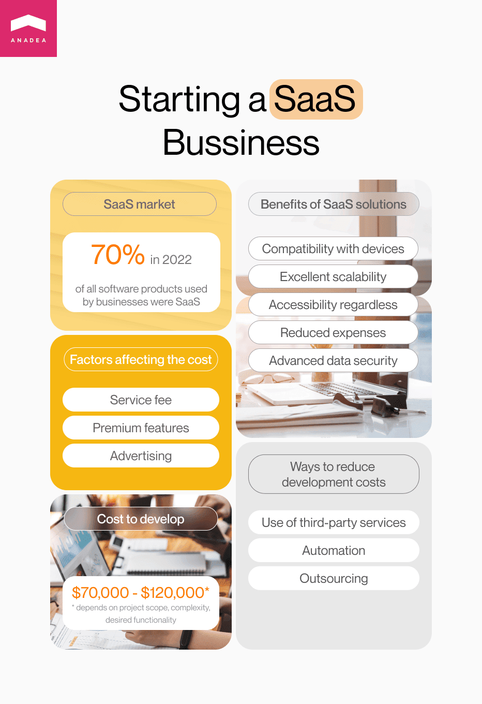

The remote format of work is becoming increasingly popular these days. And if in 2020, when the first COVID-19 lockdowns were introduced, remote work was a necessity, today it is a trend that is widely supported by businesses worldwide. This trend is one of the strongest boosters of the demand for various software tools that help to make this remote interaction as efficient and comfortable as possible. Among these products, we should name SaaS (Software-as-a-Service) platforms. If you are also considering launching such a solution, it will be very useful to learn how SaaS development cost is calculated and what factors can influence the final amount.

## SaaS solutions: Why do you need them?
The interest in <a href="https://anadea.info/solutions/saas-development" target="_blank">SaaS development services</a> from the side of absolutely different companies working in a wide range of industries is growing at a fast pace. In 2020, businesses <a href="https://pages.bettercloud.com/rs/719-KZY-706/images/2020_StateofSaaSOpsReport.pdf" target="_blank" rel="nofollow">admitted</a> that around 70% of all the software products that they used were SaaS which already was quite an impressive figure. But according to different estimates, we can expect to see it grow up to 85% already by 2025. If you want to learn more about the current situation in the SaaS market, we recommend you read one of our previously published blog posts.

<a href="https://anadea.info/blog/saas-market-overview" target="_blank">What Businesses Should Know About the SaaS Market in 2023</a>

And it is interesting to note that many businesses prefer to launch their own SaaS solutions instead of using the ready-made platforms offered today. Why is it so? The answer is very simple. Ready-made solutions (even if they offer a good level of customization) can’t fully meet the requirements and satisfy all the individual needs of each user. And despite the fact that at first glance cost of SaaS development may seem to be a rather serious investment, given all the benefits and new opportunities that these products bring, the investments fully pay off.

But why do so many businesses worldwide rely on SaaS in their activities?

* __Compatibility with platforms and devices.__ When you have an on-premises software solution, you need to care about its compatibility with different devices. In the case of cloud-based solutions, there are no such problems. To obtain access to SaaS platforms, users need just to get connected to the internet.
* __Excellent scalability.__ When your business is growing, it is obvious that your needs (as well as the needs of users) are gradually changing. Thanks to the SaaS model, all updates are delivered online which means that there are practically no limits and restrictions in your platform expansion.
* __Accessibility regardless of users’ location.__ As we’ve already noted, SaaS tools are perfect for remote work. You just need to get connected to the internet. It means that all the tools are available 24/7 and can be accessed from any corner of the world.
* __Reduced expenses.__ Of course, when you are planning your IT budgets and expenses and are going to create a SaaS solution, you need to take into account the cost to develop SaaS. But at the same time, you can fully eliminate from your expenses such points as costs related to the infrastructure installation and support. Moreover, you won’t need to think about the maintenance of servers and expensive hardware.
* __Advanced data security.__ Privacy and data protection remain to be among the most important tasks for developers. While hackers and fraudsters introduce more and more sophisticated methods to get access to sensitive data, software developers need to find better ways to protect valuable info that belongs to software users. At the current moment, cloud technologies help to ensure better data protection than traditional tools.

Of course, that’s not a full list of all the possible benefits that businesses and their clients can enjoy after launching a SaaS solution. Some of the advantages are industry- or even company specific. That’s why if you are considering a variant of building such a product but have any doubt related to the feasibility of such a project for the needs of your business, it will be quite sensible to get a consultation with professionals.

For example, at Anadea, we provide SaaS consultation services and help our clients to analyze their ideas and create step-by-step roadmaps for their realization. We also can support you in enhancing the functionality of your product based on the exact tasks that you want to solve with it. If you need our help, do not hesitate to <a href="https://anadea.info/free-project-estimate" target="_blank">contact us</a>, to get valuable recommendations and estimates of your SaaS development cost.

## How much does it cost to develop a SaaS platform?
As you can understand, it is completely impossible to name an exact amount that you will need to pay for building your solution without analyzing the scope of your project, its complexity, desired functionality, etc.

However, based on our experience, we can say that on average the cost to develop SaaS from scratch varies from $70,000 to $120,000. Of course, when you already have any versions of your product and some parts of code can be reused or when you have a task just to expand the existing product with some new features and functionality, the final amount can be significantly lower. At the same time, those clients who want to build a big solution with numerous integrations and complex functionality should be ready to get a higher cost of SaaS projects.

In general, when we are asked about SaaS cost (as well as about the price of any other software development project), we always say that there is a quite simple formula for calculating the amount that you will need to pay. It looks the following way:

> Hours needed to develop your product multiplied by Developers’ rate.

At Anadea, the average rate is $50 per hour.

But the issue is that in real life everything doesn’t look as simple as it seems at first glance as there are much more various factors that have a strong influence on the two mentioned variables than you can even imagine. And that’s exactly what we are going to discuss further.

## SaaS cost and what affects it
When our clients come to us and we need to provide them with estimates for their project, we always need to analyze a row of different factors and parameters that have a different influential power on the final amount.

Let’s consider the key ones of them.

### The scope and type of a SaaS project
Here it is crucial to take into account the fact that the realization of different projects may require teams of different sizes. For example, while for small app development, it will be enough to work with one developer and one designer (of course, we have greatly simplified this case), the development of a huge platform may require hiring a team that will be composed of 10 members or even more who will work on your tasks for more than a year. So, everything depends.

As a rule, the bigger your project is, the more experts will be engaged, especially if you have a strict deadline.

### Deadlines
The development of a SaaS solution on average can take around 4 months. But again, we need to highlight that everything may vary given the specificity of your project. Sometimes, it takes a team more than a year to develop a good platform in full accordance with the client’s requirements and even after the product launch the work may be still going on as the solution may require continuous updates and modernization.

However, the general principle is quite simple: the less time is required for project realization, the lower SaaS development costs can be. But the exact time needed for building your solution typically depends on the features that you want to create for your product, the complexity of the solution itself, and the stages and tasks that have been already carried out. Moreover, it is necessary to understand whether you have already built an MVP (or whether you want to do it), whether you have any parts of code that can be reused, whether you plan to integrate any third-party services, etc. All this greatly affects the timeframes of your project, and, consequently, the cost of SaaS development.

Nevertheless, please, do not set too ambitious deadlines. You need to think realistically when you are creating a roadmap. Too tough deadlines (even if they are met) usually have a negative impact on the product’s quality.

### The desired features and the complexity of your solution
You can decide on the required functionality only when you know for sure what tasks your solution will need to perform and what demands and expectations potential users have. When you are building a solution that will be used internally at your company, it is usually easier to define the exact set of functionality that you want to have for dealing with your business tasks. When you are building a product for a wide audience, you need to deeply study the market demands and requests before planning SaaS development.

There are some general principles that can help you to build an excellent SaaS product that will satisfy the needs of a modern user. If you are planning the development of a product of this type, we recommend you read one of the previously published articles on our blog.

<a href="https://anadea.info/blog/how-to-build-a-saas-product-that-people-will-love" target="_blank">How to Create a SaaS Product that People Will Love</a>

### API integration
Again, it is impossible to make a decision on whether you will integrate any APIs or not without knowing exactly what product you want to build. In general, it is very important to understand that APIs (or application programming interfaces) are a special type of software that allows developers to easily organize interactions between different applications. In other words, when you have an integration with another app, the data from your app is sent to the online server where it will be processed by another solution and you will get the required info back. When you prefer not to integrate any APIs, all data processing tasks will be fulfilled by your back-end system on its own.

That’s why when you have a clear understanding of the desired functionality of your app, you together with your development team need to choose whether you want to integrate any APIs or you prefer to create all back-end components fully from scratch. Very often SaaS businesses prefer to integrate payment services which helps to save a lot of time.

But API integration helps not only to reduce the time needed for product development (however, we should admit that there can be very complicated API integrations that require not only additional time but also strong technical skills from programmers). You can also cut SaaS development costs and ensure more freedom for your product scalability.

## Ways to reduce SaaS development costs
As you can see, there are quite a lot of factors that define the final cost of SaaS products. The majority of them are related to the specificity of your solution and its complexity (and as a result, the time, effort, and resources that will be required for its development).

Though the exact cost can be calculated only when you’ve chosen a development team and made all the decisions regarding the features that should be built and the technologies that will be used, already now we are ready to share with you some tips that will help you to reduce your expenses.

### Third-party services
As we’ve already noted above, API integrations can be viewed as a great way to reduce the time that developers will spend on the creation of the desired functionality. Instead of building all the features, they can just ensure a reliable interaction between your solution and the required services managed and operated by third-party vendors.

### Automation
Of course, it is impossible to automate the entire process of development. But at least, it is possible to efficiently automate testing procedures. If your app is tested fully manually, this task can take up to one-third of the entire time period that was required for coding. But when the testing process is automated, it not only takes less time but is also believed to be more reliable as it helps to avoid the risk of human errors. Thanks to reducing the time on some tasks, you will pay less as costs are calculated based on the working hours that specialists have to spend on your project.

### Outsourcing
This point will definitely suit not everyone. If you have an in-house development team and your resources are enough for building the desired product you do not need to think about working with third-party developers. But at the same time, when you rely only on in-house resources, all the calculations will differ.

Nevertheless, if you still do not have developers and you are trying to choose between hiring in-house specialists or working with external developers, the second option will definitely let you reduce your expenses. It is much more feasible to cooperate with a company that provides outsourcing development services than to sign long-term contracts with new in-house employees. Moreover, in the case of outsourcing, you have much more freedom related to the geography of your search, you can hire a development team from any corner of the world and get the best quality-price ratio you can only dream about.

## Conclusion
As you can see, it is impossible to name the exact cost of SaaS development without taking into account numerous factors related to your future product. But there are some points that can help you to reduce your expenses without losing the quality of your software. That’s why with a reasonable and well-thought approach to development, you can always optimize your expenses and smartly plan your budget.

At Anadea, we help our customers to find the best ways to allocate their money and make sensible investments in their innovative and feature-rich software products. If you are considering the launch of your SaaS platform, we will be ready to provide you with the necessary assistance in your project realization.

Get in touch
