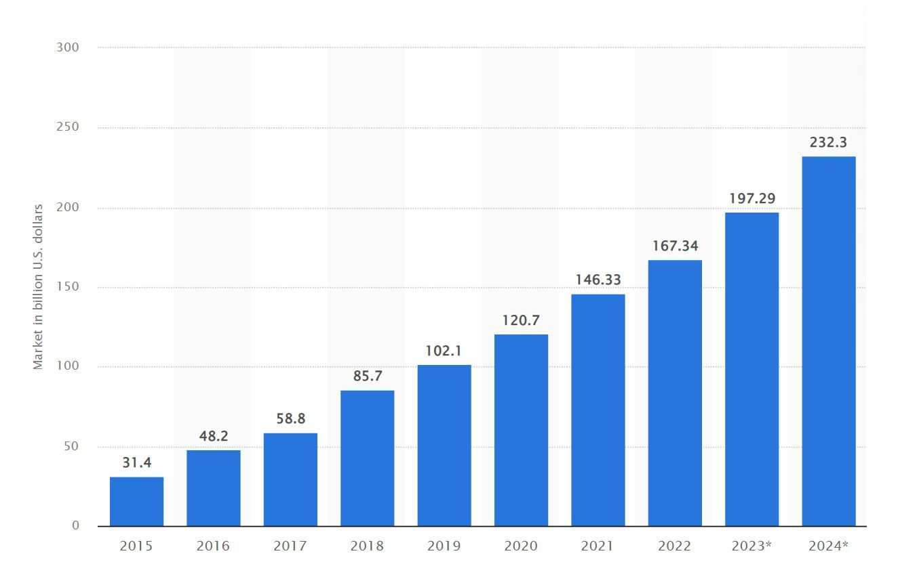

With the development of cloud technologies and the skyrocketing interests of users in Software-as-a-Service products, it has become a very attractive and promising sphere for many startups and well-established companies. But despite the quick expansion of the <a href="https://anadea.info/blog/saas-market-overview" target="_blank">SaaS market</a>, there is still though space for fresh SaaS ideas.

The advantages of such products and the opportunities that their users can leverage are among the major factors that boost the demand for <a href="https://anadea.info/solutions/saas-development" target="_blank">SaaS development</a>. Solutions of this type ensure enhanced security, cost-efficiency, and scalability, as well as easy access to their features and data regardless of the user's location. Moreover, the possibility to rely on cloud storage allows companies to avoid the necessity of investing in and keeping on-premises servers.

It is <a href="https://www.statista.com/statistics/505243/worldwide-software-as-a-service-revenue/" target="_blank">estimated</a> that in 2023, the global SaaS market volume will reach nearly $197 billion while the projected figure for 2024 is $232 billion.

The range of SaaS business ideas that are likely to turn out to be successful is rather wide. But with our experience in this industry, we clearly understand that despite the vital role that the idea itself has in the project performance, its technical realization also matters. That's why we recommend you consider various software startup ideas first. But then it will be sensible to book a consultation with a team of professional developers in order to understand <a href="https://anadea.info/for-clients/before-you-start/how-to-build-a-saas-product" target="_blank">how to create a SaaS product</a> that will be bound to rock the market.

## Project management and collaboration tools

This type of software can be named among the most highly demanded solutions among modern-day companies of different sizes that's why we can't omit it, especially if we are talking about B2B SaaS ideas. That's why a lot of startups have already offered their solutions that help project managers and teams to efficiently organize their processes and cooperation with all the participants who contribute to the project organization.

The growing number of such products is explained by a row of factors, such as the global digitalization of the business world, the need for quick exchange of various data, including visual formats, and the increasing complexity of projects and processes. In other words, companies want to have reliable tools for managing their projects, and cloud solutions, such as SaaS tools, fully correspond to their needs in the ongoing market conditions.

Successful examples of such products are well-known to many of us. Among them, we need to mention **Slack, Trello, Zoom, ProofHub, Confluence,** and others.

While some of them are focused on providing teams with a convenient space for communicating, sharing files, and discussing their plans (like Slack). Some others, such as ProofHub, can be used for assigning tasks, monitoring progress, and tracking time.

If you ask us about the profitability of such tools, we will offer you to have a look at the case of Slack. It was launched in 2013 and its valuation skyrocketed from $0 to $1 billion just in 8 months, which allows the startup to win unicorn status in a practically record time. In 2021, the startup was acquired by Salesforce for $27.7 billion. The first 8000 users joined Slack in the first 24 hours. Now, there are over 20 million users and among them, there are prominent Fortune 100 companies, including IBM, Oracle, and Uber.

But we should admit that today it is not 2013 already and the market situation is a different one. That's why if you are thinking about launching a SaaS solution of this type, it can be a good idea to create a software product for a particular niche, not just a standard team cooperation tool that theoretically can be used by any industry. On one hand, it may seem that such an approach will limit your target audience. But on the other hand, such a niche product can become much more profitable thanks to ensuring a better user experience and, consequently, bringing more benefits to teams.

## Customer relationship management (CRM) systems

Customer relationship management tools are intended for helping businesses to enhance the processes of establishing and developing relationships with their clients. Functioning as data hubs, they also help to personalize and automate numerous marketing, customer support, and sales tasks.

SaaS CRM solutions are cloud-based products that allow users to get permanent access to the necessary functionality of such systems. Moreover, thanks to the nature of cloud products, companies do not need to take care of installing, supporting, and updating such systems as all the related tasks will be the responsibility of a provider.

CRM solutions are on our list of Software as a Service ideas as their advantages make them a suitable option for practically any organization. And it means that a high-quality, secure and reliable SaaS CRM with the right market positioning will have excellent chances to bring revenues.

Already today we can consider the cases of successful SaaS CRM systems. They are **Microsoft Dynamics 365, Adobe Experience Cloud, SAP, Salesforce,** and **Oracle Customer Experience.** They may slightly or greatly differ in pricing, features, and the offered tariffs. Nevertheless, they all stand out not only for their quality but also for their flexibility and the provided possibility to integrate them with other corporate solutions.

**After analyzing the most successful products of this kind, we've managed to define the most popular CRM functionality that allows businesses to efficiently manage their customer relationships:**

- Lead management tools;
- Activity feed;
- Email templates;
- Chatbots;
- Predictive analytics;
- Dashboards and reports;
- Customer surveys;
- Self-service portals;
- End-to-end data encryption;
- User-based access control.

As for the trends in CRM SaaS development, with the advancements made in AI, we can observe a new wave of popularity of such features. And we can suppose that this trend is definitely here to stay for the years to come. The range of other tendencies in the CRM evolution also includes voice and conversational UI, higher demand for personalization, stronger analytics features, as well as the integration of social media channels into customer relationship management systems.

## AI-powered analytics and business intelligence

While artificial intelligence can become a part of practically any product that we will mention among the best SaaS ideas, for your startup, you can fully focus on this technology and build an analytics solution.

One of the most valuable resources that any company has is data. But it is not enough to own data. It is much more important to have the possibility to efficiently process it and apply it to your business needs. With the growing volumes of data, it is becoming practically impossible to process it manually. What is more, it can be a very time-consuming process, which means that by the moment when a specialist finishes working with some information, it can be already absolutely irrelevant.

Business intelligence tools allow users to get their information automatically processed and analyzed. As a result, managers, executives, and their employees can receive valuable insights for making better-informed business decisions. And <a href="https://anadea.info/services/machine-learning-software-development" target="_blank">AI development</a> plays the leading role in creating such solutions as it brings decision-making and intelligent automation features to SaaS apps.

**AI-powered SaaS tools can offer the following benefits:**

- Automation of different time-consuming and repetitive tasks;
- UX personalization;
- Accuracy and precision of analysis and predictions.

Already today there is a row of successful AI-powered platforms that offer developers and businesses from different industries innovative tools for implementing data science, ML, and NLP-focused solutions into their business processes. They are **IBM Watson Studio, Microsoft Azure AI, SymphonyAI Sensa, Clarifai,** and **DataRobot.**

Does AI have a future in the SaaS market? Definitely yes! Companies are continuously adopting AI-powered solutions and it is expected that the innovations and growth in this field will be gaining momentum.

As for future trends, it is expected that AI will be more actively integrated with other promising technologies like blockchain or IoT. Thanks to their combination, it will be possible to create even more powerful tools that will be able to work with more complex processes and automate them.

A very promising niche of AI applications in the SaaS industry is forecasting and predictive analytics. By relying on historic data and the detected patterns, AI apps can demonstrate a high level of accuracy as the risk of human errors is fully excluded.



## Remote work solutions

If 5 or 10 years ago the format of remote work was a rather rare thing, today nobody will be surprised if you say that you work from home. And the main factor that can explain such a situation is the coronavirus pandemic that hit the world in 2020. During the first wave of the pandemic, the lockdown measures were so strict that companies had no other choice but to ask their employees to work fully remotely. Though now all the restrictions have been fully lifted, a lot of businesses follow a remote or hybrid model as they have already gotten accustomed to and have found numerous benefits in it. Moreover, today there are relevant tools that can help them to organize all the processes in a convenient and sensible way.

Just compare. Before the COVID-19 pandemic, around 6% of people <a href="https://www.ncci.com/SecureDocuments/QEB/QEB_Q4_2020_RemoteWork.html" target="_blank">worked</a> remotely and it is <a href="https://www.upwork.com/press/releases/upwork-study-finds-22-of-american-workforce-will-be-remote-by-2025" target="_blank">expected</a> that around 22% of employees in the US will work from home in 2025.

That's why while considering possible software product ideas, you can also think about advanced SaaS tools that will help remote teams to cooperate and to solve their tasks without the necessity to visit the office on a regular basis.

The majority of existing tools for remote teams are primarily focused on communication. A lot of remote workers today do not imagine their lives without Google Meet or Microsoft Teams. But there are also solutions for being used by remote designers (Mockplus), for hosting virtual events (Hopin), for working with documentation (Almanac), for payroll management (Papayaglobal), and many other tasks.

Our advice will be to begin with choosing whether you want to address one precise aspect with your solution or you are ready to create a comprehensive platform that will cover a lot of processes and functions at once. Of course, here you need to bear in mind the <a href="https://anadea.info/blog/saas-development-cost" target="_blank">SaaS development cost</a>. Given the complexity of the solution of the second type, your budget should be bigger than in the first case. Nevertheless, this investment can really pay off rather quickly as a lot of companies today are looking for ways to unite as many processes within one software product as possible. But in this case, you should think a lot about UI and UX as the interaction with your solution should stay straightforward and clear regardless of its complexity.

## e-Commerce and inventory management

At the moment, retail e-Commerce sales worldwide are <a href="https://www.statista.com/topics/871/online-shopping/#topicOverview" target="_blank">estimated</a> to be around $6 trillion. And there are solid grounds to expect that this figure will reach new peaks in the nearest future.

With the increasing consumer interest in buying different products and items online, it is obvious that a lot of companies are trying to enter this market and win their positions there. As a result, the demand for reliable tools that can help merchants to organize their processes is skyrocketing as well. And SaaS can be a very successful choice for this industry.

SaaS e-Commerce products can offer a lot of valuable features that let companies manage and streamline all the processes at their online stores. Speaking about SaaS business ideas for the e-Commerce industry we can offer you to think about inventory management, request processing, or payment tools. All these solutions are aimed at increasing customer satisfaction and bringing higher profits to businesses.

Shopify is one of the most popular SaaS platforms in this industry. And it can provide companies with feature-rich all-in-one solutions, including but not limited to inventory management, shopping carts, shipping integrations, and payment gateways (PayPal, Stripe, and Apple Pay, among others).

The company's revenue from subscriptions accounts for around 25% of the total revenue. And in Q1 2023, subscriptions brought the company around $382 million.

Other well-known examples of such SaaS solutions are **BigCommerce, Wix, 3dcart,** and **WooCommerce.**

For those who are interested in launching a solution of this type, we highly recommend considering the creation of such features as order and inventory management, email marketing, dropshipping automation, and delivery tracking tools. Following the ongoing trends in e-Commerce software development, it will be a promising step to include AI-powered predictive analytics functionality that will protect sellers from situations when the most demanded products are out of stock.

## eLearning and online educational platforms

When you are searching for the most profitable SaaS ideas, the education industry definitely shouldn't be ignored. And here you should take into account not only school or university education. The need for solutions for conducting various courses for adults and corporate learning is also rather high.

Why are people so interested in online education? First of all, that is the heritage of the coronavirus pandemic. People fully realized that it could be convenient. And secondly, mobility is one of the key principles of our lifestyle today. Online solutions allow us to continue studying from anywhere and at any time of the day.

But while people are looking for platforms to learn various things online, companies want to find convenient platforms that will allow them to manage learning content and processes. And the popularity of SaaS learning management systems (LMS) just proves this thesis. Speaking about this group of solutions, we can name **Adobe Learning Manager, iSpring Learn, TalentLMS, 360learning.**

SaaS eLearning systems have a lot of advantages in comparison with those types of software that have to be installed on users' computers. Now companies can simply subscribe to using a SaaS solution provided by a vendor and leverage all pluses of online education without dealing with all the pitfalls of managing solutions on-premises.

The list of trends in SaaS eLearning solution development includes streaming functionality, preference for video content, collaborative learning, high personalization of the learning processes, and advanced student progress analytics. We have covered the topic of <a href="https://anadea.info/blog/create-online-learning-platform" target="_blank">creating an online learning platform</a> on our blog before.

## Health and wellness apps

With the development of cloud technologies, startups and medical establishments started to pay more attention to the questions of the accessibility of healthcare services. And telemedicine solutions perfectly cope with this task. People can get consultations in a fully remote format, regardless of their location. And thanks to the possibility to find a doctor despite the distance between a user and a hospital or medical center, people can get an appointment practically immediately.

There are also various tools for hospitals that help them to optimize their workflows.

Moreover, with the growing attention that people pay to their well-being and physical state, wellness solutions also can boast high popularity.

But why do experts recommend using cloud technologies for building software products for the healthcare industry? Security, scalability, and cost remain to be the strongest arguments in favor of this option.

The global healthcare cloud computing market <a href="https://www.marketsandmarkets.com/Market-Reports/cloud-computing-healthcare-market-347.html" target="_blank">reached</a> the level of $39.4 billion in 2022 and is expected to grow up to $89.4 billion in 2027. It means that the CAGR for the period from 2022 to 2027 will be almost 18%. While observing this growth, we can say that cloud technologies definitely dominate the health tech market and if you are considering launching a solution for this industry, it can be one of the SaaS ideas that are worth your attention.

**Let us mention some of the most successful SaaS products and startups that are focused on wellness and health.**

- **Veeva Systems** - a data management solution for the healthcare industry.
- **Elation Health** - an online EHR that helps private practice physicians to provide their services to patients.
- **Modernizing Medicine** - an AI-powered EMR and practice management solution for clinics.
- **Azalea (by Azalea Health)** - a platform that ensures the keeping of electronic medical records and offers telehealth functionality, a mobile health app, as well as tools for managing personal health records.

There are also solutions like **YuMuuv** and **Wellness 360** that help to promote wellness-centered culture to corporate users.

But to achieve success with such a product on the market, you need to know the key trends that are currently leading the evolution of healthcare solutions. AI-powered functionality for process automation and data analytics is practically a must. Moreover, the integration of IoT systems into comprehensive platforms for medical service providers is actively gaining popularity. IoT devices allow doctors to get real-time information about patients' state which is vital for treating different diseases. And there is one more point to concentrate on. It is medical data protection.

## Virtual events and conferencing platforms

Speaking about these SaaS product ideas, we need to recollect the period of COVID-19 lockdowns again. The event industry was definitely among the ones that suffered the most serious consequences of all the introduced measures. Event organizers needed to look for alternative variants and that's exactly when virtual concerts, workshops, and conferences became a real trend. Just recollect those times. Maybe you also were one of those people who were invited to online wedding ceremonies or online corporate parties. It absolutely doesn't mean that before 2020 there were no online events. They were organized long before the pandemic but the demand for them was not so high.

We also should mention that platforms for virtual events contribute to making events in general more available to practically everyone. If a conference is organized on another continent, not all interested people can have the possibility to travel but practically everyone can attend it virtually.

**Brella** is one of the virtual, in-person, and hybrid event platforms. It allows companies to manage multiple events, conduct surveys, and communicate with participants in a real-time chat. There are such features as the virtual lobby, attendee management, sponsorship management, and branding customization.

**Exposim** is another example of a hybrid and virtual event platform. It is targeted at event organizers and managers, including those who want to host virtual expos ad trade shows. By using the offered tools it is possible to organize personalized events and no technical skills are required for that. Thanks to the advanced metaverse functionality, attendees can enjoy unique immersive experiences.

And namely, metaverse integration is one of the latest trends in building SaaS conferencing and virtual event platforms. Metaverse events are not limited to one location only. Their participants can be anywhere. It is possible to create a lot of virtual spaces for hosting online gatherings. Users join events and their presence is demonstrated by their avatars.

## Financial management and accounting software

Accounting and financial tools are an integral part of any organization. The importance of such solutions can't be underestimated. It is too challenging to manage all these processes manually. Moreover, even the smallest mistake caused by a human factor can lead to serious losses for the entire organization. That's why if this sphere looks attractive to you, such SaaS ideas definitely can win a big audience of users.

In general, the size of the accounting software market is expected to <a href="https://www.globenewswire.com/en/news-release/2022/10/13/2533849/0/en/Accounting-Software-Market-is-Reach-USD-38-08-Billion-at-an-8-14-CAGR-by-2030-Report-by-Market-Research-Future-MRFR.html" target="_blank">reach</a> $38 billion by the end of 2030. Cloud technologies ensure more flexibility to users and quite often are a more feasible option in comparison to traditional programs.

If you decide to build a SaaS product for accounting and financial management, you need to bear in mind that there can be serious differences in the regulations in different countries. One way out here is to choose one country, deliver your SaaS product only to the companies based there, and fully focus only on this target audience. The second way out presupposes expansion. As in the first option, you need to start with one country but later scale your platform and add other countries with their rules as well.

What are the most well-known accounting and finance SaaS products? They are **Xero, QuickBooks, Wave Financial,** and **Dakxo.** Their features can be different but the main tasks are common for all of them. They are intended for helping companies smoothly and effortlessly manage their finance and keep records.

As for the innovations in this sphere, again, we need to mention AI that can power analytics and reporting features as well as the introduction of functionality for dealing with crypto asset taxes. Though the cryptocurrency industry still lacks well-developed regulation, some countries have already started to introduce taxation rules and some companies use such assets in their transaction. With further crypto adoption, functionality for managing transactions in digital currencies will be must-have.

## Real estate and property management solutions

Last but not least is software for real estate and property management. Property management SaaS platforms are designed to simplify relationships and interactions between different players in the real estate market, such as, for example, property managers or landlords and their tenants. In general, such solutions can help to optimize not only rental processes but also the processes of selling and buying real estate.

What's more, SaaS products can be used in the real estate industry for addressing lead generation, transaction management, accounting, and marketing needs.

**Below you can find short descriptions of different types of SaaS products for this market.**

- This provider offers automation solutions for residential apps. Thanks to such tools owners of properties, managers, and tenants can control cameras, locks, lights, monitor energy consumption, schedule maintenance work, etc.
- This solution helps users to analyze and predict the changes in the value of real estate units.
- This is rental management software. The platform is targeted at real estate agencies, tenants, and landlords and allows them to optimize paperwork as well as all financial transactions that are included in the rental processes.

If you are going to build a SaaS solution for the real estate market, it is highly recommended to think about adding AI-powered features that will offer personalized recommendations for those who are looking for a real estate unit. For property managers and landlords, a predictive maintenance tool will be of great importance as they will be warned beforehand about the maintenance services that will be required in the nearest future. In those cases, when your SaaS product will include payment processing, it will be a good idea to offer users freedom of choice by adding various payment methods, including cryptocurrencies.

## Conclusion

Is the list of the best SaaS ideas limited to those that we've mentioned in this article? No way! These are just some of the promising software product ideas. If you want to deliver any other types of SaaS solutions, with the right approach they will also have a high chance to succeed.

And at Anadea, we will be happy to help you with any type of software development project you may have. Our seasoned developers have rich expertise and outstanding practical skills in working with cloud technologies. We are not afraid of complicated tasks and we are sure that we will always find the best solution even in the case of the most challenging tasks.

Contact us to learn about the terms of cooperation with us!

Create my SaaS
