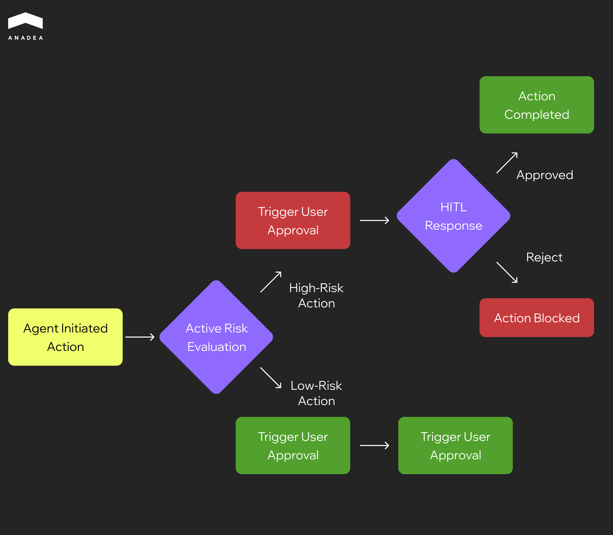

According to the SailPoint report, [82% of organizations rely on AI agents](https://www.sailpoint.com/press-releases/sailpoint-ai-agent-adoption-report) in their workflows. But only 44% of companies have introduced relevant policies to secure them. This gap exposes organizations to substantial risk from attackers. For instance, AI agents can unintentionally leak sensitive information. Or they may also execute unauthorized actions if not properly governed.

In this article, we are going to talk about the importance of AI agent protection and the most efficient ways to ensure it.

## Why Is It Important to Think about AI Agents Security?

An AI agent is an autonomous or semi-autonomous system capable of reasoning, planning, invoking external tools, and taking actions with minimal human intervention.

An AI agent is a step beyond a traditional conversational chatbot. Chatbots might answer questions or provide scripted support, but an agent can:

* execute workflows;
* access external tools and APIs;
* store and recall information from memory;
* make decisions.

All these abilities make AI agents highly effective and, at the same time, vulnerable to security risks. Vulnerabilities are related not only to AI models themselves, but also to the surrounding infrastructure.

The risks are not always catastrophic. For example, the situations when attackers fully take control of AI systems are rare. However, data leaks, misuse, privacy violations, unwanted behavior, and reputation damage still represent serious threats. For high-stakes agents implemented in finance, healthcare, and critical infrastructure domains, the potential for more significant harm is real.

## Security in This Domain

AI agents should be secure. But what should we mean by saying that an agent is secure enough?

In this context, we need to define two categories of AI agents: non-critical and critical (high-stakes) solutions.

Non-critical agents are those that do not affect sensitive data or safety. For example, internal productivity tools are included in this group. In this case, secure enough means:

* The agent does not leak private data.
* It can’t be hijacked into performing harmful actions.
* It has guardrails that prevent misuse under reasonable threat models. 

Nevertheless, residual risks may remain, including low-probability but high-impact vulnerabilities.

For critical agents, secure enough means the agent’s threat model is rigorously defined. All external interactions, tools, and memories are isolated. There are fail-safes, human oversight, and continuous auditing. All this is intended to ensure that even low-probability failures won’t lead to catastrophic harm.

The range of AI use cases is continuously expanding. From automating workflows to unlocking new customer experiences, artificial intelligence helps companies fully reshape their operations. If you want to learn more about this, you can explore our article about the most common [GenAI applications for business](https://anadea.info/blog/gen-ai-applications-for-business/).

Given the differences between critical and non-critical agents and the approaches to their security, the protection measures will vary as well. While agents that execute low-risk actions can function autonomously, high-risk actions require human-in-the-loop (HITL) controls.

## The Most Common AI Agents Security Risks

There are different ways attackers can manipulate AI agents and get access to your sensitive information. In the table below, we will summarize the most common attack paths and provide real-life examples to demonstrate their possible impact.

<table>

<tbody>

<tr>

<td>

<strong>Risk Area</strong>

</td>

<td>

<strong>What It Means</strong>

</td>

<td>

<strong>Real-life Example</strong>

</td>

</tr>

<tr>

<td>

Prompt injection

</td>

<td>

Attackers slip malicious instructions into user inputs, inside documents, metadata, or web pages.

</td>

<td>

A support agent is asked to summarize a customer's PDF, but instead, it gets tricked into revealing system credentials embedded in the file.

</td>

</tr>

<tr>

<td>

Data exfiltration, jailbreaks, and guardrail bypass

</td>

<td>

These are different types of attempts to override safety rules and extract sensitive data.

</td>

<td>

An attacker convinces the agent to output private HR records by hiding the request as a coding task.

</td>

</tr>

<tr>

<td>

Tool misuse and over-permissioned actions

</td>

<td>

Agents are given too much access to files, APIs, or system tools without proper limits.

</td>

<td>

A calendar-management agent gets file-system permissions it never needed and is tricked into deleting all files.

</td>

</tr>

<tr>

<td>

Insecure plugins and integrations

</td>

<td>

Weak third-party add-ons create attack paths.

</td>

<td>

A malicious plugin silently sends all agent queries to an attacker&rsquo;s server.

</td>

</tr>

<tr>

<td>

Agent hijacking&nbsp;

</td>

<td>

Attackers plant malicious instructions in websites or shared documents that the agent will read later.

</td>

<td>

While browsing a competitor&rsquo;s site, a sales bot finds a hidden text, which tells it to email customer data to an attacker.

</td>

</tr>

<tr>

<td>

Session takeover

</td>

<td>

It includes exploiting authentication flaws to seize control of an active agent session.

</td>

<td>

Hijackers piggyback on a logged-in browser agent session to issue their own commands.

</td>

</tr>

<tr>

<td>

Data poisoning and RAG manipulation

</td>

<td>

Attackers corrupt training data, vector databases, or retrieval pipelines to influence future outputs.

</td>

<td>

A poisoned FAQ entry tricks a healthcare agent into recommending the wrong dosage.

</td>

</tr>

<tr>

<td>

Supply chain risks

</td>

<td>

Such risks are related to vulnerabilities or tampering in models, dependencies, or plugins.

</td>

<td>

A widely used plugin update adds a backdoor, which may compromise every agent that relies on it.

</td>

</tr>

</tbody>

</table>

## AI Agents Security by Design

Before we proceed to discussing what you can do to protect your systems, it’s worth paying attention to the key principles that will help you build secure AI agents. These principles are based on embedding safety and control into their architecture, which means that you should act proactively.

### Least Privilege and Capability Scoping

Grant agents only the permissions that they really need for their specific tasks. At the same time, introduce OAuth scopes, per-tool role-based access control (RBAC), and allowlists. This is required to restrict access to sensitive systems and data.

For example, a document-summarization agent should have read access only to approved folders. Write access should not be provided. As a result, it won’t be able to introduce any changes to system-critical directories.

### Separation of Duties

Agent roles should be divided into planner and executor. It is necessary to prevent a single component from performing unsafe actions autonomously.

In addition to this, you can implement a human-in-the-loop review for high-impact operations (such as fund transfers or system changes).

In this case, the planner will propose a sequence of actions. But the execution of critical steps will require human approval.

### Deterministic, Schema-Validated Tool Calls

You can use schemas to validate tool inputs and outputs, ensuring agents cannot inject malicious or malformed commands. Another step is the application of parameter whitelisting to limit what the agent can pass to external tools.

When everything is done correctly, a trading agent will be able to place orders only within predefined quantities and approved trading pairs.

### Policy-as-Code Guardrails

You should encode security and compliance rules directly into agent logic using policy-as-code principles. At the same time, deny rules can prevent actions such as exfiltration of secrets or unsafe system modifications.

For instance, any request to output credit card data or system credentials will be automatically blocked by policy checks before execution.



## Security Best Practices for AI Agents: Layered Protection

Our experts recommend introducing controls across different layers. Each layer (input, reasoning, tooling, and runtime) addresses specific types of risks. And only this comprehensive approach can ensure proper protection of AI agents.

### Input (Context) Layer

This layer focuses on what the agent works with. It covers user input, documents, APIs, and memory. Key controls at this layer:

* **Content sanitization**. You should escape embedded instructions and normalize text to remove hidden payloads.
* **“Untrusted input” tagging**. All the content from unverified sources should be marked. Thanks to this, the model can treat it differently or apply stricter filters.
* **RAG hardening**. Recommended controls include source allowlists, retrieval filters, mandatory citations, signed context, and per-source trust scores. This will help reduce the risk of retrieval poisoning.
* **Sensitive data controls**. It is strongly recommended to apply PII redaction, DLP checks, and deploy canary tokens to detect unauthorized exfiltration attempts.

### Model (Reasoning) Layer

Measures introduced at this layer will help you protect the model’s internal decision-making and interaction with tools. Here’s what can be done:

* **System prompt locking**. You can prevent untrusted instructions from overriding base system prompts.
* **Tool-execution gates**. The introduction of these gates will presuppose the requirement for verification or approvals before tool calls.
* **Jailbreak-resistant patterns**. To resist malicious manipulations, you can use decoy prompts, deny instructions, and hardened system prompts.
* **Safety and evaluations**. It will be helpful to maintain adversarial prompt libraries and set success thresholds. Apart from this, you can perform continuous testing to ensure consistent safe behavior.
* **Model choice and configuration**. The use of smaller, deterministic models for critical tasks and control of the maximum token lengths will help limit unexpected outputs.

### Tooling Layer

To perform their tasks, agents often act through APIs, plugins, or scripts. That’s why the importance of protecting these integrations shouldn’t be underestimated.

* **Strong schemas and parameter validation**. You need to make sure that inputs and outputs conform to strict formats.
* **Dry-run modes and approvals**. It is vital to test tool actions before execution. For high-risk operations, we strongly recommend you introduce just-in-time approvals.
* **Output diff reviews**. To detect anomalies, you can compare expected and actual outputs.
* **Secrets management**. You should use scoped API keys and log all actions with parameters for accountability.

### Environment (Runtime) Layer

The runtime environment serves as the agent’s protective shell as it isolates it from critical systems, sensitive data, and the broader network. Among the key strategies that can be introduced at this level, we should name:

* **Isolated containers and virtual machines**. This isolation will prevent the agent from accessing unintended resources.
* **Network egress proxy**. It is intended to restrict external communications only to approved endpoints.
* **File system policies**. For sensitive directories, it will be a good idea to enforce read and write restrictions.
* **Browser automation sandbox**. It is recommended to run web interactions in fully sandboxed environments. This measure will help you prevent malicious payload execution.

## How to Test Security of AI Agents

One of the best approaches to building and testing secure AI agents is to think like an attacker. To check whether your solution will stay strong when real threats emerge, you need to simulate them in a testing environment.

At Anadea, we have been delivering [custom AI software ](https://anadea.info/services/custom-ai-agent-development)for more than 6 years, and today, we have a clear vision of how a reliable testing process should be organized.

The table below shows the most common security threats, the methods to test your agents against them, and the ways to mitigate their consequences.

<table>

<tbody>

<tr>

<td>

<strong>Risks</strong>

</td>

<td>

<strong>How to Test</strong>

</td>

<td>

<strong>How to Mitigate</strong>

</td>

</tr>

<tr>

<td>

Promt injection

</td>

<td>

Feed the agent prompts that look harmless but include hidden instructions. Also, inject malicious text into documents that the agent will later summarize or process.

Watch for unexpected changes in instruction-following.

</td>

<td>

Tag untrusted inputs, escape embedded instructions, and require explicit provenance checks before acting on retrieved content.

</td>

</tr>

<tr>

<td>

Data exfiltration

</td>

<td>

Attempt to get secrets by asking staged questions, and by seeding the environment with synthetic &ldquo;sensitive&rdquo; values.

Monitor for outbound transmissions, tool calls, or outputs that include sensitive markers.

</td>

<td>

Enforce data loss prevention checks (DLP) and block outputs that match secret patterns. Log and block suspicious exports automatically.

</td>

</tr>

<tr>

<td>

Tool misuse

</td>

<td>

Try calling tools with unsafe parameters (like delete all or escalate privileges) to see if the agent bypasses checks.

Log every tool call with full parameter capture and flag calls that exceed normal thresholds.

</td>

<td>

Apply strict parameter whitelists, per-tool RBAC, approval gates for destructive actions, and human confirmation for high-risk calls.

</td>

</tr>

<tr>

<td>

RAG and memory poisoning

</td>

<td>

Inject poisoned documents into the retrieval index or memory; issue prompts that rely on that context to see if behavior changes.

</td>

<td>

Use allowlists for trusted sources, require citations for retrieved facts, run retrieval filters, and mark newly added documents until validated.

</td>

</tr>

<tr>

<td>

Jailbreaks

</td>

<td>

Start with harmless queries, then escalate to chained instructions that try to override system prompts or bypass deny-lists.

</td>

<td>

Lock system prompts, enforce execution gates, and include jailbreak vectors in regular adversarial test suites.

</td>

</tr>

</tbody>

</table>

## Wrapping Up

AI agents are transforming the way businesses operate. But these capabilities inevitably introduce new, complex security challenges that must be systematically addressed.

The adoption of layered controls, continuous testing, and human-in-the-loop oversight are among the most powerful measures that can help you keep risks in check and ensure that your AI agents remain reliable and safe.

If you are currently looking for professionals who will help you build secure AI agents for your business, [contact us](https://anadea.info/free-project-estimate)! At Anadea, we have solid practical experience in AI development and implementation of cybersecurity best practices. This helps to design agents that are both powerful and safe.
