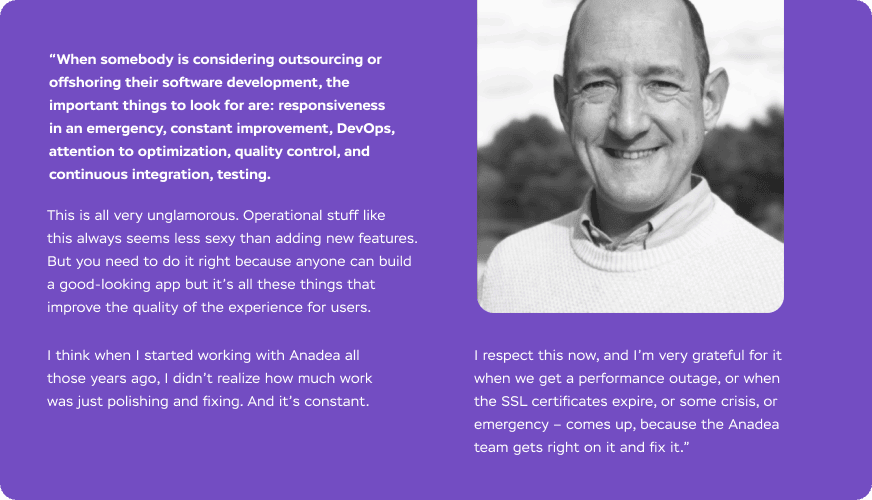

Assessment of a <a href="https://anadea.info/projects" target="_blank">software company portfolio</a> goes hand in hand with the process of choosing an outsourcing partner, doesn’t it? In most cases, yes. But there are a few more cases of how you can use it:

* Benchmarking of the project’s time and cost.
* Take a look at the interfaces of some complex solutions to improve your own system.
* Assess your competitors’ solutions from the inside and technical perspectives.
* Get new ideas for the features.
* Get ideas to change business processes.
* Find answers to your technical questions or challenges, and much more.

These things and many others can be done while crawling a software development company portfolio. But they are subject to a separate topic. Today we’ll cover the most frequent and classic case - analysis of a software house portfolio for selecting the best match for your project. This approach may help to reduce the risk of failure of the project, to make sure that the contractor has the necessary expertise and can show the needed level of proficiency.

## Portfolio
The portfolio of the software development company is a showcase of engineers’ capabilities, the variety of technologies they master, the typology of the projects they can lead, and abilities to meet business goals through building a demanded product. A portfolio may say more than any advertisement or paid listing, more than any laudatory review or paid award. You just need to know what to look at.

## Case study structure
An informative case study structure will resemble these sections under similar titles. They may go in some other order but it’s a good idea that you study them thoroughly.

### Type of solution
Make sure that the type of solution is the same as the one planned to be developed by you. If you are looking for a web portal or a web application, there’s no reason to look at irrelevant cases of mobile apps. It may seem an obvious thing, but for people that are far from the technical details of the project realization, it still may be a good tip.

### Industry
It's pretty obvious that you are a subject matter expert of your own business and you understand how it operates in the industry. Still, the team with the relevant experience has a significant chance to strengthen your own expertise in the subject, deliver a solution that responds to the business needs and goals, and do it faster. And faster means cheaper, as the team won’t spend time on investigating, it is able to start as soon as possible.

### Business context and goals
If the 2 first points match your own business case, you can go further and study the business context of the solution and the goals it chased. It’s telling you the story about why, what, and how the need was met. It’s a likely situation that you can evaluate if the solution was elegant, or not quite.

### Challenges
Really, this is one of the best parts of the play. Every project meets obstacles and collisions in many different ways. Communication, change requests, bugs, challenges in tech realization, the complexity of the domain, numerous stakeholders, and different system roles. These are things a project team faces every day and needs to find an efficient way to win over challenges. If case study shows you that everything was great, flawless, and easy, it’s not a source of trust. Besides, you can see the team’s maturity and situations they can struggle with. Pay attention to this point, it shouldn’t be overlooked.

### Team's effort
The way a software development company formulates the team’s effort in the case study says a lot. It may spotlight initiatives, creative solutions to challenges, show that the team thinks for themselves and is ready to become a flagship and engine of your project. If not, you’ll always be limited to your own thoughts and expertise and will lead them by the hand. It is time-consuming, isn’t it?

### Team composition
Big projects require big teams and not every outsourcing company is ready to provide you with a team of the corresponding size, specialization, and seniority by your demand and at the moment you’d like to start. Nevertheless, the information about the team composition and size may be very useful if you feel or know how many people you need. One more way to get this insight is to google the customer company. This way, you will make sure the contractor is dealing with companies of your size and has the capacity to take your project.

### Scope, time and cost
It’s an essential section, as it can provide you with the vision, wild-ass-guess estimation, and even benchmarking if you analyze several samples. Pay extra attention to the MVP version, killer features, if there was gold plating, and what were the timeframe and the cost, of course.

### Services and technologies
If your business is already supported by solid tech specialists in your in-house team, it’s not a waste of time to show them this section and ask what they think about it. It may appear that they can evaluate the elegance of the solution, the rationality of selected technologies and services in other companies’ case studies and speak up their mind.

### Business future plans
Business future plans speak louder than words. Do they plan to continue, or scale, was the solution effective to hit the goals? If yes, it’s a good point to take a closer look at the software development company.

### Impact on business
Does the case study vividly display numbers (increase in income, number of users, etc.) before and after the solution was implemented? If so, would you be impressed with them?

### Customer reviews
A proper client review will tell you a lot about the team’s strong sides. It’s not just “everything was so great, we recommend this company as a tech partner.” If a client really appreciated the result, they will share what exactly was great. Read between the lines - the mood, the expressions, to see if something deeper stands behind their words, or if it’s merely a marketing move.

Just take a look at the customer’s review that is really insightful and helpful left by __Matthew Stibbe__, CEO of <a href="https://anadea.info/projects/turbine-hq" target="_blank">Turbine</a> which was developed by Anadea.

<small style="font-size: 14px">Source: <a href="https://bmmagazine.co.uk/business/secrets-on-how-to-make-your-saas-flourish/" target="_blank" rel="nofollow">BusinessMatters</a> magazine</small>

It’s pretty different from usual accolades, isn’t it?

## To sum up
A software company portfolio is a great tool in capable hands. It may be useful in different ways. We hope this guide will help you not only to navigate through the sea of opportunities and options, but also make it easy and efficient.
