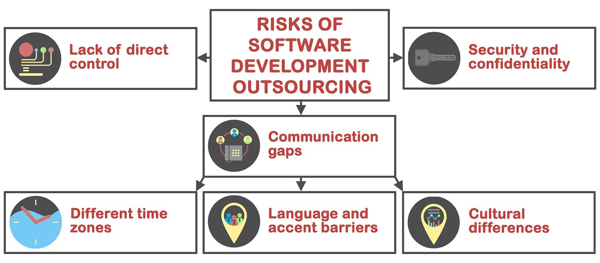

We often hear that we live in the world of possibilities. However, how often do you hear what these possibilities are?

Look at Apple. We love their computers and phones, the quality and innovations they bring. We also know that their products are a bit pricey - the newest iPhone would cost about $1000 or more. $1000 for a device assembled in China! Can you imagine how costly it would be if Apple built it in the USA? Thrice as expensive, I bet. However, Apple did a smart choice to outsource their production. It allows assembling more devices, makes them affordable, keeps the quality good and lets the headquarters in the States develop new features and work on new ideas. In the end, everybody is happy.

Outsourcing vs. insourcing is a common dilemma faced by businesses and many companies opt for to outsource their operations: Ford, Samsung, Paul Reed Smith, Ikea, Dell, Sony, Marshall, just to name a few. They do it because of a cheaper production cost which, with proper QA, doesn't degrade the final product's quality. IT companies and online businesses are no exception. There are many <a href="https://codeable.io/blog/top-companies-outsourced-development/" target="_blank">examples of successfully outsourced products</a>. For instance, Expensify, a popular online expense management service, took advantage of outsourced developers to build their back-end systems. Or Groove, currently a company with over $5 million in revenue, that outsourced the entire early development of their online customer support platform.

Let's take a closer look at the benefits of outsourcing compared to in-house software development.

## Why you should outsource to <a href="https://anadea.info/services/custom-software-development" target="_blank">custom software development companies</a>

### Reason number one: hire the best

When I tried to form a band in the small town where I lived, I faced the problem that there were few musicians around. No worthy vocalists, three bass players more interested in drinking and partying than making music and one drummer who was already engaged in five bands. But when I decided to collaborate with YouTube musicians, I got limitless options. I saw talented people with enough skill and drive from all around the world. I could see videos of them playing, I could find guys who enjoy playing the same music as I do and I could have any of them in my project.

In app development, things work the same way. You are very lucky if you know someone or can find a qualified developer with all required skills in your city. You are twice as lucky if it doesn't cost you your pants. You are extremely lucky if you can pick the entire team. You just can't count on luck alone.

Outsourcing offers endless possibilities, enabling you to explore skilled professionals from all over the world and review their qualifications and past work experiences. With just a few clicks, you can build your ideal team. Whether you require a mid-level Ruby on Rails developer with strong SQL capabilities, you are likely to find a suitable candidate online. When considering whether to outsource or hire in-house, consider the time and energy you can save by engaging an external IT team.

Moreover, by collaborating with outsourcing software development companies that specialize in your target niche, you can gain access to more than just technically adept developers. They can also provide market-specific expertise, potentially saving you a great deal of trouble.

### Reason number two: bang for the buck

Cost-efficiency is one of the main pros of outsourcing. Remember the example in the beginning of the article? $1000 for the device assembled in China, $3000 for the one made in the USA. The same is true about software development services. Actually, if you worry about issues associated with offshoring, you can go with outsourcing partners near you and their rates can be comparatively high.

However, the true cost of hiring an app developer internally far exceeds his base salary. It also involves significant overheads, such as employment taxes, paid vacations, trainings, paying salary even if you don't need their help at the moment and many more. The prices of computer equipment suitable for a heavy-duty programming, development and designing tools can cost thousands of dollars. You don't have to bother about these things with an outsourced team.

Ask yourself, is it still worth to hire in-house developers?

### Reason number three: scale your team at any time and get your product to the market faster

On different stages of development you may need different number of IT specialists with different skills to be involved in your project. Partnering up with a great software outsourcing company provides you with on-demand access to a large pool of professional developers. You know their hourly and man/day rates for each outsourced specialist and you can add, remove or switch developers in your external team based on what skills you need right now.

With in-house employees such flexibility is not achievable. Sourcing, interviewing and onboarding the right people is a challenging and time-consuming process. According to a <a href="https://www.computerworld.com/article/2939497/here-s-how-long-the-hiring-process-for-that-tech-job-will-take.html" target="_blank">study of job hiring data</a> at Glassdoor, it takes around 35 days to hire a coder in the U.S. and the average time-to-hire for tech positions has a tendency to increase. An outsourced IT team can [build an MVP](https://anadea.info/guides/what-is-mvp) for your app within this time so that you can start validating your idea with real users. It is a well-known fact that, especially in the IT business, every single day of delay is increasing the risk to be left behind by your competitors.

Let's sum up the major advantages of outsourcing software development:

## Outsourcing issues to consider

Let's say you can get an outsourced team for the same amount of cash you'd spend on a US-based developer. Sounds like a dream, right? However, as it often happens in life, there are some pitfalls on the way to your dream. In fact, the risks associated with software outsourcing are lower than many believe and there are proven ways to avoid them. However, they are also worth mentioning.

## Keys to successful outsourcing

**Don't choose the cheapest developers,** because they most likely won't produce anything decent. Some of them may use your project as a possibility to learn how to code. That's not what you are looking for, right? Remember the [quality/speed/cost triangle](https://anadea.info/blog/time-cost-quality-which-ones-do-you-choose-for-your-app/)? What you need is to find a balance between these things. Ukrainian developers is a good example of this: they are not overpriced and not the cheapest at the market, well-educated and give reasonable estimates.

**Transparency is necessary.** There are a lot of project management tools, such as Jira, Freedcamp or our [Tracker](https://anadea.info/projects/tracker). These tools allow you to see how your developers work, how much time they spend on each task, the estimates for each feature, daily reports, etc. They also help you to be better involved in the development process, become a part of the development team, set priorities and make changes if needed. Good software outsourcing companies always keep the development process transparent. They are working on building trust and care about their reputation which is the next point in our list.

Learn about company's **reputation.** See what projects they have developed, check their customers feedback, find out how long this company has been already operating in the market and so on. <a href="https://www.b2blistings.org/">B2B companies</a> with many years of experience have plenty information about them on the Web. They would gladly show you their portfolio and give you contacts of previous customers. After all, a tree is known by its fruit. Learn about a fruit that company provides and what others think of it.

Last but not least - **right estimation.** You can find your dream team, you like everything about them and particularly their temptingl low development cost estimate. However, if they underestimated your project and unexpected additional costs will spring up in the course of development, you can run out of budget before the project is ready to release. If you don't want to end up with an unfinished product, check twice that the estimate is fair, accurate and there are no pricing games.

## Conclusion

There is no simple answer which approach works best for your company. Both outsourcing software development and hiring in-house developers have their advantages and disadvantages that should be carefully weighed before coming to a final decision. Most companies go with a mixture of both approaches by performing their core operations in-house and delegating certain tasks to external specialists. Anyway, there is no doubt that IT outsourcing has become an essential element of running a successful business and refusing its benefits leaves businesses at risk of being left behind by their nimbler competitors.
