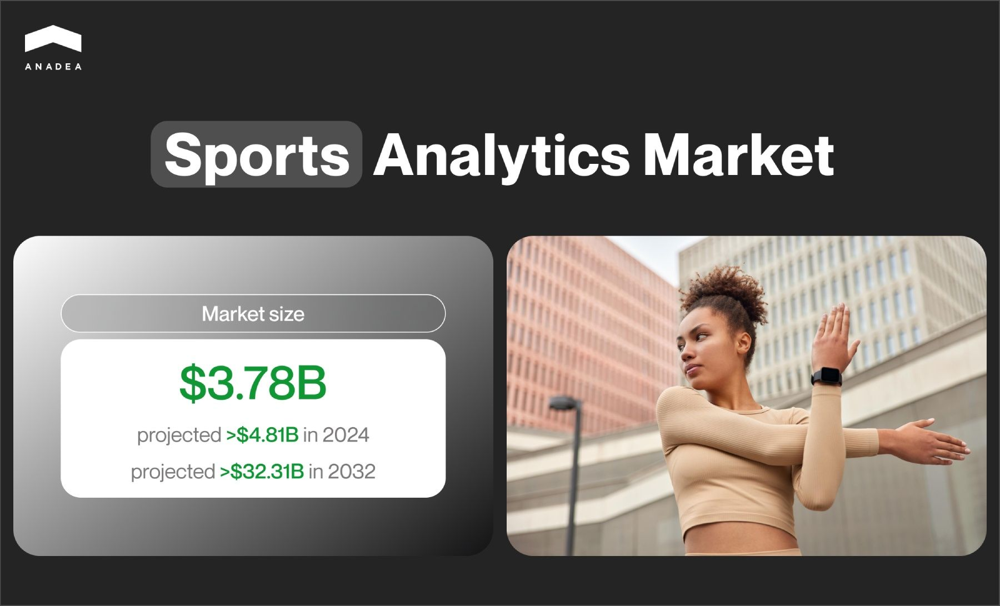
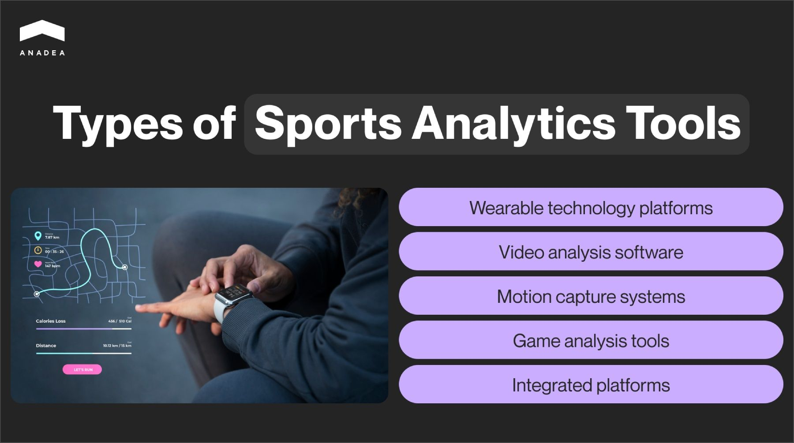
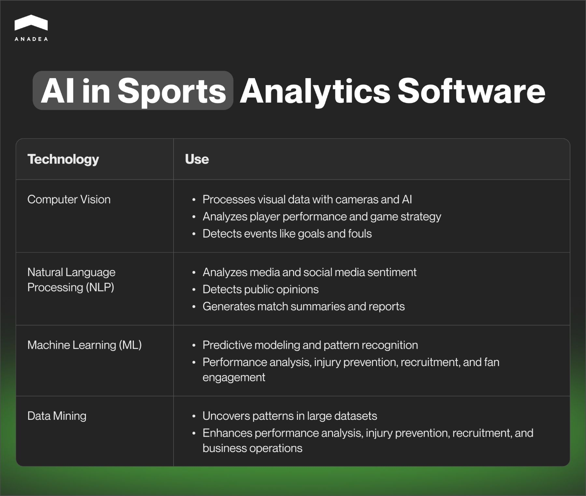
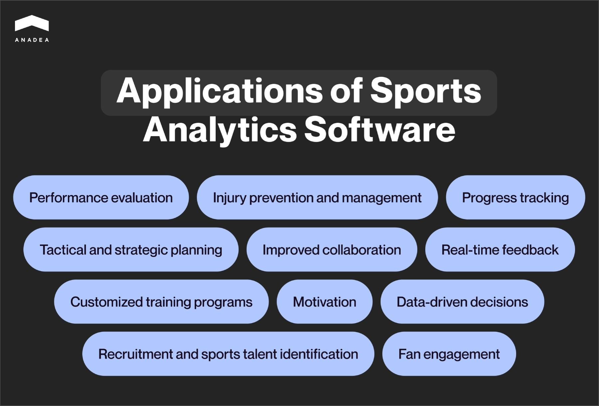

Data analytics tools are expected to revolutionize a lot of domains and industries. But while in some spheres, like business, the use of such solutions seems quite common already, in others, like sports, it’s not widespread yet. Still, the reality is that the adoption of such technologies in the sports industry is gaining momentum, which proves the efficiency of sports analytics tools and their significant role in this market.

In our article, we are going to talk about the peculiarities of such solutions and the key technologies that power modern sports data analytics software.

## What is sports analytics software?

First of all, let’s define this term.

Sports analytics solutions are designed to accumulate, process, evaluate, and provide insights into data related to an athlete’s or team’s performance during games or training sessions. They can analyze various aspects of different sports based on video footage or real-time data gathered by wearable devices worn by players.

Such sports analytics tools help to identify the strengths and weaknesses of each player, decrease the risk of injury, as well as make better informed strategic decisions.

Moreover, advanced performance analysis software can offer predictions on the results of upcoming sporting events based on ongoing tendencies. By getting such insights in advance, athletes and coaches still have a chance to adjust their approaches to team formation and players’ movements to their rivals’ tactics.

The global sports analytics market is actively expanding these days. In 2023, its size was [valued](https://www.fortunebusinessinsights.com/sports-analytics-market-102217) at $3.78 billion. It is expected that in 2024, this figure will climb up to $4.81 billion and hit the mark of $32.31 billion by 2032. These forecasts demonstrate that a CAGR for the forecast period from 2024 to 2032 will be close to 27%.

Although today the global community seems to have fully forgotten about the coronavirus, the pandemic is still believed to be one of the most powerful boosters for the growing demand for [sports software solutions](https://anadea.info/solutions/sports-app-development). Analysts say that amid the lockdowns, sports organizations were actively looking for digital solutions to help them during that period and beyond.

Sports performance analysis software proved its efficiency over time. Today we can observe the growing adoption of such products and their continuous modernization.

However, it would be wrong to say that such tools are something totally new. For example, the history of one of the most well-known products from this category, [Hudl](https://en.wikipedia.org/wiki/Hudl), takes its roots in 2006. Today, around 200,000 teams in 40 sports rely on the technology provided by this sports analytics software company to get insights from video and data. These figures can be viewed as a good demonstration of the demand for such products.

Book a free consultation

## Different types of sports analytics tools

If you are thinking about the launch of sports data analytics software, you should attentively study the range of existing types. This will help you to make up your mind and find the best idea for your project.

* **Wearable technology platforms**. Such solutions can integrate data from wearable devices (such as GPS trackers, heart rate monitors, and sports bracelets with sensors) to track the movement, speed, distance, and physiological metrics of athletes.
* **Video analysis software**. This software can break down game footage to analyze strategies, tactics, and player movements. It can also help to assess individual player techniques and biomechanics using video recordings.
* **Motion capture systems**. They rely on high-speed cameras and sensors to analyze athletes’ movements in detail.
* **Game analysis tools.** They are designed to analyze in-game data to evaluate team and player performance during competitions. Such software can also be used to examine opponent performance data to develop competitive strategies.
* **Integrated platforms**. There are also comprehensive solutions that combine multiple types of analytics (including performance, health, and tactical analysis) into one platform.

When we are talking about sports analysis software in general, it is also worth mentioning **fan engagement platforms**. Though they are often distinguished in a separate group, their key functionality still relies on analytics. They monitor fan interactions and engagement across different channels to improve marketing strategies and get insights into fan sentiment.

Sometimes our customers ask us to share our opinion on the best type of such solutions. However, it is impossible to provide a single answer. Your choice of the idea for your future product should depend on many factors.

You need to define your target audience and opt for the exact type of product to build based on the needs and demands of this group. Preliminary market research and direct communication with potential end-users can greatly help you in this case.

Request a free quote

## Use of artificial intelligence in sports analytics software

Artificial intelligence (AI) is one of the technologies that modern performance analysis software relies on. And here is how different types of AI help to enhance such products.

### Computer vision (CV)

This technology involves the use of cameras and AI algorithms to process and interpret visual data. Thanks to this, apps can provide valuable insights into player performance, game strategy, and much more.

It works the following way. First of all, high-resolution cameras should capture every movement on the field. Then, the image from the cameras should be processed. AI algorithms can detect and identify players, referees, and the ball in each frame. Then, tracking algorithms will measure motion between frames to track the direction and speed of each movement. And finally, the collected data should be analyzed. Modern software can work with positional data, visual representations of player movement, as well as speed and distance metrics.

Moreover, computer vision can also be used for detecting and classifying events during a game, such as goals, fouls, and other key moments. To introduce such functionality, developers should introduce algorithms that will be trained with predefined rules for different types of events. As a result, the system will be able to recognize specific patterns of movement and interactions that correspond to various events.

### Natural language processing (NLP)

This technology helps to analyze media, social media, and other textual data for sentiment analysis and trends. NLP algorithms analyze social media posts, comments, and forums to detect public opinions about players, teams, and events. Thanks to real-time analysis, teams and clubs can find out how fans react to their performances, strategies, and decisions.

NLP can be also used for generating automated match summaries and post-match reports including such info as player performance, game statistics, and critical incidents.

### Machine learning (ML)

This technology is used for different purposes mainly for predictive modeling and pattern recognition. Its applications span across performance analysis, injury prevention, recruitment, game strategy, and fan engagement.

### Data mining

Data mining in sports analytics provides insights by uncovering hidden patterns and relationships in vast datasets. It contributes to the enhancement of performance analysis, injury prevention, recruitment, game strategy, fan engagement, and business operations.



## When and why sports analysis software can be used

Sports performance analysis software can serve a wide range of purposes. And here is a list of the most important of them.

1. **Performance evaluation**. Such software provides in-depth analysis of various performance metrics, such as speed, strength, agility, and endurance. As a result, it can greatly help in assessing technical skills and identifying the strengths and weaknesses of individual athletes or teams.
2. **Injury prevention and management**. These tools can be enriched with the necessary features to monitor athlete workload to prevent overtraining and reduce the risk of injuries. They can also identify potential injury risks by analyzing movement patterns and physiological data.
3. **Tactical and strategic planning**. Sports statistics software offers insights into team performance and helps in building effective game strategies. Moreover, such apps can analyze the strengths and weaknesses of opponents. The more information teams have, the better tactics they can prepare.
4. **Customized training programs**. These digital solutions can design personalized training programs following the specific needs and goals of every athlete.
5. **Progress tracking.** Such software can monitor progress over time, allowing for adjustments to training programs as needed.
6. **Improved collaboration**. Apps from this category facilitate the sharing of data among coaches, athletes, and medical staff. They also often use visualizations like charts and graphs to communicate performance insights more effectively.
7. **Real-time feedback**. Sports data analytics software provides real-time data during training or competitions. Thanks to this, instant feedback and adjustments, as well as live monitoring of performance parameters, are possible.
8. **Motivation**. These digital solutions can help in setting measurable goals and tracking achievements, boosting athlete motivation.
9. **Recruitment and sports talent identification**. Sports analysis software can assist in identifying promising talent based on objective performance data.
10. **Data-driven decisions**. With solutions of this type, it is possible to reduce reliance on subjective judgments. Coaches get objective data for decision-making.
11. **Fan engagement.** Though it is not the key use case of this software, it can also serve this purpose. By sharing some performance insights and predictions via fan apps and platforms, sports clubs and teams can establish closer relations with their communities.

## Final word

The introduction and adoption of sports performance software can greatly change the efficiency of the training process and increase the chances of winning during competitions for individual athletes and teams. Already today such solutions are used across different kinds of sports. And the demand for them is continuously climbing higher. This fact should be viewed as a good sign by those who are considering the launch of their own products of this type.

To make sure that your solution will boast high popularity among its target audience, you should carefully analyze market needs and trends, as well as choose a reliable development partner.

At Anadea, we have rich expertise in building software products for the [sports domain](https://anadea.info/projects#sports) and will be always ready to support you at any stage of your project realization. For more information about our services, do not hesitate to contact our team and share your ideas with us.

Get in touch
