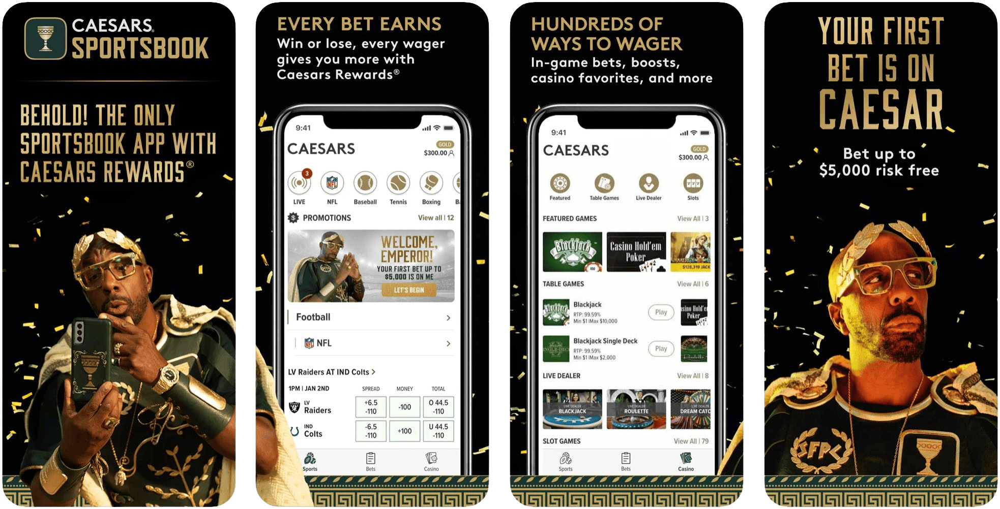
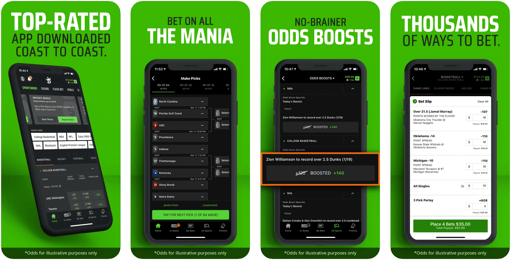
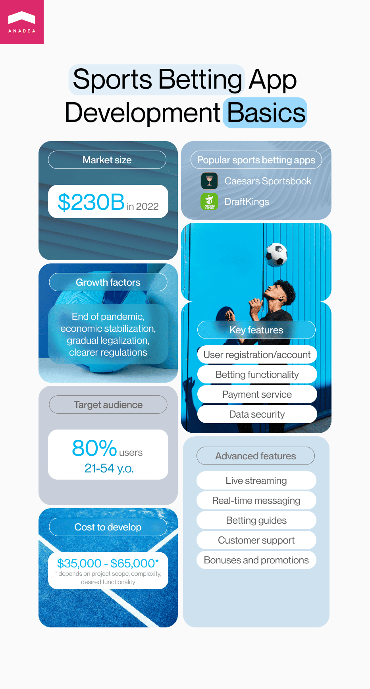

After the fall observed amid the coronavirus crisis, the sports betting and lottery market has started to grow again. And in 2022, it even managed to climb up to the pre-pandemic levels of around [$230 billion](https://www.statista.com/statistics/1186240/sports-betting-and-lottery-industry-market-size-global/). Today people demonstrate an increased interest in such activities. And it can be considered to be a very good sign for businesses that are thinking about the possibility to launch betting sports apps.

But what are the factors that are driving the growth of this market today? First of all, we should mention the end of the pandemic and the comparative stabilization of the economic situation. In 2020 and 2021, amid the introduced lockdowns and financial turbulence, people felt really unprotected and insecure and additional risks related to betting activities were barriers to market expansion. But that's not the only factor that has its impact.

Gradual legalization of the industry, in combination with clearer regulations, and the introduction of advanced solutions that enhance user experience also make their contribution to the market growth.

In this article, we would like to offer you to have a look at the peculiarities of sports betting app development and will share recommendations that will help you to achieve success with your betting application.

## Specificity of modern betting sports apps

It doesn't matter whether you are looking for the answers to the question of how to create a betting website or any other software solution, the first thing that you need to do is to conduct market analysis. You need to understand what solutions already exist, what makes people love them, and what issues can be detected. All this information will be of crucial importance for you at the stage of ideation. Successful betting sports apps can not inspire you but help to define the ongoing trends in building such solutions.

One of the key things that we recommend you pay attention to is the peculiarities of the target audience that you want to reach with your solutions.

According to the [research](https://www.westwoodone.com/blog/2022/06/21/new-online-sports-betting-study-am-fm-radio-listeners-show-significantly-more-interest-and-engagement-than-tv-viewers/) conducted by Westwood One Audio Active Group, nearly 80% of users who express their interest in sports betting are from 21 to 54 years old which is a quite wide segment. But it is interesting to mention, that people of the age of 55+ have also started to show interest in such activities, and their share in continuously growing. One more thing that may sound quite surprising to many of us is that women are also becoming more and more engaged in this market.

<small style="font-size: 14px"><a href="https://www.westwoodone.com/blog/2022/06/21/new-online-sports-betting-study-am-fm-radio-listeners-show-significantly-more-interest-and-engagement-than-tv-viewers/">Data source</a></small>

In general, the research has helped to create a socioeconomic profile of an average participant in sports betting activities. Despite the stereotypes that may say that unemployed millennials are the most active users of such apps, in reality, they are usually adults with kids and full-time jobs.

<small style="font-size: 14px"><a href="https://www.westwoodone.com/blog/2022/06/21/new-online-sports-betting-study-am-fm-radio-listeners-show-significantly-more-interest-and-engagement-than-tv-viewers/">Data source</a></small>

You may ask us why we pay so much attention to these characteristics of users in the context of explaining how to build betting website. But the answer is quite simple.

The more you know about your users, the better you can understand what they want to get with your solution. This knowledge will help you to make the right decisions regarding the tools of promotions (as you can guess, with this target audience TikTok and other platforms for youngsters will be not the best choice), collaborations that will bring your higher profits, design peculiarities, and the most highly-demanded features.

Similar principles are relevant when you want to know [how to develop a sports app](https://anadea.info/blog/how-to-develop-sports-app) of any other type.

But what betting sports apps are popular today? Here are a couple of examples.

### Caesars Sportsbook

This sports betting solution is launched by the largest casino-entertainment company in the US Caesars Entertainment Inc which was established in 1937. Today Caesars Sportsbook is a world-class sports betting solution that legally operates in 20 states of the US. To attract new users, the platform provides generous welcome bonuses. One of the most highly demanded features of this platform is micro-betting which allows users to bet on some particular game moments that are not related to the final results.

### DraftKings

It is an American company that offers daily fantasy sports and sports betting technologies. The company was founded in 2012 and since then, it has been expanding fast by obtaining licenses in new territories and making strategic acquisitions. The company's betting app is highly praised for its user-friendly interface and appealing bonuses. Moreover, it offers access to a wide range of sports and bet types.

## Legal and regulatory considerations related to sports betting app development

Sports betting is one of the activities that are still considered to be illegal in some jurisdictions while in others it should be licensed. Moreover, software for betting business should be compliant with the existing regulations, otherwise, such solutions can be blocked by the authorities.

In general, a legal online gambling website or app that provides services to users is obliged to have a betting license that can be issued by a relevant authority. Even if we take one region - **Europe** - we will see that regulatory practices will differ in different countries. For example, in **Spain**, betting apps and websites should be regulated at the local and state levels. In **the Netherlands**, sports betting apps are regulated by the Dutch Gaming Authority.

In **the United States**, the situation is also quite interesting. If you are going to launch a betting application in the US, we recommend you carefully study the market situation at the ongoing moment as the situation can be dynamic. As of June 2023, 34 states and the District of Columbia have a "Live, Legal" status. It means that sports betting services can be offered via legal sportsbooks. There are also 4 states where sports betting is legalized but the market here is not available.

<small style="font-size: 14px"><a href="https://www.americangaming.org/research/state-gaming-map/">Source</a></small

In **Australia**, sports betting is legal. But states there also have different licensing laws.

When you are planning the launch of such a solution, you also need to study not only the laws that are in force in different jurisdictions but also the regulations introduced by app marketplaces. If you ignore these rules, your application won't be published at all or will be deleted from their platforms.

## Sports betting apps: Essential features

To help you better understand what functionality your solution should have and what features can be added to enhance user experience, we've divided them into two relevant categories. The first one unites essential features of a modern betting application.

- **User registration/account.** To start placing bets, users should create an account. That's why it will be the first functionality that people will deal with. Make sure that all the processes are logically built and that it won't take too much time for users to understand what data they should provide and how to do it.

- **Betting functionality.** Your app should offer users a choice of different betting options as well as convenient tools for placing bets. The navigation should be intuitively clear, otherwise, you will risk losing users. In general, it is crucial to pay enough attention to UX/UI design in order to make sure that your app is user-friendly and that there are no issues related to design that will become a barrier to people who want to interact with your app.

- **Payment service**. As every betting app presupposes making payments, we recommend you take care of the possibility to add different payment options for users. The range of available variants can include debit and credit cards, bank transfers, e-wallets, payment services like Paypal, as well as cryptocurrencies.

- **Data security**. Sports betting apps deal with the personal details of users as well as their data for conducting financial transactions. That's why you should introduce powerful tools to protect people's data from any external attacks and eliminate all the existing vulnerabilities.

## Advanced features of a sports betting application

Below you can find some ideas that will help you to make your app more attractive to users.

- **Live streaming**. Thanks to modern technologies, today it is possible to integrate live streaming functionality that will allow users to watch games and matches in real-time directly via your app.

- **Real-time messaging**. You can also add a feature that will let people communicate with each other via an online chat and discuss the results of games and other related topics.

- **Betting guides.** This feature will boast popularity among those users who start their betting journey. That's why it is important to offer content of the highest quality.

- **Customer support**. It is necessary to ensure reliable customer support. The formats of interaction with users typically include phone calls, live chat, and email.

- **Bonuses and promotions**. To attract new users and retain the existing ones, you can introduce deposit bonuses, loyalty programs, and free bets.



## Sports betting app development process

The process of building a betting application, in general, resembles [fantasy sports app development](https://anadea.info/blog/how-to-make-a-fantasy-sports-app)or the creation of any other type of software as the main steps generally stay the same.

**Step 1. Ideation and market analysis.** When you make a decision to launch a sports betting application, you need to elaborate a good understanding of the concept of your solution, its goals, and key functionality. It is also highly recommended to analyze the market and the range of solutions that are already available to users. Thanks to such an analysis, you can define key trends in software development and find out what can make your app unique.

**Step 2. Hiring a reliable IT provider.** For those businesses that do not have their in-house development teams, the search for good developers can become a real challenge. We recommend you find a team that has expertise in building solutions for the sports industry and works with a rich tech stack. It will be useful to read the reviews that the company's customers have written on external platforms and to look through the [IT company portfolio](https://anadea.info/projects#sports).

**Step 3. Requirements gathering and planning.** When the team is chosen, the key task will be to make sure that you and your developers are on the same page. Both parties should clearly understand the goals of the project, the required functionality, the way of project realization, etc. That's why you should provide your team with all the documentation that you have regarding your future solution, share your vision, and be open to a dialogue.

**Step 4. Design and development**. This stage typically includes a lot of designing and coding work. Based on the approved requirements, designers will create interfaces for your betting application and developers will build the necessary features.

We highly recommend you start your project development with a minimum viable product ([MVP](https://anadea.info/guides/what-is-mvp)). It will be the first version of your application with a limited set of features. It will help users to understand whether they like and want to have your solution or not. Based on their feedback, you will be able to update and expand your app and make it better.

**Step 5. Testing**. Very often manual and automated tests are conducted already in parallel with development for detecting and fixing the bugs as soon as possible. But when the development is finished, it is time to check the correctness of the app's functioning as a whole. It is crucial to make sure that everything works as it is supposed to before the release.

**Step 6. Deployment.** When the app is ready, it is necessary to prepare the environment and launch the product.

**Step 7. Support and maintenance**. But even after the step of deployment, it is not sensible to stop working on your app. Its performance should be continuously monitored for defining any possible vulnerabilities. Moreover, it will be a good idea to regularly gather users' feedback in order to understand what can be improved. Based on their feedback, you can introduce changes that will have a positive impact on their satisfaction.

## Tech stack for a sports betting application

The tech stack for building your app should be always chosen based on the requirements of your project. For example, the choice of a programming language will depend on the platform (or platforms) that your app will be compatible with. Below you can find a list of technologies that are often used for building such solutions.

- **Mobile development:** Kotlin, Java, Swift
- **Backend development:** PHP, Node JS
- **Frontend development:** Angular, React
- **Database:** MongoDB, Postgre, HBase, Redis
- **Real-analytics:** IBM, apache, Spark
- **Cloud platform:** AWS, Microsoft Azure, Google Cloud
- **Push notifications:** Firebase, Onesignal
- **Messaging features:** Twilio
- **Payments:** Paypal, Stripe
- **Live streaming protocols:** WebRTC, RTMP

## Cost of sports betting app development

The cost of any software development project is affected by a row of factors, such as:

- The complexity of the project;
- The scope of work;
- The number of integrations;
- The tech stack;
- The composition of the development team, etc.

That's why it is impossible to name any precise figures without analyzing any particular case. As a rule, the final price will be somewhere in the range of **$35,000 - $65,000**. But before planning your budget, you should have a consultation with your development team that will provide you with more accurate estimates.

## Conclusion

With the increasing popularity of sports gambling, it is a very natural thing that more and more companies are interested in how to build a betting website or app. The market competition is growing and to win your market share, you need to offer a high-quality product with unique features. That's the main secret that will help you stand out from the row of your rivals.

At Anadea, we have a good understanding of the peculiarities of software for betting business and are always ready to apply our knowledge to practical tasks. We are not afraid of challenges and can easily cope even with the most difficult projects. Have an idea for a betting application? Contact us to get free estimates!

Get in touch
