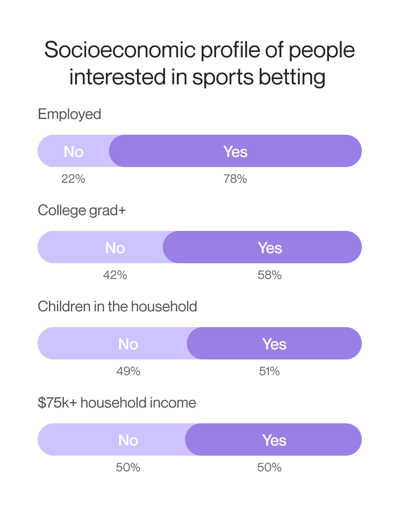

After the fall observed amid the coronavirus crisis, the sports betting and lottery market has started to grow again. And in 2022, it even managed to climb up to the pre-pandemic levels of around [$230 billion](https://www.statista.com/statistics/1186240/sports-betting-and-lottery-industry-market-size-global/). Today people demonstrate an increased interest in such activities. And it can be considered to be a very good sign for businesses that are thinking about the possibility of launching betting sports apps.

But what are the factors that are driving the growth of this market today? First of all, we should mention the end of the pandemic and the comparative stabilization of the economic situation. In 2020 and 2021, amid the introduced lockdowns and financial turbulence, people felt really unprotected and insecure and additional risks related to betting activities were barriers to market expansion. But that's not the only factor that has its impact.

Gradual legalization of the industry, in combination with clearer regulations, and the introduction of advanced solutions that enhance user experience also make their contribution to the market growth.

In this article, we would like to offer you to have a look at the peculiarities of sports betting app development and will share recommendations that will help you to achieve success with your betting application.

## Specificity of modern betting sports apps

It doesn't matter whether you are looking for the answers to the question of how to create a betting website or any other software solution, the first thing that you need to do is to conduct market analysis. You need to understand what solutions already exist, what makes people love them, and what issues can be detected. All this information will be of crucial importance for you at the stage of ideation. Successful betting sports apps can not inspire you but help to define the ongoing trends in building such solutions.

One of the key things that we recommend you pay attention to is the peculiarities of the target audience that you want to reach with your solutions.

According to the [research](https://www.westwoodone.com/blog/2022/06/21/new-online-sports-betting-study-am-fm-radio-listeners-show-significantly-more-interest-and-engagement-than-tv-viewers/) conducted by Westwood One Audio Active Group, nearly 80% of users who express their interest in sports betting apps are from 21 to 54 years old which is a quite wide segment. But it is interesting to mention, that people of the age of 55+ have also started to show interest in such activities, and their share in continuously growing. One more thing that may sound quite surprising to many of us is that women are also becoming more and more engaged in this market.

<small style="font-size: 14px"><a href="https://www.westwoodone.com/blog/2022/06/21/new-online-sports-betting-study-am-fm-radio-listeners-show-significantly-more-interest-and-engagement-than-tv-viewers/">Data source</a></small>

In general, the research has helped to create a socioeconomic profile of an average participant in sports betting activities. Despite the stereotypes that may say that unemployed millennials are the most active users of such apps, in reality, they are usually adults with kids and full-time jobs.

<small style="font-size: 14px"><a href="https://www.westwoodone.com/blog/2022/06/21/new-online-sports-betting-study-am-fm-radio-listeners-show-significantly-more-interest-and-engagement-than-tv-viewers/">Data source</a></small>

You may ask us why we pay so much attention to these characteristics of users in the context of explaining how to build betting website. But the answer is quite simple.

The more you know about your users, the better you can understand what they want to get with your solution. This knowledge will help you to make the right decisions regarding the tools of promotions (as you can guess, with this target audience TikTok and other platforms for youngsters will be not the best choice), collaborations that will bring your higher profits, design peculiarities, and the most highly-demanded features.

Similar principles are relevant when you want to know [how to develop a sports app](https://anadea.info/blog/how-to-develop-sports-app) of any other type.

But what betting sports apps are popular today? Here are a couple of examples.

### Caesars Sportsbook

This sports betting solution is launched by the largest casino-entertainment company in the US Caesars Entertainment Inc which was established in 1937. Today Caesars Sportsbook is a world-class sports betting solution that legally operates in 20 states of the US. To attract new users, the platform provides generous welcome bonuses. One of the most highly demanded features of this platform is micro-betting which allows users to bet on some particular game moments that are not related to the final results.

### DraftKings

It is an American sports betting company that offers daily fantasy sports and sports betting technologies. The company was founded in 2012 and since then, it has been expanding fast by obtaining licenses in new territories and making strategic acquisitions. The company’s betting app is highly praised for its user-friendly interface and appealing bonuses. Moreover, it offers access to a wide range of sports and bet types.

## Legal and regulatory considerations related to sports betting app development

Sports betting is one of the activities that are still considered to be illegal in some jurisdictions while in others it should be licensed. Moreover, software for betting business should be compliant with the existing regulations, otherwise, such solutions can be blocked by the authorities.

In general, a legal online gambling website or app that provides services to users is obliged to have a betting license that can be issued by a relevant authority. Even if we take one region - **Europe** - we will see that regulatory practices will differ in different countries. For example, in **Spain**, betting apps and websites should be regulated at the local and state levels. In **the Netherlands**, sports betting apps are regulated by the Dutch Gaming Authority.

In **the United States**, the situation is also quite interesting. If you are going to launch a betting application in the US, we recommend you carefully study the market situation at the ongoing moment as the situation can be dynamic. As of June 2023, 34 states and the District of Columbia have a "Live, Legal" status. It means that sports betting services can be offered via legal sportsbooks. There are also 4 states where sports betting is legalized but the market here is not available.

<small style="font-size: 14px"><a href="https://www.americangaming.org/research/state-gaming-map/">Source</a></small>

In **Australia**, sports betting is legal. But states there also have different licensing laws.

When you are planning the launch of such a solution, you also need to study not only the laws that are in force in different jurisdictions but also the regulations introduced by app marketplaces. If you ignore these rules, your application won't be published at all or will be deleted from their platforms.

## Benefits of sports betting apps

As the sports betting market regains momentum, businesses have a unique opportunity to tap into the digital space with mobile sports betting apps that enhance user engagement and expand reach. Let’s explore how these apps can provide a competitive advantage and drive sustainable growth.

### 24/7 accessibility for users

One of the primary advantages of sports betting applications is accessibility. Users can place bets anytime, anywhere, making it easy for them to engage on their own terms. This flexibility not only broadens the potential customer base but also boosts retention by integrating betting seamlessly into users’ daily lives.

### Personalized user experiences

Modern sports betting platforms stand out by offering personalized recommendations, tailored notifications, and exclusive offers based on individual preferences. By leveraging user data, these apps create customized experiences that keep customers coming back, giving businesses an edge in a highly competitive market.

### Enhanced user engagement

Through features like real-time updates, live streaming, and in-app communities, betting apps provide an immersive experience. These features make mobile sports betting apps more than just platforms—they become a complete hub for sports enthusiasts. This deepened engagement adds significant value, encouraging users to stay connected.

### Valuable data insights for businesses

Sports betting apps also serve as a powerful source of data. By analyzing user behavior, companies can refine offerings, identify trends, and adjust marketing strategies to align with customer needs. These insights provide businesses with a roadmap for ongoing service enhancement and sustained growth.

### Secure and controlled transactions

With robust security protocols, mobile sports betting apps offer users peace of mind regarding their financial information. These apps typically integrate trusted payment options and security measures, ensuring transactions are safe and controlled. For businesses, this establishes trust, helping to retain users who feel secure engaging in sports betting.

### Opportunities for cross-promotions and partnerships

Sports betting platforms open doors to cross-promotions with sports teams, leagues, and brands. From co-branded events to in-app sponsorships, these partnerships can increase brand visibility and offer mutual benefits. For businesses, this can create additional revenue streams while enhancing user experience with exclusive content and promotions.

## Sports betting apps: Essential features

To help you better understand what functionality mobile sports betting apps should have and what features can enhance user experience, we’ve divided them into two relevant categories. The first group highlights essential features every modern betting application needs.

### User registration and account setup

To start placing bets, users need to create an account. This is the first interaction users have with mobile sports betting apps, so it’s crucial that the registration process is smooth and straightforward. Make sure all steps are logically organized and that it’s clear to users what information is required and how to provide it without hassle.

### Comprehensive betting functionality

Successful mobile sports betting apps should provide a variety of betting options and make it easy for users to navigate. An intuitive, user-friendly interface is key here—any complexity in design or functionality can lead users to abandon the app. Prioritize UX/UI to ensure seamless interaction and satisfaction with the betting experience.

### Integrated payment services

Given that mobile sports betting apps require monetary transactions, offering multiple payment options is essential. These can include credit and debit cards, bank transfers, e-wallets, payment services like PayPal, and even cryptocurrencies. A variety of choices increases user satisfaction and trust, making transactions feel secure and convenient.

### Robust data security

With personal and financial data flowing through the app, high-level security is a must. Implement advanced encryption and protection mechanisms to safeguard user information against external attacks and vulnerabilities. This not only ensures user trust but also compliance with legal requirements in many regions.

### Real-time odds and updates

To keep users engaged, it’s crucial to provide real-time odds and updates. Users appreciate accurate, up-to-the-minute data that helps them make informed betting decisions. This feature is vital in mobile sports betting apps, especially for live betting where decisions are often made on the fly.

### Push notifications and alerts

Push notifications are a great way to keep users active and informed. These alerts can notify users about upcoming games, changes in odds, or promotional offers, enhancing overall engagement. Personalized notifications based on user interests are especially effective in keeping them engaged with the app.

Adding these essential features can make a big difference in user experience, creating a platform that not only meets but exceeds user expectations.

## Advanced features of a sports betting application

Here are some advanced features to consider for sports betting software development, aimed at enhancing user experience and making your app more engaging and competitive.

### Live streaming

With modern technology, you can integrate live streaming so users can watch games and matches in real time directly within the app. This feature not only adds excitement to using mobile sports betting apps but also keeps users engaged for longer periods.

### In-app messaging

Adding real-time messaging allows users to connect, chat, and discuss game outcomes or strategies with each other. This feature in mobile sports betting apps creates a community feel within the app, making it more interactive and enjoyable, especially during live events.

### Betting guides

Providing high-quality betting guides is invaluable for users who are new to betting. Offering well-structured, informative content will not only build trust but also make mobile sports betting apps accessible to beginners looking for guidance on betting strategies and game analysis.

### Reliable customer support

Ensuring dependable customer support is essential for mobile sports betting apps. Options like live chat, phone support, and email provide users with quick help when they encounter issues or have questions, enhancing trust and user satisfaction.

### Bonuses and promotions

To attract and retain users, offering bonuses, loyalty programs, and promotional incentives can be very effective. Deposit bonuses, free bets, and exclusive promotions add value to the user experience and encourage regular engagement with the app.

By incorporating these advanced features, you can create a more dynamic, engaging mobile sports betting apps appealing to a wide range of users.



## Popular types of sports betting apps
The market of sports betting apps offers diverse options tailored to different user preferences and betting styles. Here’s a look at some of the most popular types that businesses might consider:

### Sportsbook apps

These apps offer comprehensive betting on popular sports like football, basketball, and tennis. With options like point spreads, money lines, and live betting, sportsbook apps attract a wide audience, providing real-time odds and even live streaming. They’re a staple for users seeking classic sports betting experiences across various sports.

### Daily fantasy sports (DFS) apps

DFS apps let users create fantasy teams with real players, earning points based on actual performance. This approach caters to users looking for a more strategic, season-long sports betting experience and has proven popular for those wanting deeper involvement with their favorite sports.

### Exchange betting apps

In these apps, users bet against each other rather than a traditional bookmaker. Here, users set their own odds, offering more flexibility and control. This peer-to-peer model attracts users who value community-driven sports betting and typically want better odds.

### Esports betting apps

With the growth of esports, dedicated betting apps for games like League of Legends and Dota 2 have emerged. These apps feature live streaming, real-time player stats, and even virtual currency betting, appealing to younger audiences and esports fans.

### In-play or live betting apps

These sports betting apps allow users to place bets during live games, with odds that fluctuate in real time. Key features include instant bet placements and live updates, making the experience dynamic and engaging for users who want to be involved throughout the game.

### Pool betting apps

In pool betting, users bet into a collective pool with variable payouts based on total contributions. This format is especially popular in sports like horse racing, fostering a community-oriented experience for users who enjoy collective sports betting.

### Virtual sports betting apps

Virtual sports apps offer betting on simulated events like horse races and football matches, available 24/7. This type appeals to users seeking quick, continuous betting options, even during off-seasons or between major events.

### Cryptocurrency-based betting apps

These apps let users bet using cryptocurrencies like Bitcoin or Ethereum, offering enhanced privacy and lower fees. They’re popular with tech-savvy users who prioritize security, anonymity, and quick transactions.

Each type of sports betting apps has unique features to suit different user preferences, offering businesses a range of options to tap into niche and mainstream markets alike in the sports betting industry.

## Sports betting app development process

The sports betting app development process, in general, resembles [fantasy sports app development](https://anadea.info/blog/how-to-make-a-fantasy-sports-app) or the creation of any other type of software as the main steps generally stay the same.

### Step 1. Ideation and market analysis

When you decide to engage in sports betting app development, you need to elaborate a good understanding of the concept of your solution, its goals, and key functionality. It is also highly recommended to analyze the market and the range of solutions that are already available to users. Thanks to such an analysis, you can define key trends in software development and find out what can make your app unique.

### Step 2. Hiring a reliable IT provider

For those businesses that do not have their in-house development teams, the search for good developers can become a real challenge. We recommend you find a sports betting app development company that has expertise in building solutions for the sports industry and works with a rich tech stack. It will be useful to read the reviews that the company’s customers have written on external platforms and to look through the [software company portfolio](https://anadea.info/projects#sports).

### Step 3. Requirements gathering and planning

When the team is chosen, the key task will be to make sure that you and your developers are on the same page. Both parties should clearly understand the goals of the project, the required functionality, the way of project realization, etc. That’s why you should provide your team with all the documentation that you have regarding the entire process of sports betting app development, share your vision, and be open to a dialogue.

### Step 4. Design and development

This stage typically includes a lot of designing and coding work. Based on the approved requirements, designers will create interfaces for your betting application and developers will build the necessary features.
We highly recommend you start your sports betting app development with a minimum viable product ([MVP](https://anadea.info/guides/what-is-mvp)). It will be the first version of your application with a limited set of features. It will help users to understand whether they like and want to have your solution or not. Based on their feedback, you will be able to update and expand your app and make it better.

### Step 5. Testing

Thorough testing is crucial to delivering a bug-free experience. During online sports betting app development, both manual and automated testing are used to catch errors early. Once the app is fully developed, end-to-end testing verifies that all features work as intended. This process includes usability testing to ensure the app is user-friendly and secure, particularly important for an app handling financial transactions.

### Step 6. Deployment

Once testing is complete and the app is stable, it’s time to deploy. Sports betting app developers prepare the production environment, including configuring servers, databases, and security protocols, to support a smooth launch. Release the app on relevant platforms (such as iOS and Android app stores) and coordinate with marketing teams to promote the launch effectively.

### Step 7. Support and maintenance

The work doesn’t end with deployment. Continuous support and maintenance are essential to keep the app running smoothly and address any issues that arise. Get your sports betting app developers to regularly monitor app performance to identify vulnerabilities, fix bugs, and implement updates. Additionally, gather user feedback to identify areas for improvement, allowing you to fine-tune the app and enhance user satisfaction over time.

A structured sports betting app development process ensures every phase, from concept to deployment, builds a strong foundation for user engagement and loyalty. Even after launch, continuous support and updates keep the app relevant, adapting to user feedback and market shifts. With this approach, businesses can build a sports betting app that stands out, retains users, and evolves with the industry’s demands.

## Tech stack for a sports betting application

The tech stack for building your app should be always chosen based on the requirements of your project. For example, the choice of a programming language will depend on the platform (or platforms) that your app will be compatible with. Below you can find a list of technologies that are often used in sports betting app development.

- **Mobile development:** Kotlin, Java, Swift
- **Backend development:** PHP, Node JS
- **Frontend development:** Angular, React
- **Database:** MongoDB, Postgre, HBase, Redis
- **Real-analytics:** IBM, apache, Spark
- **Cloud platform:** AWS, Microsoft Azure, Google Cloud
- **Push notifications:** Firebase, Onesignal
- **Messaging features:** Twilio
- **Payments:** Paypal, Stripe
- **Live streaming protocols:** WebRTC, RTMP

## Cost of sports betting app development

The cost of developing a sports betting app usually ranges from $35,000 to $65,000, though the exact price depends on several factors. Here’s a breakdown of key cost drivers:

### Project complexity

Simple apps with core betting features are less costly, while more complex apps with real-time betting, live streaming, or in-depth analytics require a higher budget.

### Scope of work

Developing across multiple platforms (iOS, Android, web) adds to the workload and cost. Starting with an MVP can help control initial expenses.

### Integrations

Essential integrations—such as payment gateways, sports data providers, and authentication services—add costs due to compatibility testing and security measures.

### Tech stack

Advanced tech choices, like real-time updates or cloud-based infrastructure, increase costs but can enhance app performance and scalability.

### Development team composition

A team with additional specialists, such as AI experts or security professionals, may cost more but enhances app quality and security.

### Compliance and security

Betting apps require adherence to industry regulations and strong data security, which can involve legal guidance and encryption costs.

To get an accurate estimate tailored to your project’s specific requirements, consult your development team and prioritize features that align with your budget and goals. On our part, we can offer a [free app development quote](https://anadea.info/free-project-estimate)—just get in touch with us and share your project details.

## Why choose us for your sports betting app development project

Since 2000, Anadea has been developing custom software solutions that emphasize quality, functionality, and a seamless user experience. With years of experience in the sports industry—through projects like Plei and Just Play—we understand the unique demands of this field. Our commitment to excellence is reflected in our 4.9 rating on Clutch and a 5.0 on GoodFirms, as clients consistently highlight our reliability and expertise.

We offer flexible collaboration models to suit your project needs:

* **Outsourcing:** Let us manage your sports betting app development project end-to-end, allowing you to reduce expenses, leverage our streamlined processes, and focus on your core activities.

* **Team augmentation:** Access specialized skills matched to your requirements, adjust resources as needed, and maintain direct oversight, all while strengthening your in-house capabilities.

Beyond our core sports betting app development services, we’re excited about AI’s potential and are eager to incorporate it into your apps, from predictive analytics to real-time personalization, enhancing user experience and functionality. If you’d like to hear more, check out interviews with sports project founders [Sebastian Duque](https://anadea.info/client-interviews/plei) and [David Argyle](https://anadea.info/client-interviews/just-play), who share insights into how our collaboration turned their vision into a successful product.

Choosing Anadea as a sports betting app development company for your project means partnering with a team that brings experience, adaptability, and an enthusiasm for innovation, helping your sports betting app excel in a competitive, tech-driven market.

## Conclusion

With the increasing popularity of sports gambling, it is a very natural thing that more and more companies are interested in how to build a betting website or app. The market competition is growing and to win your market share, you need to offer a high-quality product with unique features. That's the main secret that will help you stand out from the row of your rivals.

At Anadea, we have a good understanding of the peculiarities of software for the betting business and are always ready to apply our knowledge to practical tasks. We are not afraid of challenges and can easily cope even with the most difficult projects. Have an idea for a betting application? Contact us to get free estimates!

Get in touch
