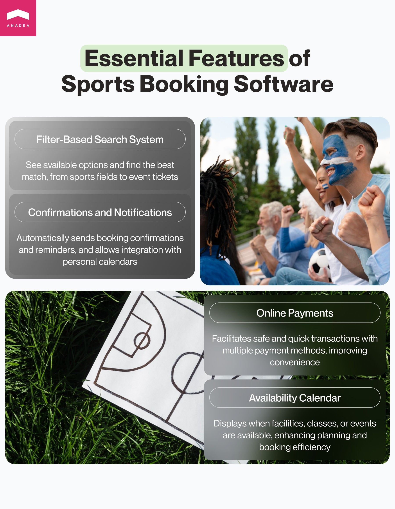
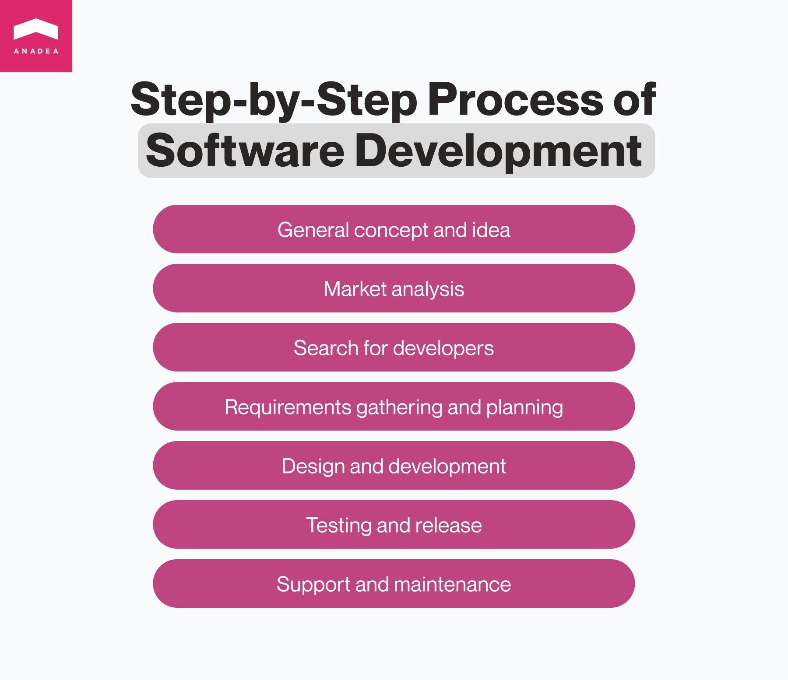

With the overall digitalization of the sports and fitness industry, current businesses are looking for the opportunity to transform as many traditional processes as possible using modern technologies. [Sports app development](https://anadea.info/solutions/sports-app-development) is on the rise and sports booking software is one of those types that boasts rather high demand today. In this article, we are going to talk about the peculiarities of solutions included in this category and provide practical tips to those interested in building such software.

## Types of sports booking software

Before discussing how to make sports booking software, it is necessary to focus on the general definition of this group of solutions and their use cases. Today there is a wide range of [online booking apps](https://anadea.info/blog/online-booking-app-development-tips) that are well known to people from all over the world. Such solutions as **Booking.com**, which allows us to find and book hotel rooms, or OpenTable for reserving tables at different cafes and restaurants have millions of users.

And that’s not an exaggeration. In January 2024 alone, nearly 565 million people [visited](https://www.statista.com/statistics/1294912/total-visits-to-booking-website/) Booking.com. To understand the scale of this business, it’s also worth mentioning that in 2023, the global [revenue](https://www.statista.com/statistiques/225455/booking-holdings-total-revenue/) of Booking Holdings increased by 25% over the previous 12 months and reached $21.4 billion. There are also highly successful booking apps for making appointments, ordering taxi services, organizing trips, buying tickets, etc.

But what about sports booking software development? What solutions can be built?

As it is possible to understand from the name of this software category itself, such apps and websites are intended for reserving something (facilities or equipment) or making appointments (like individual training sessions with coaches or group fitness classes).

Let’s have a closer look at the different use cases of these software products:

* **Sports facility booking software**. Such solutions can help administrators of various sports facilities save the time and effort that are traditionally required when all the related tasks are performed manually. With modern sports facility booking management software, you can significantly simplify end-to-end booking for all the participants of this process. There are solutions for reserving tennis courts, football pitches, swimming lanes, indoor multi-purpose courts with various equipment, and other types of sports field booking software. Such applications are usually enriched with features for instant communication with customers and tools for making online payments.
* **Sports and fitness appointment booking apps**. These applications should offer all the required features for choosing available time slots with coaches or fitness classes in the schedule provided by clubs. Software of this kind can greatly facilitate tasks for different groups of users, including sports club staff, coaches, athletes, and fitness lovers.
* **Sports ticket booking software.** Sports booking solution development services are gradually revolutionizing the processes of selling and [buying event tickets](https://anadea.info/blog/ticket-booking-app-development-guide). With applications of this kind, users can find tickets for events held in any location. And to buy them, people even do not have to visit any traditional ticket offices, everything can be done online. Such software often provides access to seat maps, offers directions on how to get to the venue by car or public transport, as well as sends notifications before the match.



## Features of sports booking software

The exact set of features should be defined when you already have a clear concept of your sports booking solution development project. Before making a final decision regarding the functionality of your custom product, you need to identify its target audience, use cases, and key goals. Nevertheless, given the specificity of booking software, we can provide you with a range of the most basic features and tools that are highly likely to be included in your solution.

* **List of available options with a filter-based search system.** Users should be able to see what you can offer them and easily find the options that fully meet their expectations. In this case, it doesn’t matter whether we are talking about sports field booking software that opens access to the reservation of pitches, courts, swimming lines, etc; solutions for booking classes; or apps for buying event tickets.
* **Availability calendar**. Depending on the type of your sports booking software, it could be highly sensible to include a calendar. This feature will help users better view the availability of various facilities or schedules of different classes and events in a particular time period. Very often, when you are building a solution for booking a stadium or arena, it will be useful to integrate your calendar with the calendar of a team that plays its home games and trains there. In such a case, you should consider integration with a [sports team management solution](https://anadea.info/blog/sport-team-management-software).
* **Confirmations and notifications.** It will be a good idea to send confirmations and reminders of upcoming bookings via email, SMS, or push notifications. To enhance the experience, you can also integrate your app with the personal calendars of users. It means that all the planned appointments, events, and bookings will be shown in people’s daily schedules. We also highly recommend you allow users to set all reminders per their preferences. Thanks to that, it will be possible to avoid irritation caused by excessive notifications.
* **Online payments**. Thanks to booking apps, you can either fully eliminate or at least greatly reduce the number of cash operations. As a result, you can make transactions safer, faster, and much more convenient for all the participants of this process. It will be sensible to offer various payment methods to make sure that every user will find the most appropriate option.

Discuss your idea

## How we develop sports booking software at Anadea

At Anadea, we work with software development projects of different types, and apps for the sports industry are one of our focus areas. We have well-developed processes and a clear vision of how the project realization should be organized. This helps us deliver solutions that perfectly meet the expectations of our clients, address the needs of users, and correspond to market trends. That’s why if you are thinking about how to make sports booking software, you can use our step-by-step plan as a foundation for setting your flows.

1. **General concept and idea**. First of all, you should understand why you want to create your custom sports facility booking software or a product for making appointments for any related services. You should decide on the range of tasks that your app should fulfill, as well as on the target audience. Based on this information, you will further create your requirements for developers.
2. **Market analysis.** It will be always highly helpful to study the market, find similar solutions, consider their functionality, and read the reviews written by real users. Of course, the “copy-and-paste” approach is not what we are talking about. However, you can use the results of your research for inspiration and for better realizing the ongoing market needs and industry standards.
3. **Search for developers.** Even those companies that have their in-house development departments may face situations when their inner resources are not enough for project realization. In this case, it is necessary to find external experts: freelancers or vendors who can provide sports booking software development services. In this article, we will explain the benefits of different approaches. However, one thing is for sure - it’s always better to look for specialists who already have expertise in building sports and booking applications.
4. **Requirements gathering and planning.** At this step, we, as a reliable software development partner, usually join the game. It doesn’t mean that we can’t help you with ideation or market research, but very often customers come to us already with some understanding of what they want to get.  Our team needs to get as much information about your project as possible. If you already have any documentation, tech stack requirements, prototypes, etc. - everything will be helpful. Based on the provided info, we will be able to plan the development process, set the key milestones, and define the time frames.
5. **Design and development.** Traditionally, it is the most time and effort-consuming process which includes a lot of coding. It is necessary to make sure that the built functionality will not only meet the set requirements but also ensure excellent user experience and smooth navigation. As a rule, we offer our customers, to build an MVP first. This version of an app has a limited set of features, which means that your investment in such a product will be lower than in the case of a full-scale solution. It is recommended to launch a minimum viable product to see the reaction of potential users. You can gather their feedback to find out whether you have chosen the right concept, or whether it’s necessary to enhance it before building an application with all the planned features.
6. **Testing and release.** Before launching your app, you should make sure that it works as it is supposed to, that all bugs are fixed, and that there are no vulnerabilities that can pose serious threats to users, their data, or finances. That’s why our team always pays a lot of attention to testing. Some types of tests are conducted in parallel with development. But when your product is ready, it is necessary to test it again and have a look at whether everything functions well after all the introduced changes.
7. **Support and maintenance**. After the release, you can take a breather. But only a really short one. Successful work of your app requires continuous monitoring and regular updates. You also should analyze the opinions of users to adjust your solution to their changing needs.

Get in touch

## How to hire sports app developers: freelance vs outsourcing

When you see that you do not have the required in-house resources for your sports booking solution development, you need to attract external specialists. And here you may have a dilemma: freelancers or a software development company like Anadea.

### Freelancers

The cooperation with freelancers always seems to be quite seamless and straightforward. You just need to open a website like Upwork and find specialists with the required skills and appropriate rates.

In reality, there are much more pitfalls than it is expected. First of all, not all freelancers demonstrate a high level of responsibility. They know that they are not members of your team and their discipline may suffer. Of course, there are a lot of amazing specialists who respect their clients and take care of their own reputation but such risks still exist.

Moreover, it can be rather difficult to find freelancers who will be available in a long-term perspective, especially after a break. For example, if you launch an app and decide to add some new features two or three months later, it is rather risky that the same people will be engaged in other projects and you will need to look for completely new specialists.

In general, this model of cooperation with developers is an excellent choice for some small tasks. It is possible to hire specialists and get the desired results comparatively fast.

### Outsourcing

When you have a more serious project, we suggest you consider working with a software development company. This format of cooperation provides you with higher stability and better-established processes. Of course, there are still some risks related to the quality of the offered services. That’s why you need to devote your time to looking for a trustworthy vendor.

Nevertheless, when a good company is found, the majority of tasks related to the project realization will be solved by the hired team. In this case, you can stop worrying about post-launch support and maintenance of your product. Most companies, including Anadea, can provide such services as well. Moreover, all responsibilities of each party will be clearly stated in the signed contract. So, there won’t be any unpleasant surprises.

Vendors can offer you various engagement models which will presuppose different levels of your participation in the project. It means that you can find the one that will be the most comfortable for you.

There are cases when it is not feasible to hire developers via establishing cooperation with an outsourcing company. But when we are talking about end-to-end development of sports booking software, outsourcing has a lot of benefits.

Hire sports app developers

## Conclusion

Sports facility booking software is a type of solution that boasts rather high popularity today and there are no signs which indicate that something can change. Today users are accustomed to solving the majority of everyday tasks with a couple of clicks. And the process of booking sports facilities or classes is one of those that can be digitalized as well.

If you are looking for developers who will help you with transforming your ideas into a working solution, at Anadea, we are always ready to help. Tell us about your project and we will provide an estimate!

Request for proposal
