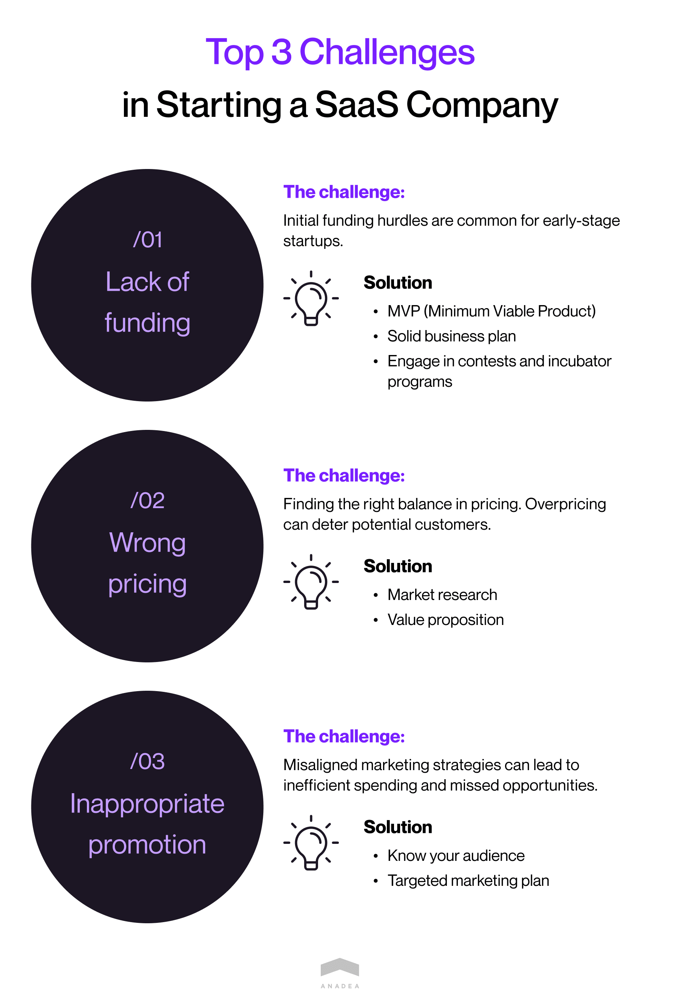

With the growing adoption of cloud technologies in the modern business world, the need for SaaS products is increasing. Namely, this fact brightly explains the desire of many entrepreneurs, startups, and well-established entities to start a SaaS business. With the right approach to the realization of such plans, it can become a very promising and profitable idea. If you are also considering starting a SaaS company as an option for your business strategy, this article where we are going to share a row of practical tips is exactly what you need.

## SaaS market overview
The [SaaS market](https://anadea.info/blog/saas-market-overview) is quickly expanding these days. And it can be associated with the benefits that this model of delivering software solutions brings.

- **Convenience**. SaaS products allow companies to avoid the necessity to keep software products on-premises.
- **Feasibility**. Businesses do not pay for software maintenance and can choose one of the pricing plans offered by a vendor. Pay-as-you-go is a commonly applied choice.
- **Scalability**. Such solutions are also known for their flexibility, they can be expanded when your business requires new changes.
- **Security**. While working with cloud technologies, developers can introduce powerful security tools that can ensure the highest security of your solution.
- **Great availability**. You can access SaaS products from any device if it is connected to the internet.

With all these advantages, it is quite natural that SaaS solutions boast popularity among businesses and those users who are looking for an app for their private purposes.

In 2022, the global SaaS market value [hit](http://grandviewresearch.com/industry-analysis/saas-market-report) the mark of over $261 billion. But is it a good idea to start a SaaS company now? The forecasts provided by experts and the general market situation look quite promising. It is [expected ](https://www.skyquestt.com/report/saas-market#:~:text=What%20is%20the%20global%20market,period%20\(2023%2D2030\).)that the industry will reach the size of $1298.92 billion by 2030. It means that the CAGR for the period from 2023 to 2030 will be over 20%.

The number of successful SaaS businesses can also prove the healthy state of the industry. Among them, we can name well-known, Adobe Inc (as of July 2023, its market cap is around $234 billion), Salesforce Inc (as of July 2023, its market capitalization is over $223 billion), and Intuit Inc (its capitalization is around $135 billion).

## How to identify a market need?
If you have ever looked for answers to questions about [how to create a SaaS product](https://anadea.info/for-clients/before-you-start/how-to-build-a-saas-product), you probably know that one of the main factors of success is offering a solution that can satisfy the existing market requirements and demands.

But here the main task is to detect the right issues and business aspects that you are going to address with your solution. We’ve prepared for you a list of strategies and approaches that will help you to correctly identify a market need.

1. **Analyze the products offered by competitors.** Thanks to conducting market research you will see what solutions already exist, whether users like them, what and how can be improved. It will be helpful to read the reviews written by users.

2. **Define your target group.** You will need to clearly understand who and when will use your product. When you plan to launch a solution for businesses, you still can detect their peculiarities and highlight the specificity that will allow you to focus on their particular needs.

3. **Conduct interviews and surveys.** When you already know who will be the target audience of your solution, you can communicate with potential users. It will help to better understand what they want to get if they choose your solution.

4. **Try to narrow your niche.** Though the possibility to launch a software product for a wide audience may seem to be a very appealing option, there are some pitfalls. It is rather unrealistic that everyone in the market has the same demands and expectations. That’s why it may be sensible to choose a narrower group but to be sure that the offered solution will directly address its needs.

Let’s have a look at a couple of examples.

**Figma** is a popular design SaaS product that offers a wide range of tools for creating unique software solutions. One of the key factors of its success is that it can be used by a lot of people within the company. It is rather simple to use and it focuses on collaborations. That's exactly what businesses want to have today. With Figma, even those people who do not have highly developed skills in design can create attractive interfaces. But professional designers also like this platform as it lets them deliver really amazing solutions.

Another good case is **Slack**. It is highly likely that you at your company also use it. It is well-suited for businesses thanks to the provided possibility to customize its features for their specific needs. Moreover, it is possible to integrate Slack with a row of productivity tools such as Trello or Google Drive. Such integrations help to facilitate a lot of tasks for employees as they can access a lot of tools in one place. Businesses today highly value optimization. And Slack can offer it to them.

## How to develop your SaaS idea
When you already have a general understanding of the issues that you want to address with your product, it’s high time to focus on the product itself and proceed to the stage of ideation. Now it will be crucial to make a decision on how your software will solve the set tasks.
To facilitate this step for you, we have a couple of tips.

1. **Brainstorming**. It will be great to organize brainstorming with your team. Every voice and every opinion should be highly appreciated here. Sometimes even the boldest thoughts can turn out to be the most appropriate ones.

2. **Business plan.** There are several approaches to composing a [SaaS business plan](https://anadea.info/blog/saas-business-plan-guide). A traditional one presupposes creating a document that will contain 30-50 pages of detailed information, including market analysis, product description, mission and vision, long-term goals, etc. But we offer you to consider the option of preparing a lean business plan. Here you can forget about such volumes. Your task will be to focus on values and try to keep your plan as short as possible. In a lean business plan, you need to indicate your business identity, problems that are worth solving, solutions, target market, competitors, sales channels, marketing activities, revenue, expenses, milestones, team, key roles, partners, and resources. When you have a clear understanding of the direction in which you want to move, it will be easier for you to go from one step to another in your project realization.

3. **Idea validation**. The typical process of idea validation includes defining goals, developing a hypothesis, and conducting experiments. In those cases when you are going to launch a software product, it will be sensible to gather feedback from end-users. It means that you need to demonstrate to them the idea of your project and let them share their opinion. By performing your own research, building a prototype, and asking potential users to test it, you can make sure that your chances to achieve success are high enough to continue working on your project realization.

## Building a SaaS product
After choosing the best idea for your project, it’s time to proceed to product development. Starting a SaaS company can require heavy investment from your side. It means that if it is possible, it will be very sensible to minimize the risks of financial losses. That’s why we always recommend building an MVP before starting the development of a full-scale software product. Actually, it can be viewed as one of the steps of idea validation.

An MVP (minimum viable product) can be explained as a simplified version of the product that you are going to launch. Thanks to building a [SaaS MVP](https://anadea.info/blog/how-to-create-saas-mvp) that will have a limited set of features, you will be able to receive feedback from early users. Their opinion can become a good foundation for your decision on the feasibility of continuing to create a SaaS product. If you see that users are not interested in your solution, you can change the concept without risks to lose all the money that you were ready to invest in the development of your product.

**The key benefits of building an MVP when you are planning to start a SaaS business:**

- It allows you to **test your idea** rather quickly as it will take significantly less time to create an MVP than to develop a full-scale solution.

- Your **financial risks are lower** as it is cheaper to create an MVP than a product with a whole set of features.

- An MVP can help you to better **present your project to investors** and successfully raise funds.

Develop an MVP

Before building an MVP, you will need to choose the core features of the solution that will be designed. This set of features should include only the most important functionality that will help users to understand the main idea of your product.

After getting familiarized with your solution, users will be able to provide you with their feedback. It is valuable not only for estimating the feasibility of your project but also for understanding what can be enhanced in the next version of your software product.

When you see that you have a product that users will like, you can proceed to build your software with the whole set of features.

### How to start a SaaS company: Legal and financial considerations
It doesn’t matter what type of business you are going to build, you always should remember the related legal aspects. The key points that you will need to think about first of all (and maybe even get a consultation with lawyers):

- Warranty;
- Liabilities;
- Data security;
- Privacy policy;
- Intellectual property.

You also need to prepare a row of documents such as, for example, Terms of Service, and Master Services Agreement.

Another point to bear in mind while thinking about how to launch a SaaS product is the way of getting funding. There are different approaches to financing your business. The most popular of them are the following ones:

- **Venture capital**. In this case, you will get funding from investors and provide them with an equity stake in exchange for their financial support.
- **Angel investors**. These investors provide funds to small businesses and get a minority stake.
- **Revenue-based financing**. This model presupposes that at the moment of receiving funding, you will agree to share a part of your future revenue every month. These payments will be conducted till the moment when the loan amount is paid.
- **Incubators and accelerators**. Incubators usually work with startups at the earliest stages and help them not only by proving funds but also by offering different consultations, training sessions, and other types of support. Accelerators help later-stage startups to grow and develop. They offer fixed-term funding opportunities, as well as mentorship programs.

There are also alternative methods of financing projects like crowdfunding, contests, and governmental support.

Getting funds is very important. But managing costs can be even more important. In the initial stages, the highest costs will be related to software product development. If you decide to work with a software development company and choose Anadea as your IT partner, we will estimate your project costs and you will be able to plan your budget in advance. Proper planning will help you to avoid the necessity to freeze your project or reduce the complexity of its features due to a lack of funding.

### The role of branding and marketing
Today when the market competition is extremely high. You need to do your best to make your project stay visible and attractive to users. And here is when marketing will help you.

You need to make sure that your target audience will have the possibility to get familiarized with your product. To do it, you will have to choose the right go-to-market strategy. It should be elaborated based on the specificity of your product, your brand identity, and the target audience. There aren’t any universal strategies that will be suitable in every case. That’s why even the best marketing specialists won’t be able to provide any recommendations without studying your case.

Among the top things to remember we should mention the following points:

- **Advertising channels**. You should detect those ones that are the most popular among your target audience.
- **SEO and content marketing**. You can share valuable insights to attract users’ attention to your offer.
- **Social media marketing**. Of course, everything depends on the idea behind your project but even if you want to launch a serious business product there are such platforms as LinkedIn that unite professional communities.

### Revenue generation models
Every founder who is going to start a SaaS business wants to find the best way to get the highest profits.

There are the following options for those who are starting a SaaS company:

- **Ad-based revenue model.** This system is quite simple to implement. You need to support large traffic on your app or website which will attract advertisers. Nevertheless, you should be very careful with the number of ads as if there are too many ads it can become too irritating for users.

- **Affiliate revenue model.** This model greatly depends on the popularity of your product. It will allow you to earn money by sharing affiliate links.

- **Direct sales.** Here everything is very obvious. You will just sell your product directly to your customers.

- **Indirect sales.** In this case, you will need to find resellers who already have a big audience. And your solution will be sold as a part of their offerings.

- **Freemium model**. This model is a good choice for newcomers. And probably you’ve already heard about it while trying to understand how to launch a SaaS product for the B2C market. It presupposes that your product is offered for free but some functionality is provided on a paid basis.

- **Subscription revenue model**. This is a classical model for SaaS businesses. Your tasks will be to create and then update and modernize a software product. And clients will pay on a weekly, monthly, or yearly basis to get access to your solution.

The choice of a revenue generation model will depend on the specificity of your business and the stage of its development. And it is important to take into account a lot of factors. For example, for a business at its earliest stages, it may be quite challenging to attract advertisers. But a freemium model can be a very successful solution as it will allow new users to get familiarized with your solution without financial investment and then pay for additional functionality.

### How to measure success when you start a SaaS company
There are different approaches to measuring success. But when we are talking about business success, only personal perception won’t be enough for getting the full picture. We recommend you rely on **KPIs (Key Performance Indicators)** that will demonstrate your progress and highlight areas for improvement.

The most commonly used KPIs for SaaS companies are:

- **Monthly Recurring Revenue (MRR).** This indicator helps to track the amount of money that you get from new sales and renewals.
- **Annual Run Rate (ARR).** It is a version of MRR but you will analyze a year, not a month.
- **Churn Rate**. It shows customer attrition. In other words, it helps to understand how many customers stop using your products or services.
- **Revenue churn.** It demonstrates lost revenue.
- **Conversion rate to customer.** This is a percentage of those customers who started using a free version of your solution and then moved to the paid version.
- **Average Revenue per Account (ARPA)**. It helps companies to identify the average price points for new customers and detect those products that can bring the highest revenue.
- **Customer acquisition cost (CAC).** This KPI demonstrates how much your company needs to spend to get a new customer.

This list of KPIs for SaaS businesses is not a full one. And when you start a SaaS company, it will be useful for you to study this question in more detail. But even now you already can shape a general understanding of how you will be able to analyze and estimate the progress of your business.

You also can apply various performance tracking tools like **AppDynamics, SolarWinds AppOptics, Stackify, Datadog, New Relic,** and others. Such tools are intended for monitoring different SaaS performance parameters (like log management, infrastructure, network performance, etc.) and optimizing them.

## 3 top challenges in starting a SaaS company
Business activities are always associated with some challenges and pitfalls. Nevertheless, in those cases when you are aware of them in advance, you have the possibility to find the right strategy to overcome them.

- **Lack of funding and external capital.** That’s a typical problem for early startups. But what can you do to make your idea look more attractive to investors? First of all, you can build an MVP that will demonstrate the core idea of the project. Secondly, you can write a good business plan to show what goals you are going to reach with your solution. Moreover, you can participate in different contests and incubator programs that will help to ensure the visibility of your product.

- **Wrong pricing**. It is clear that we all want to earn as much as possible and as quickly as possible. But when you are just starting your business journey, you need to understand that you won’t be able to gain your customer base with the highest prices in the market. That's why conducting market research is a must to estimate the level of prices that will be suitable in your case.

- **Inappropriate promotion**. To decide how you need to advertise your product, you should study the interests and needs of your target audience. When you know what influencers are popular among your target group, what articles your potential users typically read, and what social media they use, it will be easier for you to compose the right plan for promoting your product.

## Our experience in building SaaS solutions
When you are looking for a team that will help you in creating your SaaS product, you should know that at Anadea, we are always at your disposal. Our portfolio already includes a row of successfully launched SaaS solutions and you can have a look at a couple of examples on our [website](https://anadea.info/services/saas-development).

One of these solutions was a web platform dubbed [TurbineHQ](https://anadea.info/projects/turbine-hq). The entrepreneur who wanted to launch this SaaS product had the aim to create a web-based tool that would help companies to eliminate huge volumes of paperwork and stop wasting precious time on it. This easy-to-use online system can replace numerous paper forms related to business schedules, staff time-off, HR records, purchase requests, and other tasks and processes.

This approach to dealing with paperwork helps to increase the productivity of employees and reduce the risks of mistakes caused by human factors. Together with our customer, we also decided to integrate the platform with Slack, Office 365, Google Services, and Zapier.

Among other features built by our team, we should also mention an email editor with templates. The content and the formatting of the templates can be easily edited and emails can be sent to employees directly from a corporate account registered on Turbine.

Moreover, thanks to the possibility of creating an employee database directly on the platform, companies can conveniently store all the information about their teams in one place.

Turbine has already handled hundreds of thousands of various business requests, orders, and claims. And we are happy to see that this solution is continuously gaining popularity thanks to its user-friendly business model and the excellent idea behind it.

See also: [Interview with Matthew Stibbe, Founder of TurbineHQ](https://anadea.info/for-clients/customers-stories/turbine)

## Conclusion
Starting a SaaS company can become a good idea for a business. But to fully enjoy all the opportunities that can be opened to you, you need to be well-prepared to build your company.

Already at the stage of ideation, it is crucial to make the right choices. That’s why all your decisions should be well-informed and made on the base of market analysis and research. You always should stay flexible and open to changes if something goes wrong. And of course, if you do not have expertise in some spheres, you shouldn't hesitate to contact professionals and cooperate with them.

At Anadea, we can help you with all the tasks related to your SaaS product. Just share your requirements with us and we will provide you with your project estimates for free.

Request a free quote
