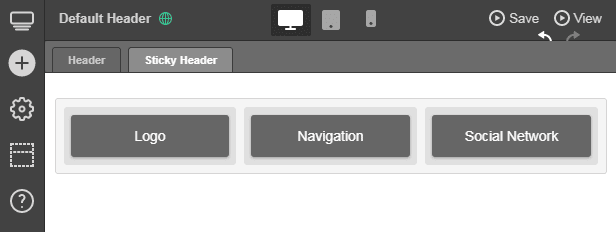
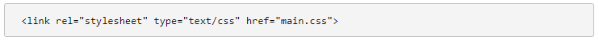

Web design trends rise and fall like waves in the sea of time. Beneath this attempt at poesy is an undeniable fact. Sure, some best practices, such as <a href="https://redstagfulfillment.com/online-store-work-across-all-devices/" target="_blank">responsive design</a>, seem like they're here to stay, but many will hit the curb in a year or two, if they haven't yet. Sticky navigation has been around for a while, but it's expected to become big this year. Should you incorporate it into your site? It depends.

<a href="https://www.smashingmagazine.com/2012/09/sticky-menus-are-quicker-to-navigate/" target="_blank">Sticky navigation</a> is one of two common forms of website navigation, the other being fixed navigation. In the latter, the menu bar is "glued" to the top of the page and moves up along with the rest of the site's content every time the user scrolls down. Sticky navigation means that the menu bar remains visible at the very top, even though the user has arrived at the bottom of the page.

Image credit: <a href="https://1stwebdesigner.com/sticky-vs-fixed-navigation-a-comparison/" rel="nofollow" target="_blank">1stWebDesigner.com</a>

## The main advantages of sticky navigation are:

* **Quicker navigation.** Because the menu remains visible, users can easily move to other parts of your website without having to scroll all the way to the very top. If your site offers long-form content, sticky navigation might help improve user experience. 
* **Visible reminders.** The constant presence of the menu bar reminds users that other pages, ones they probably need, are also available. For instance, if they have a question about your service, you can remind them to check out the FAQ that's visible on the menu. You can also invite them to share your <a href="https://blog.sharelov.com/marketers-guide-to-the-top-social-media-trends/" target="_blank">content on social media</a> by placing social icons on your menu.
* **Minimal distraction.** Although a sticky menu may indeed obscure text or images, they usually take up very little space. This means they can be used even for image-heavy pages, such as galleries, portfolios, and even <a href="https://www.shopify.com/blog/product-page-increase-conversions" target="_blank">product pages</a>.
* **Visible branding.** You could place your logo on the menu and keep it visible and readily available for recall through sticky navigation.

If you do decide to incorporate sticky navigation to your website, you can anticipate these disadvantages:

* **Constant distraction.** For some users, even small menus can distract them from their goals. The constant visibility of the menu may annoy others, especially if the site is designed to make the menu easy to find, to begin with.

* **Complex application.** Adopting sticky navigation may not be simple to do, especially if you're building your site from scratch, You may even have to reposition existing elements of the site to accommodate the menu.

## Applying sticky navigation to your website

If you do plan to incorporate sticky navigation, you can do so easily if your website was built using WordPress CMS. Before you get started, make sure <a href="https://themes.artbees.net/docs/activating-header-builder/" target="_blank">Header Builder feature is activated</a>. Once it is, just follow these steps:

1. In the WordPress CMS dashboard, go to Jupiter and click on Header Builder.

Image credit: Themes.ArtBees.com

2. Go to Settings by clicking on the cog icon located at the left part of the page.

Image credit: Themes.ArtBees.com

3. Enable the Sticky Header option and modify the settings as needed. Take note that Sticky Header Offset determines when the header transforms into a sticky header. Sticky Header Behavior decides how the sticky header behaves.

Image credit: Themes.ArtBees.com

4. Close the Settings tab and proceed to Sticky Header.

Image credit: Themes.ArtBees.com

5. Add the elements that go into your sticky menu.

Image credit: Themes.ArtBees.com

6. Preview your changes by clicking on Preview.

Image credit: Themes.ArtBees.com

### Creating your own sticky header with HTML and CSS

But what if your site was not built using WordPress? Then you'll have to <a href="https://anadea.info/blog/what-to-focus-on-when-making-a-code-review" target="_blank">code the header</a> yourself. 

1. In creating your HTML file, make sure you have the right `<!DOCTYPE html>`, `<head>`, and `<body>` tags.
2. Put a `
` tag inside another `
` tag, inside yet another `
` tag. These are important as the innermost `
` will be for the content while the rest will be for the container of the content.
3. In the second `
` tag, right before the innermost one, assign a class named "header."
4. Add text and other elements to the innermost `
` tag.

Image credit: CSSReset.com

5. For CSS, go to the `
` class nicknamed "header." Add elements as shown below.
6. Assign attributes and values to the body. Don't forget the attribute and value "position: fixed" as it keeps the `
` at the top of the window and creates a sticky header.

Image credit: CSSReset.com

7. Apply the following CSS link to the HTML header tag.

Image credit: CSSReset.com

## Examples of great sticky navigation

Considering the benefits and disadvantages of sticky navigation, you could say it's not ideal for just any type of brand. Here are three websites that did a good job of incorporating the web design trend and benefited from it.

* **Search Engine Journal**

Image credit: <a href="https://www.searchenginejournal.com/" rel="nofollow" target="_blank">Search Engine Journal</a>

The SEJ homepage feels unique and dynamic because, in part, of its sticky navigation bar. When you arrive at the SEJ homepage, you'll see their top story at the upper left, along with their logo. As you scroll down, this box moves to the right and the logo animates into view. In other pages of the site, the menu is simply sticky without the cool animation.

* **Grain & Mortar**

Image credit: <a href="http://grainandmortar.com/" rel="nofollow" target="_blank">Grain & Mortar</a>

Their sticky navigation bar offers an interesting twist to a tested formula. When you get to their homepage, you'll see a large image, as well as their logo to the left. The navigation is out of sight and won't appear until you have actually started scrolling down.

* **Novotel Hotels**

Image credit: <a href="https://novotel.accorhotels.com/" rel="nofollow" target="_blank">Novotel Hotels</a>

When you scroll down the Novotel website, you'll notice the navigation bar following you. But once you arrive at the booking details bar, this section of the site begins following you as well, along with the sticky navigation menu. This design not only makes booking rooms easier, it may also help Novotel gather more leads.

## Should you succumb to the hype?

There is no doubt that sticky navigation opens new opportunities to be creative about achieving your goals. However, you don't necessarily need it. It may not even be compatible at all for certain brands. If sticky headers will improve your site's performance and engagement and create an enhanced experience or <a href="https://anadea.info/blog/10-tips-to-improve-usability-of-your-app" target="_blank">usability for users</a>, then, by all means, adopt them. But if you're thinking of incorporating them just for aesthetics and nothing more, they may not be worth it.

 

---
*This is a guest post by **Aaron Chichioco.** Aaron is the managing editor of Designdoxa. He loves to write about online marketing, eCommerce and web design. He has a vast experience in overseeing daily operations of several online businesses since 2011. You can follow Aaron on <a href="https://twitter.com/Aaron_Chichioco" target="_blank">Twitter</a>.*
