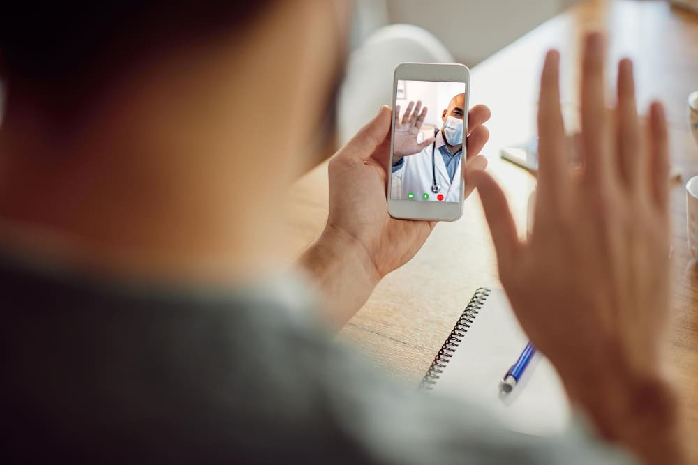
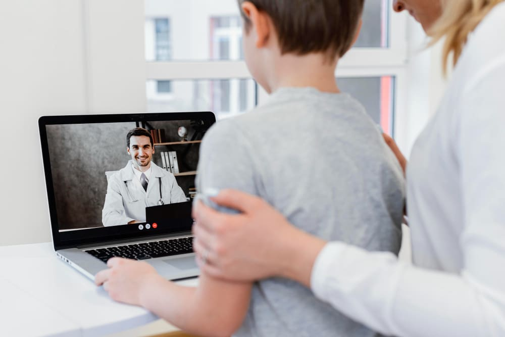

You probably witnessed that a high workload on healthcare institutions reduces the quality of healthcare services. The recent challenge was the breakthrough of the COVID-19 pandemic when the number of Covid cases grew exponentially. Still, there are digital means that are able to alleviate this burden for doctors, some of the busiest and most responsible professionals in the world. They are often struggling under the weight of too much work without the time or resources to cope. Telemedicine solutions are designed to create new ways for doctor-patient communication that are more cost and time-effective for both parties.

## What is a telemedicine and telehealth app?
It’s possible that you’ve heard the terms ‘telemedicine’ and ‘telehealth’ before in various contexts and you are not quite sure how to distinguish between them or whether they are interchangeable. Let’s draw a solid line between them and see what is what.

First of all, the terms ‘telemedicine’ and ‘telehealth’ are often used as synonymous. However, there is a slight difference between them.

__Telemedicine__ is the use of digital technologies and tools like video conferencing, instant messengers, and smart devices to provide healthcare services over a distance. This term refers specifically to the __remote delivery of clinical services__, i.e. evaluating, diagnosing, and treating patients via secure video/audio connections. The above-mentioned pandemic outbreak has shown an evident rise in the adoption of Telemedicine technology and its offerings. With telemedicine, follow-up visits, management of chronic conditions, preventive care, medication management, and specialist consultation can be provided remotely.

In its turn, __telehealth__ includes a __broader range of health-related services aimed at improving the healthcare delivery system as a whole__, such as health education and administrative activities.

Accordingly, a telemedicine app refers to the range of possibilities in the telemedicine sphere. And telehealth refers to the range of possibilities in the telehealth sphere.

## How do telemedicine apps work?
It’s necessary to mention that not every patient-doctor interaction can be replaced by telemedicine. For instance, diagnosis often requires special tools, equipment, and manipulations carried out by a doctor. Also, even if the type of interaction perfectly suits the telemedicine frame, there are a few more conditions to follow:

* a fast and stable internet connection,
* a camera able to show a detailed picture in good quality,
* a headset (ideally with noise reduction),
* appropriate surroundings for a comfortable patient-doctor interaction (no people around, a quiet place, ability to make movements or lie down, etc.).

Still, despite some limitations we mentioned, telemedicine apps are valuable means for tasks like:

* reducing healthcare costs,
* conducting time-efficient treatment,
* making access to healthcare possible or easier,
* helping with effective time management for doctors.

And this is a standard flow of how the majority of telemedicine apps process logic works:

1. A patient fills in the necessary personal information and information about their state of health and complaints. It may be, for example, a questionnaire or a chatbot that will help to decide on a relevant specialist to contact.
2. A patient books an appointment.
3. Both sides approve the appointment. Sometimes, a doctor can request additional information or clarify a patient’s medical history at this step through an app.
4. A video visit is conducted. It can be recorded if the parties agree.
5. A doctor draws conclusions and prescribes treatment. Sometimes they make another appointment or suggest a patient do it.
6. A patient pays for the session.

## Why build a Telemedicine app?
A telemedicine app is a great solution that improves the process of patient-doctor communication. Let’s see what parties get from using a telemedicine app.

### For patients
With a telemedicine solution, patients __save lots of time__ on going to the medical institution, waiting at the medical reception or information office, searching for rooms, and waiting in a queue.

Also, remote appointments reduce the risk of catching new diseases, stress, and frustration. These are important factors for such groups of risk as babies, elderly people, people with weak immune systems, women who have recently given birth, and others.

Telemedicine apps __improve patients’ experience__. They automate a lion's share of the process, every step is evident and comes in iteration. The flow is simple and stressful.

### For doctors
Doctors value telemedicine apps for zero risk of getting infected, easy data management, a well-tuned process, and less negativity from patients. Communication is well structured, efficient and can be recorded to preserve details. In case of conflicts, doctors have evidence to support their point of view. In general, doctors willingly adopt telemedicine solutions, especially when they give access to patients’ health records and a user-friendly way of managing them.

## Overcoming challenges of telemedicine
Rolling out telemedicine solutions is not a seamless process. Let’s take a glance at what challenges you may be facing during telemedicine project implementation.

### Compliance with laws and regulations
Healthcare providers - whether private or publicly funded - operate under a mountain of rules and regulations. Apps that provide these services need to safely adhere to these guidelines for the sake of patients and doctors. For insatnce, HIPAA is a USA federal law that requires the creation of national standards to protect sensitive patient health information from being disclosed. So, as you see, it isn’t as simple as texting or calling your doctor and expecting a virtual consultation whenever a patient wants one.

### Integration and administrative issues
Healthcare providers also need to ensure that the teams that respond to telehealth messages and calls know the patient's medical history if that isn’t a service provided directly by a doctor. So any telemedicine software solutions created for this purpose must align with and function alongside other healthcare apps and platforms. Systems must integrate securely and seamlessly.

### Language barriers
Sometimes people need medical help when they move to another country. This is not a rare case when patients are unable to communicate their conditions and symptoms accurately as a result of the language barrier. A good way to overcome such situations is the synchronization of translation in real-time so both the doctor and the patient can understand each other in their own native language. Such language translation systems are costly, as ideally, they should support many languages. However, this approach can safeguard against misdiagnoses, wrong prescriptions, and mismanagement.

### Organizational problems & lack of awareness
A telemedicine app also needs to sync with the doctor or medical provider calendar and other third-party or inner software systems. And that is another challenge: making sure that patients who might want to see a doctor face-to-face know that the service exists and are encouraged to use it.

### Costs of breaking into the market
It has proven useful to spend as much promoting and advertising a new service as it costs to create an app that makes the solution possible. A telehealth app needs to be easy to use and advertised well. Once patients are aware and there is sufficient evidence of social proof, use amongst patients should increase organically. In time, this should reduce the cost and resourcing impact on medical providers with fewer patients coming in for appointments.

### Patients’ resistance to change
And finally, that brings us to a challenge only experienced in countries where patients need to pay for treatment. Payers are still unwilling to pay for telemedicine services as much as they would for in-person treatment. Despite the convenience and cost savings - for the patient - many don't see as much value in telehealth appointments as they do in visits. Possible solutions are either smart advertising - demonstrating value more effectively to patients - or new payment solutions and pricing conditions - this is the final challenge that healthcare providers need to overcome for successful telehealth software rollouts.

## How much does it cost to develop a telemedicine app?
The price and cost of a telemedicine app is a frequent question when it comes to project realization. Typically, you’ll get some information from the net like “time, cost and duration will depend on the number and complexity of features, design, type of a solution (a web, native or hybrid app), timeframe and a region of outsourcing and the outsourcing company rates, and contracting model”. Sounds familiar, doesn’t it?

That answer is absolutely correct but leaves a bad taste in the mouth. It’s probably because nobody tends to go into detail and explain things. Seriously, why is it so difficult to say from a project's high-level description how much will the app cost?

The estimation itself is a complex task that requires a commitment of a development team. They decompose the features you want into smaller pieces that are more or less estimatable, and the discussion itself may take 5-10 man-hours. Still, even this doesn’t guarantee absolute accuracy, as there are too many assumptions the team makes. Add here different parameters that influence the estimation (we mentioned them above) - and it gives us a great field of options that we are not able to guess in this article. Anyway, we can tell from our experience as a <a href="https://anadea.info/solutions/medical-app-development/telemedicine-development" target="_blank">telemedicine app development company</a> that the average price for building such project may vary starting from $40,000.

## Monetization strategies for Telehealth apps
Monetization of telemedicine and telehealth apps is quite a task. First of all, these solutions are adopted by a medical organization which is a corporate client. Sure, there are doctors with private practices who also may be interested in this solution, but their share as users of an app is not so significant. That’s why there are some recommendations to increase your chances of a more efficient return on investment.

### Subscription
Let people use your app under some circumstances like specific times, or times of addressing some core features (for instance, appointments).

#### Provide different subscription plans
If your app serves medical organizations of all sizes, it’s a good practice to adjust subscription plans so that users will find what they need.

#### Leave the possibility to pay by invoice
Not always a medical institution has got a corporate card that they use for recurrent payments which subscription is. Rather often organizations prefer to pay by invoice. Leave them this opportunity.

### Freemium
Freemium is about getting people to pay for additional services or possibilities. Everyone likes comfort, don’t they? Just give people more opportunities to solve their problems in a more efficient way.

### Commission or Fees
As soon as a user makes a transaction for a doctor’s service, the app takes a % or a fixed amount. Ideally, when commissions do not become a burden for the users’ wallet. As a rule, it’s about 1-5% of the cost.

As you see, there are different monetization models available for telehealth apps. It’s just a matter of their wise application in each specific case.

## How to make a Telemedicine app step-by-step
As always, doing a project is a sequence of steps taken in the right direction.

### Step #1. Select the platform
There are options in the question of what platform to choose for a telemedicine app. The solution may be <a href="https://anadea.info/blog/does-my-business-need-mobile-app" target="_blank">web or mobile</a>. Mobile apps can be native (iOS, Android) or <a href="https://anadea.info/blog/cross-platform-mobile-development" target="_blank">cross-platform</a>. We’ve already written a lot about the pros and cons of every platform. It’s a very broad theme to cover, and for you to get a picture, we suggest you study the topic separately. But apart from tech details to consider, mind that you should pay attention to your target audience. What devices do they use more frequently and how do they tend to solve their problems? Your target geography and app functions will direct your choices.

### Step #2. Decide on design
Today’s UX/UI designs are a separate form of craft. As of today, the trendy designs are self-guided, intuitive, and user-friendly designs that provide users with clear navigation, reduce time on task fulfillment and lower stress and memorization of paths to the features.

### Step #3. Choose APIs
As telemedicine apps’ core feature is video calls, it’s a great idea to save budget by using APIs instead of building this feature from the ground up. The most frequent telemedicine APIs are VSee SDK, VIDYO, WEBRTC and Twilio. All of them support HIPAA-compliant app development.

### Step #4. Development
Development without any doubt is the most important part of the digital project. And the choice of a software development company is the essential part. By the way, we’ve got a great article about <a href="https://anadea.info/blog/software-development-company-portfolio" target="_blank">how to assess a software development company by its portfolio</a>. But still, the portfolio is only one of the options. One more is to read reviews on the company’s website. Or go to respectful listings like Clutch and Goodfrims and look at the category corresponding to your needs.

### Step #5. Quality Assurance and User Acceptance Testing
No matter how cool and proficient your development team is, bugs will appear no matter what. The best you can do is to ensure that these practices take place on your project:

* Test-driven development
* Quality Assurance (QA)
* Peer-to-peer code review
* User acceptance testing (UAT)

This approach ensures <a href="https://anadea.info/guides/code-quality" target="_blank">code quality</a>. It may seem that it takes some additional time during the project but in the end, it helps you to minimize flaws in production and time spent on fixing defects.

### Step #6. Deployment and Maintenance
Even after the release of an app, it will still require your attention - it should be regularly updated. Sometimes the app may also require improvements like following new trends, meeting users’ expectations, scale, etc.

## Wrapping up
Telemedicine technology is the way forward for bridging the physical distance between patients and healthcare specialists around the world. Digital telehealth solutions improve medical communication and reduce costs for patients and doctors, making it possible for doctors to serve more patients with the same amount of time and resources, providing more effective healthcare for everyone.


