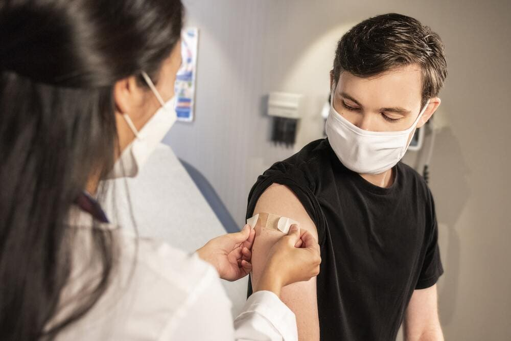
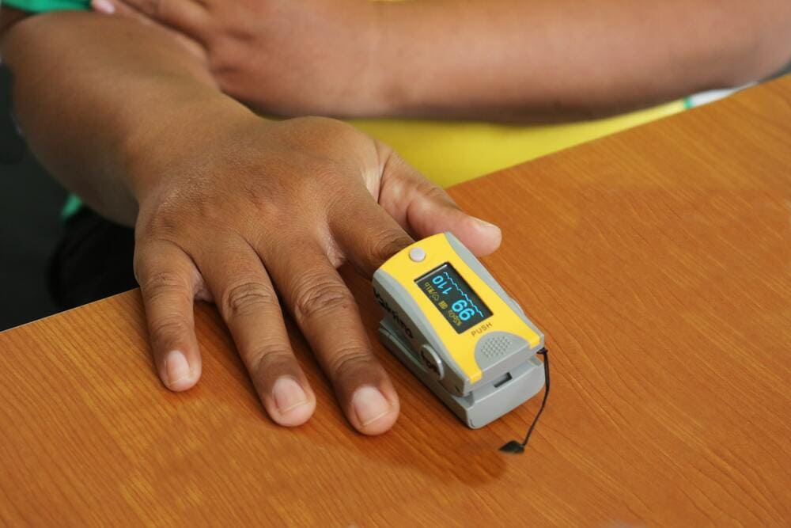
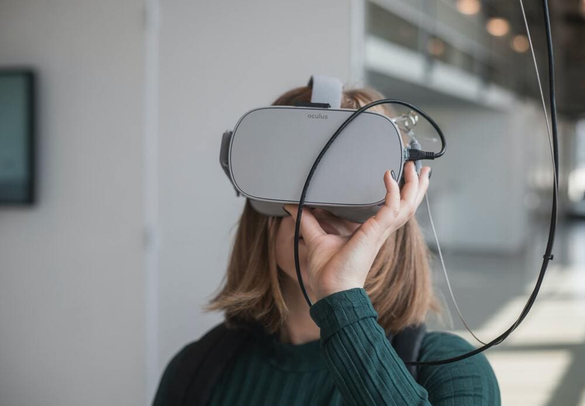

Medicine is an area where technology is always welcome. The transformation of healthcare with the help of digital technologies is happening all over the world. How do modern technologies shape the direction of <a href="https://anadea.info/solutions/medical-app-development" target="_blank">custom healthcare software development services</a> and what prospects are drawn in the future? Let's find out.

## Artificial intelligence in healthcare will cure everyone

Even for the geniuses of medicine, who possess professional intuition and experience, it may not be easy to make the right decision. This is where artificial intelligence applications in healthcare come in handy.

The capabilities of <a href="https://anadea.info/solutions/machine-learning-software-development" target="_blank">AI and machine learning</a> in healthcare are truly amazing. The volume of medical data is growing rapidly with every hour and it is almost impossible to absorb it in the short term. The examples of AI in healthcare listed further can help physicians process large data, monitor patient health, and make important clinical and prophylactic decisions.

* **Support in diagnosis.** Each medical image, examination protocol and history contains information that allows you to accurately diagnose and prescribe treatment. Unfortunately, the practice and experience of a doctor may not be enough to see the full picture and correctly diagnose the disease. Or, for example, part of some diseases, such as cancer, can be defeated if you recognize non-obvious symptoms in time and start treatment. Artificial intelligence can solve this problem.
    AI allows you to measure the physiological parameters of the patient, and with access to scientific literature and millions of case histories can quickly classify a case, relate it to similar ones, and make an accurate diagnosis for the further therapeutic process. Now AI solves relatively simple tasks: it makes a conclusion about whether there is a foreign body or pathology in the X-ray image, or whether there are cancer cells in the cytological material. Smart products for preliminary diagnostics are offered by IBM (<a href="https://en.wikipedia.org/wiki/Watson_(computer)#Healthcare" target="_blank" rel="nofollow">Watson Health</a>) and Google (<a href="https://en.wikipedia.org/wiki/DeepMind#Healthcare" target="_blank" rel="nofollow">Deepmind Health</a>).
* **Recognition of prescription errors.** One of the emerging trends in healthcare technology is the identification of prescription inaccuracy using AI. The system examines EHR data history and compares prescriptions to it in order to help doctors and nurses spot prescription errors. Therefore, AI technology can save lives by lowering the odds that patients would receive the wrong dosage or prescriptions that have negative interactions with other medications they are taking.

* **Drug development.** The journey of a new drug from laboratory to a shelf, on average, takes up to 14 years, according to the US Food and Drug Administration. In this, not all medications successfully enter the market. The difficulty of developing a new drug is that researchers must examine tens of thousands of molecules to find "candidates" for inclusion in the drug, then thoroughly test them and find a ratio of components that are effective in treating a particular disease.  In order to optimize the search for the ideal drug formula, pharmaceutical companies are introducing machine learning techniques to analyze arrays of biomedical data. The AI system conducts a deep analysis of many types of unstructured data from specialized databases and open sources on the Internet, and based on the processed data, evaluates the potential effectiveness of each candidate for drugs. Such an approach is already used by <a href="https://www.exscientia.co.uk/" rel="nofollow" target="_blank">Exscienta</a>, a drug design company.
* **Virtual nursing assistance.** A novel technique to deliver high-quality healthcare at home while cutting expenses is through the use of virtual nursing assistants. The virtual nursing assistant powered by AI technology can give patients individualized care. You may support patients with chronic diseases in tracking their health metrics, routines, and prescription intake and managing their care more autonomously by using AI-enabled robotic assistants. Additionally, you can provide doctor appointment scheduling and support 24 hours a day.
* **Surgery assistance.** Robot assistants are being used more and more and in a wider medical spectrum - from gastroenterology to cardiology. Even Google is now engaged in the development of robot-surgical equipment: together with Ethicon, they are working on a new generation of robotic assistants equipped with artificial intelligence and capable of performing minimally invasive operations. So the key advantages of AI in healthcare lie in the speed of image processing and visual clarity.

## AI vs Covid

Although it’s been years (can you believe it?) since the pandemic first stroke, technological means for fighting COVID are still relevant, staying among the current trends in healthcare. During COVID pandemic times, AI is being used in the following areas:

* **The high-speed diagnosis of COVID.** AI swaps data with hospitals’ CT scanners and analyses photos of lungs examining them for the signs of coronavirus. Due to deep learning algorithms, software develops a high level of precision.
* **Suppression of spread of misinformation.** Machine learning techniques may be used to identify sources of false information and support in curtailing the gossips and misinformation. AI can provide the most recent updates on emerging proof in diagnosis, treatment, and therapeutic results in this dynamic situation, which will diminish the fear and panic experienced by the public.
* **The preparatory work for vaccines** such as performing calculations, pinpointing the right molecules, and finding details about related diseases.

* **Forecasting the epidemic development** of COVID-19 and predicting its potential hosts and sources. Canada-based BlueDot tracks, recognizes, and reports the spread of the virus faster than the World Health Organization.
* **Providing reliable information and guidelines**, recommending protection measures, checking and monitoring symptoms, and recommending whether hospital check-in is necessary or self-isolation will be sufficient through multilingual virtual chatbots.

## Telemedicine software solutions

The telehealth industry gained momentum with the emergence of COVID due to its convenience: patients can get a professional opinion about their symptoms and get referred to a diagnostic test avoiding a visit to the hospital, which could put others at risk of becoming infected.

On the other hand, telemedicine embraced patients with chronic diseases, who need ongoing care. Finally, protecting medical staff from exposure to infected patients is another strong advantage of telemedicine. To sum up, telemedicine is extremely helpful for hospitals during COVID, however, in terms of technology and staff training, hospitals are not fully ready to make the most of it yet.

## Internet of Medical Things (IoMT)

By 2025, the size of the worldwide Internet of Things (IoT) in healthcare industry is anticipated to <a href="https://www.marketsandmarkets.com/Market-Reports/iot-healthcare-market-160082804.html" target="_blank" rel="nofollow">increase</a> from USD 72.5 billion to USD 188.2 billion. The rapid growth of the IoT in healthcare is impressive, and the industry is only at the stage of understanding what opportunities it opens up. It is already used by military servants, oil workers and other specialists in different parts of the world.

Continuous developments in the field of devices connected to the network help to improve certain medical processes, facilitate the work of medical professionals and, ultimately, improve the situation in overloaded hospitals. IoMT technology in healthcare software development also can make a significant contribution to creating more personalized and patient-centered medicine.

* **Remote health condition monitoring.** Today, the biggest potential of the internet of things in medicine is in the field of patient monitoring sensors. Such sensors in surgery, intensive care units and post-operative hospital monitor vital signs, evaluate them and instantly notify nurses, physicians and other specialists about critical changes, reducing response time. In some cases it allows patients to leave the hospital and finish their treatment at home while physicians keep monitoring their health remotely. As an example, Breather by PN Medical sends vital information to medical providers when a patient needs extra help.

* **Wearable devices.** Gadgets that continuously monitor the daily activity of patients and provide information such as heart rate, body temperature, etc. help to prevent the occurrence of conditions requiring urgent medical care. For example, implantable glucose monitoring systems allow patients with diabetes to regularly monitor indicators through the mobile app and reduce the risks of unplanned hospitalization.
* **Telemedicine.** One of the most obvious mixes of the IoT and medicine is <a href="https://anadea.info/blog/telehealth-solutions-paving-new-ways-for-medical-communication" target="_blank">telemedicine software</a>. In some cases, patients do not need to visit emergency rooms or physicians. The work of medical workers, as a rule, is performed by various devices in combination with applications. Doctors use remote monitoring to obtain more informed conclusions about a patient's health. With the help of telemedicine, costs for hospital visits are reduced.

## Blockchain in healthcare

When it comes to trends in healthcare industry, it becomes noticeable that healthcare has an interest in the blockchain. The distinctive features of blockchain are decentralized structure, transparency and consistency of the data stored in it. For now, there are three areas in the healthcare industry where the technology is used.

* **Maintenance of drug supply.** The easiest use of blockchain technology in healthcare is to track the supply chain, for example, drugs that contain narcotic substances are subject to special control. Blockchain technology in healthcare makes it possible to see to whom the drugs were transferred, to what extent they are required, protect patients from fake drugs, and so on. A real example is the MediLedger Project that already uses the prescription medicine supply chain based on the principles of blockchain and unites such giants of the pharmaceutical industry as Pfizer and Genentech.
* **Patient data storage.** Now all medical data is stored in electronic databases on the side of clinics. As users, patients do not have any mechanisms to control what is happening with their medical records. Theoretically, this information can be transferred to unknown organizations, or simply lost.
    Or to put it another way - having arrived in another country in the case of medical problems you become a mystery to doctors. If a foreigner requires an operation, the surgeon has no idea what problems the patient has experienced before. Maybe he or she has contraindications for anesthesia. All the information he needs to receive from the words of a patient who may forget something important or simply be unconscious.
    If we transfer the information to the blockchain, the patient themself can provide access to his or her data to physicians or research organizations.

__Example:__ <a href="https://anadea.info/projects/vivum-health" target="_blank">Vivum Health</a> developed a system that facilitates access to all vital patient data and leads to better medical outcomes.

* **Medical insurance.** Thanks to the impossibility to hack the system and delete data, medical insurance companies can trust medical records and define insurance risks more precisely. Blockchain also makes it easy to control modifications to insurance contracts. Blockchain-based solutions can link together all the disparate data sets which make the use of information more effective as it provides immediate access to all information created during the review and settlement of claims, as well as track all changes. China's <a href="https://www.the-digital-insurer.com/dia/zhong-blockchain-initiative/" target="_blank" rel="nofollow">ZhongAn</a> already uses the blockchain for storing insurance policies.

## A strong connection between big data and cloud computing in healthcare

The amount of medical information is growing like crazy. We are moving in a direction where all medical manipulations since the birth of a human will be stored in a single electronic database. In the United States, 80% of hospitals are already using some type of electronic health records.

Electronic medical records which include medical history, lab test results, and allergies to any medications are one example of big data in healthcare. This also includes medical research. The human reference genome (DNA sequence in a digital form) alone occupies 3GB. The volume of such data can be large and requires huge storage and computing power for processing. The question of whether to use cloud technology in healthcare or not to use is no longer relevant. The application of cloud computing is one of the ways to reap the benefits of big data in medicine. Now more attention is paid to finding the right ways of using cloud computing for healthcare.

* **Security.** Data theft, data loss, account hacking - for many years security has been seen as an obstacle to moving to the cloud. Now, in most cases, security compliance is fully implemented by the cloud provider and its technology partners.
* **Hybrid clouds.** This type of cloud unites public and private cloud infrastructures that allow balancing the load on the server, and minimize the problems with speed and accessibility.
* **Cloud analytics.** The advantages of forecasting analytics are beginning to be realized in the medical field. Big data analytics at hospitals can help predict the number of patients daily, prevent opioid abuse, and help in medical research.

## Augmented and virtual reality in healthcare becomes real

A hundred years ago people ran away from the movies when a train of the Lumiere brothers drove right up to them. Now with the help of AR and VR people can teleport across the globe or visit Mars. In its most fantastic realization, virtual reality will become completely indistinguishable from the present. This level of superiority of virtual and augmented reality is unlikely to be achievable in the near future, however, the growing interest in this technology accumulates the knowledge of visual, sound and tactile feedback, which are necessary to enhance the effect of human presence inside the system. Besides, the achievements in the VR and AR development available now are already successfully applied in medicine.

* **Practice before the operation.** Ask any cardiac surgeon and he will tell you how hard it is to imagine and describe the heart in a three-dimensional view. And it is also not static. Another example. Brain surgeons perform operations to remove tumors and aneurysms while dangerously close to the areas that control the tongue and coordinate body movements. How not to make a fatal mistake? This is where digital reality comes to the rescue.
  For example, doctors of <a href="http://virtualreality.duke.edu/news/" target="_blank" rel="nofollow">Duke University</a> came up with the idea to use a virtual map of a human brain projected through VR glasses onto the patient's head. The glasses impose a 3D model obtained from a computer tomogram and the surgeon really sees where his catheter is located.
* **Rehabilitation.** Augmented and virtual reality technologies will be increasingly used for rehabilitation purposes. It can restore many functions of the body after a serious illness, like a stroke. VR programs for rehabilitation of motor functions and cognitive disabilities offer scenarios where a patient has to perform a series of movements or control the elements of the screen. Trying to perform the proposed tasks the brain gradually restores and rebuilds the broken neural connections.
* **Treatment of mental disorders.** It turns out that treatment of fears and phobias, paranoia and post-traumatic disorders with VR is also effective. Despite the fact that the quality of graphics even in modern VR is far from photorealism, the use of virtual reality in healthcare can really convey a sense of presence and help patients.

An outstanding contribution to the development of medical VR is made by <a href="https://ict.usc.edu/profile/albert-skip-rizzo/" target="_blank" rel="nofollow">Dr. Albert "Skip" Rizzo</a>. He has been using VR in clinical research since the mid-90s, and for his treatment methods for post-traumatic stress disorder, he received an award from the American Psychological Association - one of the most influential associations of professional psychologists in the world.

## Adoption of ERP software in healthcare

Specialization of ERP systems is developing since every industry requires a solution that would take into account its specific standards and needs. Many healthcare organizations are managed similarly to businesses, and, of course, they have inventory management, supply chain, financial management, and staff management that differ from those of other businesses. How will <a href="https://anadea.info/solutions/erp-development" target="_blank">ERP software development</a> advance in the near future?

* **ERP goes to the cloud.** New versions of ERP systems are developed taking into account deployment in clouds. Cloud technologies expand the opportunities of ERP systems as they enable companies to gather (store and process) much data.
* **Demand for mobile ERP.** The increased functional capabilities of ERP systems require developers to make more user-friendly interfaces. Users of medical ERP software need a convenient system that could be used not only from workstations in the office but also on mobile devices.
* **ERP becomes intelligent.** ERP systems continue to improve to solve business tasks effectively. Intelligent ERP medical software offers something more than ordinary ERP systems. It combines cloud computing, machine learning, and intelligent analytics for providing unique data. A huge step forward is the development of ERP with AI and the tendency points out that AI will be a necessary part of healthcare ERP systems.

## The future healthcare IT trends are far more interesting

It's truly remarkable how modern advancements in science and technology have made once impossible feats achievable without any wizardry. Healthcare has especially benefited from these miracles, with the development of real-life cyborgs whose bodies are enhanced by technology, nanobots that roam through the bloodstream to eliminate harmful bacteria, and digital tattoos that can measure heart or brain activity.

The progress in medical software development has been impressive and innovative, and who knows what incredible possibilities may emerge in the next 20 years? Perhaps we'll even be able to program a Bishop-like figure, as in the "Aliens" movie. It's worth noting that just over a century ago, the idea of exchanging instant messages across the globe with millions of gigabytes of information would have seemed far-fetched to most people.

Hire healthcare software developers
