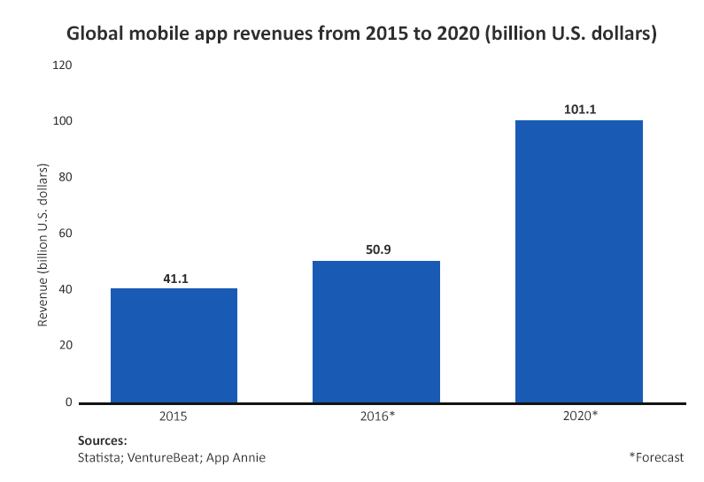
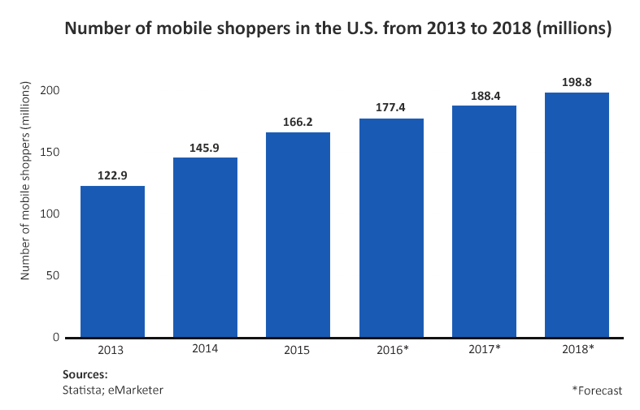

The world of eCommerce is growing with every single year. Why to spend your time and effort on going to brick and mortar stores if you have tons of international shops available night and day with a much wider choice of goods that are brought to your doorstep fast and often for free? Some online stores even deliver their clothes for you to try them on at home and only then to pay for the chosen ones. As for the unwanted pieces of clothing - you simply ship them back, also free of charge. So everything is done with the view to minimize the possible customers' inconveniences like wrong deliveries or extra costs and to encourage those uncertain people that still fear the new to make use of online shopping services.

In addition, anyone from business owners to housewives can start selling goods on the Internet mostly thanks to numerous eCommerce platforms like <a href="https://www.shopify.com/" rel="nofollow" target="_blank">Shopify</a>, <a href="https://getsocio.com/" target="_blank">Getsocio</a> or <a href="https://www.bigcommerce.com/" rel="nofollow" target="_blank">BigCommerce</a>, which don't require from entrepreneurs any programming skills whatsoever.

## What's next?

Online stores are a popular and profitable option due to their ease of setup, but in the dynamic business world, success requires constant progress. Staying ahead of competitors means adopting new trends, which not only brings financial gain but also customer appeal and loyalty.

If you already have an online store, the next logical step is to develop a mobile commerce app. While some may think a mobile-friendly website is sufficient, online shopping websites are losing popularity without an accompanying app. We have previously discussed the importance of having a mobile application for your business, but for those who remain uncertain, consider the following facts.

## Statistically speaking

People nowadays can't get by without their gadgets with round-the-clock Internet access. Moreover, 25% of smartphone owners aged 18-44 can't remember the last time they were without their phone. In 2014, 42% of all mobile sales generated by the leading 500 merchants <a href="https://www.internetretailer.com/2014/08/21/how-often-do-shoppers-use-retail-apps" rel="nofollow" target="_blank">came from mobile applications</a>. As for global mobile app revenues, they are expected to <a href="https://www.statista.com/statistics/269025/worldwide-mobile-app-revenue-forecast/" rel="nofollow" target="_blank">grow to 76.52 billion US dollars</a> in 2017. And taking into account that in the US, time spent with mobile applications now exceeds desktop web access, creating an app for your online store would be more than timely.

Mobile shopping is not only faster but also ensures a closer interaction with your customers. Novel mobile app development technologies allow for features which can help you to keep your clients interested and satisfied with your application as well as attract new followers. However, "less than 3% believe their business is at the cutting-edge when it comes to being mobile ready and a further <a href="http://internetretailing.net/2015/04/consumer-spending-on-mobile-to-top-53bn-a-year-by-2024-but-only-30-of-retailers-have-m-strategy-study-warns/" rel="nofollow" target="_blank">70% said</a> they did not currently offer a mobile website or a mobile app for consumers". Moreover, those who do, provide simple "skins" that redirect to a website and nothing more.

So to help you to find the best solution in the sphere of mCommerce and shape your app properly, here are some useful features you ought to think of including.

## Possibility to socialize

We are extremely social creatures by nature, so if you want people to be in their element while shopping, you'd better include the possibility to communicate inside your application. For example, [Dressli](https://anadea.info/projects/dressli) allows you to shop together with friends and chat inside the app in real time. This way the overall process of buying becomes more realistic and entertaining.

The number of social network users <a href="https://www.statista.com/statistics/278414/number-of-worldwide-social-network-users/" target="_blank">continues to grow</a> and people are used to exchanging tons of information they are passionate about every day. If you integrate social media platforms into your app, then if somebody comments on your goods or services, they will have a chance to share this commentary on Facebook, for example. This way they will spread the word about them. As for you, it will become an additional way to advertise your goods without any effort from your side. You can also make a hashtag for your business for all users to be able to mention your shop on their pages.

In addition, keep in mind that this notion includes not only user-user communication, but user-seller as well. Your app may have a discussion forum where you can post responses directly to your customers (either publicly or privately). Such social tools will also become a source of feedback that you can use to improve your goods and services by analyzing people's suggestions, praise and criticism. The possibility to share experiences helps to minimize uncertainty and boost trustworthiness towards your product (even in case some part of the commentaries is <a href="https://conversionxl.com/how-why-you-should-invest-in-getting-good-testimonials-w-examples/#" rel="nofollow" target="_blank">negative</a>).

## Mobile payments

One more important feature is the ability to pay with the help of the app itself. Unless people use public wifi networks, such <a href="http://www.nextgov.com/mobile/2015/11/reminder-mobile-payments-are-more-secure-your-traditional-credit-card/123734/" rel="nofollow" target="_blank">mobile money transfers are said to be more secure</a> than traditional ones. It's much faster and more convenient as well. In addition, it will make ecologically aware people happier as the amount of paper receipts and cash will reduce significantly. That's why many online applications already have the in-app payment feature.

You can go even further. If you have an offline shop, people can use your app to add items they scan with their mobile in the supermarket to a virtual shopping cart and pay when they leave, which will shorten queues and save everyone a good deal of time. The check-out process is already a lot faster in <a href="https://itunes.apple.com/us/app/walmart-app-shopping-savings/id338137227?mt=8" rel="nofollow" target="_blank">Walmart</a>, for example, as their app users are able to pay for their purchases when they visit the venue.

## Personalization

It is one of the best ways to make users love your application. If you pay attention to a set of significant parameters, it will be easier to understand what their preferences are. You can integrate a system of analytics and use the acquired information to ensure that your offers are relevant. The parameters you ought to take into consideration are quite basic but nonetheless important. They include age, gender, geolocation, recent purchase date and item. Learning the details on the last thing that was bought is actually most difficult of all, as ideally you need to know about in-app, in-store and online purchases per customer.

To obtain a comprehensive view, it's crucial to use these parameters collectively rather than selecting just one. By incorporating all three parameters - increasing sales, introducing updates, and fostering loyalty - businesses can significantly enhance their performance. For instance, users would appreciate receiving timely notifications about nearby events or receiving a free Starbucks coupon on their birthdays. In summary, personalization eliminates irrelevant information for users, rewards them on time, and enhances the app's functionality.

## Push Notifications

Most of our time smartphones are at arm's length so keeping in touch with your customers couldn't be easier. Just send them push notifications to make them interested and informed about your offers. However, it's not that simple. A growing number of users find such notifications to be annoying and distracting. The problem is that very often they lack a personal touch. I wouldn't like to receive any discounts (however big they might be) on electronic cigarettes if I don't smoke. And if I keep on getting notifications I'm not interested in, I will only become more and more irritated and disable all of them forever.

So you should know your users and do your best not to bombard them with unnecessary alerts. For example, <a href="https://www.shopspring.com/" rel="nofollow" target="_blank">Spring</a> sends one only after a user likes an item. Alternatively, you could suggest a temporary discount offer if a person browses through the same item a few times thus encouraging him/her to purchase it. Just remember that stalking is not the best strategy. If you really want this to work and get closer to a direct interaction and mutual liking, don't make your push notifications too "pushy".

## Perks

Everybody loves free cheese when it comes to shopping. With mobile eCommerce apps it becomes really easy to engage shoppers. All kinds of reward systems have taken a firm position and gained users' love. For example, a loyalty shopping app may award you with styling points for browsing, which can be further converted into cash and either spent or withdrawn.

Hardly any modern shopping app can do without bonuses, points, coupons, presents, electronic loyalty cards, etc. Moreover, numbers already show that mobile coupons, for example, <a href="https://www.slideshare.net/HubSpot/50-mobilefactsdeck62812/20-Mobile_coupons_receive10_times_higher" rel="nofollow" target="_blank">are redeemed 10 times more often</a> than those that are printed.

It is very convenient as each user has a personal profile where all the information (including rewards) rests in one place. In addition, such experience is engaging for customers. Many of us use an application more willingly and frequently if it reminds us of some game. <a href="https://itunes.apple.com/us/app/sweetgreen/id594329490?mt=8" rel="nofollow" target="_blank">Sweetgreen salad chain app</a> showcases users' progress and how close they are to the next reward. And it's a good move as the ability to visualize your current progress and goals can be pretty addictive.

## Your app, your features

[Stats show](https://www.statista.com/statistics/276819/number-of-mobile-shoppers-in-the-united-states/), and I think you can personally feel it in the air, that mobile eCommerce is gaining steam with every passing year. Gartner forecasts that by the end of 2017 the demand for mobile app development services will swell up much faster than the internal ability of IT providers to deliver them. Thus, good mobile app developers are going to become a very valuable resource. All of this makes going mobile a must for every entrepreneur who wants to succeed, and the sooner the better.

It is in your hands to avoid developing a mere "skin" and make a fully working application. To do that, you need not only to include important features (some of which were mentioned above) but try to seamlessly combine in-app and in-store experience. <a href="https://itunes.apple.com/us/app/shopkick-rewards-free-gift/id383298204?mt=8" rel="nofollow" target="_blank">Shopkick</a>, for example, rewards you with kicks each time you enter their store. As for Walmart, thanks to the geofencing technology, users are able to check in via their app upon arrival to see current sales or the state of their online order.

Unfortunately, popular eCommerce platforms (like the ones mentioned earlier) don't give you all the necessary tools to create an application that will follow popular mobile commerce trends and fulfil all your requirements. So for those of you who value their goods and cherish their customers, a good way out is to develop a custom mobile app with the help of an in-house or [an outsourced team of mobile developers](https://anadea.info/services/mobile-development). Then you can realize any idea whether it involves geofencing like Walmart does or <a href="https://www.youtube.com/watch?v=vDNzTasuYEw" rel="nofollow" target="_blank">augmented reality used in IKEA's app</a>. All you have to do is to entrust the implementation of your plans to the right web and mobile app development company.
