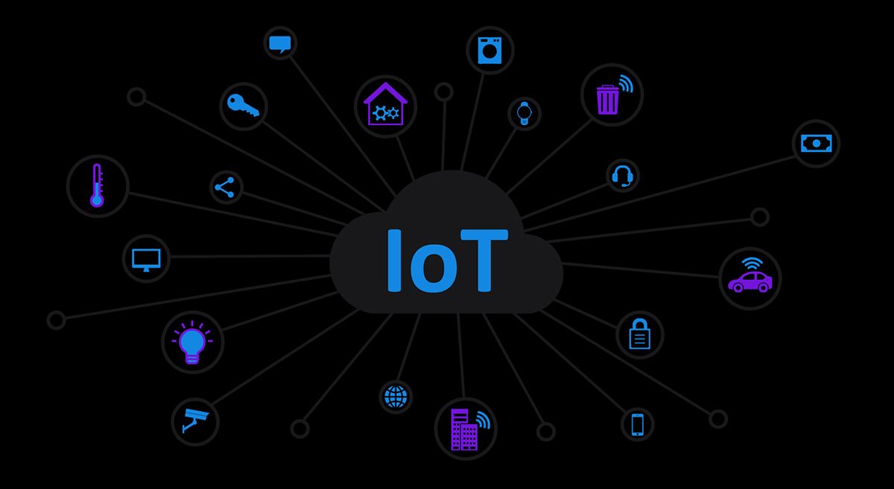

Twenty-five years ago, if you asked anyone what they thought the future would look like, you’d likely be met with answers like “Robots for companions, flying cars and regular trips to Mars.” While we’re a long way off from holidaying in the stars, we have made unimaginable headway in the field of IoT Technology.

<a href="https://www.fraud-magazine.com/article.aspx?id=4295000555" target="_blank">The IoT or ‘the Internet of Things’</a> is a system of interrelated computing devices with the ability to transfer data over a network without requiring human-to-human or human-to-computer interaction. And while most people associate it with the ‘smart home device,’ its branches extend far beyond that, and into several areas like <a href="https://anadea.info/blog/healthcare-future-integrating-medical-devices-with-health-apps" target="_blank">healthcare</a>, the automobile industry and so on.

In recent years, the deteriorating condition of our environment has been a red flag for the technology industry to take stock of the effect of current tech, and develop applications that change the environment for the better. From solar panels to smart vehicles, energy-saving devices for the home to entire cities being powered by smart devices; IoT is making the goal for a sustainable future well within our reach.

## IoT at home

Sustainability begins at home, and with the issue of the environment at the forefront of consumers’ minds; eco-conscious living is on the rise. Likewise, ethical design has gained much popularity. <a href="https://www.fivestarpainting.com/blog/2019/november/sustainable-home-decor-guide-ethical-and-eco-fri/" target="_blank">As defined by experts at Five Star Painting</a>,

> *“Ethical design means creating designs that employ moral behavior and make responsible choices with the overall intent to ‘do good’ throughout the process of creating and selling the product. These choices and behaviors cover a range of issues, such as exploitation, working conditions, fair trade, sustainable production, environmentally-safe production and manufacturing, and animal welfare.”*

With these movements becoming more widespread, technology has come through, and more consumers are opting for applications that help them reduce their carbon footprint. Some of these applications include:

### Smart bins

Not only do smart bins make taking out the trash a lot easier; their motion-detection sensors, do wonders to help consumers do their bit for the environment. Smart bins can monitor how much one is throwing away, how much they are recycling and how much energy they’re wasting. This helps people re-evaluate their spending, their consumption decisions and takes a little weight off their carbon footprint.

With sensors that alert for pick-up only when the bin is full, the implementation of smart bins also means <a href="https://hub.beesmart.city/en/solutions/smart-environment/smart-waste-management-solutions-in-smart-cities" target="_blank">fewer pick-ups and better waste management</a>. This results in less strain on petroleum and other resources for vehicles, and thus, fewer carbon dioxide emissions.

### Smart home devices

<a href="https://anadea.info/blog/how-iot-can-help-realtors" target="_blank">IoT applications in real estate</a> are numerous and promising. Yes, they play music in whichever room you’re in and turn the lights on and off — but smart home devices are now doing so much more. <a href="https://builtin.com/internet-things/iot-environment-sustainability-green-examples" target="_blank">Applications like Curb and Nest</a>, amongst others, are monitoring circuit-level electricity and consumption levels of individual devices. These applications use remote energy controls to give consumers data about which of their devices are pulling the most current and how they can conserve energy.

### Smart meters

Connected to ‘smart grids,’ <a href="https://www.businessinsider.com/smart-meters-utilities-iot-energy-water?IR=T" target="_blank">smart meters</a> are meters that record real-time energy, gas and water data of a house or building. This helps home-owners and building managers keep an eye on their usage habits and make smarter decisions to save money and reduce their carbon footprint.

### Smart lighting

Smart lighting has the potential to <a href="https://thefutureofthings.com/11159-iot-changing-face-led-lighting/" target="_blank">reduce the costs of energy by 90%</a>, all while helping the environment. IoT powered smart lights allow users to control lighting through their devices, while also analyzing energy consumption to optimize lighting usage. The sensors used in smart lighting can quickly gauge natural light conditions, and adapt to maximize energy efficiency automatically. All of this results in conservation of energy, and as an added win; a major reduction in maintenance costs.

## IoT in everyday life

Moving just slightly beyond the boundaries of our homes, these two major IoT applications do and will continue to affect every aspect of our daily lives:

### Smart cities

Governments of today are increasingly using IoT to create “smart cities.” Smart cities are urban areas that use sensors and devices to collect data that ranges from pollution levels to street lighting and water and energy consumption. With information and communication technologies, <a href="https://www.thalesgroup.com/en/markets/digital-identity-and-security/iot/inspired/smart-cities" target="_blank">governments can analyze data to take measures</a> that offset pollution, reduce municipality energy consumption, regulate and streamline trash collection and better traffic congestion and road safety.

The Internet of Things and big data hold significant potential for addressing public health challenges, and particularly sustaining the health of populations in the face of epidemic outbreaks. Through IoT enabled applications, authorities can send out messages about disease outbreaks, symptoms, vaccinations, and precautions to take.

Also, governments can use the data derived from IoT devices to identify the groups or individuals that are most at risk, better target interventions, carry out epidemic prevention and response activities. With the outbreak of COVID-19, IoT based systems and robots are being used for <a href="https://www.smartcitiesworld.net/news/news/how-5g-powered-robots-are-helping-china-fight-coronavirus-5154" target="_blank">disease prevention inspections, disinfection and other anti-virus measures</a>.

### Smart commuting options

A few years ago, a car completely on autopilot still seemed like the stuff of fiction. Now, <a href="https://www.tesla.com/autopilot" target="_blank">Tesla’s autopilot feature</a> (that still requires active driver supervision) allows cars to steer, accelerate and brake automatically within their own lanes. The potential with IoT and the automobile industry is exciting, seeing as vehicles are, <a href="https://www.ibm.com/business-operations/industries/automotive" target="_blank">as IBM puts it</a>, “moving data centers, connected inside and out, to traffic, weather and travel conditions.”

With data like this, smart cars can change how we travel, what insurance coverage we should opt for, how we track our energy consumption and how we can change those habits. Electric cars especially are a huge leap towards a sustainable future, wasting less energy and of course having no emissions. The key to making them even more sustainable though is to ensure that the sources they get their electricity from are sustainable too — like solar panels, wind energy, etc.

Here, it is worth noting that while millennials seem to be the champions of the environmental cause, <a href="https://www.truecar.com/blog/which-generation-is-going-green/" target="_blank">a study by TrueCar</a> shows that they aren’t the ones investing in bigger changes like eco-friendly cars. While millennials might have a more sustainable lifestyle and are definitely the ones holding onto the sentiment, it’s actually Gen X buying the most Electric Vehicles at 39.8% and investing in green vehicles from Electric, Hybrid, Plug-in, and Fuel Cell vehicles. Millennials aren’t too far behind though at 34.9%, and the difference can be attributed to the fact that Gen X tends to have more spending power than the younger millennial generation. Whatever the case, we’re just happy everyone’s on board with a greener way to get to work.

Another smart commuting option is carpooling. While carpooling itself is not a new concept, companies like <a href="https://citymapper.com/company" target="_blank">United Kingdom-based CityMapper</a> are changing the way it happens. With a ride-sharing application, they use the “power of open data, mobile, and payment technology to make transport sustainable and hassle-free” and reduce traffic congestion and the burden of pollution on the environment.

With everything from smart lighting to smart cars and even smart dustbins, IoT home devices are changing the way we live. Convenience aside, these new technologies are bringing us closer to the goal of a truly sustainable future with no compromise on technological advancement. The onus is both on companies to find even more sustainable applications of IoT and on us to adopt them, because it’s never been easier to join the climate cause — right from the comfort of our own homes.
