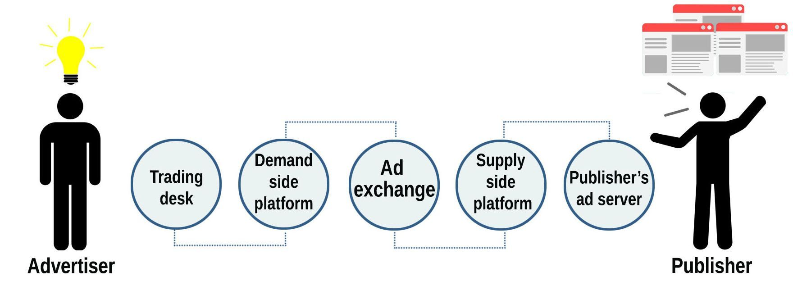

Online advertising has turned into something trivial for us. We receive advertisements by email, see them on YouTube, social networks, online shops, etc. We take internet ads as they are and just notice the things that they try to sell us. However, have you ever wondered what mechanism drives online advertisements and how does digital advertising work? It's hard to believe, but there's a huge advertising empire behind that slim yellow line and pop-up ads on YouTube. Today, we'll take a close look at an extensive tech system that works for internet advertising and delivers ads to our screens.

## How online advertising works

The process starts when the user comes to one of the publisher's websites, i.e. a website that offers ad space for sale or, as they call it, advertising inventory. These web pages are connected to real time bidding system (RTB). The website's server creates an impression request that contains information about the user (e.g. gender, age, region, recently visited pages, OS) and sends it to an ad server.

The ad server allows selling ad inventory, including direct sales. If there are prepaid ads, the publisher's website gets the ad content from the ad server. Otherwise, the server sends a request for bid to an ad exchange.

The ad exchange gets the content request and can communicate with other services to gather more info about the user. Based on the collected data, it filters the ad offers and conducts an auction. The highest bid wins. The auctions are often held using the second-price auction model. In this case, the highest bid wins but the winner pays the price equal to the second-highest bid plus $0.01 or other predetermined amount.

The winner's ad content appears on the page being viewed by the user. The entire process of sending the request and receiving the ad content takes place within 100ms, which is insanely fast.

All the user interactions with the ad (such as watching the video, following the link, ignoring or blocking ads) are tracked and their effectiveness is measured. This allows advertisers to customize target audience and see what kind of consumer's response turns into sales. Based on this information, the system calculates conversion rates.

This is how a simplified web advertising process looks like. Let's see how it goes from the side of advertisers and publishers.

### The advertiser's point of view

When starting an advertising campaign, the advertiser decides on the target audience, advertising budget, other necessary parameters and puts this data in a trading desk. Trading desk is a service that helps advertisers with audience buying and usually deals with several buyers of the ad spaces, called demand side platforms (DSP). On trading desks, online advertisers can set parameters for displaying their ads and target their audiences using the data obtained through customer data providers, commonly referred as data management platforms.

Using the data entered by advertiser, the DSP places the bid on an ad exchange platform and sets its price. When an ad request with a matching target audience appears, the offer takes part in an auction. If it wins, the ad goes to the user's browser.

The DSP also allows you to buy remnant ad inventory at low prices, which is beneficial for both sides.

### The publisher's point of view

Publisher puts an offer with his inventory on the ad server. Through a special service named supply side platform (SSP), the ad server can perform direct sales of the ad space or conduct auctions for the ad content. The ad server tracks ad events and provides reports on every ad view on the network.

To sum it up, let's imagine that there is a publisher, who has an available space for ads on his site and an advertiser who is searching for a place to display his ad. We also assume that the publisher's offer of ad space for sale and the advertiser's ad request suit each other in terms of targeting paramaters (and there is no advertisers who can offer a higher bid for the same ad space). Here are the key points they will go through to be matched by real time bidding system and they will pass all the way within just a few milliseconds:

## Primary services that RTB members provide

### Ad server

1. **Forecasting** - tracking the number of available ad spaces:
   * estimating inventory for a specific target audience;
   * the estimation is based on 12-month history to ensure the best accuracy;
   * taking seasonal fluctuations into account;
   * measuring differences between the actual and estimated traffic.
2. **Targeting:**
   * organizing users by content, geolocation, technologies (OS), age, gender etc.;
   * forming the rules of selecting target audience and saving them as a template to be used later.
3. **Delivery** - optimization of the chosen advertising logic to improve the campaign performance:
   * carrying out an advertising campaign in accordance with the business rules based on click-throughs and target coverage;
   * options for deep targeting and frequency adjustments;
   * providing the ability to use achieved results in order to fine-tune your ad campaign on the go.
4. **Reporting** - ability to use data to make decisions:
   * output of statistical data on CPM (cost of 1000 displays of your ad to potential customers), number of requests, etc.;
   * providing summary information for different time periods;
   * summarizing data about partners-buyers and advertisers' activities;
   * email reports and customizable schedule;
   * setting up the report format;
   * action tracking for a specified advertiser or campaign.
5. **Usability** - adaptive and handy interface.
6. **Platform:**
   * API for easy integration with third-party platforms;
   * 24/7 tech support;
   * built-in integration with some of leading third-party platforms.

### Supply side platform

1. **Yield optimization** - increasing incomes without losing time:
   * access to all leading DSP platforms;
   * integration of the customer's existing network solutions and dozens of pre-integrated networks;
   * running a single auction for all connected DSP;
   * analysis and evaluation of the customer's inventory.
2. **Reporting:**
   * setting up reports that allow you to track income, CPM, requests, target audience, calculate ratings and monitor their dynamics;
   * visualizing reports in graphical form.
3. **Ad quality safeguards and tools:**
   * control and protection from suspicious third-party suppliers;
   * managing channel conflicts and setting up various content filters;
   * blocking of banned ads.
4. **Usability:**
   * multi-user support;
   * easy navigation.
5. **Flexible selling models:**
   * selling top advertising spots at a premium price;
   * ability to choose the sales model;
   * option to prioritize specific deals depending on the price or strategic indicators.

### Demand side platform
1. **RTB-bits** - storage of ad requests and their bids.
2. **Single system - multiple inventories** - accessing multiple SSPs.
3. **Campaign management** - centralized tool for managing ad campaigns.
4. **Reporting** - reporting on ad views through all integrated resources.
5. **Data analytics** - ability to optimize the budget of ad campaigns in real-time.

### Ad exchange
1. **Reporting** - the same as in SSP.
2. **Ad quality safeguards and tools** - the same as in SSP.
3. **Pricing controls** - searching the right price for maximization:
   * creating a package of ad spaces according to the category and size of advertising content, position on the page or other targeted criteria;
   * setting maximum price limit;
   * monitoring of the correlation between the level of earnings and the max price, adjusting the price respectively.
4. **Usability** - the same as in SSP.
5. **Flexible selling models** - the same as in SSP.

### Data management platform
1. **Data collection** - gathering data about users and their actions in the web.
2. **Finding segments** - data processing and grouping in different categories.
3. **Sending instructions** - reports and income request instructions generation.

## Closing thoughts

There is a thriving online advertising industry with the ad companies like Epom, Adtapsy, Supersonic, Loop Me and Inneractive. Some of them specialize in services that encompass the entire online advertising ecosystem, others focus on its specific parts. Anyway, to work successfully, every part should communicate with other components of the ecosystem and not only within one particular company. The success in this case is based on the expansion of the market and growth of demand and supply.

The advertiser increases the reach of the campaign by allocating offers to several DSPs (through the trading desk) that interact with multiple SSPs. With the help of the reports about advertising events, the ad campaign can be edited in real time. The advertiser can adjust his target audience by setting the appropriate parameters, such as gender, age, region, view time, users' browsing history, content displayed on the page, etc.

The publishers, in their turn, win by getting the highest price from advertisers as well as from the guaranteed sale of their advertising inventory - even if there is no ads for the target audience, these spaces will be sold at reduced rates.

As you see, online advertisement is much more than just a paper attached to the notice board nowadays. It's a big and complex system that never rests. Within vanishingly fast 100ms, so many processes occur that you can barely imagine it. And try to pay no mind to the fact that the advertisers track all your actions when you view web ads.

Online advertising business will always be on demand, that's why it evolves so quickly. I guess, it's one of the best ideas for an IT startup. Now, you saw how online ads work on the inside. If you'd like to create your own advertising service or tool, [contact us](/contacts) and we'll help you bring your vision to life!
