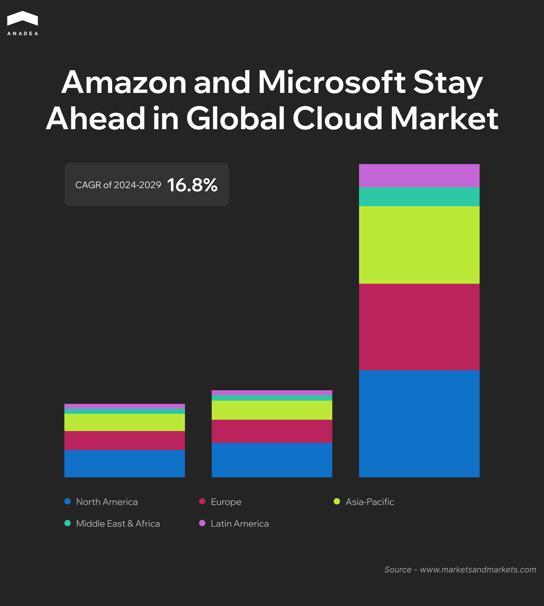
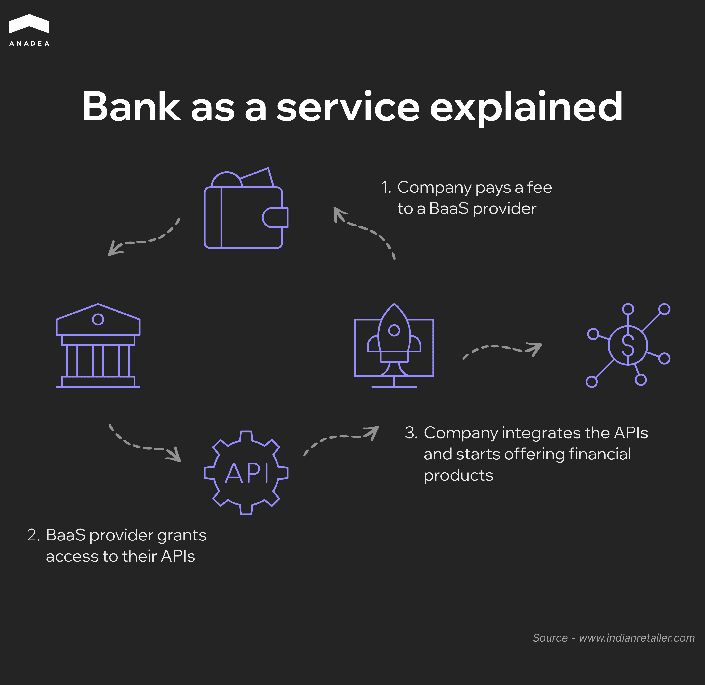

[Fintech](https://anadea.info/solutions/fintech-software-development) has been gradually changing the world of finance over the last few decades. Traditional banking institutions are not the only providers of financial services today as the competition from the side of tech startups is gaining momentum. These services themselves as well as the ways of their delivery are gradually evolving under the influence of changing consumers’ needs and demands. Amid all these shifts, embedded finance solutions and BaaS (Banking-as-a-Service) can become the core components of the next-gen financial system. They allow businesses to offer payments, lending, and other banking services without transforming financial institutions themselves.

Finance services are not an isolated domain anymore. With the API-first approach they can easily become a part of any platform dealing in any other industry. 

In this article, we are going to talk about these new concepts in the financial landscape and discuss both the benefits and risks of their implementation.

## Embedded Finance and BaaS: What You Should Know

To begin with, let’s dive deeper into the basics of this topic.

### Embedded Finance Definition

The concept of embedded finance presupposes integrating financial services, including payments, lending, or insurance, into non-financial platforms. 

Customers are not expected to visit a bank or turn to a separate financial service provider. With embedded finance, businesses can offer financial products directly within their existing user experience. 

Today there are quite a lot of widely known examples of this concept implementation. For instance, there are food delivery apps like Uber Eats and Grubhub that offer instant payouts to drivers. Another example is e-commerce platforms (such as Amazon and Alibaba) that can provide buy now, pay later (BNPL) options to shoppers.

In 2024, the global market of embedded finance was estimated to be [$115.8 billion](https://www.marketsandmarkets.com/Market-Reports/embedded-finance-market-126584658.html). By 2029, this figure is expected to reach $251.5 billion, which will reflect a CAGR of almost 17% during the period from 2025 to 2029.

The key market drivers are overall [digitalization of financial services](https://anadea.info/blog/digital-transformation-in-banking/), consumer demand for flexibility and convenience, as well as tech advancements (the use of [AI in the banking sector](https://anadea.info/blog/ai-banking-what-to-know/) is one of the key trends).

Apart from that, we should mention the growing popularity of B2B embedded finance transactions among the factors that boost market growth. Such service providers as Square and Stripe significantly facilitate numerous processes for businesses, including payroll and invoicing. Given this, not only consumers but also businesses are contributing to the expansion of this sector.

### What Is BaaS?

BaaS provides the backend infrastructure required for delivering these services. It means that businesses can rely on it without building their own banking systems. This technology powers embedded finance and it is often provided through an API-first approach.

BaaS providers fulfill the role of the back end. They take responsibility for ensuring security, regulatory compliance, and managing risks. Via this model, they can offer a wide range of financial services and products like payments, loans, deposit accounts, cards, etc.

Both traditional banks and pure BaaS providers can deliver banking services, systems, and functionality to third-party companies that want to develop their own services.

## Perks of the API-first Approach

Unlike traditional integration methods, where APIs are a secondary element, they are core components of the Banking-as-a-Service model. 

The API-first approach focuses on designing and optimizing APIs from the very beginning of development. This ensures that financial services stay flexible, scalable, and easy to integrate with other systems.

APIs enable seamless interaction between businesses, and financial service providers and greatly simplify the process of embedding banking features while maintaining security and compliance.

Embracing an API-first strategy encourages collaboration and data sharing, which can become a solid foundation for new business models. This approach accelerates the rise of cutting-edge financial solutions, including embedded finance, and also enhances the speed and efficiency of product development. By enabling more personalized and seamlessly integrated services, this approach ensures enhanced customer experiences and contributes to setting new standards within the industries.

## Benefits of Embedded Finance and BaaS

To better understand whether these new concepts are suitable for your business, it is necessary to analyze the advantages that they bring.

### New Revenue Streams

Traditionally, financial transactions have been the domain of banks and financial institutions. However, with new models, businesses across various industries can now generate additional revenue streams by offering and monetizing financial services. 

In this context, it doesn’t matter whether you are going to offer lending, payments, insurance, or investment products. You can earn transaction fees, interest margins, or subscription fees. 

### Fast Time-to-Market

The development of financial mobile and [web products](https://anadea.info/services/web-development) from scratch always requires significant time. Apart from that, businesses need to take care of receiving regulatory approvals. 

Embedded finance and BaaS eliminate such entrance barriers. They allow businesses to partner with licensed financial institutions and integrate ready-made banking solutions via APIs.

It means that companies can roll out their financial services without undergoing the time-consuming process of acquiring a banking license. As a result, businesses can focus on innovation and customer engagement instead of dealing with complex compliance requirements.

### Enhanced User Experience

Today consumers are accustomed to excellent financial experiences. They expect to enjoy frictionless transactions and all-in-one solutions. This drives businesses to seek innovative approaches to service delivery. The concept of embedded finance aligns perfectly with such demands. It enables businesses to meet these expectations by seamlessly incorporating financial products into their existing ecosystems.

For example, by integrating one-click payments or instant loans at checkout, companies can create a more engaging user journey for everyone. This integration not only increases customer satisfaction but also strengthens brand loyalty. It helps to keep users within a single platform for multiple financial needs.

### Global Scalability

Expansion into international markets often becomes a challenge for companies offering financial services due to differences in regulatory landscapes and banking infrastructure complexities. 

BaaS providers offer third-party companies access to financial services that comply with local regulations. This makes it easier for them to scale operations globally. With API-driven financial solutions, companies can launch in new regions without establishing local banking partnerships from scratch. Businesses can grow and adapt to different market needs much faster while maintaining a consistent financial experience for users from different corners of the world.

### Cost Savings

The development of financial infrastructure in-house is usually very costly and resource-intensive. The Banking-as-a-Service model helps to reduce these costs by providing pre-built solutions and eliminating the need for complex financial infrastructure. 

### Data-driven Insights and Advanced Personalization

By integrating financial services into their platforms, businesses can gain access to valuable customer data that can drive better decision-making. Analyzing transaction patterns, spending behaviors, and financial preferences allows them to offer personalized financial products and targeted promotions. Such data-driven insights help businesses refine their strategies and offer new convenient payment methods and other related services to their customers.



## Challenges of the API-First Approach in Finance

The adoption of an API-first approach in finance comes with a wide range of advantages. However, it is also associated with the risks that businesses must navigate. Below you can find a list of the most common challenges and the ways to mitigate them.

### Data Protection and Cybersecurity

APIs deal with sensitive financial data. This makes them very appealing targets for cyberattacks, which leads to data breaches and fraud. Unauthorized access to B2C and B2B embedded finance APIs in combination with weak security measures can be a reason for sensitive information damage.

#### How to Overcome This Challenge

* Implementation of robust authentication;
* Introduction of encryption protocols;
* Use of API gateways and rate limiting;
* Continuous monitoring and regular audits of API activity to detect suspicious behavior.

### Regulatory Compliance and Cross-border Restrictions

The use of embedded finance solutions is often related to the [open banking](https://anadea.info/blog/open-finance-vs-open-banking/#what-is-open-banking-basic-definition) model. It refers to the exchange of services and data between financial institutions and third-party providers.

Not all countries allow open financial data access. Some jurisdictions do not allow API-based banking due to local banking laws and data sovereignty concerns.

Moreover, it is vital to remember that open banking regulations like PSD2 and privacy laws like GDPR and CCPA that are in force in different jurisdictions impose strict security requirements. Non-compliant businesses can face fines and legal consequences.

#### How to Overcome This Challenge

Introduction of strong consent management practices;

* Regular updates of API security policies to comply with evolving regulations;
* Cooperation with compliance experts and regulated financial institutions in different regions;
* Research and adherence to country-specific open banking laws before service expansion;
* Implementation of geo-fencing and localized API configurations to control data access.

### Performance Issues

APIs that deal with real-time financial transactions require low latency. If they face issues with it, this can lead to slow response times, poor user experience, failed transactions, and even financial losses.

#### How to Overcome This Challenge

* Use of caching mechanisms to reduce the number of redundant API calls;
* Optimization of API requests;
* Deployment of APIs on high-performance cloud infrastructure with auto-scaling capabilities.

#### Complexity of API Integration for Traditional Banks

A lot of banks today still rely on legacy IT infrastructures and systems that were designed long before the development of new B2C and B2B embedded finance APIs. As a result, the integration of modern APIs with outdated infrastructure may become too challenging and expensive.

#### How to Overcome This Challenge

* Launch of API management platforms to bridge legacy systems with new APIs;
* Modernization of the IT infrastructure and phased API adoption;
* Education of internal teams on API maintenance and integration.

### Standardization and Interoperability

Different financial institutions may use different API standards. Due to this, businesses that work with multiple providers can face integration challenges.

#### How to Overcome This Challenge

* Adoption of commonly recognized API standards, such as REST or GraphQL;
* Implementation of API gateways to manage multiple integrations;
* Establishment of open API collaboration within the financial ecosystem to promote standardization.

### Adoption Barriers and Customer Trust

Users may have serious security concerns due to low awareness about API-powered banking. Because of that, they may hesitate to share their sensitive financial data with third-party platforms.

#### How to Overcome This Challenge

* Education of users on the benefits of this approach to delivering financial services;
* Clear explanation of security measures and data privacy policies to users;
* Obtaining explicit user consent before accessing financial data.

## Final Word

Embedded finance and Banking-as-a-Service provide market players with powerful advantages. They allow businesses to integrate financial services directly into their platforms, which unlocks new revenue streams and monetization opportunities. 

Additionally, this approach enhances user experience by delivering seamlessly integrated services that can easily scale and expand into new markets.

To offer such financial services to businesses, you need to have a reliable tech partner with relevant expertise by your side. At Anadea, we have solid experience in building different types of web, mobile, [SaaS](https://anadea.info/services/saas-development), and other solutions for clients from different industries, with banking and finance being one of our focus domains.

We do our best to stay aware of all the latest tech trends in the finance world and know what customers expect to get today. [Share your ideas with us](https://anadea.info/free-project-estimate) and our experts will find the best approach to your project realization!

Planning to offer your own embedded finance solutions?

We will help you launch unique products that will seamlessly bring financial services closer to their end users.

Get estimates
