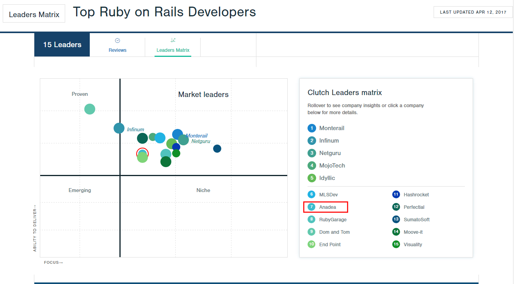

When you're looking for an outsourced Ruby on Rails developer for your project, just like with any other third-party provider, you want to find someone who has an extensive experience, easy to collaborate with, and actually does the work that meets your expectations. It may be challenging to detect an expert who truly meets all the requirements and this leaves a lot of entrepreneurs falling into well-known pitfalls associated with hiring the wrong person.

At [Anadea](https://anadea.info/), we've been in the software development industry for over 20 years and we have come to know how important it is for our clients to get a quality software product that serves their unique needs. Not only do we specialize in Ruby on Rails development and building [custom software apps for business](/solutions), we also have a proven track record in refactoring and improving software solutions created by other development teams. This gives us a clear understanding of where the issues can come from and how to develop software that will not cause unwanted headache to our clients. We've come a long way on this front, earned a high standing in custom software development and particularly in providing [Ruby on Rails development services](/services/web-development/ruby-on-rails-development).

## One of the best Ruby on Rails developers by Clutch

Clutch.co is a B2B research company that spots the best software developers in the world. The key feature of Clutch is interviewing current and former clients of each service provider and using their feedback as the primary criteria of their evaluation methodology. Clutch also takes into account characteristics of the clients, types of projects completed for them, market presence and reputation of the service provider.

All the criteria are analyzed to identify "Firms that deliver" and the outcome is the Leaders Matrix that shows the top companies in each service area. The evaluation process is ongoing and the list of best companies is frequently updated. Anadea is proud to be ranked among the leaders in [several categories](https://anadea.info/awards-achievements) on Clutch and the list of <a href="https://clutch.co/developers/ruby-rails/research" target="_blank">top Ruby on Rails developers</a> is one of them:

As a Ruby on Rails development company, Anadea scored highly in all evaluated aspects, including client reviews, experience and market presence:

One of our clients, managing director of a small software development shop in the UK, who hired our Ruby on Rails team to help with building a cloud-based solution, <a href="https://clutch.co/profile/anadea#review-112357" rel="nofollow" target="_blank">said</a>:

> The work was exemplary. I wouldn't change anything that occurred. The only reason we stopped was because we ran out of funds for the project.

Another client, founder of an Australian social website, who entrusted us to develop a Ruby on Rails web platform for organizing sports club and social events, <a href="https://clutch.co/profile/anadea#review-24389" rel="nofollow" target="_blank">shared with Clutch</a>:

> We didn't want to work with expensive Australian developers who weren't very good anymore. After testing Anadea extensively with smaller projects, we decided to hand them the full initiative. [...] I fully recommend them to anyone and have already told my friends about Anadea.

We really appreciate the support of our clients and we are proud to see ourselves in the Ruby on Rails Developers Leaders Matrix. Visit our <a href="https://clutch.co/profile/anadea" target="_blank">Clutch.co profile</a> for more client references or our [portfolio](https://anadea.info/projects) for more examples of our RoR based projects.

## What sets us apart

In addition to our expertise as a Ruby on Rails development firm, there are a multitude of other qualities that make collaborating with us a rewarding and productive experience. Our approach involves more than simply executing tasks and writing quality code that adheres to specifications. We believe that delivering exceptional work entails developing projects with purpose and meaning: contributing to the strategic process, leveraging our critical thinking abilities, offering clients valuable advice, and crafting the optimal solution within their budget constraints.

Rather than offering the cheapest prices or shortest timelines, we prioritize gaining a deep understanding of our client's objectives and providing accurate estimates for both cost and duration. Our well-organized project management approach enables us to establish strong relationships with our clients, even for large and complex projects, and make the development process transparent and convenient. Additionally, our extensive experience includes developing sophisticated backend systems for large-scale projects, handling complex and unconventional business logic, and remedying issues for projects that have encountered problems with other developers.

Our clients say that they find partnership with us comfortable, easy and enjoyable. They score high our quality of work and technical skills. They also praise us for proactivity, flexibility and clear work process with daily updates, ability to efficiently communicate with our engineers, monitor all of the elements being built and manage priorities in real time. It's no wonder that many our clients, especially those who have large scale projects requiring long term development, opt for ongoing collaboration with us instead of employing some local experts.

So, whether you want to create Ruby on Rails application from scratch or fix and enhance an existing one, we can do exactly what you need. Just [drop us a line or call us](https://anadea.info/contacts) and let's get the ball rolling!
