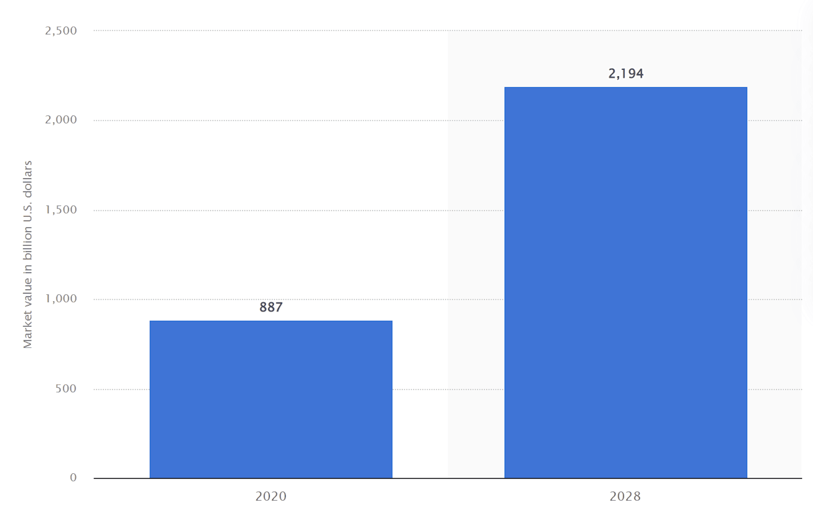
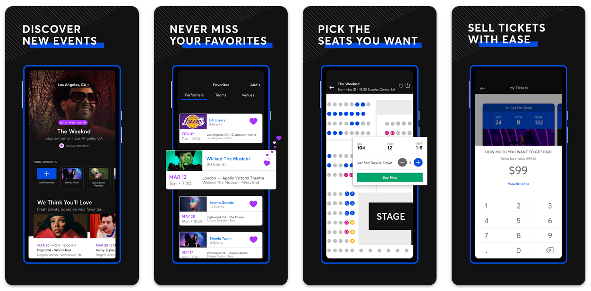
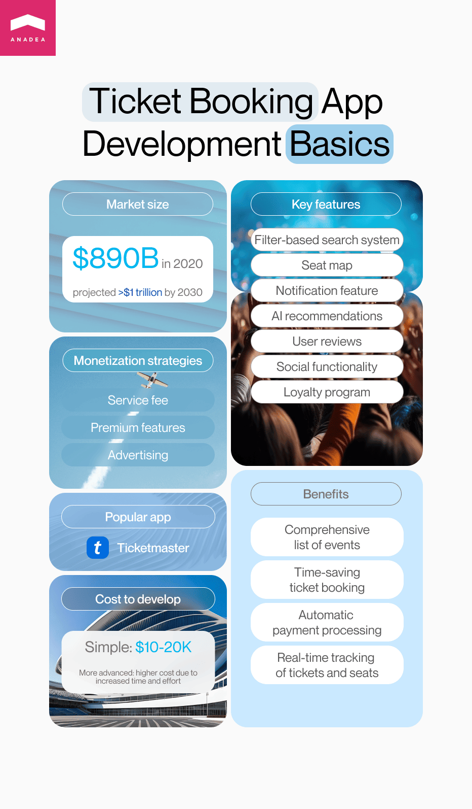

The times when people had to spend long hours standing in queues in front of ticket offices seemed to be in the past. Now to buy a ticket for a concert, sports match, or any other event, it is enough to take your smartphone out of your pocket, open your favorite ticket booking app and make a couple of taps. A similar situation can be observed in the travel industry when it comes to buying tickets for travel. Without any doubt, that's a cool alternative. Given all the benefits that these software solutions can offer to end-users and businesses, ticket booking mobile app development can become a good investment.

In this article, we offer you to have a look at the key points that you need to pay attention to if you want to build an online event booking solution that will quickly gain popularity among the target audience.

## Why invest in ticket booking app development?

Despite some obvious challenges that the event and travel industries faced during the first waves of the coronavirus pandemic in 2020 and the beginning of 2021, the situation seems to have stabilized by now.

In 2020, the volume of the global event market was at the mark of nearly $890 billion. But it is <a href="https://www.statista.com/statistics/694876/event-industry-market-size-worldwide/" target="_blank" rel="nofollow">expected</a> that this market will achieve the level of about $3 trillion in less than 10 years.

If we take a closer look at the event ticket segment, we will also see quite impressive amounts. According to the data <a href="https://www.statista.com/outlook/dmo/eservices/event-tickets/worldwide" target="_blank" rel="nofollow">posted</a> by Statista, the revenue of this segment is expected to achieve $71 billion in 2023.

__A good ticket booking app is a win-win project for both event organizers and attendees.__

- Users can get access to a comprehensive list of events that can be filtered in accordance with different parameters including time, location, and event type. Moreover, these lists can be enriched with detailed descriptions that users can carefully consider before making a final choice.

- As there is no manual processing of each request, numerous users can choose, buy, and get their tickets simultaneously. Thanks to this possibility, a lot of time can be saved.

- It is possible to accept payments without relying on any additional staff. Payments can be processed automatically via an app and transfers can directly come to a bank account of an event organizer or business owner.

- For service providers, it is quite simple to manage the process of selling tickets. They can track the number of sold tickets as well as the occupied seats in real time. Moreover, all other users can see the sold tickets and get information about available seats.

## What is a ticket booking app?

To help you better understand whether the development of a ticket sales app is a good project for you, we offer to dive deeper into the peculiarities of such a solution.

Generally speaking, the term "ticket booking app" can be referred to a mobile app that lets people search for and book tickets for various types of events (sometimes also trips). As a rule, such apps function as a bridge between event organizers, or ticketing providers, and users.

A solution of this kind is a cool alternative to the traditional way of buying tickets as in this case a person can book a ticket for any event in any corner of the globe without the necessity to leave their current location. Moreover, a lot of applications today offer access to seat maps, can provide directions on how to get to the venue as well as send notifications before the event.

Some apps provide various discounts and loyalty programs that motivate people to use these applications more frequently.

As a rule, to use an event ticket booking app, a person needs to download it from an app marketplace and create a personal account. After that, it is possible to start looking for events that seem to be interesting.

Though such apps often charge fees for their services, in general, the offered tickets can be more affordable in comparison to the level of prices that are set by traditional sellers at ticket offices.

Many projects that want to launch an application of this type have a goal to make an app like Ticketmaster. And it is not surprising at all as it is one of the most successful products in its niche. Though the app is available in many countries of the world, its highest popularity can be observed in the United States. According to a <a href="https://www.statista.com/forecasts/1338173/ticketmaster-event-tickets-brand-profile-in-the-united-states" target="_blank" rel="nofollow">study</a> conducted in the US in 2022, more than 50% of people who buy event tickets do it via this app and nearly 88% of the event attendees have heard about this brand.

Though the company itself was established in 1976 in the US, it is quite obvious that its electronic ticketing system was launched significantly later, only in 2009. The company is continuously improving its offering and trying to implement new features for improving user experiences. For example, in 2022, the company was experimenting with dynamic pricing which presupposed changing ticket prices in accordance with the ongoing demand.

Today it is the world's largest ticket marketplace.

## Top features of an event ticket app

To win the attention of potential users your app should offer something unique to them, something that will help it to stand out from the row of similar solutions. It can be an innovative design, a highly detailed search system, or a set of AI-powered features. It will be up to you to decide what will make your app special. But we highly recommend you take into account the peculiarities of your target audience, especially when you want to launch an app for a specific age group.

Below you can find some general tips and basic recommendations that will help you to make up your mind on the questions related to app features and functionality.

- The __filter-based search system__ is a must. The basic parameters for search are date, time, and destination. But you can also expand this range of parameters by adding, for example, ticket price range, age limits, etc.

- You should provide users with the possibility to __view a seat map__, available seats, as well as the number of tickets that can be purchased.

- Modern applications should have __integrated payment gateways__ that will allow users to pay for their tickets directly in the app.

- The app should have a __notification feature__. It will be a good idea to let users easily set the notification according to their needs.

- Given the modern trends in app development, it will be great to enrich your application with __AI-powered recommendations__ that will offer users a list of apps that can potentially be interesting to them.

- You can also add the functionality that will allow users to __write reviews__ on events, organizers, musicians, etc.

- __Social and communication functionality__ is another promising idea that will make users like your application. For example, you can provide users with the possibility to organize communities or group chats for sharing their opinions and discussing events. Also, you can allow people to share some information from your app directly to their social media accounts.

- A __loyalty program__ can boost interest in your app. You can offer discounts, free tickets, or other premium options to the most active ticket buyers.

As we've already mentioned, the exact set of features should be created based on the requirements and expectations of our target audience, as well as the specificity of your product. As a result, solutions of this kind may have absolutely different functionality and complexity which greatly influence the final cost of your project. The simplest project may cost around $10-20K but more advanced systems will require much more time and effort from the side of developers and, consequently, your investment should be higher.

Create an event booking app

## Technologies and tools that you can use for ticket booking app development

Of course, you can't identify a precise set of tools and technologies that will be used for building your ticket selling app, without creating a list of features and choosing the platform that your application will be compatible with. Nevertheless, based on our experience in <a href="https://anadea.info/services/mobile-development" target="_blank">mobile development services</a>, we can define the most popular tools and technologies that may be useful for building a native or cross-platform app.

- __Programming languages:__ Kotlin, Java, Objective-C, Swift, Fluffer, Xamarin, React Native
- __Backend:__ PHP, Python
- __UX/UI:__ Figma, Jetpack Compose, UIKit, SwiftUI, Anroid UI
- __Payments:__ Stripe, Paypal, Braintree
- __Push notifications:__ OneSignal, Pusher, Twilio
- __Maps:__ Google Maps API, OpenStreetMap API, Mapbox API
- __Calendar:__ Zoho, Google Calendar

Please, bear in mind that if you work with our software development team, the tech stack may be adjusted in accordance with your needs and requirements. That's why we always deeply analyze your demands at the stage of planning in order to make sure that we can offer a solution that will fully correspond to your expectations.

## How to make money by launching an event ticket booking app

Before starting a software development project (and a ticket booking app development project definitely won't be an exception) you need to think about the way to monetize it. With online event booking applications. the situation quite differs from the cases with many other types of apps. With a ticket sales app, you can't take fees for downloads. Okay, you can but this initiative may have a strong negative impact on the number of people who will be ready to use your app. However, it doesn't mean that you are limited in your earning opportunities. Vice versa, one method that is quite typical for any app that allows people to buy any products or order any services is now available to you.

- **You can take a service fee.** It can be a small percentage of the ticket price or a fixed amount that will help you to cover operating costs.
- **You can offer paid premium services or features.** For example, these options may include choosing seats in specific zones (that are in high demand) or booking tickets for some events in advance, earlier than many other people can get access to them.
- **You can also work with businesses that want to advertise their offers**. Though ads can become an excellent source of revenue, we highly recommend you think about how they will be presented in your app. It is very important to make sure that offered ads won't spoil the user experience.

## Instead of the closing word

We have rich expertise in developing various kinds of mobile apps and will be happy to help you in transforming your ideas into real solutions that will bring real value to your business.

If you are also thinking about a booking app for the travel industry, we recommend you read one of the previously published articles on our blog where we shared some valuable insights related to <a href="https://anadea.info/blog/time-to-innovate-or-how-to-create-a-viable-flight-and-hotel-booking-app" target="_blank">creating flight and hotel booking apps</a>.

Our team doesn't blindly follow the tech requirements provided by you but also can help you to improve your idea and enrich your project with new features and functionality based on modern trends and market demands. Don't hesitate to contact us in order to discuss what our developers can do for you.

Request a free quote
