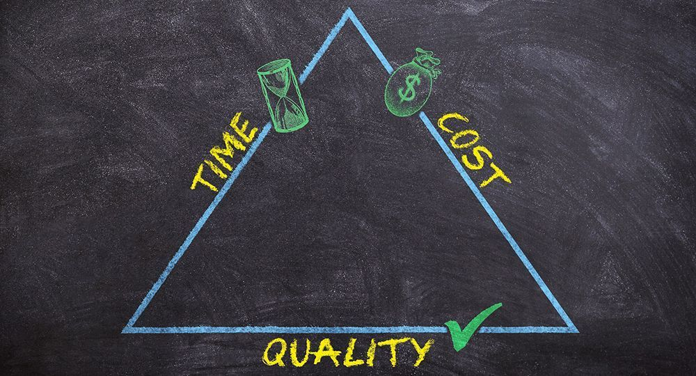
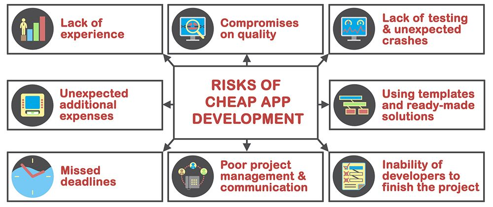

Getting an app built is an investment. Whether your audience is consumers or business users, apps are an integral part of modern life. Over a decade of innovation places high expectations on the user experience of any new app to hit the market.

Businesses know they need to set aside a budget to ensure they get an app that will meet or exceed these minimum expectations. We even created a [calculator](https://anadea.info/tools/estimate) to help companies get a sense of how much they need to budget.

Although we take a transparent approach to pricing, timescales and project management when working with clients, we know not everyone in our industry does. Some web and app development firms charge considerably more. Others charge a lot less, aiming to rush through product development so they can move onto the next paying project.

As a result, companies can be left with the bewildering *good, cheap, fast* choice:

* Do you pick expensive, with potentially protracted production timescales?
* Or do you go for a more reasonable price, which offers a realistic production process?
* Or what about the cheapest option? Some firms promise apps within a matter of a few short months.

It comes down to the time, cost, quality triangle (also known in project management as <a href="https://en.wikipedia.org/wiki/Project_management_triangle" target="_blank">triple constraint</a>).

To help companies chose the best option for them, we've made a comparison below.

## 1. Time

App development goes through several stages. From wireframe and designs, to iterative testing, creating the front and back-end, connecting the app to any databases, APIs or other services as needed, then quality testing, further iterations and changes, as needed.

<a href="https://anadea.info/services/web-development">Web development company</a> that skip some of these steps, or take shortcuts to reduce timescales throughout the process aren't doing their clients any favors. You could end with an app full of bugs. An app your users or paying customers don't want to download and use. An app that receives bad reviews on app stores, making it far less likely that new potential users will download it.

Every app comes with its own production timescale. It depends on the number of features, estimated hours - which should be illustrated in a proposal - and time for a web development firm to work with a client, communicating needs and changes throughout the project. However, a quote seems too long or too short, it probably is. Reasonable quotes should reflect the total time to build, iterate, test, improve and complete an app. Not rushing a project for a quick finish, nor dragging the work out for months and months.

## 2. Quality

Quality is a huge concern. If the end-result is an app you aren't happy with, it could take months to fix problems, or you might need to wait until you can work with a different firm to rebuild the app. Agencies that promise cheap and quick results often compromise on quality. Even if something looks nice - which is easier to achieve than ever thanks to templates - the user experience could let you down.

An app that doesn't perform as expected when it goes live represents a huge missed opportunity, potentially damaging marketing and sales growth plans, and customer relations.

Without an effective [software testing (QA)](https://anadea.info/services/quality-assurance) process, you risk delivering a poor performing app to your customers and end-users. Some IT firms even re-outsource work to external developers or other third-party agencies in other countries. We know that some of these firms and freelancers do a fantastic job. But not all. Without the ability to monitor and consistently improve outputs, you risk launching an app far below the quality threshold your business needs.

## 3. Cost

When is a bargain not a bargain?

When you pay too little for something that needs more investment to ensure you get the results you actually want. App and web development is a sector where bargains aren't always what they appear and trading between constraints is not always a good way to go. Web development firms that are up-front about costs, [that show how/where that budget](https://anadea.info/free-project-estimate) is going to be spent, are the ones that are worth working with.

Watch out for cheap app developers that promise low prices, fast results, or are quick to offer discounts. Often this leads to compromises, rushed work and expensive problems down the road. At the same time, you don't need to work with the most expensive option either. A high-price doesn't always guarantee effective results.

## Good, fast, cheap: choose wisely!

You don't want to sacrifice quality for speed or affordability, but finding a company that offers all three can seem impossible. That's where we come in.

At Anadea, we believe that you shouldn't have to compromise when it comes to your web development needs. We provide full-cycle development services, from the initial concept to the final product launch, and our team of IT specialists includes software engineers, designers, mobile developers, QA engineers, and DevOps experts.

Our approach is simple: we prioritize quality and realistic timelines, and we work closely with our clients to ensure that they get exactly what they want. Communication is key, which is why our customers have direct access to our engineers and can control the project as if they were in the same room with the team. So if you're looking for a web development firm that can offer good, fast, and cheap services without compromising on quality, look no further than Anadea! [Contact us](https://anadea.info/contacts), and we'll make whatever is on your mind real.
