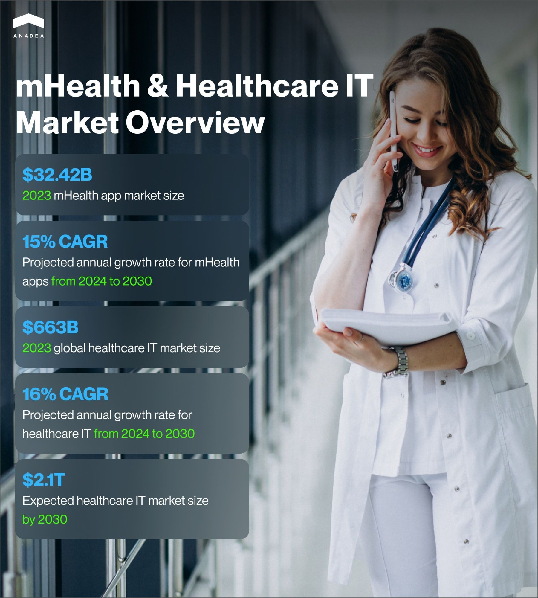
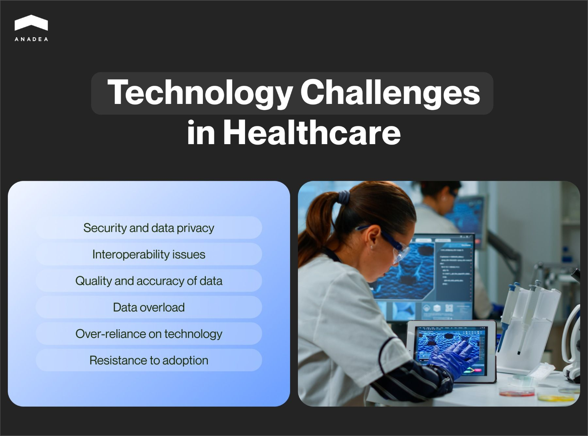
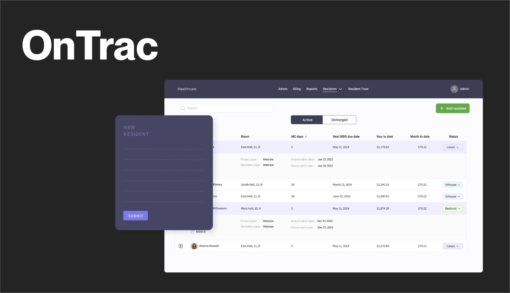
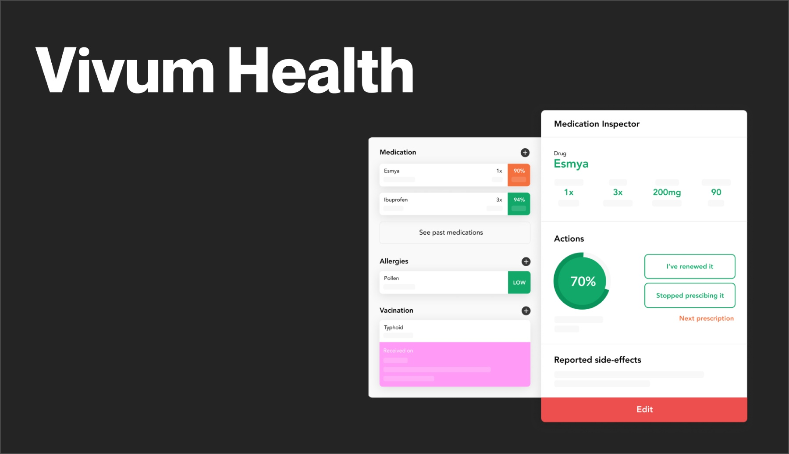

When businesses implement various digital solutions, quite often their main goal is to increase their revenue. However, when it comes to the healthcare industry, digital transformation also has a great social value. [Various apps](https://anadea.info/solutions/medical-app-development) built for this domain can help to increase the quality of medical services, enhance their accessibility, and save thousands of lives. Nevertheless, the introduction of such innovations is associated with a row of pitfalls. To address them properly, you need to be well-informed about their nature and peculiarities. And that’s exactly what we are going to discuss in this article: technology challenges in healthcare and possible solutions.

## Digitalization and innovation in the healthcare industry

In general, digital transformation-related changes that we can observe today in this domain have a huge positive impact. Already today there are a lot of software solutions designed for hospitals and medical establishments as well as advanced apps for a wide audience of consumers. With the skyrocketing demand for such products, the scale of healthcare IT challenges is growing as well.

These days, there are a lot of studies that focus on various sectors of the healthcare market. According to one of them, in 2023, the global mHealth app market [reached](https://www.grandviewresearch.com/industry-analysis/mhealth-app-market#) the size of $32.42 billion. With the expected CAGR of almost 15% for the period from 2024 to 2030, the market of mobile healthcare apps will be close to $100 billion by the end of this period.

The factors that are driving this growth are, for example, a high smartphone penetration level in many countries of the world, as well as the growing consciousness of people in the questions related to maintaining physical and mental health.

In general, the global healthcare IT market unites under one umbrella different kinds of solutions. This range includes but is not limited to systems for remote patient monitoring, medical diagnosis software, pharmacy management tools, electronic health records, and many others. In 2023, the [size](https://www.grandviewresearch.com/industry-analysis/healthcare-it-market) of this market was estimated at $663 billion. According to forecasts, it can increase up to around $2.1 trillion by 2030. This means that the projected CAGR will be close to 16% for the period from 2024 to 2030.

Today, we can notice a continuously growing number of initiatives supporting eHealth and digital transformation, as well as heavy investments in the technologically advanced healthcare IT infrastructure.

Such tendencies look quite natural given all the benefits that they can bring to the industry. Below you can find a couple of the most significant perks.

* Electronic Health Records (EHRs) can ensure improved accessibility of patient data across different healthcare providers, as well as reduce medical errors.
* Telemedicine provides access to care in remote and underserved areas.
* Solutions powered by big data and analytics can analyze vast datasets from clinical trials or real-world evidence. As a result, they can greatly assist in research.
* AI and ML tools can enable early disease detection and optimize hospital operations through predictive analytics.
* [Voice technology](https://anadea.info/blog/what-you-need-to-know-about-voice-technology-and-hipaa) helps to provide round-the-clock care and make remote consultations accessible for people with particular disabilities and impairments.
* Blockchain is used to increase the integrity and security of highly sensitive data. It also improves the transparency of many related processes.
* Healthcare management software streamlines administrative processes and reduces the burden on staff.
* Robotics can successfully improve precision in surgeries and assist in rehabilitation through robotic exoskeletons.

Of course, this is not a full list of all the advantages that IT can bring to healthcare. Nevertheless, the implementation and use of such solutions may not be completely smooth and seamless. That’s why it’s crucial to talk about possible challenges of technology in healthcare.

## Key technology challenges in healthcare

If you are planning to introduce a healthcare digital solution, it will be important for you to understand what pitfalls you can face after its implementation.

### Security and data privacy

One of the biggest challenges of using technology in healthcare is explained by the fact that the healthcare industry handles vast amounts of sensitive patient data. Due to this, medical software is often a prime target for cyberattacks. Incidents where patient data is leaked or accessed illegally are not rare. That’s why securing this data from breaches, hacking, and misuse is critical.

Moreover, Healthcare organizations must adhere to strict regulations like HIPAA in the US, GDPR in Europe, and others. Nevertheless, this can be rather difficult and costly to implement.

### Interoperability issues

Today there are a lot of healthcare systems delivered by different providers and implemented at different times. As a result, they operate in isolation from each other. This makes it difficult for them to communicate and share information seamlessly. For example, many hospitals, clinics, and labs use fully incompatible software. Moreover, there are no standardized data formats across various systems.

### Quality and accuracy of data

While talking about healthcare technology challenges, it’s impossible not to mention those related to data. Digital systems rely heavily on data input for accuracy. Poor data quality or errors can lead to incorrect diagnoses, improper treatments, or operational inefficiencies. Incorrect data entry or outdated information can lead to adverse clinical outcomes. What’s more, variability in how different healthcare providers document and input data into EHR systems can lead to gaps in patient records.

### Data overload

With solutions like EHRs, remote patient monitoring, and wearables, healthcare providers need to deal with an overwhelming amount of data. Clinicians may struggle to filter relevant information from the flood of data. Given this, hospitals and clinics need to have effective data storage, retrieval, and analysis systems to handle the influx of information.

### Over-reliance on technology

Probably this point could look quite surprising on our list of technology challenges in healthcare. Nevertheless, today we can observe not only the growing adoption of technology but the growing dependence on it. As a result, the emphasis on human judgment, empathy, and the patient-doctor relationship is gradually being reduced. This has some serious consequences, such as dehumanization and issues caused by technology failures. For example, system outages or malfunctions can disrupt healthcare delivery and put patient safety at risk.

### Resistance to adoption due to solution complexity

Healthcare professionals, particularly those used to traditional systems, may resist adopting new technologies. It may also happen when they believe that the use of new solutions can cause difficulties.

The learning curve for new technologies can be steep, especially for older staff. However, the task of development teams is to create user-friendly interfaces and implement simple navigation.

In some cases, new systems may disrupt established processes and routines during the transition phase. However, that’s the question of efficient training.

## How to deal with technology challenges in healthcare

Based on our experience, we’ve prepared a list of practical recommendations that can mitigate IT challenges in healthcare for your organization.

### Enhance data security and privacy

To do this, you need to adopt robust cybersecurity measures. For example, you can implement advanced encryption protocols, firewalls, multi-factor authentication, and regular security audits to protect sensitive patient data. It’s also important to ensure that doctors and administrative staff know how to recognize phishing attacks, use secure communication channels, and follow privacy best practices.

### Improve interoperability

We recommend you adopt standard data formats, which will allow different healthcare systems to communicate seamlessly. You can also use cloud computing to centralize and standardize data storage.

### Enhance data quality and accuracy

The application of automated data validation tools will minimize human errors in data entry and ensure accurate information in EHRs and other systems. You can also conduct regular audits and adopt standardized documentation practices.

### Provide comprehensive training and support

It is recommended to conduct workshops and training sessions to familiarize healthcare providers with new systems. A good idea would be to offer continuous support through help desks or technical teams to resolve issues. In some cases, it could be reasonable to introduce new technologies gradually. This will help to avoid overwhelming staff and give them time to adapt while maintaining productivity.

### Reduce data overload

You can simplify complex data with dashboards and visualizations. It will make it easier for clinicians to interpret and act on information. Moreover, sometimes hospitals assign dedicated teams to work with large datasets. As a result, physicians aren’t overwhelmed by non-essential information.



## How Anadea can help to overcome healthcare technology challenges

It’s quite obvious that not every healthcare provider has its own IT team. This could be simply not feasible for them. That’s why when it comes to software development and further maintenance, they turn to outsourcing. And given the importance of digital solutions in the healthcare market, it is crucial to find a reliable company with irrelevant experience. Such a tech partner should have enough expertise and knowledge not only in building medical systems but also in overcoming the challenges of using technology in healthcare.

At Anadea, we provide software-related services to companies from many domains. And healthcare is one of our focus fields. Depending on various factors and the needs of our customers, we apply different development approaches. For example, your solution can be built fully from scratch or with the use of [healthcare APIs](https://anadea.info/blog/healthcare-api). We always do our best to deeply study the requirements and expectations of our customers to deliver a solution that can efficiently address their technology issues in healthcare.

One of the products that we successfully built was [OnTrac Resident Manager](https://anadea.info/projects/on-trac). It is an eHealth platform that addresses the needs of Skilled Nursing Facilities (SNFs) and Assisted Living Facilities (ALFs).

The system is equipped with an automatic invoice generation feature. When payments are made, they are automatically integrated with invoices. OnTrac Resident Manager also generates billing reports. Moreover, the solution is enriched with a row of valuable features that were either implemented or modified by our team. For example, it has an EHR module, care plans, patient and resident census, accounting module, and others.

Another project that is important to mention is the EHR software [Vivum Health](https://anadea.info/projects/vivum-health). It is a medical data-sharing platform that is aimed at patient treatment process optimization. It helps medical staff have a clear picture of the entire treatment pathway. The platform users can get access to medical records for each patient, add patient details, track symptoms and treatment in real time, as well as view and edit medical prescriptions. Soon after its launch, the app received the Digital Health Innovation Prize 2018.

## Conclusion

Without professional support, the challenges of technology in healthcare can become quite difficult to deal with. To address them, it is vital to understand their origin, their possible consequences, and their impact on hospitals and their work with patients. Handling technology challenges in healthcare involves a combination of robust security measures, investment in scalable systems, and fostering user adoption.

By choosing the right strategic approach in this journey, healthcare providers can harness the full potential of technology to improve outcomes and their streamline operations.

Have any questions about the development or implementation of digital solutions in healthcare? Do not hesitate to contact us. Submit your inquiry via our website and get your project estimate for free.

Get in touch
