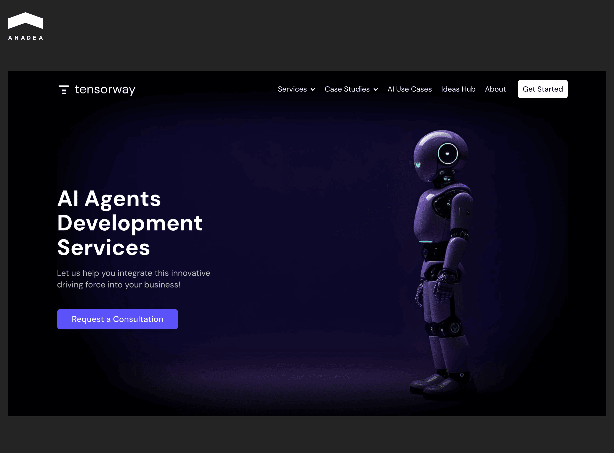
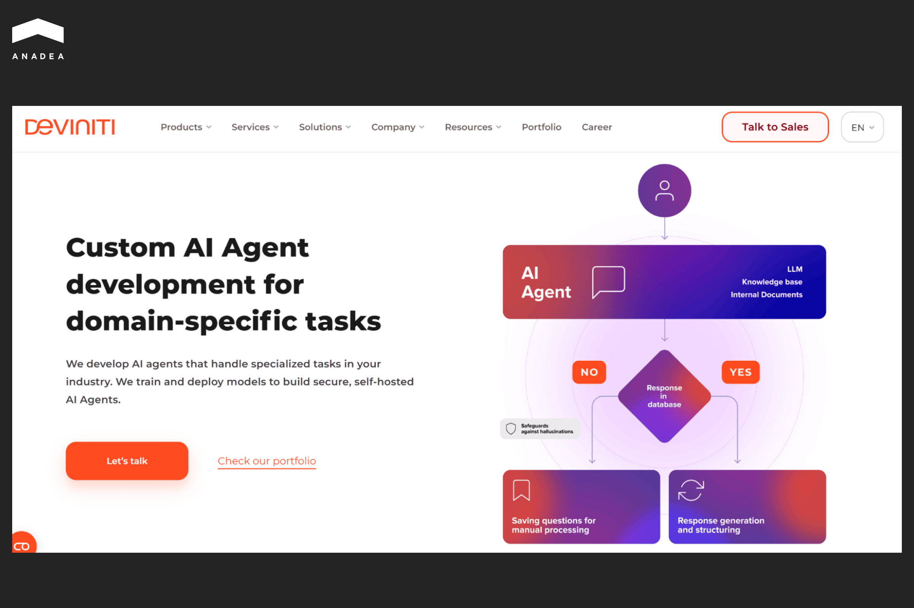
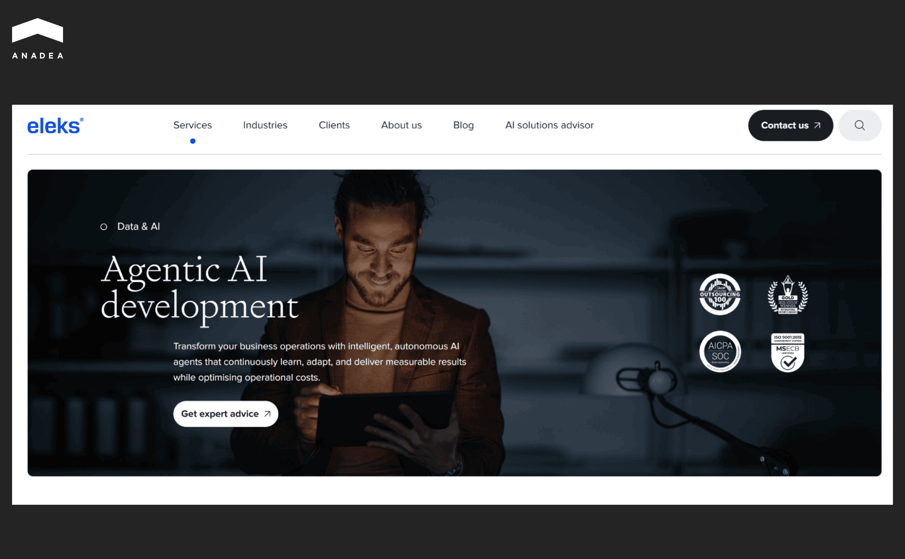
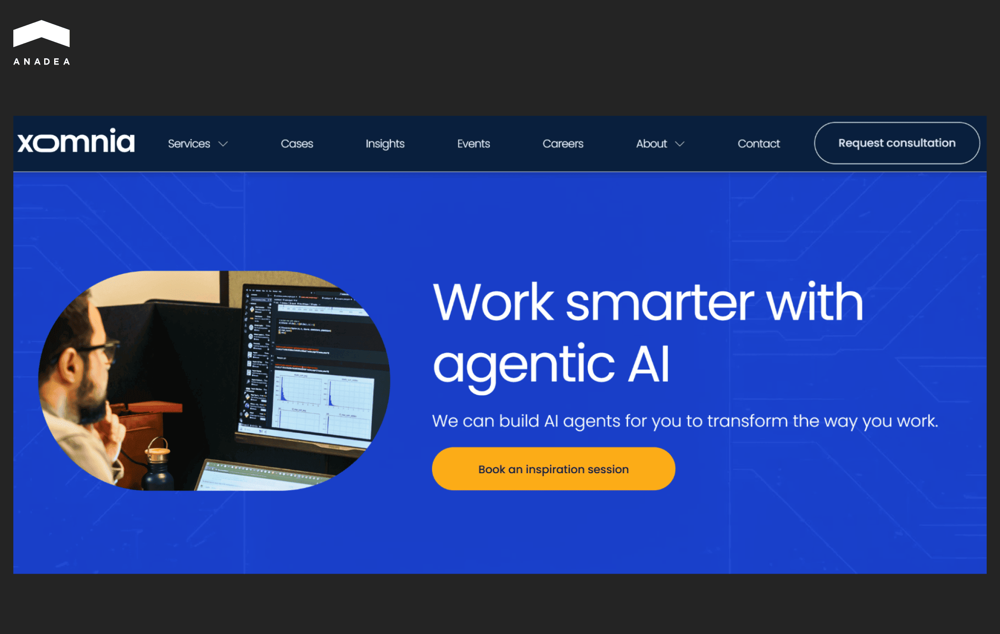
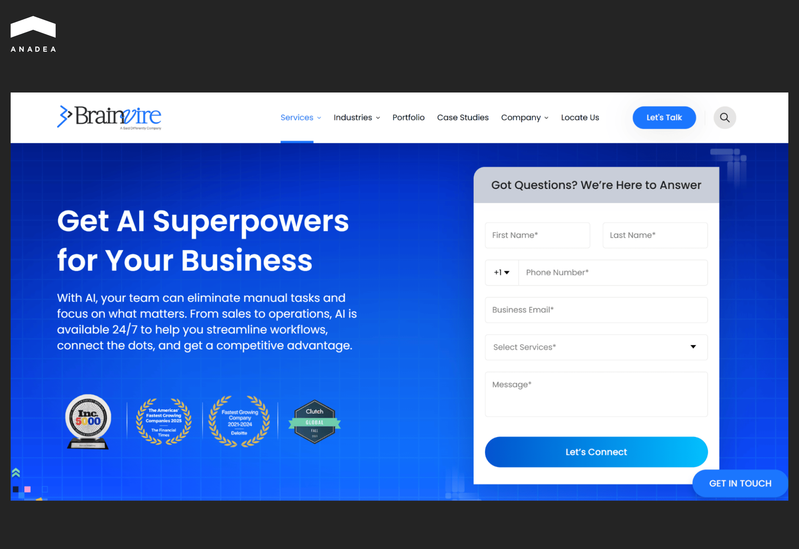

By the end of 2027, more than 40% of agentic AI initiatives are predicted to be abandoned, according to the [Gartner report](https://www.gartner.com/en/newsroom/press-releases/2025-06-25-gartner-predicts-over-40-percent-of-agentic-ai-projects-will-be-canceled-by-end-of-2027). The reasons behind such a negative trend are escalating implementation costs, undefined ROI, and insufficient risk management. Quite often, all this can be a consequence of a lack of organizational maturity and experience in executing AI-driven projects.

If you do not have relevant expertise in-house, to minimize the risk of failure, you should have a reliable tech partner by your side. 

To make the process of selecting a professional team to address your needs faster and easier, we have prepared a list of the top AI agent development companies with an outstanding reputation in the industry.

## How to Select the Best AI Agent Development Agency

The choice of the right partner for [custom AI agent development](https://anadea.info/services/custom-ai-agent-development) is an important strategic decision. Today, there are a lot of companies that offer similar services. For example, as of October 17, 2025, on Clutch, there were more than [1087 agencies](https://clutch.co/developers/artificial-intelligence?related_services=field_pp_sl_ai_agents) that provide their help with AI agent development and implementation.

To establish cooperation with the right tech team, you need to have a clear evaluation framework so that you can compare vendors based on measurable criteria. This will help you understand whether a company under consideration aligns with your business needs and technical environment. 

Here are the key aspects that you should take into account.

### Must-Have Capabilities

* Proven experience in building AI agents for your domain or use case;
* End-to-end services (from ideation to agent deployment and performance monitoring);
* Ability to integrate custom AI agents with your current data stack and security standards.
* Transparent documentation and maintainable code.

### Nice-to-Have Capabilities

* Custom LLM fine-tuning and retrieval-augmented generation (RAG) solutions;
* Built-in analytics dashboards for tracking agent performance;
* Proprietary tooling for prompt optimization;
* On-demand access to prompt engineers and MLOps teams.

### Technical Fit

You should evaluate whether the company's tech stack is compatible with your infrastructure and roadmap. Here are the technologies and tools that are usually required for custom AI agent development.

* Frameworks: LlamaIndex, Hugging Face, OpenAI SDK, Anthropic SDK, etc.;
* Integrations: APIs, webhooks, CRM/ERP connectors, workflow tools (Zapier, Slack, Notion);
* Hosting model: On-premises, private cloud, or SaaS;
* AI models: Open-source (Llama 3, Mistral) and proprietary (GPT-4, Claude, Gemini).

### Safety and Compliance Fit

AI agents often deal with highly sensitive information. Robust data protection and system governance are a must. That's why it is essential to verify that a development company follows stringent security and compliance standards.

What you should check in advance:

* Documented AI governance and safety policies;
* Compliance certifications (SOC 2, ISO 27001, GDPR readiness, compliance with HIPAA or other regulations relevant for your domain);
* Audit trails for model outputs and user interactions;
* Built-in tools for content filtering and user consent management.

### Delivery Proof

It's crucial to verify that a team can deliver full-scale AI agents, not just pilot projects.

* We recommend that you review case studies with measurable outcomes, like reduction of response time, cost savings, accuracy improvements, etc.;
* Ask for client references in similar verticals or use cases;
* Apart from this, you can check ROI data from live deployments.

### Pricing and Engagement Model

Today, the majority of AI agent development companies work based on fixed price or time and materials models. You should analyze which option suits you better.

* **Fixed price** is the best choice for projects with a clearly defined scope and timeline. You get predictable costs, but flexibility in the development process is limited.
* **Time and materials (T&M**) is a suitable model for iterative or R&D-heavy projects. You will pay for actual hours and resources used. This approach allows flexibility for experimentation and evolving requirements.

When you are launching your first AI agent with a small fixed-scope MVP, you can start with the fixed price model and then move to T&M for scaling and continuous improvement. If you want to know more about such projects, we recommend that you read our article about [how to build an AI agent](https://anadea.info/blog/how-to-build-an-ai-agent/).

A well-structured pricing and engagement model will ensure you know exactly what you are paying for.

## Top AI Agent Development Companies You Should Consider for Your Project

We have attentively studied the market to prepare this list of the best companies that offer custom AI agent development services. When you are planning to launch a custom AI agent, you can start your search for a reliable tech partner by reviewing our list.

### Anadea

Anadea is a software development company with more than 25 years of experience in the tech industry. Over the years of its work, its team has accumulated rich expertise in building various types of custom software, web, and mobile solutions for many domains. Since 2019, the company has been closely focused on [AI and ML development services](https://anadea.info/services/ai-software-development).

Today, its [portfolio](https://anadea.info/projects) includes 16+ AI projects in cooperation with global enterprises and 9+ advanced AI agents created to address the needs of companies working in different industries. For example, a deal sourcing agent built for a private equity firm helps increase the speed of investment data preparation by 8 times. 

Meanwhile, with an AI agent for legal document processing, medical staff can avoid time-consuming patient data analysis. The agent needs only 5 minutes to gather data from multiple sources and analyze it.

All the developed AI agents and other solutions are 100% compliant with all the related regulations, such as GDPR, HIPAA, ISO 9001, and ISO 27001.

### Tensorway

Tensorway is a software development company founded in 2019 that specializes in making custom AI, ML, deep learning, and generative AI solutions.

The team builds advanced AI agents that can retain context, anticipate user needs, handle multi-step dialogues, act proactively, and execute tasks autonomously.

The covered use cases include legal document automation, deal sourcing, automated grading, tutoring, appointment scheduling, invoice processing, and many others.

Tensorway works with businesses from a wide range of industries, including but not limited to edtech, healthcare, manufacturing, automotive, real estate, and energy.

One of the custom AI agents built by Tensorway for deal sourcing is capable of [analyzing 5000 investment opportunities](https://www.tensorway.com/projects/deal-sourcing-ai-agent-private-equity) in just a few hours. Such a task may take days and weeks when performed fully manually.

### Cognizant

Cognizant is a strong player in IT services, consulting, and business process outsourcing.

Lately, it has been pushing heavily into agentic AI. Its team builds autonomous agents that can perform tasks, make decisions, adapt, collaborate, self-organize, and integrate with existing systems.

The range of the company's offerings includes Cognizant Agent Foundry. It combines process transformation advisory and agent development. Its key peculiarity is a rich library of pre-built agents that can help greatly streamline the process of designing and deploying AI agents tailored to specific business needs.

Apart from this, Cognizant provides its customers with access to its Neuro AI multi-agent accelerator. It is a studio-like platform that allows users to visualize multi-agent networks and experiment with them. 

### Deviniti

Deviniti is an IT consulting and software-related services company that has increasingly focused on generative AI, LLMs, and custom AI agent development.

The company can not only build agents. It offers end-to-end services that cover all the project steps, from discovery, design, MVP development to deployment and post-deployment optimization.

Deviniti closely cooperates with customers in the finance, banking, and legal sectors, which are strictly regulated. That's why the team deeply understands the existing compliance constraints and knows how to address the existing issues. That's a huge advantage for any AI deployment where regulation is a concern. 

Many companies in regulated industries worry about sending data to external clouds or third-party platforms. To minimize potential risks, Deviniti offers self-hosted deployments, which helps to increase trust and privacy. However, it's vital to remember that self-hosted deployments and integrations with internal enterprise systems are complex and require additional time and resources. 

### ELEKS

ELEKS is a global software engineering and consulting firm, founded in 1991. 

The company's service portfolio is wide. It provides AI and data science, custom software development, product design, cybersecurity services, and others. Agentic AI development is one of the directions that ELEKS works in.

The company offers its tech support in building and deploying agents of different types for various industries, such as retail, entertainment, finance, insurance, logistics, etc.

The team can become a reliable partner for enterprises that need agent-augmented and multi-agent systems, instead of off-the-shelf agents.

### Markovate

Markovate is a full-stack AI and tech solutions company, with special emphasis on generative AI and AI agents, as well as conversational and automation systems.

The company's multi-capability stack, which covers vision, conversation, generative content, and automation, enables the team to build hybrid agents that combine modalities. For instance, their custom solutions can automate process documents, participate in conversations and provide reliable decision support.

Apart from this, today, Markovate is one of the trusted voice AI agent development companies. One of its products is a voice agent for restaurants. This no-code solution is enriched with voice recognition and natural language understanding features. It can communicate with customers in different languages. As a result, restaurants can automate and streamline their operations, like ordering and table booking.

### Xomnia

This data and AI consulting firm was founded in 2013 and since that time, it has been helping organizations become more data-driven and AI-capable. The company has an explicit offering around agentic AI and builds solutions that integrate agent-like capabilities.

Xomnia has a well-established, holistic approach to AI agent development. Strategy, data platform, infrastructure, integration, and ongoing maintenance are comprehensive parts of the company's offering. All this helps ensure that agents will be reliable and secure in production.

The company works with a big client base, which currently includes a lot of prominent names, such as ING, Polaroid, KLM, and VodafoneZiggo.

### scandiweb

It is a full-service digital agency that has built its reputation in eCommerce. Over more than 20 years, scandiweb has been accumulating unique knowledge in this field. And now, its team develops reliable AI agents for eCommerce businesses. 

These solutions seamlessly interact with platforms like Magento and Shopify. They can handle complex catalog logic, manage product data, and maintain smooth interaction with analytics dashboards.

Today, scandiweb builds:

* advanced AI agents for merchandising automation, content optimization, support triage and analytics summarization;
* multi-agent workflows that can synchronize product data and coordinate marketing operations;
* analytics copilots (they can flag anomalies and recommend data-driven actions in real time).

### Brainvire Infotech

Brainvire Infotech is a global IT consulting and digital transformation company. It was established in 2000. Today, its team includes over 100 AI experts. They contributed to the development and deployment of more than 350 AI projects.

The company offers both consulting and engineering, which helps clients not just to create tools but also understands how to ensure long-term efficiency and scalability of their AI systems.

Brainvire Infotech can help its clients in building different types of AI agents. For example, its team has experience in developing customer support AI agents that facilitate human-like, natural conversations across multiple communication channels. Another highly demanded type of solution is intelligent workflow agents. They automate and optimize business operations for greater efficiency.

### Systango

Systango is a digital engineering company that currently provides services in AI, cloud, automation, Web3, blockchain, and custom software development. It cooperates with businesses across different domains and helps them automate repetitive tasks and streamline business processes.

Its conversational agents can understand natural language. Thanks to this, they can respond across channels in real time.

Apart from this, the company offers GenAI Studio. This platform offers a robust library of pre-built agents and reusable components. With its help, businesses can prototype new features and MVPs without significant time investments.

Systango holds Google Cloud specialisations in GenAI services and cloud infrastructure. In addition to this, the company has established official partnerships with AWS, Microsoft Azure, Google Cloud, and Adobe.

## Final Word

With ongoing business process digitalization and automation, the role of AI agents is continuously growing. If you are planning to start implementing custom solutions of this type, one of the first decisions that you should make is the choice of a tech and strategic partner for such a project. 

The proficiency and reliability of an AI agent development agency, as well as the alignment of the team's expertise with your demands are among the most important factors of your project success.

At Anadea, we are always open to new projects. With our rich expertise in AI development, we can address a wide range of business needs with innovative, scalable agentic AI solutions. [Share your ideas ](https://anadea.info/free-project-estimate)and requirements with us, and we will offer the best approach to transforming them into real tools.
