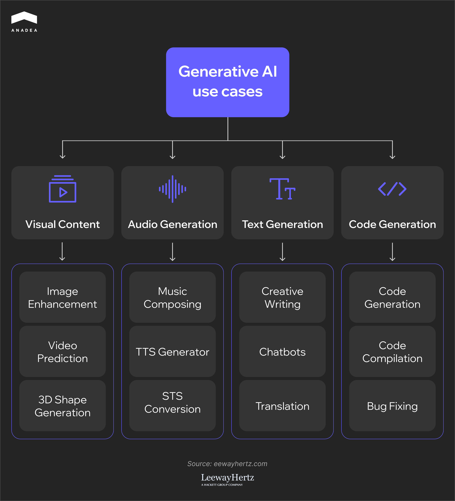
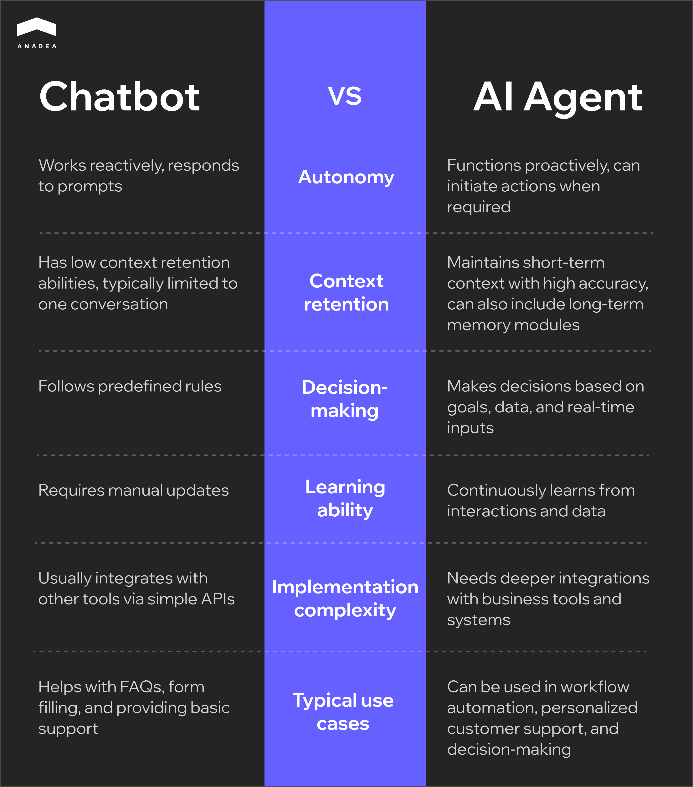

The adoption of [generative AI (GenAI)](https://www.tensorway.com/services/generative-ai-development) is growing all around the globe. For example, the AWS report shows that [90% of Canadian organizations](https://www.aboutamazon.ca/news/aws/from-experimentation-to-integration-canadian-organizations-embrace-generative-ai-as-a-priority) have already started implementing GenAI tools. On a global scale, OpenAI claimed that [92% of Fortune 500 companies](https://explodingtopics.com/blog/generative-ai-stats) are relying on its technology.

The landscape is expanding rapidly, with new generative AI examples covering a lot of use cases from image generation to [AI agents](https://www.tensorway.com/services/ai-agents-development). However, the development of innovation is accompanied by new challenges. The lack of standardization, the continuously increasing variety of tools, and unclear compliance practices are among the pitfalls that companies face today. 

Amid the hype surrounding such tools, it can become a real challenge for businesses to choose solutions that truly align with their needs.

In this article, we invite you to explore the top Gen AI applications and their most common use cases. Moreover, we will also share our practical recommendations on how to choose the right tool that will help you achieve the expected results. 

## Generative AI Examples You Should Know About

Generative AI can transform numerous processes across many industries. Let’s take a closer look at Gen AI applications that are being implemented by companies and organizations already today.

### AI Text Generation

GenAI models by OpenAI, Perplexity, Claude, and Microsoft can produce human-like text content intended for a wide range of purposes. Thanks to AI text generation, people can significantly reduce content creation time. Moreover, it helps to ensure high personalization of content at scale. These are the reasons why [40% of US adults](https://news.harvard.edu/gazette/story/2024/10/generative-ai-embraced-faster-than-internet-pcs/) have already incorporated GenAI in their work and personal lives.

Today, there are also [multimodal LLMs](https://www.tensorway.com/post/genai-multimodal-applications) that can generate texts based on the input in different formats (images, spreadsheets, videos, etc.). For example, our team built an ML-powered solution that can generate accurate descriptions for images. You can find more details [here](https://www.tensorway.com/projects/image-to-text).

Where can you use such tools?

* Content writing (product description sections, social media posts, and articles)
* Email automation (personalized marketing campaigns, follow-ups, and sales outreach)
* Customer support scripts (knowledge base responses, agent prompts)



**Popular tools**: [ChatGPT](https://anadea.info/blog/gpt-4-use-cases/), Perplexity, Anthropic, Copilot, Jasper AI, Google Gemini, CopyAI, Copysmith

### AI Code Generation

[Artificial intelligence](https://anadea.info/blog/how-to-create-ai-software/) can also streamline and facilitate the work of software developers. It can provide boilerplate code, offer improvements, and create functions. The use of AI helps minimize the risk of errors in code and greatly reduce time-to-market. However, its capabilities are limited. AI tools lack true understanding of the underlying problem domain and may generate solutions that appear correct syntactically but miss crucial business logic. They also struggle with highly specific use cases where human creativity and expertise become essential.

When AI code generation can be helpful:

* Auto-completions and real-time suggestions
* Test case generation and static analysis
* Early detection of errors and bug fixing

**Popular tools**: GitHub Copilot, Amazon CodeWhisperer, TabNine, AskCodi, Replit

### AI Image Generation

Thanks to AI image generators, businesses can reduce their dependency on professional designer teams and can generate custom visuals practically in no time. It is a valuable opportunity for marketing purposes, prototyping, and brand experimentation.

The most common use cases are:

* Design mockups
* Brand concepting (logo ideas, storyboards)
* Social media creatives

**Popular AI image generators**: Midjourney, DALL-E, Leonardo AI, Bing Image Creator, Adobe Firefly

### AI Audio Generation

Voice generation tools can create human-like speech in different languages and tones. Businesses often apply such tools for their voice-based services.

Where is audio generation used?

* Interactive voice responses (IVRs) for customer support
* Product voiceover for training content and promotional videos
* AI-narrated podcasts 

**Popular tools**: ElevenLabs, Voicemod, Wondercraft, PlayAI

### AI Video Generation

The use of AI-generated video lets businesses cut production costs and time dramatically. As AI tools can create video content based on the provided prompts, users don’t need to rent studios, buy cameras, and hire actors. 

What videos are typically created with AI?

* Corporate training videos
* Product explainer videos
* Synthetic avatars

**Popular tools**: Synthesia, Runway, Invideo AI, HeyGen, Sora

### AI Chatbots and Virtual Agents

[AI chatbots](https://www.tensorway.com/services/ai-chatbot-development-b2b) have already become a customer support standard across different domains. They are good at answering FAQs and handling simple, scripted flows. Their use can significantly reduce the workload for human agents and ensure the delivery of customer support services around the clock. 

Nevertheless, when it comes to more complex processes, their capabilities are not enough. And that’s when more advanced [AI agents ](https://www.tensorway.com/post/understanding-ai-agents-capabilities-2025)enter the game. These autonomous and semi-autonomous solutions can act as proactive assistants and deal with dynamic tasks and multi-turn conversations.

Such solutions can be used in different domains. For instance, our developers have experience in creating custom AI agentic systems for the financial markets. One of the built agents provides [predictive investment insights](https://www.tensorway.com/projects/ai-financial-agent-trading-insights). Another one can[ analyze 5,000 investment opportunities](https://www.tensorway.com/projects/deal-sourcing-ai-agent-private-equity)
in just a couple of hours.

If you want to learn more about the difference between AI chatbots and AI agents, we recommend you read [this article](https://www.tensorway.com/post/chatbots-ai-agents-automation).

Where are AI chatbots and AI agents typically used?

* Customer support
* Internal helpdesks
* Sales and lead generation

**Popular tools**: GPT-based custom bots, Intercom Fin, Microsoft Copilot, Botkit, Botpress

### Data Augmentation for AI/ML

Quite often, businesses do not have enough real data for training their AI models. In such cases, they can turn to [synthetic data generation](https://www.tensorway.com/post/synthetic-data-generation-ml-model-training). Such artificially created data sets mimic the statistical properties of real-world data. But at the same time, they don’t contain personally identifiable information (PII).

Moreover, synthetic data generation helps to cover those cases where real data is not available at all or is too challenging to obtain. For instance, when you are training self-driving car models, AI can simulate thousands of rare car crash scenarios.

Benefits of data augmentation:

* Better AI model training (more balanced inputs)
* Compliance-friendly data
* Vast possibilities for edge case simulation

**Popular tools**: Mostly, Gretel, Tonic



## How to Choose the Most Fitting Generative AI Application

Modern Gen AI applications offer a wide range of new opportunities for optimizing your business processes. According to [McKinsey’s report](https://www.mckinsey.com/capabilities/mckinsey-digital/our-insights/the-economic-potential-of-generative-ai-the-next-productivity-frontier), around 75% of the value that GenAI applications could bring are across four areas: software engineering, marketing and sales, customer operations, and R&D. The report reveals that thanks to proper GenAI implementation, banking institutions could leverage value equal to an extra $200-$340 billion a year. At the same time, the impact in retail can be even more significant and achieve $400-$660 billion annually.

But to achieve the desired results in any sphere, you need to make sure that you have chosen the right tools for addressing your needs. Only in this case, GenAI will bring the expected value.

At Anadea, we have been working with AI technologies for quite a while, which allows us to gain a good understanding of how to approach the selection process. Below, you can find our practical tips.

### Set a Clear Business Goal

Even before evaluating the impact of AI tools that you can implement, you should clearly define what you want to achieve with them.

For example, let’s imagine that you need to improve operational efficiency and enhance customer satisfaction by minimizing the time required to answer their requests. These tasks can be performed with the help of GenAI. Yet you may need to apply different types of solutions for each of them. For instance, an AI code generation tool is exactly what you need to increase the productivity of your development team. But it won’t be able to optimize your service desk routine. 

### Define Operational Bottlenecks

Identify the most time-consuming and resource-intensive processes that you want to enhance. As a rule, these are manual workflows that are often prone to errors. 

Very often, such processes are repetitive and are related to document creation, report drafting, data summarization and visualization, as well as image or video generation at scale.

### Check for Required Inputs

To work effectively and demonstrate the expected results, generative AI tools need high-quality, relevant inputs.

It means that you need to verify beforehand whether you have the necessary data sets for the AI model training process. For instance, if you want an AI text generation tool to draft your legal documents, then you should feed document templates and past contracts to the model. 

### Evaluate Compatibility and Growth Potential

Apart from assessing the functionality of your future tool, you should also check how well it would integrate with your existing systems (APIs support), scale in accordance with your business growth, and handle increased demand and usage.

### Start with a Small-Scale Pilot

It’s vital to validate the tool's efficiency in a controlled environment before its full implementation.

For this pilot launch, you will need to select at least one GenAI use case and find a separate team to run PoC and MVP. In this case, even if something goes wrong, the scale of the negative impact will allow you to quickly take everything under control.

Make sure you have set clear metrics that would allow evaluating the GenAI application's impact. For example, it can be cost reduction or time savings.

Apart from monitoring the performance of your tool, you should also gather first-hand feedback from your employees who interact with this tool directly.

This will help you understand whether you can deploy your new tool on a full scale, or you need to adjust something.

## Generative AI Applications: Key “Don’ts”

When you are just considering the implementation of GenAI into your business processes, you should not only focus on the best practices but also bear in mind the main things to avoid.

### Don’t Deploy a GenAI Tool as a ‘Trend’

Gartner research revealed that by the end of 2025, around [30% of GenAI projects](https://www.gartner.com/en/newsroom/press-releases/2024-07-29-gartner-predicts-30-percent-of-generative-ai-projects-will-be-abandoned-after-proof-of-concept-by-end-of-2025) will be abandoned after the proof-of-concept stage. The reasons can be different: from low data quality to a lack of certain business value. Some companies introduce AI just to be in the loop of progress.

However, if you don’t have a clear business use case, sufficient data, and resources for an AI project, it will be hard to succeed in this highly competitive world.

Start your AI journey only when you are sure that this technology can satisfy your needs.

### Don’t Leave AI without Proper Human Oversight

Today, the capabilities of various Gen AI applications, including AI text generation, are quite impressive.Still, it is far from a cure-all solution but rather flawed with biased, inaccurate, or brand-inconsistent outputs due to missing contexts.

Given this, the role of humans can’t be underestimated. Reviews, approvals, and hybrid content generation pipelines can help to avoid a lot of problems, including loss of customer trust.

### Don’t Ignore Data Privacy and Compliance Risks

When training an AI model, organizations can have access to sensitive data without fully understanding where and how it is stored, processed, or shared.

However, improper data handling violates regulations like GDPR, HIPAA, or internal compliance policies. All this can lead to serious financial and reputational losses.

We strongly recommend you anonymize or tokenize data before using it for AI model training. It can also be helpful to consult your legal and compliance teams before any data is fed into AI systems. 

Moreover, in some cases, when there is not enough available anonymized data, instead of violating privacy regulations, it can be more sensible to turn to synthetic data generation. Such datasets don’t contain personally identifiable information.

### Don’t Choose Flashy Tools Over Practical Solutions

Alignment between your Gen AI applications and your workflows is one of the key factors of success. Support for your specific use case, integration with your existing systems, and ease of use should be the highest priorities for you. Sometimes, the simplest apps with basic functionality will work much better in your case than any complex AI solutions.

The main idea is to detect the most pressing business needs you want to address with GenAI and find a tool that will be able to do it. While the market offers a lot of off-the-shelf options today, generic models may overlook crucial industry nuances or fail to align with your organizational goals.

In many situations, it will be more sensible to cooperate with a software development team and build your own custom solution fully tailored to your pain points and specific business processes.

## Final Word

Gen AI applications should be viewed as a business booster, not a silver bullet. They can only solve particular issues for which they are designed.

The main task for you is to align the right generative AI application with a specific business need. When GenAI tools are implemented with clear objectives, human oversight, and scalability in mind, you can achieve the expected efficiency.

If you are ready to start your GenAI journey with a new custom tool or want to enrich your existing system with advanced functionality, we are ready to offer you our professional help. Our team provides end-to-end generative AI services, from strategy development to secure deployment. [Contact us](https://anadea.info/free-project-estimate) to get more details!
