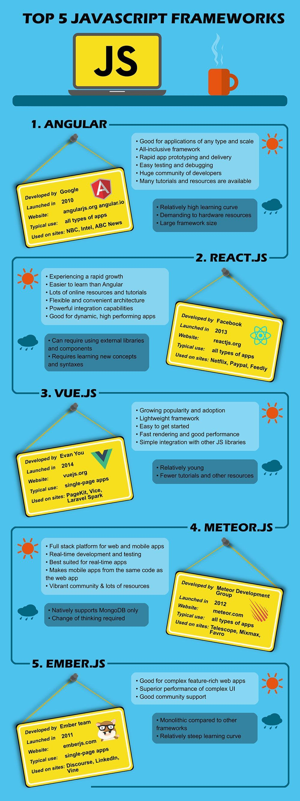

In the world of front-end development, things are a bit complicated. New frameworks appear all the time, which provides both opportunities and challenges for developers. Forget about tea and cookies, learn new stuff if you want to catch up with the changing world! The situation has become better in the past few years but it's still confusing. Polymer, Aurelia, Sencha, Webix and so on - what's behind all those names? How and when should you use them?

Today we'd like to create a shortcut for you - here are the top 5 popular JS frameworks based on the experiences of our frontend developers.

## Angular

Angular.js is one of the first things that comes to mind when you hear "JS framework". With React.js it forms "the big two" of the JavaScript frameworks world. Developers often compare them and try to pick a side.

Angular has been steadily gaining popularity since its release in 2016, with multiple versions and a vast community of developers. Its use of TypeScript as a core language makes it a great option for developing large enterprise projects, given that TypeScript is similar to C#.

One of the advantages of using AngularJS is its fast coding and testing capabilities, with any changes made in the backend instantly reflected in the user interface. This makes it easy to identify and resolve issues quickly. Additionally, developers appreciate that Angular comes with everything needed out of the box, allowing them to learn its features once and use them for years. The first version of Angular is ideal for single-page applications, while the second edition can handle various types of applications, from mobile apps to enterprise-class solutions.

However, it's worth noting that Angular can be quite heavy in terms of hardware resources and requires a significant amount of time to learn due to its complexity. If these challenges don't deter you, especially if you work with enterprise apps, then Angular is definitely worth considering. It's a reliable and powerful tool that won't disappoint.

## React.js

Now let's talk about the other side. React.js was pretty mind-blowing back in the days of its first release in 2013. Rendering technology was truly innovative and game changing at some point. Long time ago in a galaxy far far away we already wrote an article about [what is React js and its key advantages](https://anadea.info/blog/advantages-of-react-js). Check it out for more detailed insights from a senior frontend developer.

Basically, React is not a framework, it is a JavaScript library. Unlike Angular, it has nothing but View. If you need something else, you can add it by yourself. React is often used with Redux - that's how you can get a full app architecture.

React is really fast growing. It is used as a platform for new frameworks, not only for JavaScript (Rum, Re-frame, Om). React-based frameworks can be employed for any tasks. For example, React Native is good for creating multi platform applications and React VR, as the name suggests, is good for Virtual Reality websites.

React is easier for learning and usage than Angular but it is pretty difficult on its own. The possibility to integrate React to any architecture and to choose additional components is amazing but it is also challenging sometimes. With over 1000 Github authors you have to constantly learn new things about it. Still, it's not as hard for learners as Angular.

You can use this library for all types of applications. You can even develop Facebook clone now, because React became open-source with its latest update. Goodbye, copyright issues. We won't miss you.

## Vue.js

Imagine React.js and Angular have a baby - that's what Vue.js in a summary. It has the best features of React and Angular 1: the two-way data binding, server-side rendering, Vue-cli (scaffolding tool for quick start) and optional JSX support.

Vue.js is the easiest JavaScript framework to pick from the list. All you need to do is to follow the steps from documentation and… that's all! It has all the tools required right out of the box, unlike React. It also renders as fast as React 15.0. No copyright issues - that's what we love open source for! No wonder that, according to GitHub's stats, Vue.js is one of the three most popular JS frameworks:

If you want the quickest start or the best performance, Vue.js is definitely one of the best JavaScript frameworks for your needs.

## Meteor.js

What's really interesting about Meteor is that it was considered as a stillborn framework. There wasn't much info about it since its release in 2012. It became popular recently and it continues to build its community.

It's not really correct to call it a framework. Meteor is a full stack platform with server, database management and tools for backend and frontend development. Nevertheless, it's best suited for real-time apps like Slack, Viber, etc. I bet it is called Meteor for a reason. All the changes in the database are transmitted to the UI immediately without latency caused by server reply, different languages and so on. Also it covers all development cycle which is a handy feature.

It uses Node.js as a foundation and it used its own packages and library repository - Atmosphere.js. You can use npm since 1.3 update but not all packages switched from Atmosphere to npm yet.

Want to develop real-time chat or messenger? Give Meteor a try!

## Ember.js

Ember is the right choice for complex web applications. This JavaScript web framework is the backing force for such titans as Netflix, Kickstarter and LinkedIn. Fastboot.js module provides fast server-side rendering of DOM which leads to superior performance of complex UI.

What's also interesting, Ember actively uses code generation utilities which makes developers life easier. Rails influenced Ember's app architecture a lot, but the creators switched to the component approach with the latest update.

Since its first release in 2011 Ember gained massive online community, tons of best practices and continues to get regular updates, so it's pretty user-friendly framework.
Go ahead and give it a try if you are about to create something compound, deep and challenging.

## Now you know

Yes, now you know what the most popular JavaScript frameworks are. Depending on your goals, you can choose a framework which is suited best for your project. Hopefully this article was useful and if so, keep visiting our blog for more IT-related stuff.

P.S.
Special thanks to Stanislav Litvinov and Andrey Bakuta for the information for the article. You guys are amazing!
