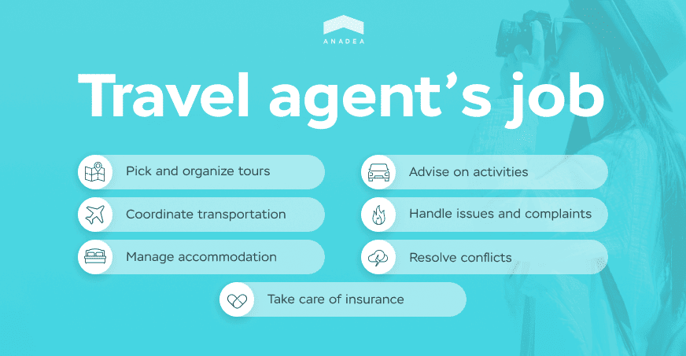
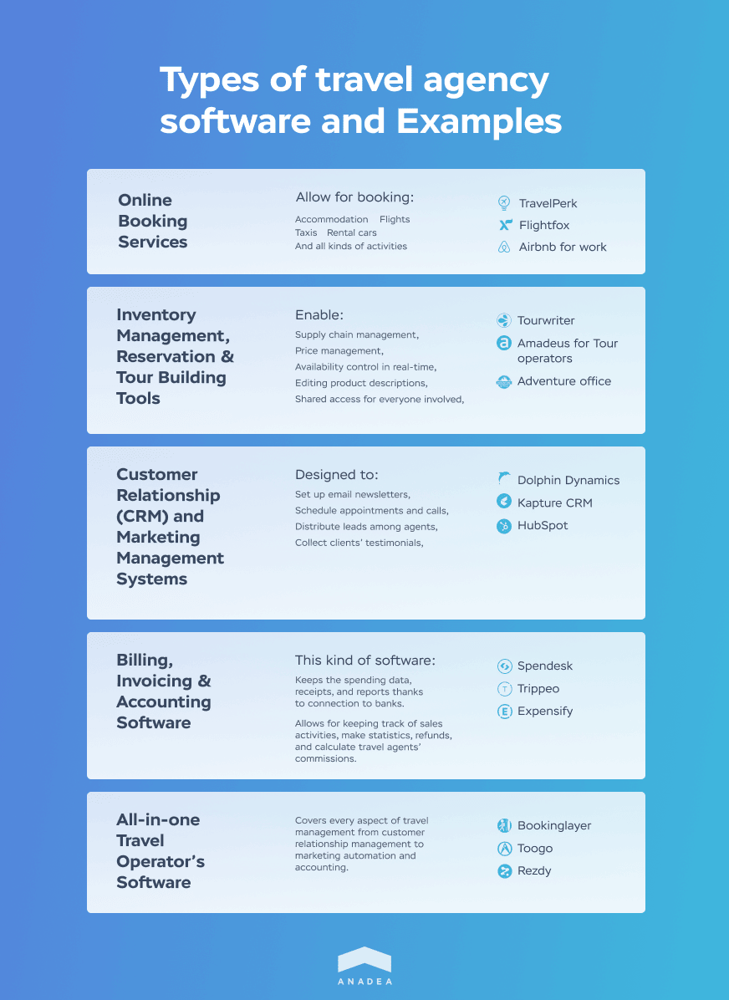

Although more and more people tend to plan their travels without side help - for some, it is not less exciting than traveling per se - travel agents still have their share of work. Software for travel booking and accounting is designed to automate travel agents’ routine and make their work more efficient, as well as simplify travel planning for agencies’ clients. Our post will reveal the ways in which you as a travel agent or a travel agency owner can benefit from such automation and whether you need the services of a <a href="/solutions/travel-app-development" target="_blank">travel software development company</a>.

## Travel Agency Software Advantages for Agents
Although travel agents’ main responsibility is to pick and organize tours for clients, there is much more to their routine. Travel agents have to coordinate transportation, travelers’ accommodation, routes, and insurance. They are also entitled to advise clients on activities at their destination, handle possible issues and complaints, and resolve conflicts. All this taking into account weather and all the other occasions that can not be affected by humans. For that, the agent only has a standard 40-hour working week.

So what are the benefits of travel agency management software given such a broad work scope?

### Adjustable Content
One thing about travel agent software that can not be underestimated is how easy and accessible it is to modify the information for clients. Specialized software allows agents to edit the pricing information and trip descriptions, as well as notify clients about these changes instantly with no need to update printed production and reach out to every client personally.

### Saving Company Resources
To continue the above point considering print production, these glossy brochures from travel agencies are nice to trifle over, however, they get outdated quickly. Plus, contrary to such accessories, specialized software allows for reducing phone communications thus saving agents’ time. Instead of informing all the interested parties about changes in the route or other aspects of the trip on the phone, everyone using the software can be reached out to with no need to communicate in person.

### All Data at Hand
You probably have used or are using tables and programs to store clients’ data but still, the occasions when it needs to be coordinated between storages are quite frequent. Travel agency accounting software enables agents to store all the clients’ data, reservations, tour history, and anything else you find important with no need to look up elsewhere thus saving time.

## Travel Agency Software Advantages for Travelers
In the world of software for travel planning, integrations rule. By integrating the popular route building tools as well as flight and hotel booking services you can simplify vacation planning for travelers multi-fold and offer them as many alternatives as they can see on their phone or PC screen.

### Maximum Comfort
Along with self-isolation, the couple-years-back COVID-19 pandemic brought people a significant advancement in the field of services automation. Restrictions have been lifted but the convenience granted by online services is still appreciated. Now that borders are open again, people enjoy booking travels and checking the full info on departures and stays from home. No visits to the agent’s office are required considering their working hours - every piece of information is accessible at any time.

### Ability to Compare Alternatives
For travelers aimed at saving costs, it is essential to be able to compare propositions from different agencies, so it is important that yours is among the available options. Having all the alternatives before their eyes is certainly more productive than visiting travel agencies one after another and keeping all in mind at the same time.

### Freedom of Choice
It is simply more comfortable and less stressful for many people to avoid personal interaction and make decisions quietly without anyone pushing. When visiting sales offices, customers may have little time to think properly and as a result, make decisions in a rush. Online tour booking software presents customers with the information they need as well as gives them enough time to think it over.

## Types and Features of Software for Travel Agency
Generally, there are two big groups of software for travel agencies. Software products of the first group are specifically designed for internal use, i.e. the agency’s staff (travel counselors, tour operators, reservations sales agents, local tour guides, etc.). The second group is thought to be used by both staff and agency clients. Which one belongs to which group is clear from the types’ descriptions. Below each of the agency software types, you will find examples of software products in the market.

### Travel Booking Software
If you are interested in building a rental website or application, follow the guide on <a href="/blog/develop-an-app-like-airbnb" target="_blank">how to develop an app like Airbnb</a>. Speaking about full-fledged travel agency software, online booking is only one of the multiple modules it can have. Moreover, booking can apply not only to accommodation for the period of stay but also to flights, taxis, rental cars, and all kinds of activities.

__Examples:__ TravelPerk, Flightfox, Airbnb for work.

### Inventory Management, Reservation & Tour Building Tools
If the client does not want to limit themselves to the all-inclusive type of vacation and is willing to enjoy their trip to the full extent, software that allows for inventory management, reservation, and tour building will lift much pressure off their shoulders. Features included in such tools are:
* Supply chain management;
* Price management;
* Availability control in real-time;
* Editing product descriptions;
* Shared access for everyone involved.

__Examples:__ Tourwriter, Amadeus for Tour operators, Adventure office.

### Customer Relationship (CRM) and Marketing Management Systems
Some software products for the travel industry are designed specifically for lead generation and marketing agency services. For this, certain essential functionality is implemented into agency CRM. This kind of software is designed for sales managers and customer relations specialists. Customer relationship and marketing management systems for the travel industry allow agency employees to:
* Set up email newsletters;
* Schedule appointments and calls;
* Distribute leads among agents;
* Collect clients’ testimonials.

__Examples:__ Dolphin Dynamics, Kapture CRM, HubSpot.

### Billing, Invoicing & Travel Agencies Accounting Software
Arranging a trip is a process that suggests multiple transactions for sure. One trip includes but is not limited to transportation, hotel reservation, insurance, and tours, all of which have to be paid for separately.

Software for billing, invoicing, and accounting allows to keep the spending data, receipts, and reports in one place for the fullest possible billing information which allows travel agents to keep track of sales activities, make statistics, refunds, and calculate travel agents’ commissions. This is achieved best through connection to banks.

What has to be paid special attention to when speaking about integration with financial services is __security__. If you are about to build software for accounting, it is best that the travel agency software development company you choose has the expertise not only in travel software development but also in building financial systems. The info on this should be available through the company’s portfolio.

__Examples:__ Spendesk, Trippeo, Expensify.

### All-in-one Travel Operator’s Software
Finally, this is travel agency software in the conventional sense designed to cover every aspect of travel management from customer relationship management to marketing automation and accounting. Such solutions are equally useful for travel operators, sports camps, yoga retreats, and any other activity sellers.

__Examples:__ Bookinglayer, Toogo, Rezdy.

### Perfect Travel Agency Software: What Is It Like?
* __Simplifies your agency workflow.__ Software for travel professionals is not to complicate the work process for them but to simplify and automate it. Before building a travel agency system for your business, break down a typical process into steps and make sure the software to be built corresponds to the resulting chart.

* __Clear and intuitive interface.__ The formula for software with a perfect UX/UI (user experience/user interface) design is being eye-pleasing and easy to use. Travel apps’ specifics is advanced mapping, i.e. the visual component when it comes to booking and estimating distance from one point to another.

* __Integrations.__ Side integrations are essential for Jack-of-all-trades apps, especially maps and payment services. More APIs are:
  - Flight aggregator API (Amadeus, Skyscanner);
  - Google account and social media (Twitter, Facebook) APIs for authentication;
  - Banking API for a currency conversion (Open Exchange Rates API);
  - Public transportation API (Google);
  - Visitors’ reviews API (Tripadvisor);
  - Rent-a-car API (Sabre, Travelport).

* __Calendering & Scheduling.__ Plans and prospects are perceived best when displayed on a calendar. A calendar feature for the travel app in combination with notifications about the upcoming events is a working option to systematize and visualize travel data.

* __Exhaustive reporting.__ Reporting will allow your agency to collect data on the most popular travel destinations, seasons, tourists’ spending, and more. Insights drawn from reports can help you improve your business strategy and better meet customer needs.

* __Security at every step.__ Travel agency databases contain personal information of clients that has to be protected from leakages. The same applies to payment information if the booking is among software features.

## Travel Software Built by Anadea
The theory is fine but examples from practice are more valuable. Anadea has successfully developed a range of solutions for businesses worldwide that successfully operate in their niche.

### <u><a href="https://www.tripaneer.com/" target="_blank" rel="nofollow">Tripaneer</a></u>

Tripaneer is a leading marketplace to book all kinds of health and wellness retreats to enjoy during holidays – yoga, meditation, mindfulness, silence retreats, and more. Providing both offline and online experiences, Tripaneer is a choice for over 160k travelers. Our task was to create a trustworthy and calming visual style for the website so that visitors feel comfortable leaving their details and find trips of interest in just a few clicks.

In addition, Tripaneer allows users to __sign up as a partner__ so that travel agents can promote their own holidays using the platform. For travelers, in their turn, the website is featuring:

* __Smart recommendation engine.__ At the top of the website’s homepage, users see the list of the most popular trips. Also, they are enabled to sort trips by duration, price, reviews, and a number of other variables.

* __Search & Filtering.__ Tripaneer visitors adjust trip categories, the calendar, and destination filters to elaborate on their request for a trip associated with the date of arrival, activity type, and destination.

* __Messaging.__ On Tripaneer, visitors can communicate with merchants via messaging module to find out more about their trip.
* __Currency converter.__ Users can see any price in 30 different currencies. The exchange rates are imported from the European Central Bank live. A default currency is determined based on the user’s IP address.

* __Ability to leave a review.__ Users can leave feedback about what they did or did not like about their travel experience. These reviews are then available to the public and influence the overall merchant’s rating.

> Read the full case study <a href="/projects/ebookingservices" target="_blank">at the link</a>.

### <u><a href="https://www.bahamago.com/" target="_blank">BahamaGo</a></u>

BahamaGo is a web tour booking system for an online travel agency that makes finding and booking hotels, tours, and airlines in the Bahamas quick and easy for users. The headline functions of BahamaGo are:
* __Booking engine.__ The visitors can book flights for all of the major domestic airlines, search and book hotels and tours in the Bahamas, as well as make other travel arrangements.

* __Generating packaged solutions.__ The site is set to create deals and specials by searching, applying custom prices, combining different services, and posting them as packaged solutions.

* __Payment processing.__ Users can pay for their trips with credit or debit cards and issue refunds online.

* __CMS integration.__ An advanced content management system is integrated into the portal to edit tourist packages and offers.

> Visit the <a href="/projects/bahama-go" target="_blank">case study page</a> for more.

## It Is Always the Right Moment to Grow
Whether you want to build a tour operator software to come full circle or a tool to automate only one facet of your travel agency operations, you have already made your first step towards digitalization. Perhaps you have tried using some popular out-of-the-box travel management software solutions like Bookinglayer or Toogo. We will gladly help you build a custom one tailored to your needs in case these products lack something or contain features you need not.

Let's build it!
