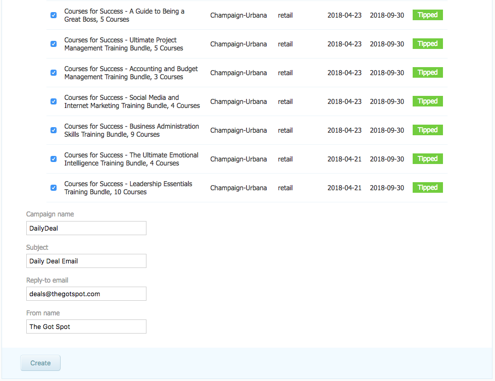
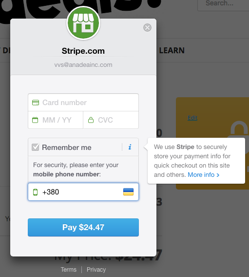
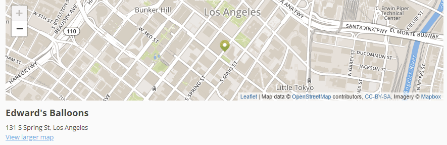
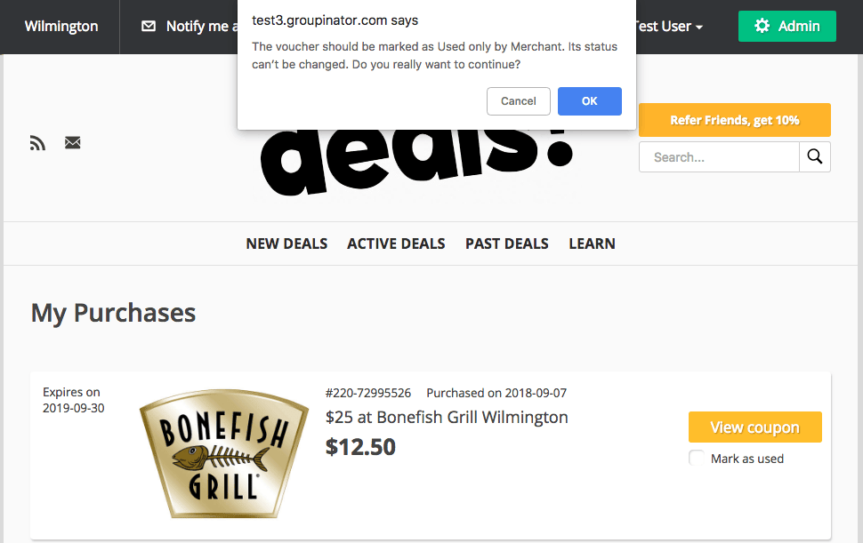
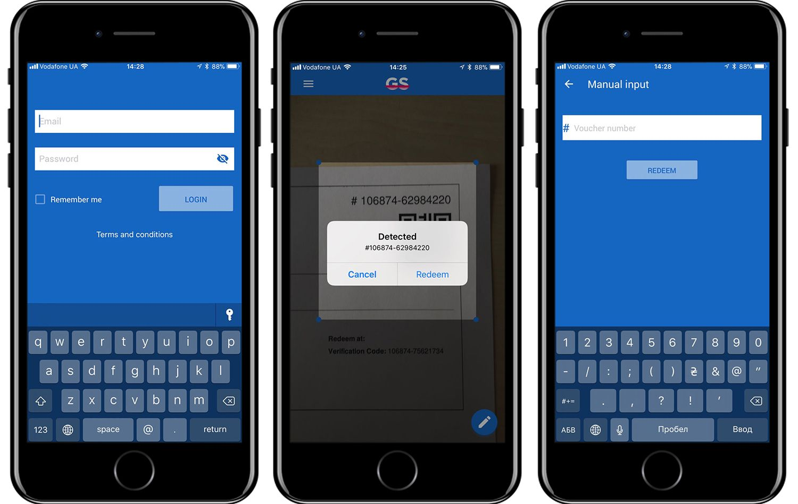
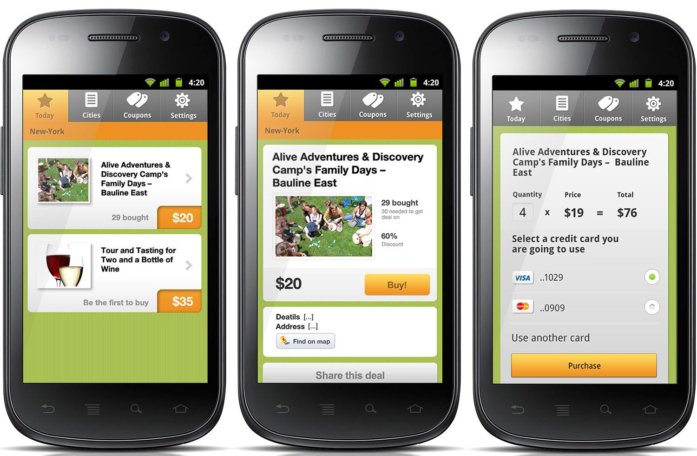
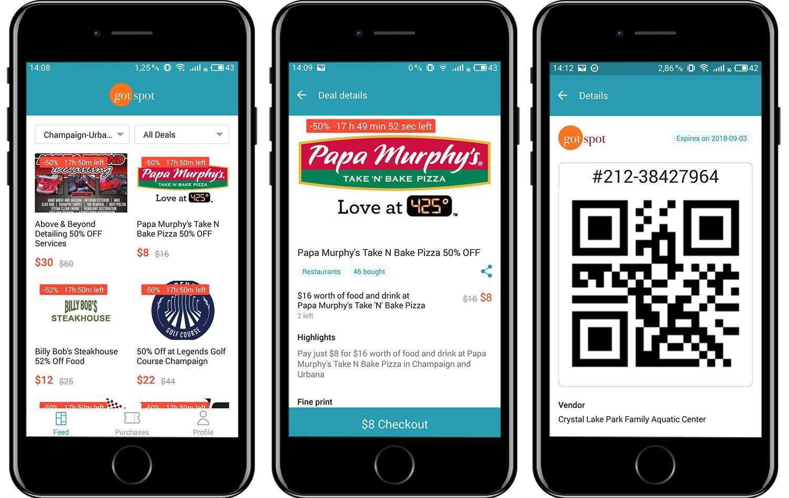

Recently we've released a new mobile app - The Got Spot app. The launch of this application is closely related to our Getsocio project, so let's first talk about major updates of Getsocio itself and some other linked projects.

## Getsocio

[Getsocio](https://anadea.info/projects/getsocio) is a platform that allows creating online stores that operate on the daily deals / group buying business model. There is an option to sell coupons, electronic vouchers, and physical goods.

Getsocio is [Anadea](https://anadea.info/)'s product, founded in 2010. It was the time of Groupon's growth and we were getting many requests from people who wanted to develop Groupon clones. As a result, we created a complete platform that lets entrepreneurs create such clones without hiring programmers. When the euphoria around Groupon gradually faded away, this influenced Getsocio too.

However, as you know, fashion tends to come back, and at the end of 2017 we got new clients who were eagerly interested in the services provided by Getsocio platform. Among those clients was The Got Spot - they switched to Getsocio from another eCommerce platform and revived the continuous development of the project.

### The main updates of Getsocio:

* **New integration with MailChimp**  
  Creating an email campaign now takes just a few clicks. A newsletter campaign goes to MailChimp, which sends it out to subscribers. Subscribers are synchronized between MailChimp and Getsocio.

* **New integration with Stripe payment system**  
  Now, there is an opportunity to tie the purchases to a phone number and not to enter the credit card details every time.

* **OpenStreetMap integration**  
  Due to changes in Google Maps policy, it became necessary to add an alternative. Customers now can get their Google Maps Api Key and use Google Maps, or opt to use OpenStreetMap.

* **Changing the coupon status from Unused to Used from the user's personal cabinet**  
  Now, not only the vendor can mark the coupon as used, but also the user.

There are also other exciting updates, including <a href="https://getsocio.com/blog/featured-deals" target="_blank">featured</a> and draft deals, tracking number and search (yeah, we've finally added this feature).

## Getsocio Coupon Scanner

This mobile application allows vendors to scan coupons purchased on Getsocio-based sites.

After the first coupon scanner apps appeared on the market, Getsocio's customers were expecting us to develop such application for Getsocio too. To meet their expectations, we made up the technical requirements, created a design, developed an API and launched the Getsocio Coupon Scanner app.

## The Got Spot mobile app

Now, let's get back to the most recent release - The Got Spot mobile app.

The growing business of one of Getsocio's key clients required developing a mobile application for their website. However, previously available client applications were created in distant 2012 and looked like this:

It was necessary to build a new API, create a new design and develop an application. We decided to use React Native for this project as it was a great opportunity to apply our expertise in this framework. As a result, we developed an app for both iOS and Android platforms. Here are some mock-ups to give you an idea of how it looks like:

The app is available in the app stores: <a href="https://play.google.com/store/apps/details?id=com.getsocio" rel="nofollow" target="_blank">Android</a>, <a href="https://itunes.apple.com/us/app/the-got-spot/id1429976980" rel="nofollow" target="_blank">iOS</a>.

## Our team

We can't but mention the team members who made all these updates happen:

* Alexey Olefirenko - team lead;
* Artem Dubrov, Denis Altukhov - Android app development;
* Daria Kovalenko - iOS development;
* Anastasiya Bakuta - React Native development;
* Dmitriy Stepanenko, Ilya Bibikov, Nikolay Stepanets, Andrei Markhaliuk, Stanislav Shandyga, Anastasiya Sakhno - backend and API development;
* Nataliya Kucherenko - design;
* Aleksey Lavrukhin, Darina Chuzhova, Konstantin Ryshchenko - quality assurance;
* Andrey Bulava - DevOps;
* Vladimir Shumik, Alexander Koroid - project management.

Thank you for making these projects great!

Get a software development quote
