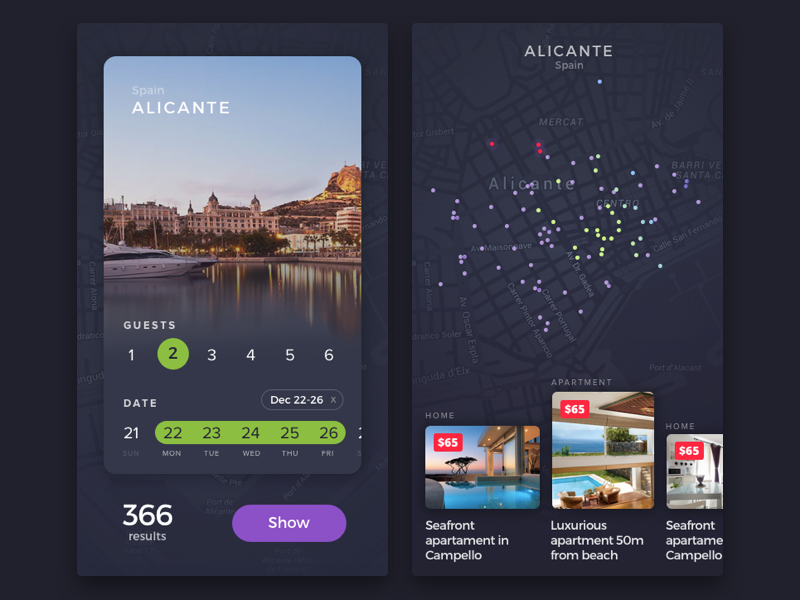

Every owner of a real estate selling website wants his website to become some kind of a sensation in a housing market and generate leads constantly. Sometimes humble applications with the right idea, and just as important, an outstanding design can grow into a nationwide solution like it happened with one of our projects <a href="https://anadea.info/projects/agentfolio" target="_blank">Agentfolio</a>, an extremely useful tool for buyers and brokers which helped them to navigate the process of buying properties. However...

## Users are becoming more and more demanding

When it comes to lead generation, UX design may not be the first thing that comes to mind. However, the conversion rates of a website and its UX design are closely linked. This is particularly true for the <a href="https://anadea.info/blog/how-to-create-a-real-estate-web-platform" target="_blank">real estate website development</a>, from which modern customers are expecting more in terms of user experience from a website that sells houses.

The importance of UX design in lead generation can be attributed to several factors. Firstly, millennials, the most important demographic group for any business, have reached the age of acquiring their own housing. This generation, born between 1980 and 2000, has grown up with technology and is well-versed in using the internet to research and purchase products and services. Therefore, a website that is not optimized for UX design may fail to capture their attention and ultimately, their business.

Secondly, customers of all ages are becoming increasingly tech-savvy and expect seamless and engaging experiences from websites. With the proliferation of smartphones and the widespread availability of high-speed internet, browsing the internet has become a daily routine for most people. Thus, a poorly designed website that fails to meet user expectations can lead to high bounce rates and low conversion rates.

Moreover, in the real estate industry, a website's UX design can significantly impact the customer's perception of the brand and its offerings. A well-designed website can create a positive impression, build trust, and increase the likelihood of a customer making a purchase.

So, what we are talking about? What is user experience and how it can help to boost sales on your website?

## UX for real estate website. What you need to know about it

Whether you punch in buttons of a calculator, play a video game on your PlayStation, or try to control drones with your mind (yeah, that's possible) - all these are interfaces, with the help of which you interact with devices. And interaction implies some purpose or need. The main goal of UI/UX designers is to bring the user to some logical point in the easiest and fastest way.

If we transfer this into the context of website design for real estate, we'll see an experience - a set of actions and emotions that the user receives while working with the interface of your website including achievement of goals, i.e. to buy a home, rent an apartment, or sell realty.

Now that we've figured out what is UX design, let's move on to how to <a href="https://anadea.info/blog/emotionally-intelligent-design-why-you-need-it-in-your-mobile-app" target="_blank">create positive emotional bonds</a> with customers and get more sales with the help of user experience design for real estate website.

Related read: [How to Make a Website for Real Estate](https://anadea.info/blog/how-to-create-a-real-estate-web-platform)

## UX tips for real estate website design

How your customers think, how they make decisions and how to make them do what you want them to do - it is all about UX design.

Rest assured, the main reason for users to visit your website is hunting or selling houses and apartments, sometimes even <a href="https://anadea.info/projects/listingdoor" target="_blank">without hiring an agent</a>. And if you make this process painful and unlogic, they will go to another site. Little user experience things on your website will capture the attention of your potential customers. So let's start.

**1. Search tools should be easy-to-use and intuitive.** Check whether real estate customers find what they need. If a user searches for houses in NY City, for example, and types the name of the city into a search bar, he should be on a page with listings of NY and not on a page of New York City housing market with the number of schools in that region and other general information. It makes the task of finding a house for a user harder.

**2. Offer a choice in filters.** Users prefer easy actions, and they'd rather choose maximum price in filters by a click than by typing it. And now imagine a customer, who tries to find a house via smart phone and there is a need to type something in filters. It can't be too much fun.

**3. Keep the original text of the query.** Don't delete the query after the search button is pressed. If a user doesn't find houses and apartments that he needs he will want to slightly change the query instead of retyping it. And we already know that users prefer easy actions.

**4. Remove ads and pop-ups that block content.** Or reduce the area of intrusive advertising forms if they cannot be entirely avoided because users hate when something interrupts their browsing experience. And be sure to turn off the autoplaying video ad.

**5. Improve search experience on small screens.** Smart phones can be perceived as necessary tools for house hunters - anytime anywhere ready to search for listings, take pictures of houses they like, contact a realtor to appoint home visits. Therefore for real estate business, it is especially worth paying attention to mobile design. What you should include:

* GPS search - technology that provides information based on the location of a user. Especially useful when a homebuyer is outside.
* Search by area - let renters and home buyers outline the area they want to focus on.
* Neighborhood area - show the properties for sale around the neighborhoods users want to live in.

**6. Show credibility and reviews of agents.** The Internet has accustomed us to make decisions based on the experience of others. The more positive experiences there are, the more satisfied with the decision we are. The same applied to real estate buyers and sellers. They also choose agents, building upon the results of the reviews.

**7. Use prompting CTA buttons.** In a real world, objects are telling us how we should interact with them - turn, press, push. When a user wants to solve some task, he is automatically looking for tools and objects that may help him to do that. Buttons on physical devices cast shadows, which compels you to press on them. It is possible to create such shadows for buttons in realty website design.

## Real estate web development and UX. Where to start

The key concept of a business is to make money for its owner. The main idea of a realty website is enhancing the visibility, attracting new clients, and generating more income, which is impossible without lead generation. If your real estate site doesn't generate as many leads as you would like maybe it is time to re-think the design of your website. Our team has experienced real estate web developers that can help you to complete this task.
