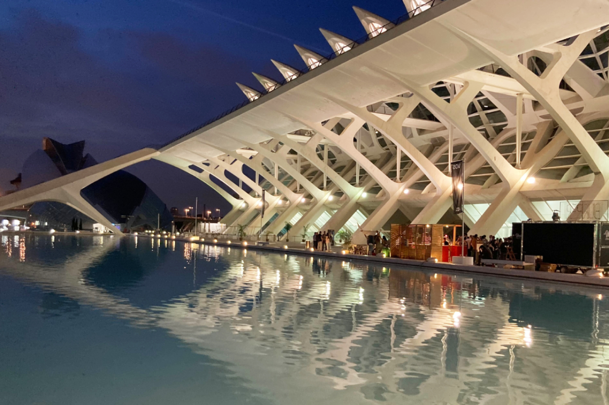
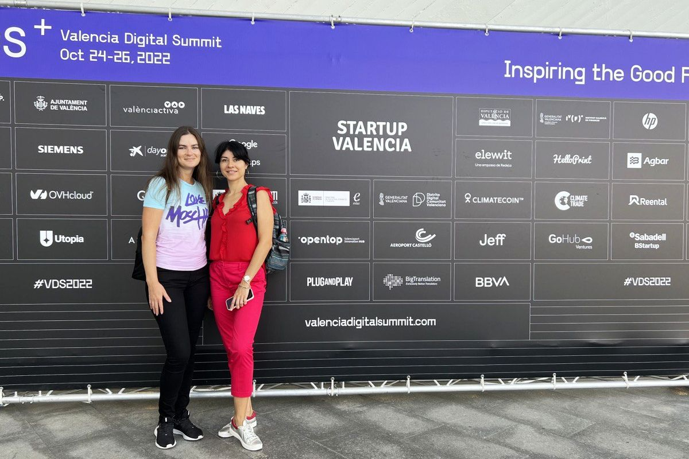
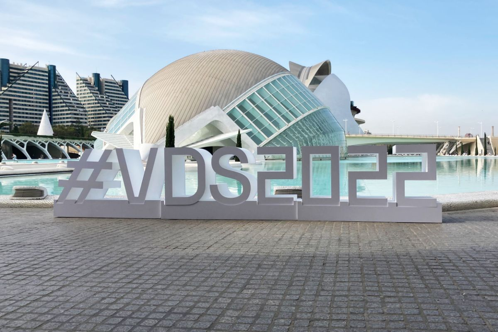

We’re way too far from Silicon Valley, the first place that comes to mind when IT and innovations are brought up. Nor are we in Poland that’s become Europe’s cradle of IT talents in the past years. But we’re somewhere just as big, that’s for sure. So where are we?

<small style="font-size: 14px">City of Art and Sciences, Valencia, Spain</small>

On October 24–26, the Valencian City of Art and Sciences held the 5th Valencia Digital Summit bringing together hundreds of speakers, investors and startup founders in front of 10,000 people. The major sponsors that made the event possible are Startup Valencia non-profit organization and the Distrito Digital initiative to house technological companies and talent.

Our Alicante-based business development team couldn’t but visit.

<small style="font-size: 14px">Alexandra Lichko, Iryna Lysenko</small>

Our goal was to learn what’s new in the tech world from the trendsetters. As exciting as it sounds, in practice it was quite a challenge to choose the speakers to attend. Given what a challenge it is to scroll the page listing all speakers to the bottom on the event’s website (try it!), imagine what it was like not knowing where to look first :) All this inside the Valencia City of Art and Sciences, an incredible place in itself.

And it goes without saying, but we say it anyway, the goal was to meet all kinds of founders working on the most challenging products. Game-changing software solutions are the special Anadea thing. Many QR codes leading to LinkedIn pages have been scanned and as many contacts made during the summit.

## More use cases for AI
We were especially interested in the emerging __AI trends__, an evolving niche that is unforgiving of missing out. Artificial intelligence and all it entails is one of the main directions we’re invested in growing as an <a href="https://anadea.info/solutions/machine-learning-software-development" target="_blank">AI development company</a>. Of the newest best practices presented at VDS was the computer vision and natural language processing emotion recognition model by __emocional__, a startup from Barcelona to identify an individual’s mood and emotional state by a video of them.

We also had an opportunity to see BoB from __Super Robotics__ in action. BoB is a computer vision-driven robot that moves around a supermarket and audits the shelves’ contents. With the help of its numerous cameras, it scans the goods and gathers essential information on the items in stock, their location, and if any are missing. It’s already working at a good level of precision but still needs improvement, so we discuss the opportunity to work on it together.

## Fresh perspectives in FinTech
A rapidly developing business domain __FinTech__ remains one of our key focuses. It was exciting to learn more about the FinTech community in Spain.

The panel on Best Global Practices in Entrepreneurship and Investment on the SummitPro stage led by __Iker Marcaide__ and __Iñaki Berenguer__ came out very compelling. Born in the Valencian community, both of them set up and developed remarkable international companies. Iker founded a FinTech Unicorn __<a href="https://byentrepreneur.com/entrepreneur/flywire-introducing-the-third-spanish-unicorn/" target="_blank" rel="nofollow">Flywire</a>__ and Iñaki founded InsureTech __CoverWallet__, an online platform that offers insurance management services to small and medium businesses.

There was a separate panel for FinTech startups pitching. Some of the ideas were very fresh and unexpected, for instance, a FinTech startup __Rentastic__, digitalizing a customer journey of industrial machinery purchase from the foodservice sector to the manufacturer. They claim to be the first KAAS (Kitchen as a Service) company, meaning that they also offer to rent solutions as a means of payment, including all associated services (transport, installation, maintenance, etc.). We are now discussing potential cooperation with this startup in the part of <a href="https://anadea.info/solutions/financial-software-development" target="_blank">creating custom financial software</a> for them.

## Much inspiration for us
So this was a great couple of days of diving into a huge community of entrepreneurs and technology enthusiasts. Operating in a region where the events like this take place on a regular basis is priceless and we can’t express our gratitude to the organizers and sponsors. Maybe next years, we’ll be joining as speakers as there’s plenty of what we can share with the world ;)
