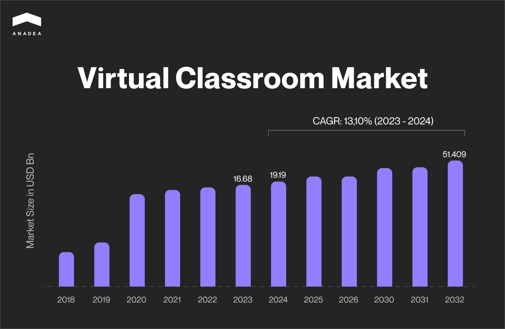
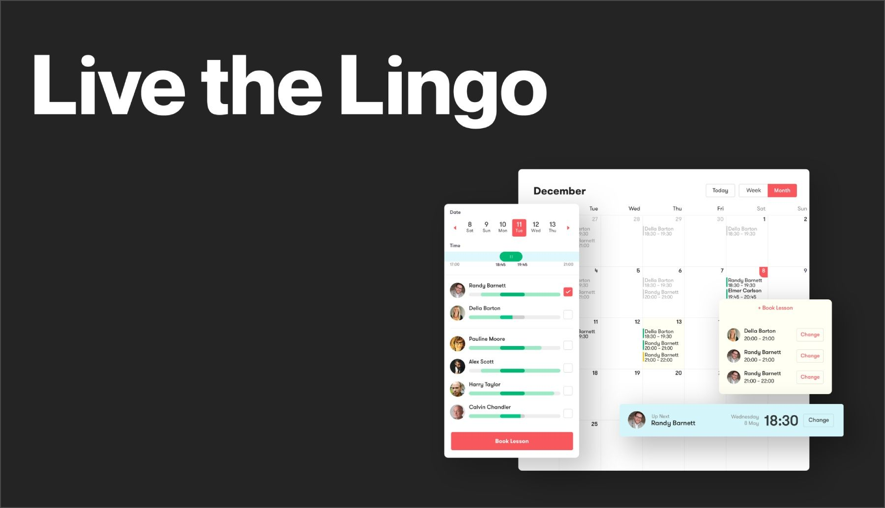

Today, the education environment doesn’t look like it used to do several decades ago. And one of the key factors that support this transformation is the tech progress. In one of our previously published blog posts, we’ve already talked about the role of [digital solutions](https://anadea.info/blog/how-digital-technology-has-changed-modern-education) in modern education. In this article, we'd like to focus on one particular type of software that is actively gaining popularity these days - virtual learning environment software. We will explain the benefits of such solutions and share some ideas for the advanced features of up-to-date virtual classroom software which will help your product stand out from the row of similar projects.

## Online classroom software: Market overview

In general, a virtual learning environment can be defined as a digital system that facilitates the management of educational courses by enabling distance learning. Such technologies are used at schools, universities, educational centers, and many organizations that provide corporate training for their employees.

Today we all have quite standardized associations with this concept. It should be a [web platform](https://anadea.info/blog/educational-portal-development) where professors can conduct online classes and publish educational materials in different formats that learners can study at any time.

Nevertheless, some [projects](https://en.wikipedia.org/wiki/History_of_virtual_learning_environments) for distance learning appeared long before the internet and computers became widely adopted. For example, in 1953, **the University of Houston** offered the first televised college classes. Each week, there were from 13 to 15 hours of specialized educational programs that aired at night. This made it possible to watch them even for those people who worked during the day time.

Of course, thanks to advancements in technology, distance learning has changed a lot since the 1950s. Now, online courses are much more flexible, interactive, personalized, immersive, convenient for both teachers and students and, as a result, more efficient.

In 2023, the [market size](https://www.marketresearchfuture.com/reports/virtual-classroom-market-4065) for virtual classroom technology reached the mark of $16.68 billion. In 2024, this figure is expected to increase to the level of $19.19 billion. The long-term forecasts of analysts also look quite positive. For example, the predicted market volume for 2032 is $51.4 billion. This means that the projected CAGR for the period from 2024 to 2032 will be over 13%.

Among the factors that boost the expansion of the virtual classroom software market experts name the wide adoption of remote learning, especially during the COVID-19 pandemic, and the significant technology development. Today, a virtual classroom system can be enriched with innovative AR and VR tools, video streaming functionality, collaboration features, interactive whiteboards, and many other possibilities that enhance learner experience and make the educational process highly engaging.

Yet, the high costs of such projects and equipment, restricted access to technology and internet connectivity, as well as inequalities in socioeconomic status restrain the expansion of the distance education software market to less developed regions.

Discuss your project idea

## Benefits of virtual classroom software for online teaching and learning

To make up your mind on whether it’s worth launching a virtual classroom technology project, it’s necessary to consider its advantages. We’ve prepared a list of the most important of them.

1. **Flexibility and structure of the educational process.** On one hand, online learning solutions give teachers and students more freedom than a traditional approach with offline lessons. On the other hand, such systems provide a better structure to the entire process, which is also a huge plus. A well-designed classroom will offer a continuous environment that will allow learners to study the available materials at their own pace and return to those parts that stay unclear for revision.
2. **Better accessibility.** With online learning platforms, users can participate in courses from any place and at any time. The exception can be a real-time video streaming session but as a rule, such lectures are recorded and further published on the platform. But even if real-time participation is required, physical presence at a particular location is not expected. The same benefit is relevant for teachers.
3. **Enhanced collaboration and engagement**. For shy students, it can be difficult to actively participate in traditional offline classes. In a virtual environment, such barriers are usually broken. Moreover, online classroom features allow teachers to divide students into small groups for discussion and work on various projects together.
4. **Immediate feedback**. In traditional schools, sometimes students need to wait for feedback for days, if not weeks. Software for virtual classroom often has features that allow students to get scores automatically, which means they will know their results immediately after submission. At the same time, teachers can also provide their feedback in a text, audio, or video format.
5. **Increased personalization**. Advanced online classroom software can be enriched with innovative AI-powered tools. They can analyze students’ strengths and detect those aspects that need improvements, they can define the interests and preferences of each person, and recommend those tasks and materials that will be the most appropriate in each case. Personalization always helps to achieve better results in the educational process and makes learning much more engaging.

## Why develop a custom virtual classroom system?

Today there are quite a lot of ready-to-use online learning platforms that different organizations can use for their needs. Nevertheless, in many situations creating a virtual classroom turns out to be a much more sensible solution. And here’s why.

1. **Fully tailored features**. When you build your own software, you can make sure that it will have all the tools that you need. At the same time, you won’t have to pay for the functionality that is not required in your work. If you want to find out what features are in demand for e-learning solutions, you can read [this article](https://anadea.info/blog/education-app-features).
2. **Seamless integration.** Off-the-shelf solutions often offer rather limited possibilities for integration with third-party systems. In your custom solution, it is possible to ensure integration with any other software products that you need.
3. **Data protection.** Your custom software can be built in full accordance with your security standards.
4. **Scalability**. With your business growth, your educational platform may need to process significantly bigger volumes of data. Or you may need to make it available to new groups of users. Or there may appear a necessity to expand the range of its features. With ready-to-use solutions, you may face significant restrictions in these aspects.
5. **Cost-efficiency.** Сustom development of virtual learning environment software requires serious investments from your side. Nevertheless, the use of a third-party solution presupposes the necessity to pay recurring licensing fees. In many cases, with all these payments, custom development with further maintenance will be a more feasible option.

## Virtual classroom system: Basic and advanced features

Before creating a virtual classroom, you should have a clear understanding of the functionality that it may have.

* **Interactive whiteboard**. This tool allows professors and students to write, draw, and highlight different things on the screen, and others will see it. It is possible to let multiple users write on the whiteboard at the same time.
* **Live video and audio streaming**. Such functionality is aimed at organizing live lectures and discussions on your platforms. It is also recommended to make it possible for students to participate in discussions in smaller groups in separate virtual rooms.
* **Communication tools.** You can enrich your platform with various features, like online chats, forums, and video or audio calls, to make the interaction between students and professors comfortable and efficient.
* **File sharing and storing**. You should ensure the possibility for users to distribute documents, presentations, and other materials during lectures, as well as to make them available later.
* **Recording and playback**. It will be a good idea to record live sessions. This will let students re-watch them.
* **Attendance monitoring.** Professors should be allowed to monitor student attendance during online lessons and get attendance reports for record-keeping.
* **Assessment**. Depending on the exact type and goals of your online classroom software, you can offer teachers the possibility to conduct quizzes during or after online lessons, as well as regularly check the knowledge of students and gather their feedback.
* **Assignments**. You can build a feature that will allow students to submit their home assignments online and get feedback from teachers.

### Advanced features

* **Gamification.** It doesn’t matter how old your students are. Such elements as online rewards, badges, challenges, and leadership boards will drive healthy competition and motivate people to study more.
* **VR/AR tools**. Such features as virtual simulations can help you ensure more engaging and interactive learning environments.
* **Real-time translation.** This innovative functionality translates your materials into multiple languages, which will make them suitable for people from all over the world.
* **AI-powered analytics**. AI-driven monitoring and recommendations will help to increase the efficiency of learning efforts.
* **Real-time captioning.** This can make your videos more accessible to wider circles of learners, including those who have different types of hearing disabilities.

Request estimate

## How to create a virtual classroom: Key steps

The process of the virtual classroom system development is traditionally divided into the following steps:

1. **Market analysis and ideation.** To begin with, you need to think about the concept of your solution, its main goals, target audience, etc. We also recommend you attentively analyze what your potential competitors offer. It will help you understand what can be done better and what ideas you can take for inspiration.
2. **Discussion of requirements**. When you have a good understanding of your future solution, you should prepare requirements and further discuss them with your development team.
3. **Planning**. Developers will study your requirements, and help you choose the right tech stack, define key milestones, and set the time frame for your project.
4. **MVP development.** It will be a good idea to develop a minimum viable product first. This version of your solution with a basic set of features will be built much faster than a full-scale product. But it will help you to get feedback from real users. Based on it, you will understand whether you should proceed to the development of your final version in accordance with your plan or whether any changes are required.
5. **Virtual classroom design and development**. When you are sure that your idea corresponds to users' needs, you can start the design and development of its full version. As a rule, it is the most time-consuming step.
6. **QA and testing.** Before the launch, you should make sure that there are no bugs. And that all features work and look as they should.
7. **Platform release**. At this step, the software development team will prepare the environment and make the platform available to end-users.
8. **Maintenance and support.** We recommend you continuously track the performance of your solution and quickly react to any detected vulnerabilities. Moreover, do not forget to update your platform following the changing market needs and trends.

## Cost of creating a virtual classroom

The cost of your custom software always depends on the complexity of your solution, the size of the hired team, and the rates that each team member will have.

The average price for the development of online classroom software will be somewhere in the range between $30,000 and $120,000. The lowest price will be in those cases when you want to build just a simple platform with basic functionality. With the growth of the complexity of your solution, the price will increase as well.

You can read more about the costs of educational app development projects [here](https://anadea.info/guides/educational-app-development-cost).

## AI and virtual classroom technology

Artificial intelligence already today has quite a serious influence on the transformation of the educational space. It can greatly enhance virtual classroom systems by offering personalized learning experiences and improving administrative efficiency.

Below you can find a couple of ideas of how AI can be used to enrich your platform.

1. **Individualized content**. AI tools can analyze users' needs and their level of knowledge and offer them materials that fully correspond to their current skills.
2. **Virtual tutors**. AI-driven chatbots can offer students additional support, answer questions, and offer explanations on-demand at any time.
3. **Predictive analytics**. AI models can forecast students’ results, which will allow teachers to timely take measures and mitigate risks for them. For example, if AI detects that some students are likely to fail the exam, teachers can help them in advance to improve their skills.
4. **Sentiment analysis**. AI-powered tools can analyze students’ emotions, behaviors, and engagement to identify those individuals who may need additional support.
5. **Smart scheduling**. AI can optimize class schedules by the availability of teachers and students, their needs, preferences, etc.
6. **AI-powered adaptive interfaces**. Customizable UI (colors, layouts, font sizes) and the integration of voice commands will ensure inclusivity and make education available to people with different needs.


## Online classroom software development by Anadea

At Anadea, we work with projects from numerous business domains and the [education industry](https://anadea.info/solutions/e-learning-software-development) is one of the spheres where we have gained impressive expertise. In our portfolio, you can find various e-learning solutions of different types. And one of them is [Live the Lingo](https://anadea.info/projects/live-the-lingo), an e-learning platform that includes a virtual classroom for improving English speaking skills.

The developed online learning environment is aimed at helping to build one-to-one interactions between a tutor and a student. Learners have the possibility of scheduling lessons with their tutors in a calendar and then enjoying real-time video connection and chat with file-sharing functionality. This helps people of different ages achieve fluency in English and enhance their proficiency.

The platform also has an initial assessment that lets users define their current level of English, which provides a useful guide for a tutor. Before starting a lesson, a student has to buy so-called lesson credits. We introduced a credit system that allowed users to purchase lessons in packages or separately. Moreover, it is possible to buy Gift Vouchers. To process online payments, we integrated PayPal and Stripe.

Our team built the platform fully from scratch in full accordance with the provided requirements. The final product was positively welcomed by the client and end-users.

That’s only one example of what our team can do for you. If you have your own ideas for an online learning project, do not hesitate to contact us and share them! We deeply understand the needs of the market and the power of the most innovative technologies that are available at the moment. This will help us build a solution that will go much beyond your expectations and support users in their learning journey.

Drop us a line and we will estimate the cost of your project!

Get in touch
