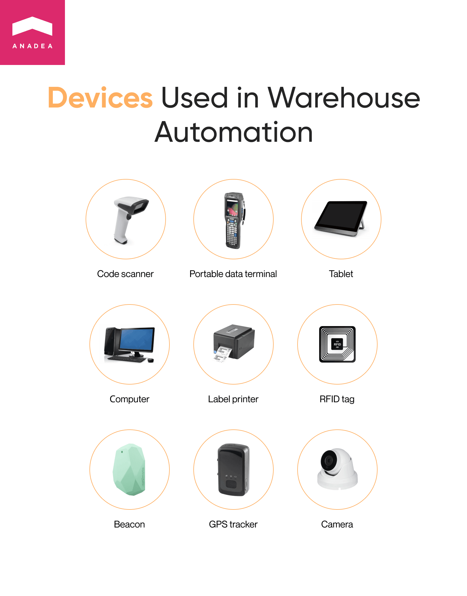

Technologies are continuously changing the world around us. And it is impossible to argue that the business world is susceptible to changes that are caused by the tech revolution. But the implementation of various software tools and systems into business processes by companies of all types and sizes is not just a modern trend. That’s already a necessity that allows businesses to stay strong in the market competition and to gain additional advantages that can help them to stand out from the row of their rivals. In this article, we’d like to focus on one very important sphere of application of tech solutions. This is warehouse management and warehouse automation. We will explain what benefits companies can enjoy after investing in <a href="https://anadea.info/solutions/supply-chain-software-development/warehouse-management" target="_blank">warehouse management system development</a> and what technologies are believed to be the most promising today in this sector.

## Warehouse automation: Brief overview
In general, automation always presupposes the replacement of some manual tasks with automated processes. In other words, when you are building a warehouse automation system, first of all, you need to detect repetitive tasks that are currently performed manually and find the most feasible ways to automate them with the help of tech solutions.

When we are talking about retail and wholesale businesses, their success greatly depends on their ability to quickly address all the needs of their clients, process orders, organize deliveries in the shortest time periods possible, and reduce the expenses and costs of their services.

All this can be achieved thanks to the implementation of well-thought-out warehouse automation software. Given the fact that such solutions are actively gaining popularity these days as more and more businesses are integrating them into their software systems, quite soon it can become rather challenging to stay ahead of the competition while still relying only on manual processes in warehouse management.

And the real figures are the best proof of this idea. More than a decade ago, in 2012, the volume of the global warehouse automation market was around $8 billion. In 2021, the market size managed to practically reach the mark of $19 billion. And according to experts, this figure is far from the peak. It is <a href="https://www.globenewswire.com/en/news-release/2022/06/19/2465012/0/en/Warehouse-Automation-Market-Size-to-Reach-USD-64-639-by-2030-Says-Acumen-Research-Consulting.html#:~:text=Pune%2C%20INDIA,14.8%25%20from%202022%20to%202030." target="_blank" rel="nofollow">projected</a> that the warehouse automation market size will hit the mark of $64 billion which means that the forecasted CAGR for the period from 2022 to 2030 is almost 15%.

According to another <a href="https://www.businesswire.com/news/home/20210621005532/en/Global-Warehouse-Automation-Robots-Technologies-and-Solutions-Market-Report-2021-2030---ResearchAndMarkets.com" target="_blank" rel="nofollow">study</a>, in 2021, nearly 80% of warehouses didn’t use any automation technologies while 15% of them had at least some mechanization solutions, and only 5% by that time had already implemented more complex automation systems. Nevertheless, step-by-step these figures are growing. And this tendency opens new opportunities for both those companies that work with warehouse automation technology and deliver sophisticated solutions to the market and those that use such software in their business processes.

## Why warehouse automation is important
In order to understand whether your business really needs to launch such a solution, it is necessary to consider all the advantages that warehouse automation technology has.

### Financial feasibility
Any errors, even the smallest ones, in warehouse management can result in huge financial losses not only for one company but also for all the participants of the supply chain. And while a lot of vital tasks are performed manually, it is impossible to avoid all the risks related to the human factor. That’s why investments in custom warehouse management system development help businesses to be on the safe side with such solutions, and risks of errors are minimized.

### Well-informed decisions
When you install smart devices with various sensors at your warehousing facilities, you can get a lot of valuable real-time data that can be used for further business strategy planning as well as for adjusting existing business processes to the ongoing market needs. For example, with smart devices, you can track how quickly some particular items are sold out or what is the average order per client.

### More precise analysis and forecasting
Thanks to real-time data gathered by smart IoT devices, you can detect various trends with a higher level of accuracy which will allow you to better predict the changes in customer behavior and their needs.

### Higher productivity and increased speed of order processing
With automated systems, the work can be organized in a 24/7 regime. Moreover, thanks to the possibility to rely on tech solutions for a wide scope of repetitive tasks, employees have more time to focus on more complicated and creative tasks that require human involvement.

### Better safety monitoring
Thanks to advanced security systems powered by the Internet of Things, managers can monitor safety at the facilities even in a remote format and receive notifications when any threats are detected, which allows them to timely take the necessary measures. Moreover, it is also possible to set a system in such a way that it will send alerts not only to authorized users but also to the relevant authorities. For example, if a smart system detects smoke, it can automatically send an alert to the fire brigade and to the smartphones of warehouse operators and managers. With this functionality, it will be possible to minimize financial losses and damages.

## Does your company need an automation warehouse system?
How can you understand that it is high time for you to think about the implementation of warehouse automation software into your business process? Actually, there is no “one-size-fits-all” solution. And there can’t be any universal recommendations. But there are some signs that can be viewed as alerts for the necessity to introduce changes to the currently applied business processes.
* You can’t cope with order processing in time due to a lack of employees.
* You notice that the number of orders completed is decreasing.
* There are mistakes in inventory management.
* You still use obsolete software tools that do not have the required functionality.
* The level of customer satisfaction is going down.

If you have at least one of the above-mentioned issues, it can be already a reason to consider the possibility to implement automation tools as namely automation can be a good answer to all the typical problems that warehouses face.

But for making a well-grounded decision, you will also need to estimate the state of your business processes, and analyze the existing software system and its capacities to be integrated with tools built with new technologies. If you do not have enough resources for doing that, it is highly recommended to establish cooperation with experts who will be able to help you with the tasks. At Anadea, we are always ready to help you at all stages of building a software solution and provide <a href="https://anadea.info/services/consulting-and-audit" target="_blank">consulting services</a>. We can also support you at all the required preparatory steps that typically include the audit of existing infrastructure, as well as business analysis and planning.



## Typical features of a warehouse automation system
When you build a custom solution for your business, you can develop any features that are required by the current needs of your company. Moreover, you can also ensure the necessary scalability for further expansion of your system when it is. In other words, the set of features that will be initially included (and of those that you will plan to integrate in the future) will greatly depend on the processes that you need to automate.

Below you can find a list of the most popular features typically developed for warehouse automation systems.

### Layout planning
To navigate and move faster at the facilities, especially when there are a lot of separate zones, employees need to have a good understanding of the layout. Modern software for warehouses can offer functionality for displaying detailed layouts with the indication of every zone. These layouts can be simply and quickly edited so that all the changes are timely demonstrated.

### Code scanning
Today one of the best ways to enhance inventory management is tagging products, packs, and pallets with barcodes or QR codes or using RFID tags. When these marks are scanned (either by people or by robots), information is sent to the server which allows warehouse operators to control orders and deliveries automatically. When the system detects that the stock of this or that item is critically low, it can send a notification.

### Real-time video streaming
If you have a very small warehouse, maybe it is possible to control everything without cameras. However, when we are talking about big facilities, streaming from security cameras is of crucial importance for tracking productivity and controlling safety.

### Report generation
Good analytics is one of the most important components of successful business growth. Precise statistics and predictions ensured by AI-driven tools help to make better business decisions. Warehouse automation systems can provide users with detailed reports on every operation. Thanks to such info, warehouse managers can detect the periods of peak sales, the most popular items, the best delivery method, etc.

### Creation of picking lists
When employees have precise directions on the article placement, the process of picking items take significantly less time. Automated warehousing systems can create detailed picking lists with indications of the shortest way to find the necessary item.

### Electronic workflow and record-keeping
Paperwork typically includes numerous time-consuming processes and is associated with various mistakes caused by a human factor. But if you decide to automate it, you will notice the difference. Your software can help you to avoid such issues as conflicting data or record duplication. Modern systems ensure shared access to various documents and their security.

### Financial functionality
Invoicing, billing, tax calculation, and other related tasks can become a real nightmare for teams that need to execute them manually. But with the right software, they can be automated which lets employees concentrate on other tasks. This functionality is especially important for middle-sized and big warehouses. Systems with such features are often integrated with an accounting platform used by a company.

## Automated warehouse technology: types of systems and devices
When you are planning to launch your own warehouse automation system, it is necessary to understand that today there are several types of such solutions that can fulfill a wide range of different tasks. And the choice should depend on the peculiarities of the processes that are currently applied at your facilities and the level of automation of your warehouses. But first of all, let’s have a look at these system types and their differences.

### Warehouse management system (WMS)
The key functionality of such systems is related to inventory tracking and management. It can help you to monitor all inventory flows, orders, and labor tasks assigned to employees.

### Warehouse control system (WCS)
Such a system should enter the game when you have highly automated warehouses. In other words, it is sensible to use this type of solution, when, for instance, items and pallets are moved not by employees but with the help of special automated equipment like sorters or conveyors. In this case, a WCS is used for processing commands and general optimization.

### Warehouse execution system (WES)
This solution can be defined as a combination of all the features that warehouse management and control systems can provide. The functionality of a WES typically covers such processes as inventory management, task tracking, item picking, and deliveries.

But software is only one part of a warehouse automation system. It is impossible to automate warehousing processes without using special devices, such as:
* Code scanners
* Portable data terminals
* Tablets/computers
* Label printers
* RFID tags
* Various smart sensors
* Beacons
* GPS trackers
* Cameras, and others.

It doesn’t mean that when you are building a solution for your facilities, you need to invest in all this equipment. Definitely not. Your investment and the necessity to purchase any device largely depend on the desired features and functionality.

## The future of warehouse automation
While some of the solutions like automated code scanning are already massively adopted, there are some projects that at the moment are not widely implemented. However, they look quite promising which gives us solid grounds to suppose that in the future their importance for automated warehousing systems will be significantly higher.

* __Smart glasses.__ Such glasses can help staff in picking items for their further transporting or moving as well as in scanning product tags. It can be possible thanks to AR features. When a person who is wearing this device is looking at a product or item, he or she can immediately see all the relevant data like the date of delivery, expiry date, etc.
* __Self-guided vehicles.__ They can perform a lot of tasks without any involvement of employees. For example, being operated fully remotely, they can transport items or load carriers. Thanks to the use of such devices, it will be possible to reduce labor costs and increase safety for employees at the facilities.
* __Drones.__ Though at the moment, it is senseless to talk about the full-scale use of drones today, this direction in warehouse automation definitely has good prospects. They can not only move some items but also track stocks and scan tags and codes with the help of special modules.

## What companies rely on warehouse automation?
It is interesting to observe how companies integrate modern software solutions into their working process. Among the business that already today successfully use various automation tools, there are some big names that you have definitely heard about.

__Zappos__ is probably one of the most well-known examples as it was one of the pioneers in implementing fully automated warehouse services and leveraged robotics. Thanks to the optimization of operating costs and streamlining all the processes, the company can offer free shipping, quick delivery, and a very flexible return policy.

Another bright example of a company that has successfully deployed warehouse automation solutions and now can enjoy the benefits and expand its business is __IKEA__. According to the company’s representative, when they took a decision to launch such a system at their warehousing facilities they wanted to ensure product availability for their clients and build an ergonomic workplace for their team. Thanks to the fact that now a lot of processes are performed automatically, people can concentrate on value-adding tasks. A lot of attention was paid to the tasks related to order processing and inventory management. Advanced automation solutions help to make sure that customers can get their items in the shortest terms.

## Summing up
Given the growing interest from the side of businesses in deploying automation systems at their warehouse, it is not surprising at all that the number of ready-made tools that are available today in the market is increasing as well. But advanced warehouse automation systems are usually big complex solutions that cover a wide range of various processes. And to demonstrate the highest efficiency and to help you achieve your goals, such a system should perfectly satisfy your needs. Can a ready-made product ensure this? It is highly unlikely.

Nevertheless, when you are building your own custom system, you can enrich it with any functionality that you need and ensure the required tech conditions so that any modernization will take place quickly and seamlessly.

If you have plans to integrate a warehouse automation solution into your software infrastructure or you want to add new features to the already existing product that you have been already successfully using for a while, do not hesitate to contact us and share your ideas! At Anadea, we have all the required skills and resources to help you. We will study your case, analyze your vision, offer the best approaches to your project realization, and build a system that will boost your business growth.

Request a free quote
