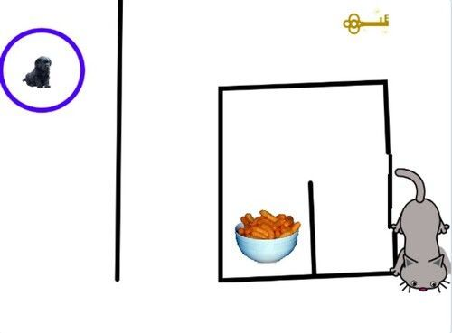

**What’s in common between my 8-year-old son’s project for a school contest on creative programming and my everyday work as a developer?** There’s a lot, as it turned out.

## It started well… Until there are issues

My son’s project was short games like this one. A little puppy needs to bypass obstacles and get the key to open a square room to eat some snacks. It needs not to stumble upon a cat that walks up and down the playing field. The puppy’s movement is controlled by the arrows on the keyboard. By the way, it's not that easy to win. =)

The project was pre-selected for the subsequent competition stage, and my son needed to make some enhancements to it. He threw himself into making improvements with enthusiasm, but **immediately faced unexpected system behavior**. He asked me for help to reveal the root of the problem.

I took a closer look at his game and found some common issues. To my surprise, **I realized that on my own current project, as well as on many projects before, I had the very same problems.**

## What are bugs in programming? And what was wrong with my son’s game?

In my son’s game, the start button was placed in 3 different places (a start page of every game). In a rush of inspiration, he forgot to make changes to all of them. It resulted in getting what we call **bugs**.

Not long before, I was invited to work with an existing website that needed some enhancements. I had to add some new features, make the website perform faster, and change the contact form colors.

In that project, I found 11 different contact forms. Each of them led to the support email, but had different text and color properties.

## The problem needed to be solved, period.

Such a situation is very common for big projects. I had to find the reason some messages from users couldn’t be received by the support of this website. I found that somebody forgot to change email to a small part of existing contact forms.

### Avoid repeating elements or logic in software code

To resolve this problem and avoid similar ones in the future, I extracted all forms to a separate module. This module had configuration for color, text, and email. At the end, we plugged the form to all 11 places on the website. So now the forms have different colors and text and one email for contacting the support. This is not only convenient, but very easy to maintain.

There’s another side to this situation. Say, you’ve got a popular and successful website that brings you profit. A billion users visit it, so you decide to expand your developer pool. A new developer has to spend some time getting acquaintance with your website or app. **And they will spend a lot of time getting understanding about all 11 contact forms, or may even not find all of them to change a support email.** So when you try to avoid repeating your elements or logic, it results in expenses cut.

### Perform tests in software development

The second level of protection from unexpected behavior after changes in your app or website is to anticipate the behavior of business logic and get some proof of this prediction. We call these proofs **tests**. If you have tests for every contact form behavior, you are protected from unexpected errors. For example, you can have the test implying that the user enters a message and submits the form after that message is delivered to a specific email.

**After my changes, I have to run only one test for all contact boxes, and before, 11 tests were needed.** This approach decreased the development time significantly.

### And a few words about refactoring

When I found the same issues in my son’s project, I suggested that he rewrote his code based on my experience - this process we call **refactoring**. And it is the best way to heal an existing website or app from problems caused by unexpected behavior of different business logic parts. So, when you experience a situation where end-users are facing inconsistencies, contacting user support, or just going away to competitors, now you know how to avoid all these setbacks.

## How we apply programming best practices in our work. (Happy end)

Just to sum it up, what do programmers do with a problematic existing project to make it fast, up-to-date, and scalable?

**They cover code with tests, avoid repeated pieces of business logic and sometimes do refactoring.**

Finally, my son’s project won the first prize. When programming best practices are used for your idea implementation, your website, mobile application or desktop application will bring satisfaction to you and joy and benefit to users. If you want to make sure it will, you can request a <a href="https://anadea.info/services/code-review-service" target="_blank">code review service</a> from Anadea.
