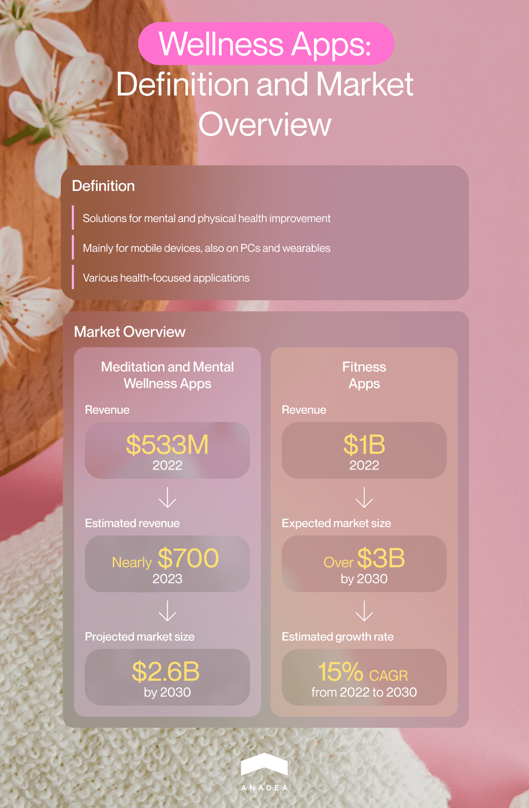
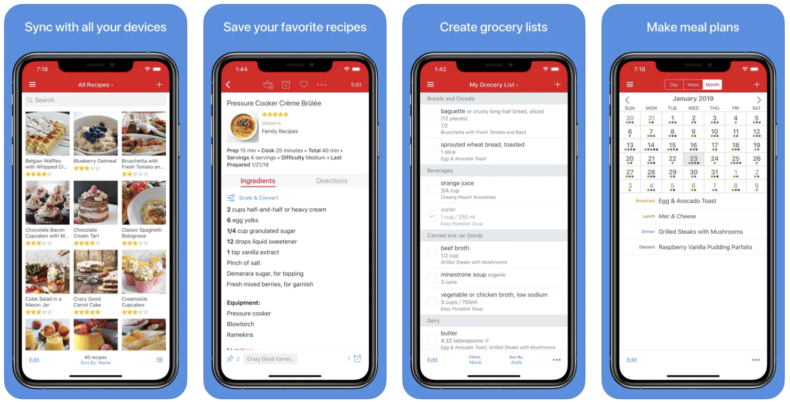
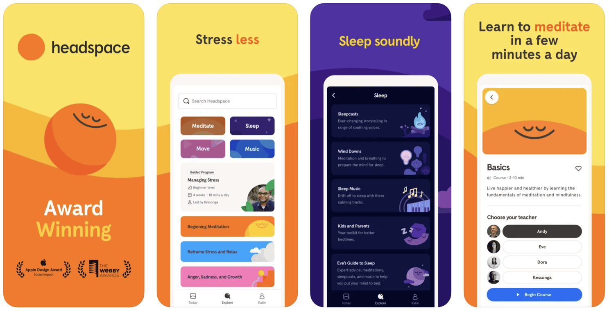
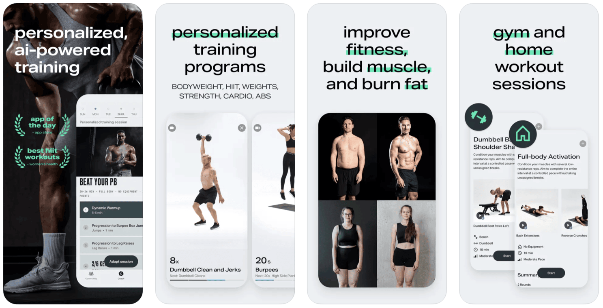
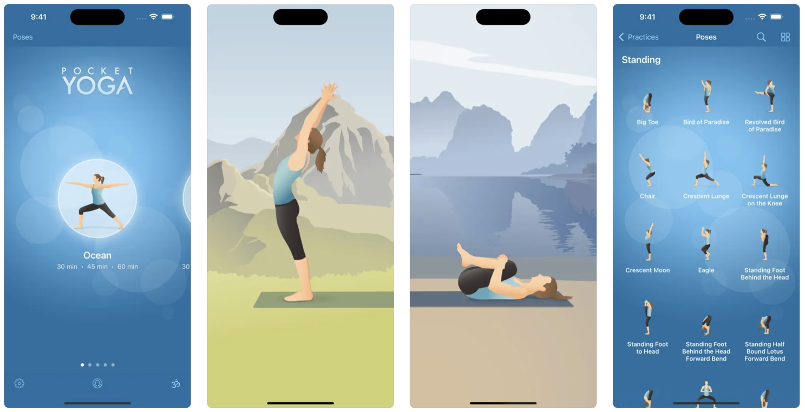
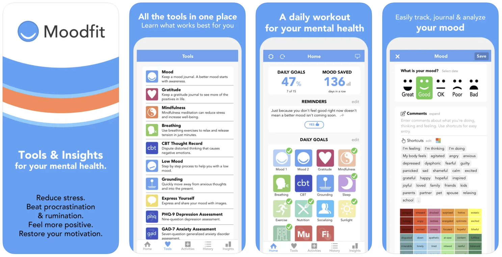
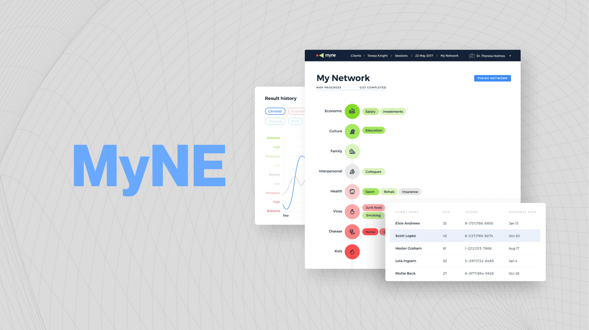

Today we observe an increased attention of people to their health and well-being. We have started to think about what we eat, what activities we have, what influence our work has on our mental health, and whether we sleep enough long and enough well. It's a very positive trend that has a strong impact on the general quality of living that society has. Amid these ongoing changes in the mindset of people, we can also notice the growing demand for health and wellness applications that can make it easier for people to track their habits, adjust their menus, and monitor various vital parameters.

To address this demand, more and more medical organizations and startups are launching wellness app development projects. The list of the wellness apps that are available today is rather impressive. But it doesn't mean that newcomers have no chance to attract the attention of the audience. **The market still requires fresh ideas and innovative solutions.** That's why if you have plans to build a health and wellness app, we recommend you attentively read this article. At Anadea, we have experience in creating solutions for this industry and now we'd like to share our insights with you.

## What is a wellness app?

Let's start with a general definition. Wellness apps can be explained as software solutions that help people monitor and enhance their mental and physical health. The majority of such products are built for **mobile devices** but there are also applications for **PCs and wearables**.

Today quite a lot of types of solutions can be included in this group and we will consider them further in this article.

## Health and wellness applications: Market overview

Given the variety of health and wellness applications, researchers may provide different figures and statistics for this market.

For example, if we take exclusively the meditation and mental wellness apps, we will see that the revenue of such solutions worldwide achieved the level of $533 million in 2022, while in 2023, this figure is already close to $700 million. According to <a href="https://www.statista.com/statistics/1390630/meditation-app-market-forecast/" target="_blank">forecasts</a>, by 2028, the meditation app market size is projected to hit the mark of $2.6 billion.

The fitness app market is also growing. Analysts <a href="https://www.globenewswire.com/news-release/2023/12/18/2797955/0/en/The-Fitness-APP-Market-size-growing-with-a-CAGR-of-15-00-Growth-Outlook-from-2022-to-2030-projecting-market-trends-analysis-by-Application-Regional-Outlook-and-Revenue.html#:~:text=The%20Fitness%20APP%20Market%20is,15.00%25%20during%20the%20forecast%20period." target="_blank">believe</a> that its volume will be more than $3 billion in 2030, while in 2022 it was around $1 billion. It means that a CAGR over the forecast period will be 15%.

Create my wellness app

## Types of wellness apps

There can be different approaches to classifying wellness applications. We offer you the following one that is based on the key goals of the solutions under consideration.

### 1. Nutrition and meal planning apps

A healthy diet is one of the main components of healthy living. However, it can be rather challenging to track your nutrition without supportive tools. That's why special apps for managing consumption, planning meals, testing new recipes, and getting access to nutritional information from experts are highly demanded today.

**Paprika** is one of the best examples of such apps. This solution helps users manage their recipes, create their nutrition plans, and compose grocery lists.

### 2. Meditation apps

Meditation is a popular way to shift your focus from your hectic everyday activities and relax. Apps of this type offer various meditation programs. Very often they are also enriched with tools for tracking mood changes and getting recommendations on gaining mental calmness.

They can also have some additional features, for example, playlists with sleep sounds and music just like the **Headspace** application offers.

### 3. Apps for setting fitness goals and boosting productivity

It is a well-known fact that for our health, we need to maintain a relevant level of physical activity. Including a fitness routine in your daily schedule will help you to keep fit and stay productive. A reliable application of this type can increase the efficiency of your efforts and drive motivation.

Such apps can not only remind you about the necessity to do some physical exercise but also provide you with a workout plan and even AI-powered personal coaches. For example, with **Freeletics** such features are available.

### 4. Yoga apps

Yoga is a rather popular form of exercise that can be done practically everywhere. It means that to practice yoga you do not need to go to the gym and it even doesn't require specific equipment. As it is not obligatory to attend group classes, you can practice yoga on your own and an app like **Pocket Yoga** can help you. Such apps typically include yoga practices for users with different skills and experiences.

### 5. Wellbeing apps

Such apps are intended to help users support their overall mental health. These solutions usually offer such features as mood and/or gratitude journals, cognitive behavioral therapy practices, as well as sleep and lifestyle trackers.

**Moodfit** is one of the popular applications in this category. It includes a wide range of features that are said to help users reduce stress, overcome procrastination, and feel more positive.

When you want to create your own app, it is always very helpful to analyze the range of solutions that have already managed to win the hearts of users. That's why at the stage of ideation, we recommend you study the list of the <a href="https://anadea.info/blog/best-healthcare-apps" target="_blank">best healthcare apps</a> to understand what apps boast popularity.



## Wellness app development process

Before proceeding to the development of a software product, you should fulfill a row of preparatory tasks that will help you to make sure that you have chosen the right direction for your project realization. Moreover, a well-conducted preparatory phase will help you to reduce financial risk related to the launch of solutions that won't manage to gain popularity among users.

Below you can find a brief step-by-step guide that will help you organize the wellness app development process in the right way.

1. **Ideation**. First of all, you need to think about the concept of your solution. You should detect your niche, your target audience, and the type of your app. At this step, we highly recommend you conduct in-depth market research to define what apps boast popularity today and what expectations users have. Based on the results of this market study, you will be able to elaborate your own idea.

2. **Establishing cooperation with developers**. When you already understand what solution you want to launch, you should fund specialists who will be able to transform your ideas into a real product.

3. **Discussion of requirements.** Together with your development team, you will need to determine the project's scope, prepare a roadmap, set a budget, and detect the required tech stack and all the necessary resources.

4. **MVP development.** This step can be skipped. Nevertheless, we usually recommend our clients not to do it. The launch of a minimum viable product will help you to evaluate your idea itself and gather users' feedback. Based on the collected opinions, you will need to understand whether you need to introduce any changes in your products. As an MVP contains only the most basic features, your investment in your development will be significantly lower in comparison to the development of a full-scale product. As a result, you can avoid serious financial risks.

5. **Design and development.** Based on the provided requirements, programmers will develop the necessary functionality while designers will create interfaces.

6. **Testing and QA.** To make sure that your solution will be bug-free and will function as it is supposed to, your team will need to conduct a row of different tests. Some of them should take place in parallel with development while others should be performed after the end of coding.

7. **Release**. When your solution is well-tested, it can be released so that end users will get access to it.

8. **Post-launch support and maintenance**. Even when your app is successfully functioning, your team still has a lot of work to do. It is necessary to track its performance to have the possibility to detect risks and vulnerabilities and address them. Moreover, it is necessary to make sure that your app is up-to-date and it fully meets the requirements of users. It will be a good idea to collect users' feedback to enrich your application with new functionality that users want to have.

In one of our previously published blog posts, we talked about the creation of healthcare CRM platforms. Though it is rather similar to the process of wellness app development, it has its peculiarities. Follow our article on <a href="https://anadea.info/blog/healthcare-crm-development" target="_blank">CRM software development for healthcare</a> to learn more.

Get started with us

## How to hire health and wellness app developers

Today the number of companies and individual contractors who offer their <a href="https://anadea.info/solutions/medical-app-development" target="_blank">medical app development services</a> is continuously growing. That's why the process of making a choice can become a serious challenge. First of all, you need to make up your mind whether you want to work with freelancers or with a software development agency.

On one hand, the variant of working with freelancers may seem to be a very appealing one from the perspective of the financial aspect. However, you should be aware of possible risks related to the lack of responsibility from the side of hired specialists. Cooperation with freelancers has a lot of benefits which are more relevant in the case of short-term tasks. When it comes to wellness app development projects, hiring a professional company like Anadea looks like a more sensible solution.

The recommendations related to the search for a good software development company are rather simple. You can either use Google or turn to professional platforms like **GoodFirms** or **Clutch**. There you can find different rankings of companies related to their key services and expertise. Moreover, such platforms contain real reviews left by the previous customers of different teams. It is always very useful to study them beforehand to understand what drawbacks you can face.

We highly recommend you pay attention to the following parameters and aspects:

- Experience in the chosen domain (in this case it will be wellness app development);
- The tech stack that the team works with;
- Successfully launched health and wellness applications (it will be helpful to take a look at the company's portfolio);
- The offered engagement models.

As for the rates, of course, they also matter. You need to understand whether your budget corresponds to what the team expects to get from you for the work done. Nevertheless, just rates will tell you nothing. You need to ask the chosen team to provide you with the estimate. The development cost is calculated based on the row of factors. And that's exactly what we are going to discuss in the next section of our article.

Request for proposal

## Wellness app development cost

When you are thinking about how to create a wellness application, it is obvious that the questions related to the required budget will also be among the most important and serious ones.

Nobody can name any precise figures without a deep analysis of your requirements and the specificity of your idea. For estimating the development costs, it is necessary to take into account such aspects as:

- the desired functionality;
- the tech stack;
- integrations;
- the size of the team and its composition;
- the project time frames.

On average, the development of wellness applications **starts at $40K**. It is lower if you need to create a very simple app or an MVP of your solution with only a basic set of features. It can also be higher in those cases when you want to implement the most innovative functionality.

On our website, you can also find detailed information regarding the <a href="https://anadea.info/guides/healthcare-app-development-cost" target="_blank">cost of healthcare app development</a>. This guide will help you better understand how project costs are calculated.

Get customized quote

## Our expertise in health and wellness app development

Our team works with businesses from different industries and domains. And one of the markets that we have the richest expertise in is the market of health and wellness applications. Our <a href="https://anadea.info/projects#healthcare" target="_blank">software company portfolio</a> includes a row of successfully built and launched solutions for this industry. A psychology app <a href="https://anadea.info/projects/my-ne" target="_blank">MyNE</a> is one of them.

This product is a tool that helps to detect a patient's mental health state and define possible measures and steps that can be applied to enhance it. This app is intended to be used by mental and medical specialists to monitor all the changes in a patient's state, track the progress, and identify the risks of crisis moments.

The application has such features as mind maps for evaluating personal characteristics, comprehensive monitoring tools, personal accounts, and a questionnaire builder that allows specialists to create forms with questions for patients.

Our team worked on the development of this solution from scratch and provided such services as project management, front-end development, back-end development, UI/UX design, and quality assurance. We helped the client choose the most appropriate tech stack that was required for building a safe and reliable application and reducing the project costs. We followed the principles of test-driven development and design to make sure that the final product would fully meet the set requirements.

Hire app developers

## Instead of the final word

The launch of a well-thought-out health and wellness app can become a win-win game for both users and businesses. While users get an excellent tool that will bring benefits to their physical and/or mental health, businesses can leverage an additional revenue source.

The demand for such solutions is high. It means that if you already have an idea for such a project, you shouldn't miss your chance. In case you do not have in-house developers and you need professional tech support for your project, you can always rely on our team. At Anadea, we are always open to new ideas and we will be happy to help you in your project realization.

Contact us to get more detailed information about our services!

Get in touch
