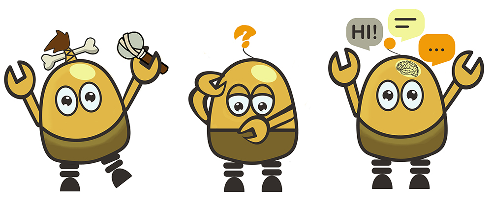

The evolution of artificial intelligence is now in full swing and chatbots are only a faint splash on a huge wave of progress. Today the number of users of messaging apps like WhatsApp, Slack, Skype and their analogs is skyrocketing, Facebook Messenger alone has more than <a href="https://www.statista.com/statistics/417295/facebook-messenger-monthly-active-users/" rel="nofollow" target="_blank">1.2 billion</a> monthly users. With the spread of messengers, virtual chatterbots that imitate human conversations for solving various tasks are becoming increasingly in demand. Chinese WeChat bots can already set medical appointments, call a taxi, send money to friends, check in for a flight and many many other.

Online chatbots save time and efforts by automating customer support. Gartner forecasts that by 2020, over 85% of customer interactions will be handled without a human. However, the opportunites provided by chatbot systems go far beyond giving responses to customers' inquiries. They are also used for other business tasks, like collecting information about users, helping to organize meetings and reducing overhead costs. There is no wonder that <a href="https://www.statista.com/statistics/656596/worldwide-chatbot-market/" rel="nofollow" target="_blank">size of the chatbot market</a> is growing exponentially.

Of course, it is not so simple to create an interactive agent that the user will really trust. That's why IM bots have not replaced all the couriers, doctors and the author of these lines. In this article, instead of talking about the future of chatbots, we will give you a short excursion into the topic of chatbots, how they work, how they can be employed and how difficult it is to create one yourself.

## What is chatbot and what is it for?

According to <a href="https://en.oxforddictionaries.com/definition/chatbot" rel="nofollow" target="_blank">Oxford Dictionaries</a>, a chatbot is

> A computer program designed to simulate conversation with human users, especially over the Internet.

It is an assistant that communicates with us through text messages, a virtual companion that integrates into websites, applications or instant messengers and helps entrepreneurs to get closer to customers. Such a bot is an automated system of communication with users.

Why does a business need chatbots? There are reasons for that like getting rid of routine tasks and simultaneous processing of multiple requests from users. Besides, a tremendous speed of processing users' requests with chatbots helps gaining customers' loyalty.

Consumers also benefit from chatbots and they are getting increasingly interested in this technology. A <a href="https://www.researchgate.net/publication/318776998_Why_people_use_chatbots_Paper_accepted_for_presentation_at_the_4th_International_Conference_on_Internet_Science_22-24_November_2017_Thessaloniki_Greece" rel="nofollow" target="_blank">study</a> presented at the 4th International Conference on Internet Science in November, 2017 identified reasons why people choose to interact with chatbots. According to this research, the main factors that motivate people to use chatbots are:

* **Productivity.** Chatbots provide the assistance or access to information quickly and efficiently.
* **Entertainment.** Chatbots amuse people by giving them funny tips, they also help killing time when users have nothing to do.
* **Social and relational factors.** Chatbots fuel conversions and enhance social experiences. Chatting with bots also helps to avoid lonliness, gives a chance to talk without being judged and improves conversational skills.
* **Curiosity.** The novelty of chatbots sparks curiosity. People want to explore their abilities and to try something new.

### Take a look into the history of chatbots

And we will find that the first conversational bot was written in the USA in 1966. It was implemented by Joseph Weizenbaum, computer scientist of the Massachusetts Institute of Technology, and was named [Eliza](https://en.wikipedia.org/wiki/ELIZA). The chatbot misled people, so authentic the communication with it was.

In the early 90's, the Turing test, which allows determining the possibility of thinking by computers, was developed. It consists in the following. A person talks to both the person and the computer. The goal is to find out who his interlocutor is - a person or a machine. This test is carried out in our days and many conversational programs have coped with it successfully.

### As for types of chatbots

Depending on how the specific bots were programmed, we can divide them into two large groups: working according to pre-prepared commands (simple chatbot) and trained (smart or advanced chatbot).

**Simple chatbots** work based on pre-written keywords that they understand. Each of these commands must be written by the developer separately using regular expressions or other forms of string analysis. If the user has asked a question without using a single keyword, the robot can not understand it and, as a rule, responds with messages like "sorry, I did not understand".

**Smart chatbots** rely on [artificial intelligence](https://anadea.info/blog/artificial-intelligence-pandoras-box-or-the-holy-grail) when they communicate with users. Instead of pre-prepared answers, the robot responds with adequate suggestions on the topic. In addition, all the words said by the customers are recorded for later processing. However, the Forrester <a href="https://www.forrester.com/report/The+State+Of+Chatbots/-/E-RES136207" rel="nofollow" target="_blank">report</a> "The State of Chatbots" points out that artificial intelligence is not a magic and is not yet ready to produce marvelous experiences for users on its own. On the contrary, it requires a huge work:

> Chat developers and designers are the gardeners: they have to tend to the chatbots and coach their growth through continuous, yet gentle, correction. these designers must also beg, coerce, and incent customers to put up with subpar experiences during the process: the learning is really slow.

### The most popular chatbot

There are various search engines for bots, such as <a href="https://chatbottle.co/" rel="nofollow" target="_blank">Chatbottle</a>, <a href="https://botlist.co/" rel="nofollow" target="_blank">Botlist</a> and <a href="https://thereisabotforthat.com/" rel="nofollow" target="_blank">Thereisabotforthat</a>, for example, helping developers to inform users about the launch of new talkbots. These sites also provide a ranking of bots by various parameters: the number of votes, user statistics, platforms, categories (travel, productivity, social interaction, e-commerce, entertainment, news, etc.). They feature more than three and a half thousand bots for Facebook Messenger, Slack, Skype and Kik.

Through the chatbot search engines, you can find an interesting application in each category, e.g. the best chatbot for Facebook Messenger is Poncho. It sends you personal weather forecasts with jokes or funny memes and, thus, looks more like a meteorologist friend than a soulless weather reporting service.

## What can chatbots do?

> I think chatbots are the future of engagement between a fan and a brand or celebrity. (Christina Milian)

Both startups and savvy companies are now incorporating interactive agents into their daily operations, communication with customers and sales processes. Chatbots can help to:

**Improve customer service.** It is the best option for those who don't want their customers to:

* Wait for operator's answer - "Stay on the line, your call is very important to us" is always annoying, isn't it?
* Search for an answer in the FAQ - as a rule users don't have time for scrolling dozens of pages with instructions.

**Streamline the shopping process.** It only takes to write what you want to the chatbot and the bot will send the information to the sales department. You don't need to repeat several times "I need the same, but with metal buttons". Besides, the chatbot remembers your preferences and uses this information when you return.

**Personalize communication.** A chatbot answers the specific questions of visitors instead of displaying a long list of information. The more attention a customer gets the more increases his desire to buy something.

**Improve a response rate.** About 90% of questions sent from Facebook business pages remain unanswered. Chatbot responds to 100% of messages and converts more visitors into buyers.

**Automate repetitive tasks.** Most customers want to get answers on the same questions - When do you work? What is your location? Do you make deliveries? In order not to write the same answers every time, make a chatbot. It reduces your employees' workload.

## How to build a chatbot

If we managed to inspire you to create your own chatbot, here are some tips to help you get started. There are 4 main stages:

1. **Define the goals.** What should your chatbot do? Clearly indicate the list of functions your chatbot needs to perform.  
2. **Choose a channel to interact with your customers.** Be where your clients prefer to communicate - your website, mobile app, Facebook Messenger, WhatsApp or other messaging platform.  
3. **Choose the way of creation.** There are two of them: using readymade chat bot software or building a custom bot from scratch.  
4. **Create, customize and launch.** Describe the algorithm of its actions, develop a database of answers and test the work of the chatbot. Double check everything before showing your creation to potential customers.

Now let's look closer at 2 approaches to building chatbots:

**Creating from scratch.** If you are not a programmer yourself, you will need to hire [software developers](https://anadea.info/) as this method requires work with code, manual integration with messengers and customization. Among the advantages of this approach are:

 * full compliance with your needs,
 * control over data the bot receives,
 * the possibility to make corrections easily,
 * best for a customer-facing chatbots.

This method may require significant financial and time investments.

**Using chatbot builder platforms.** You can create a chatbot with the help of services providing all the necessary features and integrations. It can be a good choice for an in-house chatbot serving your team. This option is associated with some disadvantages, including the limited configuration and the dependence on the service. Some popular platforms for building chatbots are:

 * <a href="https://mobilemonkey.com/" target="_blank">Mobile Monkey</a>,
 * <a href="https://chatfuel.com/" rel="nofollow" target="_blank">Chatfuel</a>,
 * <a href="https://beepboophq.com/" rel="nofollow" target="_blank">Beep Boop</a>,
 * <a href="https://www.chattypeople.com/" rel="nofollow" target="_blank">ChattyPeople</a>,
 * <a href="https://botsify.com/" rel="nofollow" target="_blank">Botsify</a>,
 * <a href="https://smooch.io/" rel="nofollow" target="_blank">Smooch.io</a>.

## Challenges of creating a chatbot

1. __Understanding natural language:__ Chatbots need to be able to understand and interpret natural language to communicate effectively with users. This can be challenging because people speak in different accents, dialects, and languages.
2. __Providing relevant responses:__ Chatbots need to be able to understand the context of a conversation to provide relevant responses. This means they must be able to recognize and interpret nuances in language.
3. __Integrating with other systems:__ Chatbots often need to access information from other systems to provide accurate information. This can be challenging if the chatbot needs to access information from multiple sources.
4. __Continuously learning:__ Chatbots need to continuously learn and improve to provide the best possible experience for users. This requires ongoing training and optimization of the chatbot's algorithms and models.
5. __Protecting user data:__ Chatbots must be designed with data privacy and security in mind to protect user data. This can be challenging, especially if the chatbot is integrated with other systems that may have different data privacy and security requirements.

A chatbot will be a good idea and bring you desired results only when these challenges are overcome. Sounds complex but definitely not impossible. <a href="https://anadea.info/contacts" target="_blank">Ask our developers</a> how they make it work and enjoy a chatbot created specifically for you!

### Remember:

* There are simple and advanced bots.
* An advanced chatbot is an artificial intelligence that communicates with a human.
* Conversational bots are useful both for business and customers.
* It is necessary to understand the language of a target audience.

## Conclusion. What to do?

Many business owners are just beginning to understand what benefits chatbots can bring to them. This technology is still in an early stage, its capabilities continue increasing and the best chatbots have yet to be created.

Invest in building a chatbot for your business and be at the forefront of innovation!
