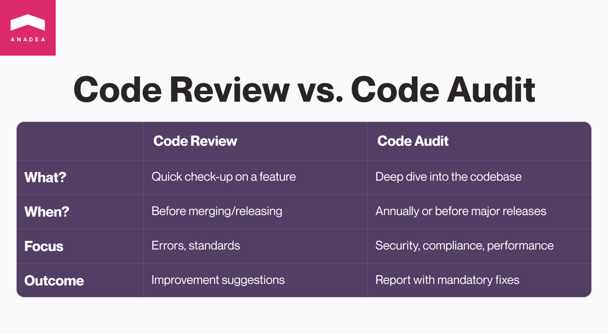
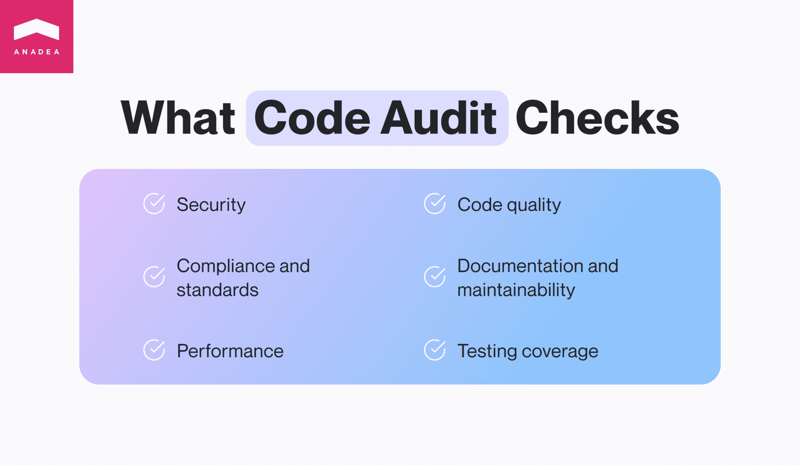
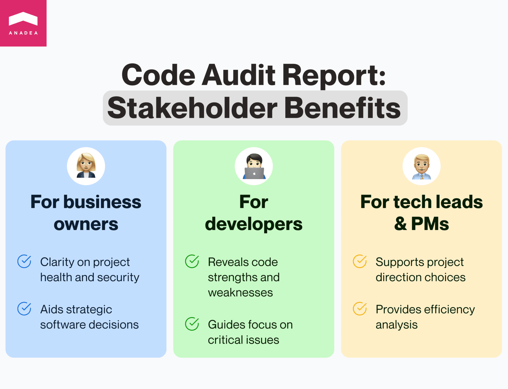
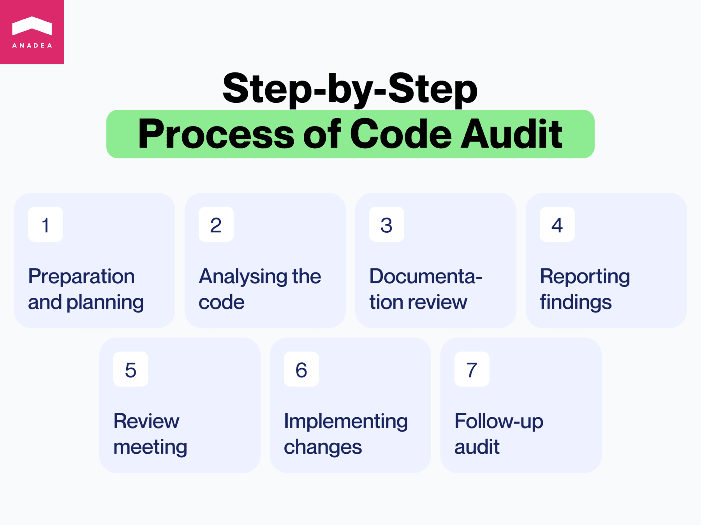

**You built it, you love it—your software is a masterpiece.** But is it functioning at its best? In this rapidly changing tech world, ensuring your code is high-quality and secure is critical. That's where a <a href="https://anadea.info/services/code-review-service" target="_blank">code audit</a> comes in. It's a comprehensive analysis of your codebase designed to identify any areas for improvement.

This article will give you the inside scoop on code audits: we'll explore what they are, why they're important, and how they work. Think of it as a guide to getting the best possible code for your business.

## Code Review vs. Code Audit: What’s the Difference?

One question needs to be answered before we dive in: Are code audit and code review the same thing? Although they sound similar and are frequently used interchangeably, these are two different processes.

**Code review** is the process of systematically examining source code by peers to identify bugs, improve code quality, and facilitate knowledge sharing within the development team. Code reviews are usually less formal than audits and occur more frequently.

You can think of a code review as a quick check-up. It focuses on a smaller part of the code, like a single feature, and typically happens before the code is merged or released. Reviewers offer suggestions that developers can choose to accept or reject.

**Code audit** is a comprehensive analysis of a software codebase. Its primary goal is to identify security vulnerabilities, compliance issues, performance bottlenecks, and adherence to coding standards. Code audits are often required for regulatory or contractual compliance.

In other words, code audit is a deeper dive compared to a review. It examines a larger portion of code, like the entire codebase. It can happen annually or before a big release. The audit results in a report with a list of problems and recommendations that need to be addressed.

The key difference is that reviews are typically done by **fellow developers** during the development process. Code audits, on the other hand, can be done by **internal teams** or **external experts** and provide a more independent, in-depth analysis.

Further, we will break down the source code auditing process from the perspective of external experts you can go to whenever you feel the need.

Talk to experts

## What Does a Code Audit Include?

While the specific focus areas of a code audit can vary depending on its objectives, several key components are commonly included in most audits. Understanding these components helps stakeholders grasp the breadth and depth of an audit's coverage.

### Code Security Audit

* **Vulnerability assessment:** Identifies security vulnerabilities within the code that could be exploited by attackers. This includes common security issues such as SQL injections, cross-site scripting (XSS), and buffer overflows.
* **Code permissions and access control:** Reviews the implementation of permissions and access controls to ensure that users can only access data and actions that are appropriate for their privilege level.
* **Data protection:** Evaluates how sensitive data is handled, stored, and transmitted, ensuring that encryption and other protective measures are adequately implemented.

### Code Quality Audit

* **Coding standards compliance:** Checks whether the code adheres to industry-standard coding conventions and guidelines. This includes naming conventions, commenting practices, and overall code structure.
* **Code complexity:** Analyzes the complexity of the code to identify overly complex methods or classes that could be simplified. High complexity can indicate areas that are prone to errors or difficult to maintain.
* **Refactoring opportunities:** Identifies parts of the code that could benefit from refactoring to improve readability, reduce complexity, or enhance performance.

### Performance Evaluation

* **Bottleneck identification:** Pinpoints areas of the code that may be causing performance issues, such as slow response times or excessive memory usage.
* **Scalability assessment:** Assesses whether the application can efficiently handle increased loads, identifying potential scalability issues before they become problems.

### Compliance and Standards

* **Legal and regulatory compliance:** Ensures that the code complies with relevant legal and regulatory requirements, which may include data protection laws, accessibility standards, and industry-specific regulations.
* **Dependency analysis:** Examines third-party libraries and frameworks for known vulnerabilities, licensing issues, and compatibility concerns.

### Documentation and Maintainability

* **Code documentation review:** Evaluates the quality and completeness of code documentation, including inline comments and external documentation, to ensure that it adequately supports future maintenance and development efforts.
* **Codebase organization:** Assesses the structure and organization of the codebase, including the use of patterns, modularity, and the separation of concerns, to ensure that it is logical and maintainable.

### Testing Coverage

* **Unit and integration testing:** Reviews the comprehensiveness of existing tests, including unit and integration tests, to ensure they cover critical functionality and edge cases.
* **Test automation and CI/CD integration:** Assesses the integration of automated testing within the development process, including continuous integration/continuous deployment (CI/CD) pipelines, to ensure that tests are run consistently and efficiently.

**Code audits cover a lot of ground.** They look for security weaknesses, code quality issues, how well your software performs, and if it follows established coding rules. By giving your code a good once-over in these areas, a code audit uncovers valuable information. This information can then be used to make improvements, tighten up security, and keep your software project on track for the long haul. By understanding what a code audit checks for, you'll see why it's such a valuable and thorough process.

## When Do You Need a Software Code Audit?

You probably need one if you are reading this article. But let’s highlight a couple of common scenarios where a code audit would be recommended.

**The project is at a pivot point or you are thinking through a strategic decision. Here are some questions a code audit can help answer:**

* Should we buy or invest in this solution?
* Is it better to rewrite our existing code from scratch or keep maintaining it? What are the costs involved in each option?
* Should we continue working with our current vendors?
* Are there any regulatory hurdles we need to address (like HIPAA for healthcare applications or GDPR for applications processing EU citizens' data)?

**The project works on a regular basis without a need for strategic changes but a code audit is still strongly recommended. Here's why:**

* Your team has been focused on delivering new features quickly and accumulated technical debt. A code audit can help prioritize what needs to be addressed first.
* Your product is experiencing serious issues.
* Your product handles sensitive data and you want regular independent verification that it's secure.
* You are preparing for a significant change in your development team composition. New team members might struggle to understand the code, especially if it lacks clarity or has maintenance issues. A code audit can help with this transition.
* It's been over a year since your last code audit.

Therefore, it's hard to say what digital product throughout its life doesn’t need a code audit. There are many reasons for making a code audit a part of a project's routine. Whenever you have doubts about whether you need a code audit or want an expert consultation, feel free to contact us—we will answer all your questions.



## What Are Code Audit Deliverables?

**What do you get after the code audit is completed?** Code audit typically delivers a detailed report that outlines any problems or weaknesses found in your code. This report will also include suggestions on how to fix these issues and steps you can take to address them.

**Think of it as a roadmap for improvement.**

Here's how a code audit report benefits different stakeholders:

### Business Owners

The report gives you a clear picture of your project's health, including how well it scales, how reliable it is, and how secure it is. It also explains how any code issues might affect your product. More importantly, a good report can help you make strategic decisions about your software. It's helpful to know what questions you want answered before the audit even starts, so the report can address those specifically.

### Developers

The audit provides an objective assessment of a codebase, highlighting both its strengths and weaknesses. This comprehensive analysis helps developers understand the code better, potentially uncovering hidden issues they might have missed. Then, an audit helps prioritize vulnerabilities and technical debt. As a result, developers can focus on the most critical issues that could have the biggest impact on the application and allocate resources more effectively, ensuring the most significant risks are addressed first.

### Technical Leads and Project Managers

The audit findings can help tech leads and project managers make informed decisions about the project's future. Whether to refactor, rewrite, or maintain the current codebase becomes a clearer choice with the backing of a thorough audit. The report can also provide a cost-benefit analysis, helping you determine the most efficient path forward, whether it's investing in current solutions or exploring new ones.

In short, a valuable code audit report goes beyond just finding problems. It provides **code examples**, **explains the impact of issues**, and **suggests solutions**, making it a valuable tool for your development team.

Audit my code

## Why Code Audit From a Third Party?

While internal code reviews are valuable, there are significant advantages to bringing in an independent code audit company. Here’s why:

* **Fresh perspective.** In-house developers may become accustomed to the codebase and miss potential issues. A third party brings a fresh perspective and expertise in identifying vulnerabilities and best practices that may not be familiar to your team.
* **Objectivity and independence.** Internal teams may be hesitant to criticize their own work or the work of colleagues. A third-party auditor provides an objective and unbiased assessment, focusing solely on the code's quality and security.
* **Specialized skills and tools.** Third-party auditors often have access to specialized tools and techniques for in-depth code analysis that may not be readily available within your organization. They may also possess deep expertise in specific security standards or compliance regulations.
* **Enhanced credibility.** For businesses dealing with sensitive data or needing to comply with strict regulations, a third-party code audit can provide an extra layer of credibility and assurance. Knowing a neutral party has vetted your code can be valuable for building trust with customers and partners.

A third-party code audit offers a powerful way to gain a deeper understanding of your code's strengths and weaknesses. This independent perspective can be crucial for making informed decisions about your software's security, performance, and overall success.



## What Is the Code Auditing Process?

Our team approaches code audits with a meticulous process, ensuring a thorough and efficient review. Here's a breakdown of how a comprehensive code audit is conducted:

### Step 1. Preparation and Planning

* **Defining objectives.** As step one, we clearly define the audit's goals. Is the focus on security vulnerabilities, coding standard compliance, performance improvement, or a combination?
* **Gathering documentation.** That’s where we collect all relevant materials, including requirement specifications, design documents, and user manuals, to grasp the application's intended functionality and architecture.
* **Choosing tools.** We select the most suitable technologies and tools for the audit. This might include static code analysis tools, security scanners, and performance benchmarking tools.
* **Setting a timeline.** Establishing a realistic timeline for the audit considers the audit's scope and the codebase's size, while ensuring flexibility for collaboration.

### Step 2. Code Audit

* **Static analysis.** We use static code analysis tools that automatically detect potential issues within the code, such as syntax errors, code smells, and security vulnerabilities.
* **Manual review.** When required, we conduct a thorough manual review of the code to identify issues that automated tools might miss.
* **Security assessment.** Performing a detailed security assessment identifies vulnerabilities like SQL injection, cross-site scripting (XSS), and insecure authentication mechanisms.
* **Performance evaluation.** Analyzing the code for performance bottlenecks, identifying inefficient algorithms, and collaborating with developers to explore optimization opportunities.

### Step 3. Documentation Review

We make sure the existing documentation accurately reflects the codebase's current state involves working with developers to identify outdated information, missing documentation, and inconsistencies.

### Step 4. Reporting Findings

* **Compiling issues.** Our auditors draw a comprehensive report featuring all identified issues, categorizing them by severity and type (e.g., security, performance, compliance).
* **Providing recommendations.** We offer detailed recommendations for resolving each issue, including code snippets, references to best practices, and links to relevant resources.
* **Developing an action plan.** Our team creates an action plan to address the identified issues. Prioritization is based on severity and impact on the project.

### Step 5. Review Meeting

We organize a meeting with the client to discuss the audit findings. At the meeting, our team presents the issues, recommendations, and action plan, encouraging discussion to ensure everyone understands the findings' implications.

### Step 6. Implementing Changes

Based on the meeting feedback, we collaboratively finalize the action plan so the developers can take on implementing the changes. Tracking progress and ensuring timely issue resolution continues.

### Step 7. Follow-up Audit

Conducting a follow-up audit after implementing the recommended changes may be necessary. This ensures the issues have been adequately addressed and verifies the effectiveness of the modifications.

Let's get started!

## What Tools Are Used in Code Audit?

Having the right tools makes all the difference during a code audit. These trusty helpers can automate repetitive tasks and provide valuable insights.

### Static Code Analysis Tools

Static code analysis tools examine the source code without executing it. They are instrumental in identifying syntax errors, code smells, and potential bugs at an early stage.

**Examples**: SonarQube, Coverity, Veracode.

### Dynamic Analysis Tools

Dynamic analysis tools evaluate the code while it is running. These tools are particularly useful for identifying runtime issues and security vulnerabilities.

**Examples**: New Relic, Iroh.js, Smartbear.

### Dependency Check Tools

Dependency check tools analyze the libraries and frameworks the application depends on, identifying known vulnerabilities in these components.

**Examples**: Dependabot, OWASP Dependency-Check.

### Performance Profiling Tools

Performance profiling tools help identify bottlenecks in the application that may affect its speed and responsiveness.

**Examples**: Datadog, Prefix, Orbit Profiler.

### Security Analysis Tools

Security analysis tools specifically focus on identifying security vulnerabilities.

**Examples**: Codacy, Snyk, Semgrep.

**What are the best tools for code audit?** It depends on your specific project and the technologies used. Choose the ones that best suit your needs for a smooth and successful audit and remember that we’re always here to help.

Get a consultation

## Code Audit Best Practices

### Use Checklists to Streamline the Audit

Without a well-designed structure, the audit process can become too complicated and time-consuming. Standardized checklists can become a good tool to ensure consistency. They should cover such key areas as code formatting, security, logic correctness, etc., and align with your project type and scope. This will guarantee their maximum relevance.

### Combine Internal and External Auditors

Internal teams always know the codebase much better than any external experts. That’s a huge benefit. However, they may bring unintentional bias to the results of the code audit. External auditors can provide a fresh perspective and valuable expertise from a wide range of projects and domains. 

If you are looking for professional help from external specialists, [Anadea’s code audit services](https://anadea.info/services/code-review-service) can become an excellent option for you. Over more than 20 years of work in the industry, our specialists have worked on 600+ projects. This has allowed our team to accumulate in-depth experience and proven methodologies to strengthen your codebase.

### Integrate Audits into DevSecOps Pipelines

To enable continuous auditing at every commit and faster detection of issues and vulnerabilities, we recommend you introduce automated tools for code scanning within CI/CD. This will also help you reduce manual effort for routine checks. However, it’s vital to remember that automated tools can’t fully replace manual code reviews.

Want to learn more about DevSecOps and other trends in DevOps? [Follow the link](https://anadea.info/blog/devops-trends-aiops-gitops-noops/) to read our comprehensive article on this topic.

### Foster Knowledge-Sharing

You should demonstrate to your teams that audits can be a good way to learn and improve their skills. Share findings transparently, explain what can be done better, define growth areas, and offer coaching when needed.

Track and verify remediation, don’t trust reports blindly. Even if some issues are marked as resolved in a report, it doesn’t always mean that they are fully fixed. You need to verify fixes via re-audit or regression tests, as well as ensure accountability for remediation.

## How Much does a Source Code Audit Cost?

Figuring out how much a code audit costs can feel like a mystery. The truth is, it depends on a bunch of things:

* **Code size and complexity**: Bigger, more tangled code takes longer to audit, so it costs more.
* **Audit goals**: Are you looking for security holes, performance tweaks, or making sure everything follows the rules? The more you want checked, the more it might cost.
* **Auditor cred**: Highly experienced auditors might charge more, but they also bring the wisdom and battle scars to find deeper problems and give you better advice.
* **Location**: Where the audit team lives can affect the cost. Big tech hubs might have pricier auditors than other areas, just like everything else costs more in those places.
* **Fancy tools**: Sometimes, special tools are needed for an audit, which can add to the bill.

While the price tag upfront might seem steep, think of it as an investment. Unfixed code problems can lead to security breaches, fines, or even system crashes—all way more expensive than an audit! A good code audit can save you a ton of money, time, and headaches in the long run.

## How Much Does a Code Audit Cost?

Figuring out how much a code audit costs can feel like a mystery. The truth is, it depends on a bunch of things:

* **Code size and complexity**: Bigger, more tangled code takes longer to audit, so it costs more.
* **Audit goals**: Are you looking for security holes, performance tweaks, or making sure everything follows the rules? The more you want checked, the more it might cost.
* **Auditor cred**: Highly experienced auditors might charge more, but they also bring the wisdom and battle scars to find deeper problems and give you better advice.
* **Location**: Where the audit team lives can affect the cost. Big tech hubs might have pricier auditors than other areas, just like everything else costs more in those places.
* **Fancy tools**: Sometimes, special tools are needed for an audit, which can add to the bill.

While the price tag upfront might seem steep, think of it as an investment. Unfixed code problems can lead to security breaches, fines, or even system crashes—all way more expensive than an audit! A good code audit can save you a ton of money, time, and headaches in the long run.

## Anadea’s Experience in Code Audit Services

### Case 1: Report-writing Apps on Android and iOS

A client needed a security checkup for their native Android and iOS report-writing apps. We started with the usual steps: signing a non-disclosure agreement (NDA) and taking a peek at the code. After a quick review, we offered to audit these areas:

* Code bugs and weaknesses
* Security measures in place
* How efficiently the app uses resources
* Dependencies and project setup
* Performance issues
* Memory leaks
* Potential code reuse in other native apps
* Portability to a different platform (like switching from Android to iOS)

We estimated 200 hours per platform and suggested separate audits by Android and iOS experts, or doing them both at once. In the end, each app took about 190 hours to audit. We delivered the full report before the deadline, but even cooler, we sent each section as soon as it was finished. This kept the client informed and allowed them to address issues right away.

Thanks to the audit report, the client decided to rewrite the whole project using [Flutter](https://anadea.info/services/mobile-development/flutter-development-services), a cross-platform development framework. This would let them maintain the native apps for a bit, but focus on building new features and a redesign for the Flutter version. A whole new app built on top of the learnings from the audit!

### Case 2: Cross-platform Service Management App

The Anadea team audited a cross-platform service management app built with the UNO framework. The client wanted us to check out their code structure, how they used design patterns, code clarity, and how well-tested it was. After a deep dive, we figured the audit would take about 40 hours, and we hit that deadline right on the nose.

The code audit service covered everything from the app’s overall architecture to the nitty-gritty details of the code. We looked for any weak spots and suggested ways to make things stronger. We also checked how they were using design patterns to make sure they were following best practices. Finally, we made sure the code was easy to read, which makes it easier to maintain and update later.

Once the audit was done, we put together a detailed report. It listed all the issues we found and suggested fixes for each one. We even had a productive chat with the client’s development team to explain the problems and how to tackle them.

Communication was key throughout the project. We kept the client updated and answered any questions they had right away. This made everything run smoothly and led to a successful collaboration.

### Case 3: Web Shop App

A client wanted their web shop app code audited. They were curious about our audit plan, their company’s security standards, and their developers’ skills. After the usual NDA and code exchange, we took a quick look and proposed this audit plan:

* Checking out their current tech stack and app architecture
* Making sure the code is high quality
* Evaluating performance and scalability (how well it handles traffic and growth)
* Spotting potential maintenance headaches
* Hunting down security vulnerabilities
* Wrapping it all up with a conclusion

We estimated it would take us about 50 hours to audit code for this client, and amazingly, we finished in just 46! The final product was a detailed audit report that analyzed everything from the app’s structure to the code itself. We also included recommendations on how to improve deployment efficiency, make it easier for new developers to jump in, and speed up project setup.

## Bottom Line

Whether you’re building a simple app or a complex enterprise system, a code audit can be your secret weapon. It’s an investment in peace of mind, knowing your software is built to last and can handle whatever challenges come its way. So, sleep sounder tonight, knowing your software’s got your back (and a trusty code audit by its side).
